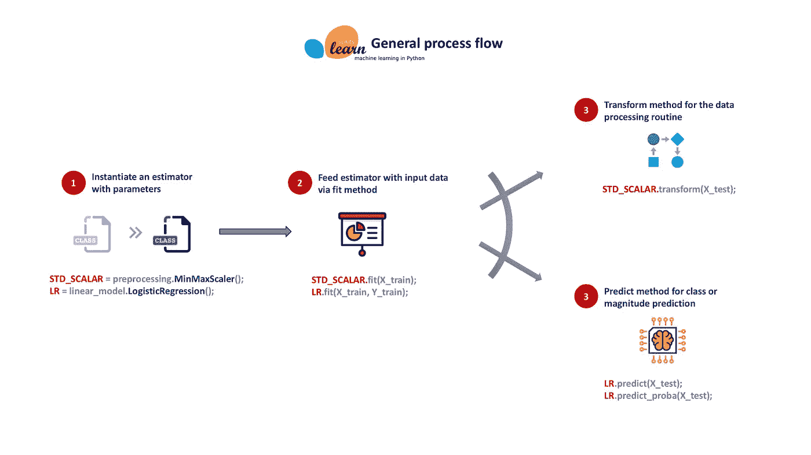
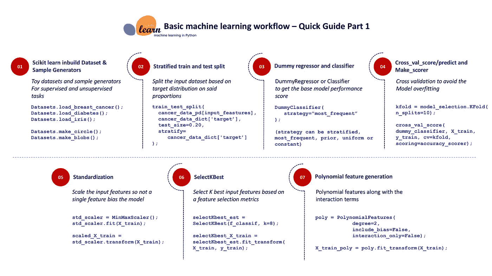
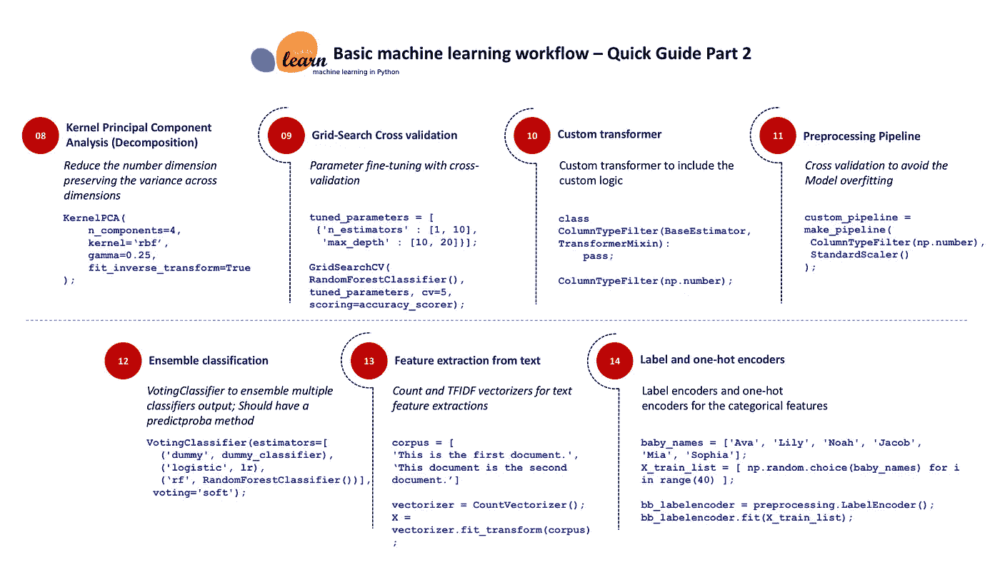
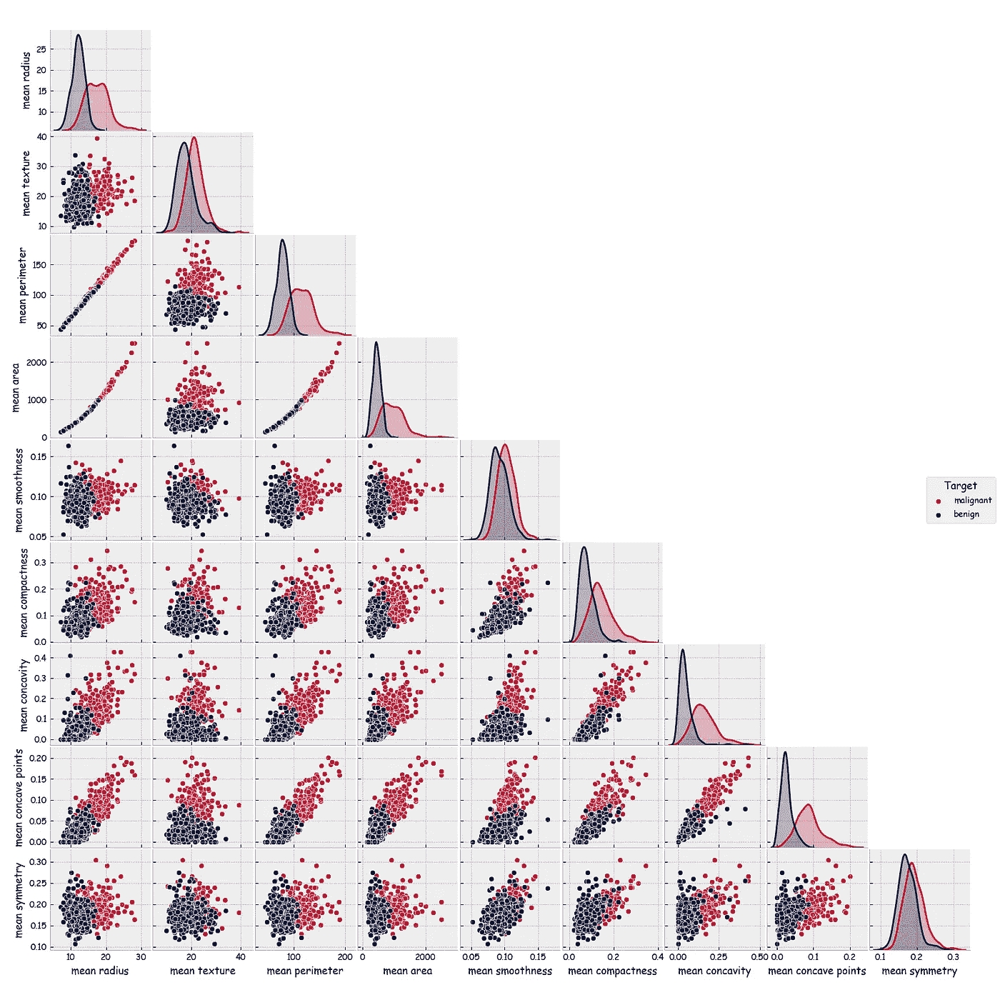
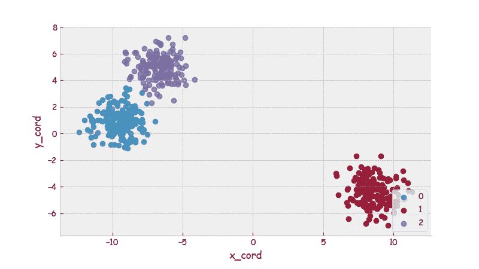

# Scikit-Learn:基础机器学习的银弹

> 原文：<https://medium.com/analytics-vidhya/scikit-learn-a-silver-bullet-for-basic-machine-learning-13c7d8b248ee?source=collection_archive---------0----------------------->


cikit-Learn 是 python 的核心机器学习包，它拥有支持基本机器学习项目的大多数必要模块。该库为从业者提供了统一的 API(应用编程接口),以简化机器学习算法的使用，只需编写几行代码即可完成预测或分类任务。**python 中为数不多的几个保持算法和接口层简单的库之一**，并且不使其复杂化，以覆盖整个机器学习特性领域。这个包主要是用 python 编写的，它包含了 C++库，如 LibSVM 和 LibLinear，用于支持向量机和广义线性模型实现。这个包依赖于 Pandas(主要用于 dataframe 进程)、numpy(用于 ndarray 构造)和 scipy(用于稀疏矩阵)。

这个包之所以有用，主要是因为它的项目愿景。**代码质量和适当的文档构成了核心愿景。**对于给定的算法，健壮的实现优先于尽可能多的特性包含，并且该实现得到单元测试的有力支持(覆盖率> 80%)。软件包文档包括叙述性文档、类参考、教程、安装说明和 60 多个对初学者非常有用的例子。并非所有即将到来的机器学习算法都会立即添加到包中，以保持包的整洁。对于新的机器学习算法，有一个明确的包含标准设置。纳入标准符合以下条件。

1.  所提出的算法应该在某些方面优于在其中实现的方法。
2.  应该无缝地适应 API 设计(应该将 numpy 数组作为输入，并遵循 fit/transform/predict 流程)。
3.  新的实现必须得到研究论文或另一个包中的实现的支持。

是的，直接用 numpy 和 scipy 编写算法代码是可能的，但这需要这个人擅长编程、数学、统计、性能调优、版本控制和测试。此外，编写的代码实现必须是可重用的和可伸缩的，以备将来使用。当整个社区都在朝着同一个目标努力时，为什么要大费周章编写自己的机器学习算法实现呢？Scikit-Learn 正在积极开发中，这应该得到很好的利用，以便从业者可以专注于手头的业务问题，而不是花时间在如何实现算法以有效地使用底层硬件上。

一揽子计划中的基本要素将是一个评估者。估计器可以是转换数据(预处理和流水线)的估计器，也可以是机器学习算法实现。所有其他模块将支持估计器。即数据集、分解、度量、特征选择、模型选择、集成和效用



sci kit-了解一般流程

## 大多数 Scikit-Learn 模块遵循相同的步骤。

1.  用参数实例化一个估计器(否则它将采用默认参数)
2.  通过 fit 方法向估计器实例提供输入数据(输入可以是包含选定列的 pandas 数据帧、Numpy 2d 数组或 Scipy 稀疏矩阵)。拟合可以只采用一个数组或输入数组和目标组合
3.  如果是数据操作模块，它会附带一个转换方法。检查 fit_transform 方法，这样第 2 步和第 3 步都可以用一行代码完成
4.  在拟合方法之后，估计器应该有一个预测方法来预测测试输入的大小或类别

并非所有 python 包都是平等的。Scikit-learn 做了一件事，而且只有一件事做得很好，那就是实现基本的机器学习算法。

## 这个包裹不应该是什么

1.  它不是一个深度/强化学习包，因为 TensorFlow 和 PyTorch 在这一类别中得分很高，而且 Scikit-Learn 不提供任何图形处理单元支持。包括 GPU 支持可能会使实现变得复杂，因为它需要为多种硬件和操作系统组合提供支持
2.  它不是一个可视化包，因为 matplotlib、seaborn 和 plotly 用于创建良好的探索性数据分析图和模型评估图
3.  它不是一个结构化学习和预测包，因为 pystruct 可以很好地处理一般的结构化学习，而 seqlearn 只能处理带有 HMM 推理的序列
4.  它不是一个自然语言处理包，因为 NLTK 和 Gensim 具有更好的 NLP 算法实现和相关的语言语料库
5.  它不是一个基本的统计软件包，因为 statsmodel 包含基本的统计指标实现以及时间序列预测模块

# 预测问题的例子；使用内置癌症数据集



让我们从这里开始一个机器学习项目的工作流程。此工作流程的目的不是提高分类问题的准确性或 f1 分数，而是触及所有必要的模块，以使用 scikit-learn 有效地完成分类问题。大多数分类示例都是从 iris 数据集开始的，因此让我们在 scikit-learn 中挑选另一个数据集用于此工作流。我们将主要研究威斯康星州乳腺癌数据集。目的是基于患者的临床观察参数对诊断(癌症诊断:真或假)进行分类。该数据集包含 569 个观测值和 30 个连续数值特征。212 —恶性，357 —良性。

*   **数据集和生成器**:与无监督的学习任务不同，有监督的任务(即分类)需要带标签的数据集，并且该包带有多个数据集和数据集生成器，以开始机器学习

大致分为两种类型

a.静态/玩具数据集:数据集是具有特征数据(numpy ndarray)、数据集描述、特征名称、目标(numpy array 和用于多标签的 ndarray)和目标名称(即，fetch_20newsgroups 包含文本输入)的字典，并且被分组为 20 个不同的新闻组，如体育、政治、金融等。, ).这些数据集只有有限数量的观测值和目标类或预测范围。即著名的 iris 数据集只有 150 个观测值和 3 个目标类。我已经写了一个函数，将字典格式的内置数据集转换成熊猫数据帧，以便可视化和探索



使用 seaborn 的癌症数据集配对图

b.样本生成器:与玩具数据集相比，大多数机器学习算法将需要更多的标记观察值，该包内置了样本生成器例程，以生成具有所需观察值数量的标记数据集。即，样本生成器 make_moons 采用两个关键参数 n_samples 和 noise。从业者可以向例程提供大量样本来生成噪声并将其添加到输入特征中



make_blobs 样本生成器生成的输出数据集

*   **训练和测试分割**:加载数据集后，它必须分割成训练集和测试集，以开始算法训练。这个包有一个例程将 pandas 数据帧或 numpy 数组分解成训练集和测试集。该方法采用输入要素、目标数组、测试集的大小(观察值占整个数据集的百分比)和分层数组。分层是一个方便的选择，因为目标类的比例在训练集和测试集中是相同的。即，目标分布(良性与恶性的比率)在训练和测试数据集中是相同的

```
X_train, X_test, y_train, y_test =    train_test_split(cancer_data_pd[cancer_data_dict.feature_names],
   cancer_data_dict['target'],
   test_size=0.20,
   stratify=cancer_data_dict['target'],
   random_state=111,
   shuffle=True);INFO - X_train.shape : (455, 30)
INFO - X_test.shape  : (114, 30)
INFO - Y_train.shape : (455,)
INFO - Y_test.shape  : (114,)
```

*   **虚拟回归器和分类器:**在探索性数据分析和特征选择之前，我强烈建议建立一个虚拟回归器或分类器。DummyClassifier 将为模型提供偏差场景。即，在癌症数据集中，大多数(最频繁)类别是良性的(569 个中的 357 个)，因此将任何未来的测试观察(患者)分配到良性类别将是伪分类器。虚拟估计器在目标变量中寻找模式，而不是从输入特征中学习模式。为什么我们需要一个虚拟评估者是为了获得模型性能度量的基线。任何其他机器学习算法至少应该优于虚拟估计器

```
dummy_classifier = DummyClassifier(strategy="most_frequent");
```

*   **模型性能度量:**必须在训练集上训练算法，并在测试集上测试算法。应该使用模型性能指标来访问模型的性能。即，准确度是范围从 0 到 1 的分类度量(准确度越高越好)。
    ***准确率=正确的类别预测/总预测。***
    该软件包提供了多种评估模型性能的指标。从业者还可以编写一个定制的度量标准，并将其包装在一个 make_scorer 方法中，这样它就可以很好地与包 API 集成

```
def cost_accuracy(actual, prediction):
    """ Custom accuracy cost function to be used in the scorer """;
    # accuracy = correct predictions / total predictions assert len(actual) == len(prediction);
    return round((np.sum(actual == prediction) / len(actual)) , 4);accuracy_scorer = make_scorer(cost_accuracy, greater_is_better=True);
```

*   **KFold 和 CrossVal Score/Predict:** 为了避免算法过度适应训练集，需要将其推广到一定程度。不是在整个训练集中运行训练算法，而是将训练集分成多个块(即，10 个相等的块)并在几个卡盘上训练(9 个用于训练)并在其余卡盘上测试(1 个用于测试)。为了避免过度拟合，将重复该过程。过度拟合模型仅在训练集模式/场景下表现良好，而在测试集上却很难做出正确的分类预测。该包提供了 KFOLD 和 CrossVal 例程，以避免过度拟合。在下面的代码中，kfold 设置了 10 个分割(10 个不同的组。每组将具有训练输入特征、训练目标、测试输入特征、测试目标)。cross_val_score 将适合 10 组 kfold 数据集上 10 个虚拟分类器。准确度分数将会列在一个列表上

```
kfold = model_selection.KFold(n_splits=10, random_state=111);
results = model_selection.cross_val_score(dummy_classifier, X_train, y_train, cv=kfold, scoring=accuracy_scorer);
```

*   **标准化:**必须对所有连续的数字输入特征进行缩放，以便没有一个特征会影响模型性能。也就是说，输入要素 A 的范围可能是以百万计，而 B 的范围可能是以百计，如果没有缩放到标准比例，模型将不会学习要素 B 中的变化。该包带有最小最大值(在 0 和 1 之间缩放)和标准缩放器(比例输出将包括负值)

```
std_scaler = preprocessing.MinMaxScaler(); 
std_scaler = std_scaler.fit(X_train);
scaled_X_train = pd.DataFrame(std_scaler.transform(X_train), columns=X_train.columns);
```

*   **SelectKBest:** 输入特征选择是任何模型建立过程中非常关键的一步。该软件包提供了基于给定标准选择 n 个最佳特征的例程。在下面的代码中，基于 f_classif 标准(分类模型性能度量之一)选择特性

```
selectKbest_est = SelectKBest(f_classif, k=8);
selectKbest_X_train = selectKbest_est.fit_transform(X_train, y_train);
```

*   **多项式特征生成:**结合输入特征生成多项式和交互项。包预处理模块附带了多项式要素例程，用于根据给定的次数生成新要素

```
poly = preprocessing.PolynomialFeatures(degree=2, include_bias=False, interaction_only=False);

X_train_poly = poly.fit_transform(X_train);
X_train_p2 = pd.DataFrame(X_train_poly, columns=poly.get_feature_names(X_train.columns));
```

*   **分解— PCA(核 PCA —主成分分析):**这是输入特征数量巨大的地方，需要分解成几个，但要保持特征间的方差。这个包附带了 KernelPCA 例程，将特性压缩到一个更小的集合中。该方法可以采用各种内核来执行 PCA。数据必须针对 PCA 进行缩放

```
kernel_param = ('rbf', 1);
kpca = KernelPCA(n_components=4, 
                 kernel=kernel_param[0], 
                 gamma=kernel_param[1], 
                 fit_inverse_transform=True, 
                 random_state=111)     
kpca.fit(scaled_X_train);   # The data has to be scaled;
kpca_X_train = kpca.transform(scaled_X_train);
```

*   **网格搜索(GridSearchCV):** 模型参数调整是一项令人生畏的任务，必须记录多次迭代及其性能指标，直到一次迭代达到最佳参数集。在 Scikit-learn 中，参数调整主要是通过 GridSearchCV 例程来简化的。给定模型参数组合的列表，该方法运行所有可能的组合，并返回最佳模型参数以及最佳估计量。该方法还执行交叉验证，因此最佳估计器不会过度拟合训练数据。在下面的代码中，有 8 个(2 x 2 x 2 x 1)参数组合，由于交叉验证是 5，所以该例程将适合 40 个模型

```
tuning_parameters = [{'n_estimators' : [1, 10],
                      'max_depth' : [10, 20],
                      'max_features' : [0.80, 0.40],
                      'random_state' : [111]
                     }];clf = GridSearchCV(RandomForestClassifier(), 
                   tuning_parameters, 
                   cv=5, 
                   scoring=accuracy_scorer);clf.fit(X_train, y_train);
```

*   **定制估计器和管道:**从业者可以编写他们的定制估计器。定制估计器可以是流水线的一部分。管道接受多个估算器，并按顺序执行它们。它将把前一个估计器的输出作为输入传递给列表中的下一个估计器。可以使用流水线设计整个模型过程(标准缩放器、估算器、多项式特征生成和分类模型拟合),并且可以直接拟合到数据集。这个例程对于简化模型生产部署非常有帮助。在下面的代码中，ColumnTypeFilter 将只返回 numpy number 类型的熊猫列。管道从 ColumnTypeFilter 获取输出，并使用标准缩放器和最小-最大缩放器对其进行缩放。输出的数字要素数量将是输入的两倍

```
class ColumnTypeFilter(BaseEstimator, TransformerMixin):
    """ Custom transformer to select all columns of a particular type in a pandas dataframes """; def __init__(self, dtype):
        self.dtype = dtype; def fit(self, X, y=None):
        return self; def transform(self, X):
        assert isinstance(X, pd.DataFrame);
        return X.select_dtypes(include=[self.dtype]);ctf = ColumnTypeFilter(np.number);
ctf.fit_transform(X_train).head();custom_pipeline = make_pipeline(
            FeatureUnion(transformer_list=[
                ('StdScl', make_pipeline(
                    ColumnTypeFilter(np.number),
                    preprocessing.StandardScaler()
                )),
                ('MMScl', make_pipeline(
                    ColumnTypeFilter(np.number),
                    preprocessing.MinMaxScaler()
                ))
            ])
    );
```

*   集成模型(Ensemble models)—voting classifier:我最喜欢的分类程序之一。向 VotingClassifier 中添加尽可能多的分类器估计器(估计器应该有预测概率的方法)。对于新的测试记录，例程会将该记录发送给所有评估者，并获得类别预测，然后根据多数投票分配类别

工作中的民主。

```
ensemble_clf = VotingClassifier(estimators=[
                            ('dummy', dummy_classifier),
                            ('logistic', lr),
                            ('rf', RandomForestClassifier())],
                            voting='soft');ensemble_clf.fit(X_train, y_train);
ensemble_clf_accuracy_ = cost_accuracy(y_test,
   ensemble_clf.predict(X_test));
```

*   **处理分类和文本输入特征:**任何机器学习模型都需要数字输入特征(连续或分类)，而文本特征不能很好地集成。Scikit-learn 对此也有一种药物。使用标签编码器或一键编码器。下面婴儿的名字被转换成数字向量，一旦被转换，这些向量将作为模型训练的输入特征

```
baby_names = ['Ava', 'Lily', 'Noah', 'Jacob', 'Mia', 'Sophia'];
X_train_list = [ np.random.choice(baby_names) for i in range(40) ];
X_test_list = [ np.random.choice(baby_names) for i in range(6) ];bb_labelencoder = preprocessing.LabelEncoder();
bb_labelencoder.fit(X_train_list);
bb_encoded = bb_labelencoder.transform(X_test_list);bb_onehotencoder = preprocessing.OneHotEncoder(sparse=False);
bb_encoded = bb_encoded.reshape(len(bb_encoded), 1);
bb_onehot = bb_onehotencoder.fit_transform(bb_encoded);Actual : Ava   | LabelEncoded : 0   | OneHot : [ 1\.  0\.  0\.  0.]
Actual : Ava   | LabelEncoded : 0   | OneHot : [ 1\.  0\.  0\.  0.]
Actual : Noah  | LabelEncoded : 4   | OneHot : [ 0\.  0\.  0\.  1.]
Actual : Mia   | LabelEncoded : 3   | OneHot : [ 0\.  0\.  1\.  0.]
Actual : Lily  | LabelEncoded : 2   | OneHot : [ 0\.  1\.  0\.  0.]
Actual : Lily  | LabelEncoded : 2   | OneHot : [ 0\.  1\.  0\.  0.]
```

*   **特征提取(从图像和文本中):**使用这些例程将文本文档列表直接转换为输入特征，无需太多代码。在下面的代码中，句子列表被转换成单词计数的观察值。

```
corpus = ['This is the first document.',
          'This document is the second document.',
          'And this is the third one.',
          'Is this the first document?', ]vectorizer = CountVectorizer();
X = vectorizer.fit_transform(corpus);cntvector_out = pd.DataFrame(X.toarray(), 
       columns=vectorizer.get_feature_names());Input text : This is the first document.
Output counter vector : This is the first document.
and         0
document    1
first       1
is          1
one         0
second      0
the         1
third       0
this        1
```

## 快乐编码，不断学习。

链接到*代码*回购

[](https://github.com/manikandanj2207/dataibreathe/blob/master/03.Scikit_Learn_WorkFlow_V1.0.py) [## manikandanj2207/dataibreathe

### 支持媒体博客的代码库。为 manikandanj 2207/dataibreat 的发展作出贡献

github.com](https://github.com/manikandanj2207/dataibreathe/blob/master/03.Scikit_Learn_WorkFlow_V1.0.py) 

> 喜欢这篇文章就鼓掌