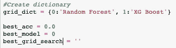

# sci kit-初学者学习管道

> 原文：<https://medium.com/analytics-vidhya/scikit-learn-pipelines-for-beginners-235abd0b8ea1?source=collection_archive---------6----------------------->

## 简化建模过程的有用工具。

来源:scikit-learn.org

按照最简单的定义，Scikit learn 中的管道可以用来将多个估算器链接在一起，文档[说](https://scikit-learn.org/stable/modules/compose.html#pipeline)。这在进行特征选择、归一化和分类时非常有用，主要原因有三个——数据科学家只需拟合和预测一次回归，Scikit-learn 超参数调谐器 [GridSearch](https://scikit-learn.org/stable/modules/grid_search.html#grid-search) 可应用于多个预测模块，并且它们有助于防止统计数据从测试数据进入训练数据。

来源:[走向数据科学](https://towardsdatascience.com/custom-transformers-and-ml-data-pipelines-with-python-20ea2a7adb65)

简而言之，Scikit-learn 中的管道可以被认为是一种通过使用给定的操作顺序将选定的过程应用于预定模型来自动化预测过程的手段。或者运行每个回归并指出哪个效果最好。但是，与其谈论它，不如我们来看看它的行动！

在 Scikit-learn 中使用管道时，需要注意的是，在找到最佳超参数或您希望使用的超参数范围后，应该对模型进行优化。在使用穷举网格搜索时尤其如此。

按照软件和教育网站 [KDNuggest](https://www.kdnuggets.com/2017/12/managing-machine-learning-workflows-scikit-learn-pipelines-part-1.html) 创建的指南，首先从 scikit learn 库以及您需要的任何其他库导入 Pipeline。

导入管道后，第一步是创建实例化您计划运行的每个模型所需的管道。管道采用元组列表，可以作为操作顺序读取。每个元组中使用的字符串可以是您想要的任何东西，它们只是用来标识您正在使用的转换器和模型的名称。然而，元组列表中的最后一项必须是您计划使用的模型。这里我用 XGBoost 和 Random Forest。

如果您计划使用网格搜索，可以从这里为您正在使用的每个模型设置网格搜索参数。详尽的 GridSearch 通过检查指定超参数的每个组合来查看哪个组合产生高精度模型。尽管 GridSearch 功能强大，但它确实需要很长的运行时间，这取决于所使用的回归模型。随着管道中包含更多模型或参数，这一数字将呈指数级增长。

如果使用管道对不断变化的数据集进行回归，最好将搜索参数缩小到历史上为模型产生最高精确度的参数。因此，对于要检查的每个超参数值，模型可能需要更多的运行时间。

在设置了要在网格搜索中使用的参数之后，实例化每个网格搜索。将估计器参数设置为您计划使用的模型，并将 param_grid 设置为特定的估计器参数，这一点很重要。有趣的是，设置 cv = 2 可以让你对每个模型进行两次交叉验证。

接下来，创建一个您计划运行的不同网格搜索估计器的列表。这对以后的迭代很有用。

在 [KDNuggest](https://www.kdnuggets.com/2017/12/managing-machine-learning-workflows-scikit-learn-pipelines-part-1.html) 上，它建议为您管道中的每个模型创建一个字典。我选择跟随他们的领导，并把它包括在我的工作流中，后来证明它很有用，还有准确性、最佳模型和最佳网格搜索变量。

最后创建一个循环，遍历前面指定的网格列表中的每个网格。

创建一个管道当然比每次都重新构建每个模型要容易，但是仍然会令人困惑。因此，关注指南、博客和 YouTube 教程会非常有帮助。这里是我看的博客和视频的列表，以帮助理解这个过程！

*   [sci kit-learn 管道示例指南](/vickdata/a-simple-guide-to-scikit-learn-pipelines-4ac0d974bdcf)
*   [用 scikit-learn 实现机器学习中流水线的一个简单例子](https://towardsdatascience.com/a-simple-example-of-pipeline-in-machine-learning-with-scikit-learn-e726ffbb6976?)
*   [使用 Python 定制转换器的 ML 数据管道](https://towardsdatascience.com/custom-transformers-and-ml-data-pipelines-with-python-20ea2a7adb65)
*   [使用 Scikit-learn 管道管理机器学习工作流第 1 部分:简介](https://www.kdnuggets.com/2017/12/managing-machine-learning-workflows-scikit-learn-pipelines-part-1.html)

这里还有一个很棒的 youtube 频道，可以看看 python 是如何实现的。

[Codebasics 频道](https://www.youtube.com/channel/UCh9nVJoWXmFb7sLApWGcLPQ)