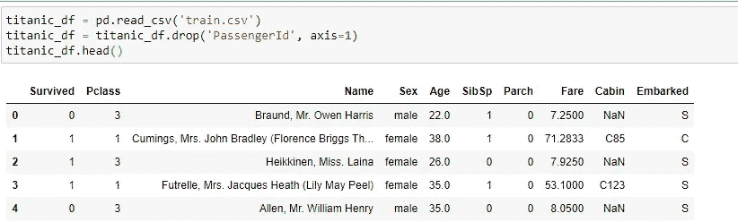
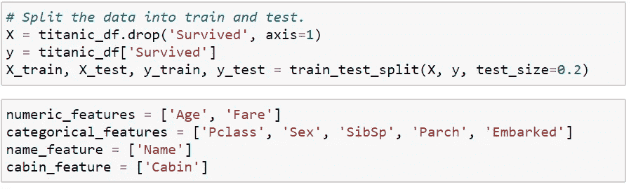
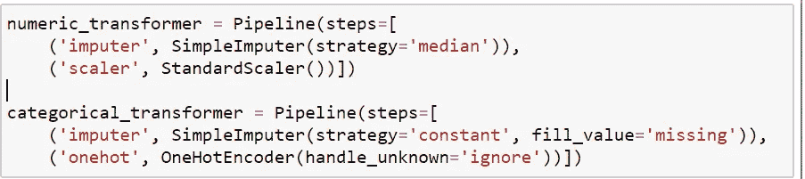
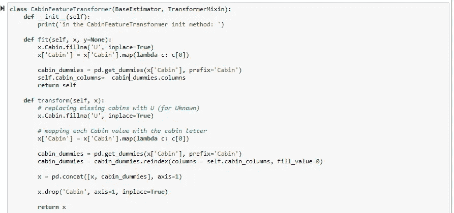
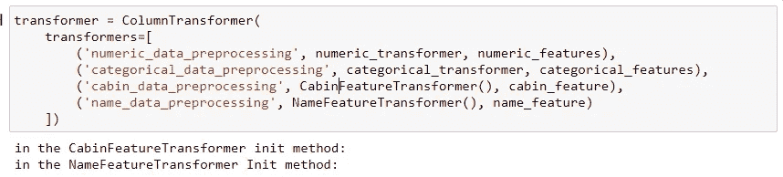
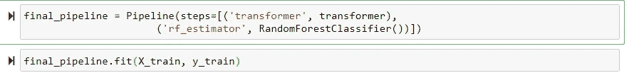
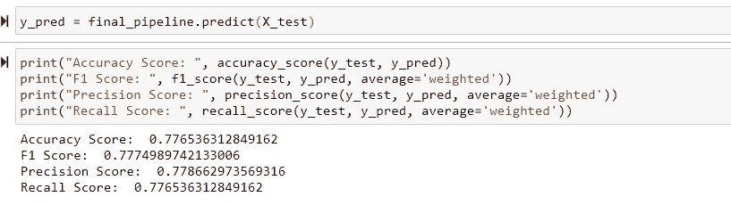
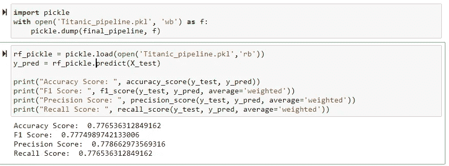
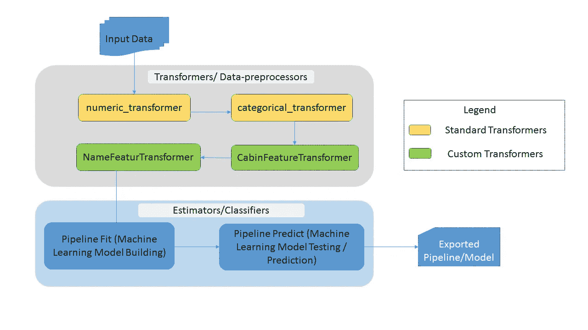

# sci kit-学习定制变压器的管道-一步一步的指南。

> 原文：<https://medium.com/analytics-vidhya/scikit-learn-pipelines-with-custom-transformer-a-step-by-step-guide-9b9b886fd2cc?source=collection_archive---------2----------------------->

sci kit-学习管道

数据和模型算法是完整的机器学习所依赖的两个核心模块。在数据模块中，数据提取和数据预处理(或称为特征工程)在整个建模生命周期中起着至关重要的作用。

在现实生活中，任何机器学习问题往往有数百个输入特征，围绕这些特征需要概念化解决方案。为了理解数据特征并生成相应用例的拟合分析报告，需要通过不同的技术来清理和处理数据，这些技术不仅限于编码分类值、缩放连续特征、输入、归一化等。处理大量输入要素时，这种数据转换过程会变得非常繁琐。

这就是为什么简化这个完整的转换过程总是一个好的做法，它可以无缝地应用于训练和测试数据。这就是 Scikit-Learn Pipeline 发挥作用的地方，它通过一系列转换器和一个最终估计器(分类器)来实现这种流线型转换。为了避免更多的理论进入他的帖子，如果你想阅读更多关于**变形金刚**和**估算师**的内容，Sklearn 教程网站对这些术语有很好的解释。

在这篇文章中，我将尝试涵盖以下几个方面。

*   sklearn 管道中如何写**标准变形金刚**
*   如何编写**自定义变形金刚**并添加到 sklearn 管道中
*   最后，如何使用 Sklearn 管道进行建模和预测

> 注意:我正在使用“泰坦尼克号幸存者”问题数据集，这是一个分类问题，以解释 Sklearn 管道集成。

从 Sklearn Pipline 变压器开始，首先我将数据导入到我的 Jupyter 笔记本中。**PassengerId '**列被删除，因为它不会在模型训练中使用。

在该数据集中，大约有 9 个输入特征和 1 个输出标签，即“幸存”。

*   Pclass、Sex、SibSp、Parch 和 oaked 是分类特征。我们将应用标准转换器来处理空值，并将它们编码成连续值。
*   年龄和票价是连续的特征。我们将应用标准转换器来处理空值并执行特征缩放
*   Name 和 Cabin 是自由文本特性，不能直接在模型训练中使用，所以我们将编写自定义转换来将它们转换成一些有用的数据

将数据分为训练和测试数据，并根据它们的数据类型对列名进行分组。

> **变压器(称为数据预处理机)**

从数据转换开始，

*   **标准转换器**:让我们首先为每种数据类型(分类和连续)编写不同的标准转换器。在这里，我创建了 numeric_transformer 和 categorical _ transformer 来处理连续和分类特征值。在 numeric_transformer 中，有两个步骤；首先是用相应列的中值替换空(NaN)值。第二步是对连续特征应用缩放。类似地，在 categorical _ transformer 中有两个步骤用于输入和应用一个热编码到分类属性上。在这里，所有这些转换器(如 SimpleImputer、StandardScalar、OneHotEnocder)将内置“fit”和“transform”方法的实现，这些方法将在管道执行时调用。

**标准变压器**

*   **自定义转换器:**现在为了处理客舱和名称输入功能，我们将编写自定义转换器，因为这两个功能不能使用标准转换器直接转换(在下面的例子中你会更好地理解)。每个自定义转换器必须定义至少两个方法'**适合** ' & ' **转换**。

> **在执行管道的 fit 方法时，将依次调用 Transformer 的“fit”和“transform”方法。**
> 
> **其中，在执行管道的预测方法时，将只调用 Transformer 的转换方法。**

> **举例详细说明**:

**为“驾驶室”功能定制变压器**

让我以“Cabin”输入特征为例详细解释拟合和转换方法的用法。对于代码片段，请参考上面的截图。

**在‘适合’方法中**

*   对于“客舱”功能，用“U”替换所有空(na)值
*   用各自值的第一个字符替换客舱值
*   在接下来的几行中，我们将确定“Cabin”特性的唯一值(通过 get_dummies 方法)并将其保存在“self.cabin_columns”中。它将在“转换”方法中使用。

**在‘变换’法中**

*   对于“客舱”功能，用“U”替换所有空(na)值
*   用各自值的第一个字符替换客舱值
*   在接下来的几行中，我们使用 get_dummies 方法，通过为每个唯一值创建新列，将 Cabin 的分类值转换为数值。
*   我们正在根据已经保存的“self.cabin_columns”值重新索引这些新列。这样做的目的是为了避免根据试验数据中的新座舱值增加新的列。否则，由于特征计数不匹配，模型预测将在测试数据上失败。这就是为什么，我们没有在这个功能上应用标签编码器或一个热编码器，而是使用自定义转换器。更多详情请参考此[链接](https://stackoverflow.com/questions/21057621/sklearn-labelencoder-with-never-seen-before-values)。

类似地，我为“Name”输入特性创建了另一个自定义转换器。

> **ColumnTransformer 合并所有变压器定义**

下一步是使用 ColumnTransformer 合并所有转换器定义，如下图所示。当我们执行这个块时，每个自定义转换器都将调用' **_init_'** 方法。

**组合变压器定义**

> **组装—组合变压器和估算器**

这是最后一步，我们将转换器和估计器(在本例中，它是 RandomForestClassifier)结合起来，并创建将用于训练模型和预测的最终管道。

**最终管道组装**

> **管道拟合和转换方法**

**管道“安装”方法**

*   它用于根据训练数据训练模型
*   它接受两个参数；列车输入特征和列车输出标签，即 x_train 和 y_train
*   **当调用此“拟合”方法时，将依次调用拟合和转换两种方法，输入特征值将被转换并传递给估算器进行模型训练**

**管道‘预测’方法**

*   管道“预测”方法用于对测试数据进行预测，如下面的代码片段所示。
*   当我们调用' predict '方法时，只有 Transformer 's ' transform '方法被调用

**利用管道预测**

**注意**:我们可以保存这个管道对象以供将来参考，如下图所示。

**保存管道并重复使用**

> **我的例子中端到端管道的流程图**

**sk learn 管道流程图**

这个练习的笔记本可以在[这里](https://github.com/abhi-rawat1/machine_learning_projects/tree/master/Sklearn_Pipeline_Custom_transformer)得到。

感谢阅读这个博客…如果你喜欢就鼓掌吧:)