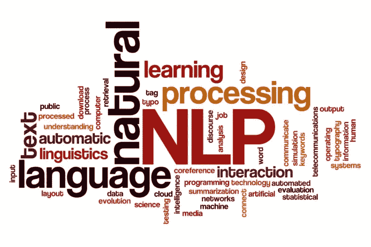

# 给意见和观点打分

> 原文：<https://medium.com/analytics-vidhya/scoring-opinions-and-sentiments-e66bbdcd4e87?source=collection_archive---------13----------------------->


图片来源- Alvantia

# 什么是意见挖掘？

**观点挖掘**又称**情感**分析是指利用自然语言处理、文本分析和计算语言学等技术，识别和提取源材料中的主观信息——[源](https://www.igi-global.com/dictionary/using-the-flipped-classroom-to-improve-knowledge-creation-of-masters-level-students-in-engineering/21327)。

# 什么是自然语言处理？



图片来源:Wootric

作为人类，理解任何语言都是我们最初的成就之一，将单词与其意义联系起来看起来很自然。计算机没有自然理解人类语调的能力，但可以依赖 NLP，NLP 是计算机科学的一个领域，涉及机器和人类之间的语言理解和语言创造。

# 机器如何理解？


图像源-真实解码

在计算机能够对文本做任何事情之前，它必须能够以某种方式阅读文本。下面给出的示例显示了我们如何准备数据来理解分类变量，例如表示颜色的特征(例如，表示一个示例是否与红色、粉色或紫色相关)。分类数据是一种使用二进制变量表示的短文本，即根据分类变量中是否存在某个值，使用**1**或**0**值编码的变量。

因此，正如您将值为红色、粉色和紫色的分类颜色变量转换为三个二进制变量，每个变量代表三种颜色中的一种，因此您可以使用八个二进制变量转换类似“两个开车的运动员帮助传真我的大测验”这样的短语，文本中出现的每个单词对应一个二进制变量(“Two”与“Two”不同，因为它的首字母大写)。这就是 ***包字*** 的表现形式。

在其最简单的形式中，单词包通过识别数据集中的特定特征来显示某个单词是否出现在文本中。

# 让我们从一个例子开始

看一个使用 Python 及其 Scikit-learn 包的例子。输入的数据有三个短语， ***sentence_1*** ， ***sentence_2*** ，和 ***sentence_3*** ，放在一个列表中，语料库。

语料库可以被定义为文本文档的集合。它可以被认为只是一个目录中的一堆文本文件，通常旁边还有许多其他目录中的文本文件- [*来源*](https://www.geeksforgeeks.org/nlp-custom-corpus/)

当你需要用计算机对文本进行分析时，你加载这些文档，并将它们放入一个字符串变量中。如果你有多个文档，你把它们都存储在一个列表中，即 ***文集*** 。当您有一个单一的文件，您可以分割它使用章节，段落，或只是每一行的结尾。

拆分文档后，将其所有部分放入一个列表中，并进行分析，就好像该列表是一个文档集一样。

现在你有了一个语料库，你使用 Scikit-learn 中的 ***特征提取*** 模块中的一个类， ***计数矢量器*** ，它很容易将文本转换成**单词包**，如下所示:

这给出了二进制输出:

```
[[0 1 0 0 0 1 1 0 1 0 0 1 0 0 1 0 1 0 0 0 0 1 0 0]
 [0 0 1 0 0 0 0 1 0 0 0 0 1 0 0 1 0 0 0 0 1 0 1 0]
 [1 0 0 1 1 0 0 0 0 1 1 0 0 1 0 0 0 1 1 1 1 0 0 1]]
```

***count vector izer***类使用 fit 方法学习语料库内容，然后
将其(使用 transform 方法)转换为一个列表列表。

列表的列表只不过是一个矩阵，因此该类返回的实际上是一个由三行(三个文档，与语料库的顺序相同)和 24 列组成的矩阵，表示内容。

**单词包**表示将单词转化为文档矩阵的列特征，并且这些特征在被处理的文本中存在时具有非零值。

比如考虑**懒**这个词。以下代码显示了它在单词包中的表示形式:

输出现在看起来像这样:

```
{'two': 21, 'driven': 5, 'jocks': 11, 'help': 8, 'fax': 6, 'my': 14, 'big': 1, 'quiz': 16, 'the': 20, 'five': 7, 'boxing': 2, 'wizards': 22, 'jump': 12, 'quickly': 15, 'your': 23, 'dog': 4, 'is': 9, 'so': 18, 'lazy': 13, 'that': 19, 'it': 10, 'sleeps': 17, 'all': 0, 'day': 3}
```

***计数矢量器*** 打印从文本报告中学到的词汇，它将 ***狗与数字 4*** 相关联，这意味着狗是单词表示包中的第四个元素。每个文档列表的第五个元素总是具有值 1，因为 ***狗*** 是在所有三个文档中出现的唯一单词。

**考虑基本加工任务:**

您可以计算短语中某个元素出现的次数，而不是标记它是否存在(技术上称为令牌)，如下面的代码所示:

输出现在看起来像-

```
[[0 0 1 1 1 1 0 0 2 0 0 1 0 0 0 1 0 1 0 1 0 0 0 0 0 0]]
```

这段代码修改了前面的示例，添加了一个新短语，其中单词 ***dog*** 重复出现了两次。

代码将新短语添加到语料库并重新训练矢量器，但这次省略了 binary=True 设置。

最后插入的文档的结果向量在第九个位置清楚地显示了 2 值，因此向量器对单词 dog 计数两次。计算代币有助于突出重要的单词。然而，很容易重复
短语元素，比如冠词，它们对表达的意义并不重要。在下一节中，您将发现如何排除不太重要的元素，但是目前，该示例使用术语频率-逆文档频率(TF-IDF)转换来降低它们的权重。
TF-IDF 转换是一种技术，在计算某个标记在短语中出现的次数
后，将该值除以该标记在
中出现的文档数。使用这种技术，矢量器认为一个无字是重要的，即使它在一个文本中出现了很多次，当它在其他文本中也找到了这个词。在示例语料库中，单词 dog 出现在每个文本中。在分类问题中，你不能用这个词来区分文本，因为它在语料库中随处可见。单词 fox 只在一个短语中出现，这使它成为一个重要的分类术语。

下面的示例演示了如何结合使用规范化和 TF-IDF 来完成前面的示例。

输出如下所示:

```
crazy: 0.125Summed values of a phrase: 0.1
  fredrick: 0.125Summed values of a phrase: 0.2
    bought: 0.125Summed values of a phrase: 0.4
      many: 0.125Summed values of a phrase: 0.5
      very: 0.125Summed values of a phrase: 0.6
 exquisite: 0.125Summed values of a phrase: 0.7
      opal: 0.125Summed values of a phrase: 0.9
    jewels: 0.125Summed values of a phrase: 1.0
```

使用这种新的 TF-IDF 模型重新调整重要单词的值，并使它们在语料库中的每个文本之间具有可比性。要恢复 BoW 变换前文本的部分排序，添加 n-grams 也很有用。以下示例使用 CountVectorizer 对(2，2)范围内的 n 元模型(即二元模型)进行建模。

```
{'two driven': 25, 'driven jocks': 6, 'jocks help': 14, 'help fax': 11, 'fax my': 8, 'my big': 18, 'big quiz': 1, 'the five': 24, 'five boxing': 9, 'boxing wizards': 3, 'wizards jump': 27, 'jump quickly': 15, 'your dog': 28, 'dog is': 5, 'is so': 12, 'so lazy': 21, 'lazy that': 16, 'that it': 22, 'it sleeps': 13, 'sleeps all': 20, 'all the': 0, 'the day': 23, 'crazy fredrick': 4, 'fredrick bought': 10, 'bought many': 2, 'many very': 17, 'very exquisite': 26, 'exquisite opal': 7, 'opal jewels': 19}
```

通过设置不同的范围，您可以在 NLP 分析中同时使用单个单词和 n 个单词。例如，设置 ngram_range=(1，3)创建所有标记、所有二元模型和所有三元模型。在 NLP 分析中，通常只需要三元模型。根据语料库的大小和 NLP 问题，增加 n 元语法的数量在三元语法之后，有时甚至在二元语法之后会有一点好处。

# 词干提取和删除停用词:

```
[nltk_data] Downloading package punkt to
[nltk_data]     C:\Users\Mitusha\AppData\Roaming\nltk_data...
['love', 'tommy', 'swim', 'time']
[[1 0 1 0]]
```

第一个输出显示了词干。注意，列表中只包含
游泳，不包含游泳或游泳。所有的停用词都不见了。例如，你看不到这样的词，他，所有，或。第二个输出显示了每个词干单词在测试句子中出现的次数。在这种情况下，爱变体出现一次，游泳变体也出现一次。sam 和 time 这两个词没有出现在第二个句子中，所以这些
值被设置为 0。

感谢阅读:)