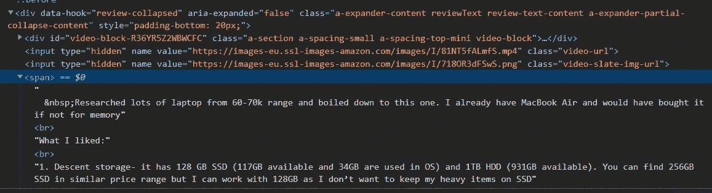

# 使用 Heroku 部署废弃亚马逊产品和定价数据

> 原文：<https://medium.com/analytics-vidhya/scrap-amazon-products-and-pricing-data-with-heroku-deployment-cca778a99f8d?source=collection_archive---------6----------------------->


**报废的必要性是什么？**

当今世界，数据在每个业务领域都扮演着至关重要的角色。借助数据，我们可以满足业务需求。数据可以是 Pdf、Excel、Word、网页数据中的任何形式。有些文件是以方便的形式提供的。在那里你可以以一种非常简单的形式读取和提取数据。在读取网页数据的情况下，我们将如何实现它？用另一种形式保存数据？基于网页数据的手写文档。所有的想法都浮现在脑海里。这对于网络报废起到了一定的作用。从网上报废能够提取网站上的数据，并保存在另一种格式，可以是任何 XLS，PDF，CSV 格式。使用 Python，我们可以在一个小时内学会并实现 web 报废。所以，Python 是实现报废技术的更大优势。


**什么是网页抓取？**

从网页中提取数据的过程。一般来说，客户端请求网页来获取详细信息。细节可以是任何形式的。例如，用户访问亚马逊网站，查看笔记本电脑产品列表，包括价格和用户评论。一旦客户端以页面内容的形式获得了详细信息。页面通常以 HTML 的形式呈现。数据以非结构化的形式组织起来。我们需要找到相应映射的数据。从映射 ID 中检索文本/数据。让我们看看如何从接下来的教程中提取数据。坐着别动…

本教程解释了如何提取带有价格和评论细节的亚马逊产品。我们认为在亚马逊可以买到的“笔记本电脑”产品。

下面的代码片段是用 Python 实现的。

```
def readData():
    productsInfo = []
    csvDatasInfo = []
    pages = int(request.form[**'pages'**].replace(**" "**, **""**)) + 1
    for i in range (1,int(pages)):
        headers = {**"User-Agent"**: **"Mozilla/5.0 (Windows NT 10.0; Win64; x64; rv:66.0) Gecko/20100101 Firefox/66.0"**,
       **"Accept-Encoding"**: **"gzip, deflate"**, **"Accept"**: **"text/html,application/xhtml+xml,application/xml;q=0.9,*/*;q=0.8"**,
       **"DNT"**: **"1"**, **"Connection"**: **"close"**, **"Upgrade-Insecure-Requests"**: **"1"**}
        amazon_url = **f"https://www.amazon.in/s?k=laptops&page=**{i}**"** page = requests.get(amazon_url, headers=headers)
        content = page.content
        soup = BeautifulSoup(content, features=**"html.parser"**)
        productName =**""** productRating=**""** productPrice=**""** flag =False
        for box in soup.find_all(**'div'**, attrs={**'class'**: **'sg-col-20-of-24 s-result-item s-asin sg-col-0-of-12 sg-col-28-of-32 sg-col-16-of-20 AdHolder sg-col sg-col-32-of-36 sg-col-12-of-16 sg-col-24-of-28'**}):
            name = box.find(**'span'**, attrs={**'class'**:**'a-size-medium a-color-base a-text-normal'**})
            price = box.find(**'span'**, attrs={**'class'**:**'a-offscreen'**})
            rating = box.find(**'span'**, attrs={**'class'**:**'a-icon-alt'**})
            commentLink = box.find(**'a'**, attrs={**'class'**:**'a-link-normal a-text-normal'**})
            linkcomment =**"https://www.amazon.in"** +commentLink[**'href'**]
            flag = False;
            try:
                productName = name.text
            except:
                productName = **'NONE'** try:
                productRating = rating.text
            except:
                productRating = **'NONE'** try:
                productPrice = price.text
            except:
                productPrice = **'NONE'** reviewPage =  requests.get(linkcomment, headers=headers)
            commentPage = reviewPage.content
            reviewSoup = BeautifulSoup(commentPage, features=**"html.parser"**)
            userComment=**""** reviewer=**""** reviewerRating=**""** reviewlayout=**""** reviewTitle = **""** for reviewBox in reviewSoup.find_all(**'div'**, attrs={**'class'**:**'a-section review aok-relative'**}):
               reviewerName = reviewBox.find(**'span'**, attrs={**'class'**: **'a-profile-name'**})
               reviewlayout = reviewBox.find_all(**'span'**)
               reviewContent = reviewlayout[7]
               reviewerRating = reviewlayout[1]
               reviewTitle = reviewlayout[3]

               try:
                   userComment = reviewContent.text
               except:
                   userComment = **"NONE"** try:
                   reviewer = reviewerName.text
               except:
                    reviewer=**"NONE"** try:
                   reviewerRating = reviewerRating.text
               except:
                   reviewerRating= **"NONE"** try:
                   reviewTitle = reviewTitle.text
               except:
                   reviewTitle = **"NONE"** if (flag == False):
                   mydic = {**'Product'**: productName, **'Price'**: productPrice, **'Rating'**: productRating, **'Reviewer'** : reviewer, **'ReviewerRating'** :
                             reviewerRating, **'Reviews'**: reviewTitle + **" "** +userComment}
               else:
                   mydic = {**'Product'**: **" "**, **'Price'**: **" "**, **'Rating'**: **" "**, **'Reviewer'**: reviewer,**'ReviewerRating'** :reviewerRating,
                            **'Reviews'**: reviewTitle + **" "** +userComment}
               csvData = {**'Product'**: productName, **'Price'**: productPrice, **'Rating'**: productRating, **'Reviewer'**: reviewer,
                        **'ReviewerRating'**:
                            reviewerRating, **'Reviews'**: reviewTitle + **" "** + userComment}
               csvDatasInfo.append(csvData)
               productsInfo.append(mydic)
               flag = True
    df = pd.DataFrame.from_dict(csvDatasInfo)
    df.to_csv(**'userReview.csv'**)
```

让我们开始按每个片段描述代码

**读取网页数据**

向 amazon .索取网页，其中附有笔记本电脑列表。您可以看到嵌入的 URL 参数，即 k & page。其中 **k** 设置为搜索字符串，而 **page** 据说是，产品需要在浏览器中呈现在哪个页面。假设 page =2 意味着，它将在浏览器中显示第 2 页的笔记本电脑产品。

request.get(URL，header)返回所请求页面的页面数据。呈现为 HTML 页面的 page.content。

```
headers = {**"User-Agent"**: **"Mozilla/5.0 (Windows NT 10.0; Win64; x64; rv:66.0) Gecko/20100101 Firefox/66.0"**,
       **"Accept-Encoding"**: **"gzip, deflate"**, **"Accept"**: **"text/html,application/xhtml+xml,application/xml;q=0.9,*/*;q=0.8"**,
       **"DNT"**: **"1"**, **"Connection"**: **"close"**, **"Upgrade-Insecure-Requests"**: **"1"**}
        amazon_url = **f"https://www.amazon.in/s?k=laptops&page=**{i}**"** page = requests.get(amazon_url, headers=headers)
        content = page.content
```

**解析 HTML 数据**

Beautiful Soup 是一个 Python 库，用于从 HTML 和 XML 文件中提取数据。它与您喜欢的解析器一起工作，提供导航、搜索和修改解析树的惯用方式。从下面的代码中解析页面数据。基于该方法可以广泛使用不同的解析器。

```
soup = BeautifulSoup(content, features=**"html.parser"**)
```

**识别< div >标识符**

导航到 amazon.in 后，右键单击页面并选择 inspect。打开包含 HTML 标记的单独窗口。它定义了包含 web 页面上数据的 div 标签列表。要从网页中获取数据，需要相应地引用

标签。在此之前，需要验证数据位于哪个标签下，然后检索它。

让我们以读取标签所在的笔记本电脑产品为例。在下面的截图中，指向 div 标签的 Lenevo Thinkpad 产品被称为“**SG-col-20-of-24s-result-item s-asin SG-col-0-of-12 SG-col-28-of-32 SG-col-16-of-20 ad holder SG-col SG-col-col-32-of-36 SG-col-col-12-of-16 SG-col-24-of-28”。**在< div >标签中，笔记本电脑信息与用户评论链接一起被添加。


产品标签

从下面的代码片段中，迭代

标签以获取当前页面中的笔记本列表。

```
for box in soup.find_all(**'div'**, attrs={**'class'**: **'sg-col-20-of-24 s-result-item s-asin sg-col-0-of-12 sg-col-28-of-32 sg-col-16-of-20 AdHolder sg-col sg-col-32-of-36 sg-col-12-of-16 sg-col-24-of-28'**}):
```

**识别<分区>T5 的属性**

到目前为止，我们已经获得了驻留在

标签中的笔记本电脑信息。我们需要在标签中更深入地查找，以获得产品名称、价格、评级和用户评论链接。让我们看看我们如何能得到那些。

```
name = box.find(**'span'**, attrs={**'class'**:**'a-size-medium a-color-base a-text-normal'**})
price = box.find(**'span'**, attrs={**'class'**:**'a-offscreen'**})
rating = box.find(**'span'**, attrs={**'class'**:**'a-icon-alt'**})
commentLink = box.find(**'a'**, attrs={**'class'**:**'a-link-normal a-text-normal'**})
```

在编码之前，需要从检查窗口中搜索姓名标签。从下面的截图中可以看到a-size-medium a-color-base a-text-normal'>中突出显示的笔记本电脑产品信息所在的位置。


产品名称的 Div 标签

让我们看看定价信息。从下面的截图来看，价格标签指的是。


定价的 Div 标签

要读取产品的等级是指标签即


分级的 Div 标签

查看单个产品的评论。需要获取 URL 链接来查看个人用户评论。

要获得注释部分的 URL 链接，需要引用标签


评论区的 HREF 链接

**意见栏导航下一页**

要查看，所有用户评论都需要导航到评论部分。为了 URL 需要，获取 HTML 页面数据。然后使用 BeautifulSoup 解析数据。代码片段说明了同样的情况。

```
reviewPage =  requests.get(linkcomment, headers=headers)
            commentPage = reviewPage.content
            reviewSoup = BeautifulSoup(commentPage, features=**"html.parser"**)
```

进一步去看看用户，评级，描述和评论。下面的代码提供了详细信息。

```
for reviewBox in reviewSoup.find_all(**'div'**, attrs={**'class'**:**'a-section review aok-relative'**}):
   reviewerName = reviewBox.find(**'span'**, attrs={**'class'**: **'a-profile-name'**})
   reviewlayout = reviewBox.find_all(**'span'**)
   reviewContent = reviewlayout[7]
   reviewerRating = reviewlayout[1]
   reviewTitle = reviewlayout[3]
```

从下面的截图来看，注释块驻留在 div 标签中，即

。我们需要迭代个体来获得每个用户的评论和评级。

注释块

**评论**

从标签开始，用户评论如下。



用户评论

**获取用户名**

从标签可以获取用户名。


用户名信息

从突出显示的收件箱中，保存评级和评论标题。


评级和评论信息

我们讨论了 amazon 产品的 web scrap 的所有代码实现。接下来，我们将了解如何使用 Pandas 导出 CSV 格式的用户评论数据。

**导出用户评论**

在下面的代码片段中，导出 CVS 中的用户评论。“csvDatasInfo”以字典类型的形式构造。因此，要导出 CSV 文件，需要使用字典类型的数据帧(dataframe.from_dict())，如下所示。

```
df = pd.DataFrame.from_dict(csvDatasInfo)
df.to_csv(**'userReview.csv'**)
```

终于，CSV 来了。


CSV 数据

接下来，我们将看到相同 python 项目的 Heroku 部署。Heroku 是一个平台即服务(PaaS ),支持开发者完全在云中构建、运行和操作应用。Heroku 是一个平台，它允许我们拥有部署应用程序所需的环境。一旦你注册并获得一个付费账户，你就可以用不同的编程语言运行你自己的域名和应用程序，比如:Java，Node.js，Ruby，PHP 等等


启动前，需要安装以下软件，

Heroku CLI

Heroku 命令行界面(CLI)使得直接从终端创建和管理 Heroku 应用程序变得简单。这是使用 Heroku 的重要部分。从以下链接安装 CLI。

[](https://devcenter.heroku.com/articles/heroku-cli) [## Heroku CLI

### Heroku 命令行界面(CLI)使得直接从终端创建和管理您的 Heroku 应用程序变得非常容易…

devcenter.heroku.com](https://devcenter.heroku.com/articles/heroku-cli) 

**GIT**

Git 是一个[免费和开源的](https://git-scm.com/about/free-and-open-source)分布式版本控制系统，旨在快速高效地处理从小到大的项目。从下面的链接安装 Git。

[](https://git-scm.com/downloads) [## 下载

### Git 带有内置的 GUI 工具(git-gui，gitk ),但是有几个第三方工具供用户寻找一个…

git-scm.com](https://git-scm.com/downloads) 

一旦安装完成。打开 Git Bash 应用程序。

**第一步:**

导航到项目目录。


导航到项目目录

**第二步:**

**git 初始化**

将当前目录转换成 Git 存储库。git init 是用 git 启动新项目的一种方式。要启动一个存储库，要么使用`git init`要么使用`git clone`——不能两者都用。

为了初始化存储库，Git 创建了一个名为`.git`的隐藏目录。该目录存储 Git 使用和创建的所有对象和引用，作为项目历史的一部分。这个隐藏的`.git`目录将常规目录与 Git 存储库分开。


git 初始化

第三步:

**git 状态**

显示索引文件和当前头提交之间有差异的路径，工作树和索引文件之间有差异的路径，以及工作树中没有被 Git 跟踪的路径。


git 状态

**第四步:**

**吉特加。**

该命令使用工作树中的当前内容更新索引，为下一次提交准备内容。它通常将现有路径的当前内容作为一个整体添加，但通过一些选项，它也可以用于添加内容，只应用对工作树文件所做的部分更改，或者删除工作树中不再存在的路径。


git 添加

**第五步:**

**git commit -m < <提交消息> >**

创建一个新的 commit，包含索引的当前内容和描述更改的给定日志消息。新提交是 HEAD 的直接子级，通常是当前分支的尖端，分支被更新以指向它


git 提交

**第六步:**

验证 **git 状态**以确认任何待提交的文件。


git 状态

**第七步:**

打开命令提示符，尝试命令 Heroku login。一旦按下任何键，浏览器就会打开，以 Heroku 凭证登录。一旦登录，用户名将显示在最后。


Heroku 登录

**第八步:**

在同一个命令提示符下，将目录指向项目文件夹，如下所示。


导航到项目目录

**第九步:**

**heroku 创造**

用于在 Heroku 工作区中创建单独应用程序的命令。从应用程序文件夹，我们可以配置内存/日志/活动。


Heroku 创建

第十步:

**git remote -v**

为存储库提供推送和获取代码的链接


正在为推送创建 URL

**第十一步:**

**饭桶推 heroku 主人**

推送 Heroku workspace 中的所有项目文件。在 Heroku workspace 中安装项目库并部署项目。下面片段中的日志。

```
D:\Ineuron\Workouts\pycharm_workspace\amazonWebScrapper>git push heroku master
Enumerating objects: 62, done.
Counting objects: 100% (62/62), done.
Delta compression using up to 12 threads
Compressing objects: 100% (57/57), done.
Writing objects: 100% (62/62), 19.96 KiB | 3.33 MiB/s, done.
Total 62 (delta 22), reused 0 (delta 0), pack-reused 0
remote: Compressing source files... done.
remote: Building source:
remote:
remote: -----> Python app detected
remote: -----> Installing python-3.6.12
remote: -----> Installing pip 20.1.1, setuptools 47.1.1 and wheel 0.34.2
remote: -----> Installing SQLite3
remote: -----> Installing requirements with pip
remote:        Collecting beautifulsoup4==4.9.1
remote:          Downloading beautifulsoup4-4.9.1-py3-none-any.whl (115 kB)
remote:        Collecting bs4==0.0.1
remote:          Downloading bs4-0.0.1.tar.gz (1.1 kB)
remote:        Collecting certifi==2020.6.20
remote:          Downloading certifi-2020.6.20-py2.py3-none-any.whl (156 kB)
remote:        Collecting chardet==3.0.4
remote:          Downloading chardet-3.0.4-py2.py3-none-any.whl (133 kB)
remote:        Collecting click==7.1.2
remote:          Downloading click-7.1.2-py2.py3-none-any.whl (82 kB)
remote:        Collecting Flask==1.1.2
remote:          Downloading Flask-1.1.2-py2.py3-none-any.whl (94 kB)
remote:        Collecting Flask-Cors==3.0.9
remote:          Downloading Flask_Cors-3.0.9-py2.py3-none-any.whl (14 kB)
remote:        Collecting gunicorn==20.0.4
remote:          Downloading gunicorn-20.0.4-py2.py3-none-any.whl (77 kB)
remote:        Collecting idna==2.10
remote:          Downloading idna-2.10-py2.py3-none-any.whl (58 kB)
remote:        Collecting itsdangerous==1.1.0
remote:          Downloading itsdangerous-1.1.0-py2.py3-none-any.whl (16 kB)
remote:        Collecting Jinja2==2.11.2
remote:          Downloading Jinja2-2.11.2-py2.py3-none-any.whl (125 kB)
remote:        Collecting MarkupSafe==1.1.1
remote:          Downloading MarkupSafe-1.1.1-cp36-cp36m-manylinux1_x86_64.whl (27 kB)
remote:        Collecting requests==2.24.0
remote:          Downloading requests-2.24.0-py2.py3-none-any.whl (61 kB)
remote:        Collecting six==1.15.0
remote:          Downloading six-1.15.0-py2.py3-none-any.whl (10 kB)
remote:        Collecting soupsieve==2.0.1
remote:          Downloading soupsieve-2.0.1-py3-none-any.whl (32 kB)
remote:        Collecting urllib3==1.25.10
remote:          Downloading urllib3-1.25.10-py2.py3-none-any.whl (127 kB)
remote:        Collecting Werkzeug==1.0.1
remote:          Downloading Werkzeug-1.0.1-py2.py3-none-any.whl (298 kB)
remote:        Collecting pymongo
remote:          Downloading pymongo-3.11.0-cp36-cp36m-manylinux2014_x86_64.whl (508 kB)
remote:        Building wheels for collected packages: bs4
remote:          Building wheel for bs4 (setup.py): started
remote:          Building wheel for bs4 (setup.py): finished with status 'done'
remote:          Created wheel for bs4: filename=bs4-0.0.1-py3-none-any.whl size=1272 sha256=3e2b3e7784e15a5630b79d4d6b540bffa0aed8bb786cf09004b5619d34da627e
remote:          Stored in directory: /tmp/pip-ephem-wheel-cache-4izxan67/wheels/19/f5/6d/a97dd4f22376d4472d5f4c76c7646876052ff3166b3cf71050
remote:        Successfully built bs4
remote:        Installing collected packages: soupsieve, beautifulsoup4, bs4, certifi, chardet, click, MarkupSafe, Jinja2, Werkzeug, itsdangerous, Flask, six, Flask-Cors, gunicorn, idna, urllib3, requests, pymongo
remote:        Successfully installed Flask-1.1.2 Flask-Cors-3.0.9 Jinja2-2.11.2 MarkupSafe-1.1.1 Werkzeug-1.0.1 beautifulsoup4-4.9.1 bs4-0.0.1 certifi-2020.6.20 chardet-3.0.4 click-7.1.2 gunicorn-20.0.4 idna-2.10 itsdangerous-1.1.0 pymongo-3.11.0 requests-2.24.0 six-1.15.0 soupsieve-2.0.1 urllib3-1.25.10
remote: -----> Discovering process types
remote:        Procfile declares types -> web
remote:
remote: -----> Compressing...
remote:        Done: 47.2M
remote: -----> Launching...
remote:        Released v3
remote:        [https://fast-sierra-97271.herokuapp.com/](https://fast-sierra-97271.herokuapp.com/) deployed to Heroku
remote:
remote: Verifying deploy... done.
To [https://git.heroku.com/fast-sierra-97271.git](https://git.heroku.com/fast-sierra-97271.git)
 * [new branch]      master -> master
```

**第十二步:**

完成所有设置后，使用您的凭证导航到您的 Heroku 站点。突出显示的是最近创建的。


Heroku 应用程序页面

一旦您点击 fast-sierra-97271 链接，它将进入如下所示的新页面。


应用工作区

点击打开应用程序按钮，运行应用程序。


希望您通过本教程学习了 Python 中的 web 抓取和部署。这对初学者会有帮助。

快乐学习:)