# 用 EDA 和线性回归像冠军一样刮

> 原文：<https://medium.com/analytics-vidhya/scrap-like-a-champ-with-eda-and-linear-regression-57f34e29a499?source=collection_archive---------11----------------------->

纳内特·比尔斯，“笼罩在薄雾和浪花中”，2013 年，油画，18 x 24 英寸。私人收藏，工作室

M 现代生活正迫使我们寻找新的方式来应对它的步伐，数据无处不在抓住它，清除它，并使用它😒，还是他们刚才告诉你的哈？？！！！🤬。
让我们冷静一会儿，你不可能每次都能轻而易举地得到你想要的一切，你需要为之努力，花费时间和精力，最后，你可能会达到你的目标。
所以在你的情况下 [**Kaggle**](https://www.kaggle.com/) 和 [**UCI**](https://archive.ics.uci.edu/ml/datasets.php) 的数据已经不够用了，你需要用硬的方法来弄脏你的手，在我们的情况下， ***刮*** 的方法。到达你需要的网站，连接到它，并开始刮出地狱了🤖。

# 关于项目:

我的最终目标是找到一个提供数据套装 ***【线性回归】*** 的好网站，把它报废，清洗，做一些可视化，找到合适的算法来预测因变量。经过一些研究和在网上查找，我找到了 it🥳.我终于找到了一个符合我的项目目标和意图的好网站。[**hürriyet em lak**](https://www.hurriyetemlak.com/)**这是 **Turkiye** 的一家知名房地产网站，提供了许多关于其页面上所列广告的可靠信息，这对我们来说是非常重要的，以防我们需要我们的项目工作良好 ***【可靠性】*** 。
我选择了挂牌出售的房产的 ***价格*** 作为因变量，并开始处理位于**伊斯坦布尔**城市的房产的数据。
我将使用 **Python** 作为我的 2 go 编程语言，用包来抓取数据 S **elenium** 和 **BeautifulSoup** ，做一些数据辩论 **Pandas** 和 **Numpy** ，可视化数据 **Seaborn** 和 **Matplotlip** 、最后是**

# **循序渐进:**

## **1-收集数据:**

****

**所以说够了，让我们开始做吧。如果我们想首先废弃任何网站，我们应该从测试抓取页面 HTML 内容的能力开始。一些公司比其他公司有更好的员工😋并尽最大努力防止你窃取他们的数据，但归根结底，这是他们的[宝贵的](https://cdn.vox-cdn.com/thumbor/-ND6trivYSr6lzP9QXQBt9b41jw=/0x0:1440x720/1200x800/filters:focal(566x174:796x404)/cdn.vox-cdn.com/uploads/chorus_image/image/66763368/Gollum_5e12010dca102.0.jpeg)的东西，也是他们整个业务的基础。
接下来，您应该研究 HTML 文档结构，建立一个模型，分别保存每个广告的数据。**

> **注意:这一步对于处理广告中缺失的值非常重要。( ***)不是每家都有游泳池😓)*。****

**我把我收集到的特征分成两个模型，第一个是 **BaseInfo** ，包含 ***(*** *城市、地区、邻里、道具 _ 类型、房间、客厅、价格* ***)*** 另一个是 **Advertisement** ，包含***(****base _ info，last_edit，area，prop* 抓取数据后，它将被提取到多个 **CSV** 文件中，以供以后进一步处理。**

## **2-数据争论:**

**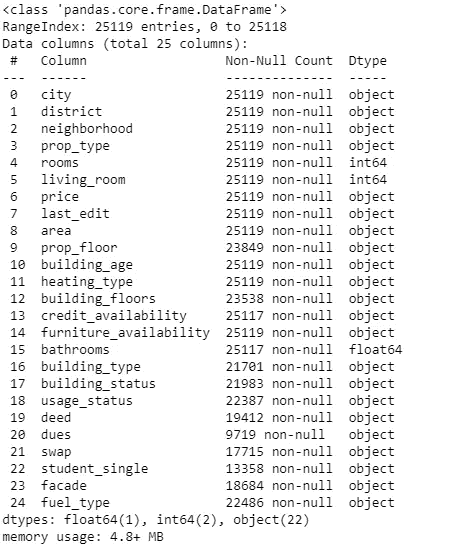**

**在我们将所有的 **CSV** 文件合并到一个 **Pandas** 数据框中后，我们开始查看数据框的信息，以了解总样本大小**‘25119’**、要素的数据类型以及数据缺失的位置。
我们注意到,( dues，student_single，facade)中存在大量无法管理或处理的缺失数据。另一方面，其他列是可管理的。**

**对于 ***prop_floor*** 特性，我丢弃了所有的空值，根据这个字典替换了一些曾经存在的值。**

> **mapper _ prop _ floor = {
> ' Bahe ':' 0。'，
> “吉里桑”:“0。”，
> 《于塞克》:“1。”，
> }**

**对于 ***建筑 _ 年龄*** 特征，我也做了一些贴图**

> **mapper _ building _ age = {
> ' SF fr ':' 0 '
> }**

**对于 ***heating_type*** 和 ***swap*** 特性，我选择将频率小于 111 的值合并到一个名为“Diger”的类别中(仅适用于 ***heating_type*** )，并使用此字典根据它们的频率将这些值映射到数字中(例如:“Soba”值具有最小的频率值)。**

> **mapper _ heating _ type = {
> ' Soba ':1，
> 'Diger': 2，
> 'Kombi': 3，
> 'Merkezi': 4，
> ' merke zi(Pay oler)':5
> }
> mapper _ swap = {
> ' Evet ':1，
> ' dier ':2，
> ' hay r ':3**

**对于***building _ status***和 ***facade*** 特性，我做了同样的事情但是使用了这个字典**

> **mapper _ building _ status = {
> ' yap am amas NDA ':1，
> 'i̇kinci El ':2，
> '塞弗勒':3
> }**

**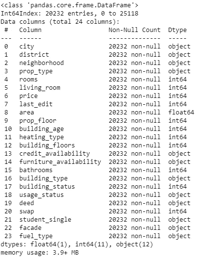**

**经过一些更多的操作和一些类型转换，我已经到达这个数据帧，我腌制它。
所有的**线性回归**部分都将在这个数据上完成。**

**在开始 EDA 部分之前，我决定移除非正常值和外层，在这个阶段结束时，我有一个带有' **15974'** 的数据帧。**

## **3-探索性数据分析(EDA):**

**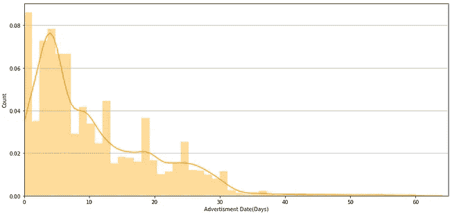****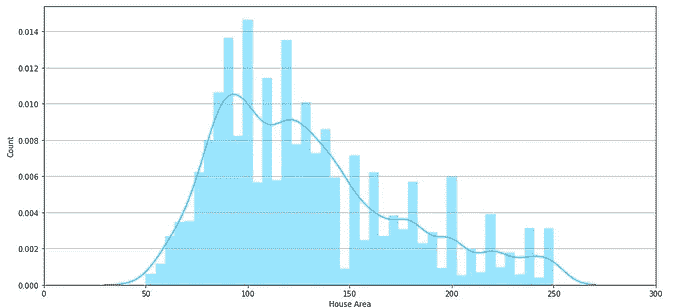****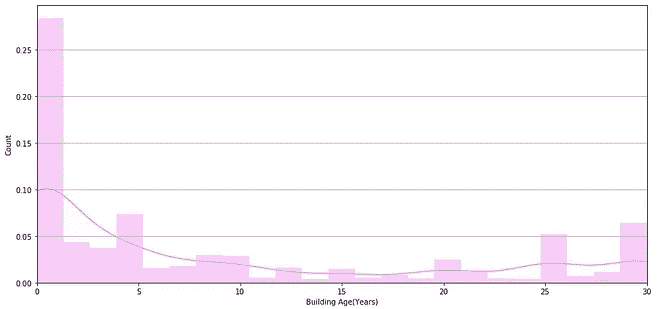****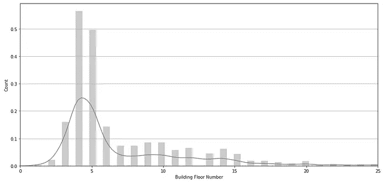****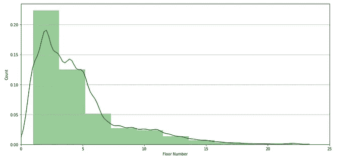****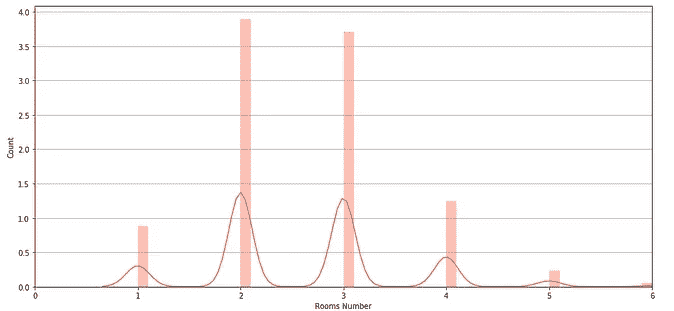**

**我开始 **EDA** 阶段是通过绘制我认为最重要的特征的分布 ***last_edit*** (橙色) ***area*** (深天蓝) ***building_age*** (紫色)***building _ floors***(灰色) ***prop_floor*** (绿色)**

**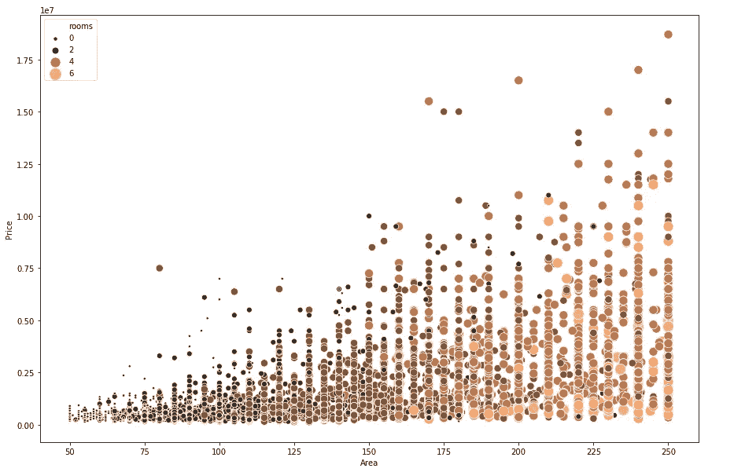**

**然后我想画出 ***面积*** 和 ***价格*** 与另一个特色 ***房间的关系。*****

**我需要看到价格和一些最重要的分类特征之间的关系**

**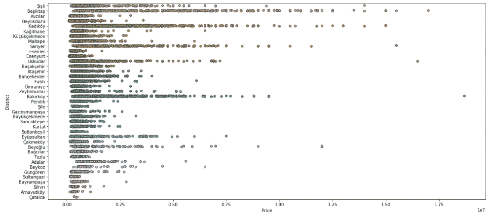**

**有价格的地区**

**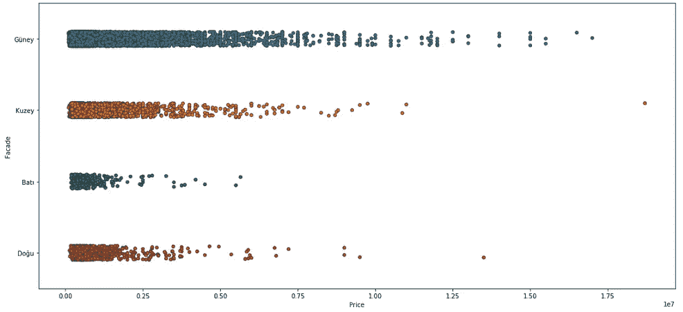****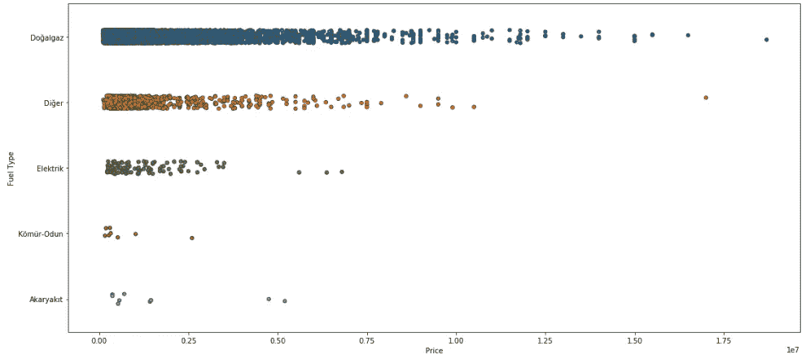**

**带价格的门面/燃料类型**

**最后，在开始线性回归部分之前，我决定看一下价格为 ***的数值特征的热图。*****

**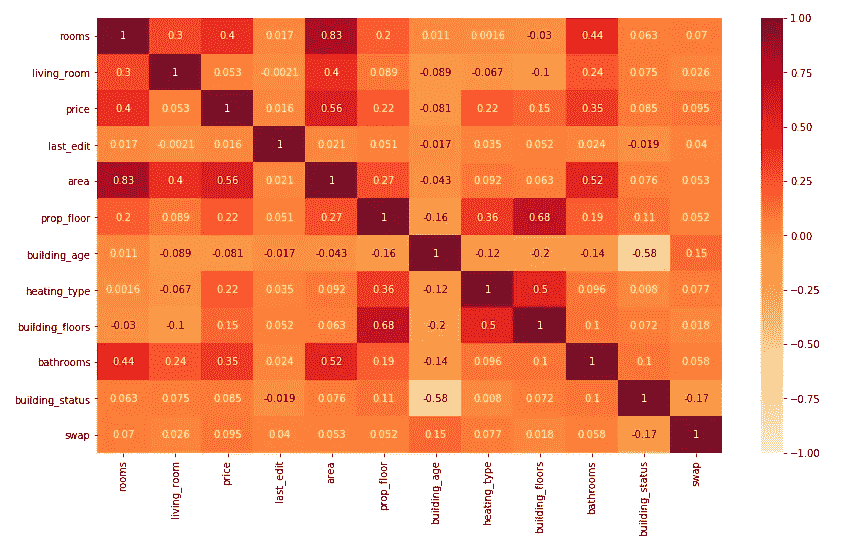**

## ****4-线性回归:****

**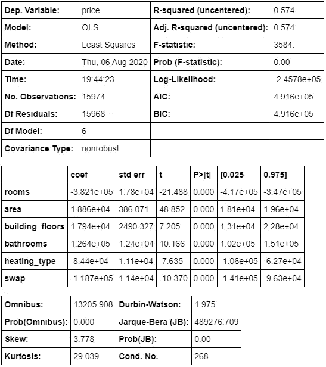**

**从 **Statsmodels** 包中的 **OLS** 模型开始，基本特征 ***(房间、面积、建筑 _ 楼层、交换、浴室、供暖 _ 类型)。*** I get smiler***R-squared***和***adj R-squared ' 0.574 '***， ***std-err*** 有点大这是可以理解的，因为特征和因变量之间的规模差异， ***cond-no*** 较低，这意味着共线性较低。太棒了，这个模型代表了一个坚实的起点。**

**让我们使用 Sklearn 包中的 **LinearRegression、** **Ridge、Lasso** 模型来看看 **R-squared** 的真实值，其中交叉验证为 10 个拆分，random_state 为 50，shuffle true(注意:我添加了次数为 2 的 PolynomialFeature)。**

> **线性回归交叉验证 R 均值:0.352
> 岭交叉验证 R 均值:0.394
> 套索交叉验证 R 均值:0.352**

**现在让我们开始通过以下方式提高我们的模型精度:
从 ***区*** 和 ***家具 _ 可用性*** 特征创建虚拟变量，并将它们添加到我们的基础数据帧 ***的末尾。*** 【我将创建一个新的特性 log_price，它代表实际价格值的 log10，我将使用它作为我的新因变量。**

**现在让我们来看看我们的新 **R 平方**与以前的型号配置相同。**

> **线性回归交叉验证 R 均值:0.782
> 岭交叉验证 R 均值:0.822
> 套索交叉验证 R 均值:0.424**

**耶！！我们做到了🤩。我们显然可以注意到，Ridge 是我们拥有的最佳模型，其 R 平方为 0.822。**

## **5-结论:**

**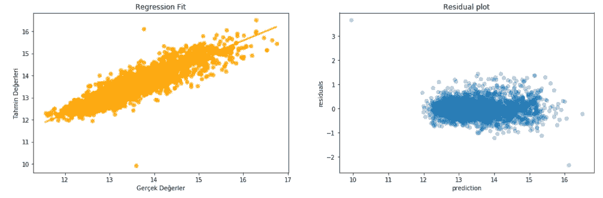**

*   **从回归拟合图中，我可以非常清楚地看到，数据点是围绕直线对称的。**
*   **根据残差图，点在 y=0 附近对称，方差大致恒定。**

**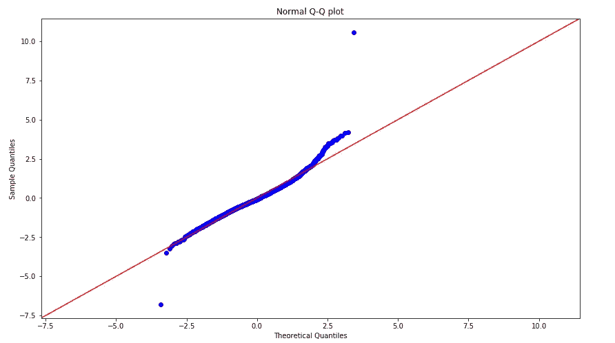**

**最后，从 Q-Q 图中，我们发现点的中间部分非常接近红色对角线。**

# **在以下位置找到我:**

****LinkedIn:**[https://www.linkedin.com/in/yamenshaban/](https://www.linkedin.com/in/yamenshaban/)
**GitHub:**[https://github.com/yamenkaba](https://github.com/yamenkaba)**