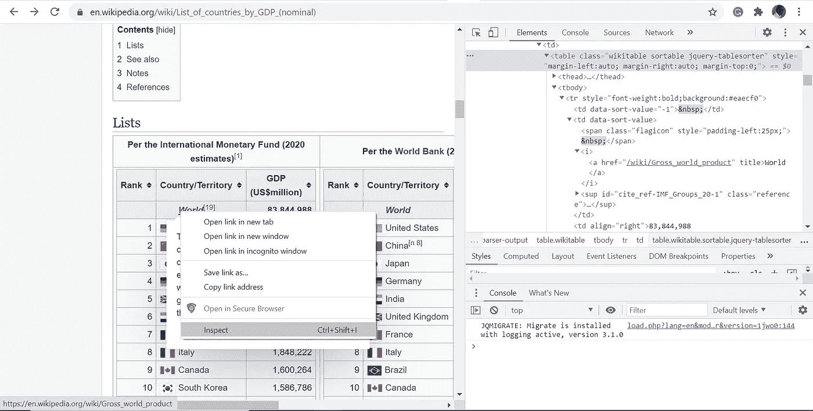
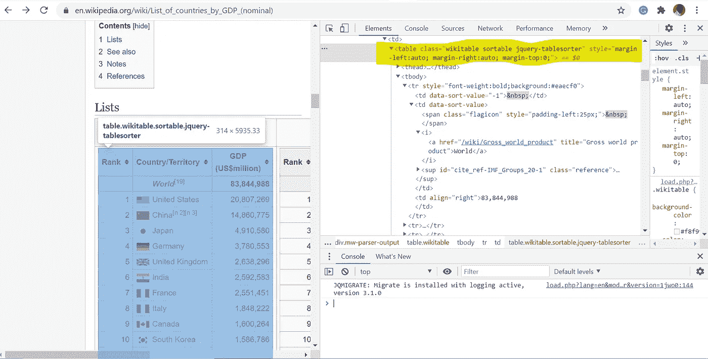
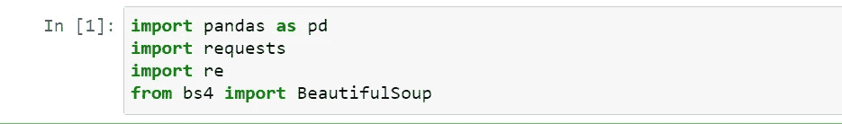
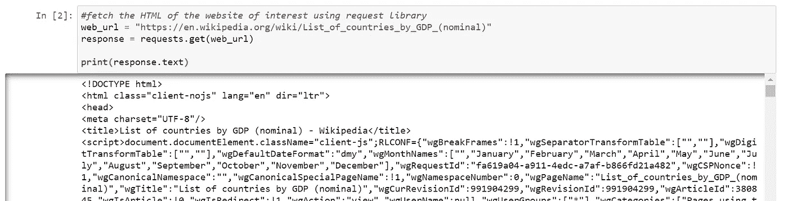
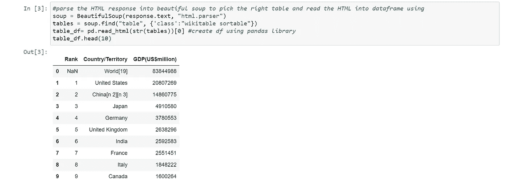
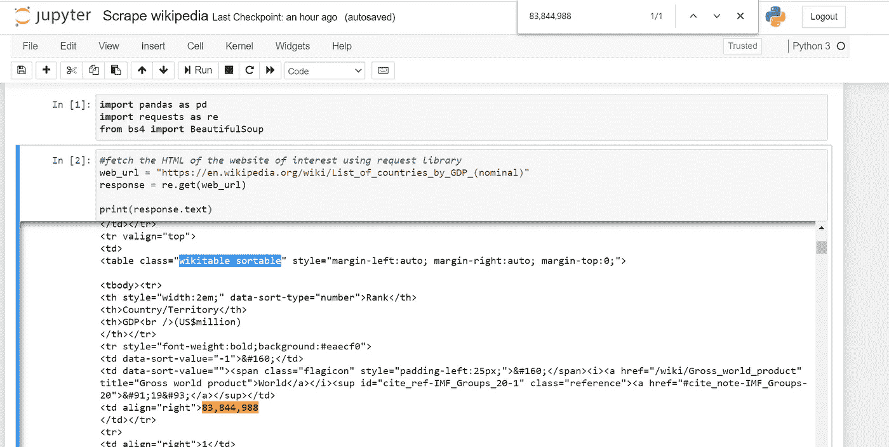
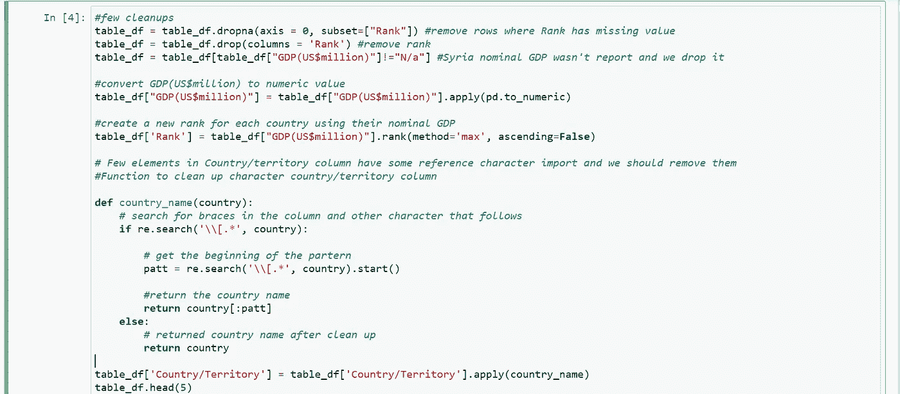

# 使用 Python BeautifulSoup 和 Pandas 库只需几个步骤就可以从维基百科中抓取数据

> 原文：<https://medium.com/analytics-vidhya/scrape-data-from-wikipedia-using-python-beautifulsoup-and-pandas-library-in-few-steps-5cda49e4dfc1?source=collection_archive---------3----------------------->

你是否曾经非常需要维基百科表格或其他网站上的数据，以至于你希望有一种方法可以复制这些数据并随时更新？此外，您知道数据可能会发生变化，保持报告和分析更新的唯一方法是自动连接到数据。

我打赌你和我一样也经历过这种情况。我要向你们展示的是我使用的一个简单的救生步骤。这种方法适用于你在不同网站上看到的大多数表格，例如[维基百科](https://en.wikipedia.org/)，[世界人口统计](https://www.worldometers.info/)，[世界人口评论](https://worldpopulationreview.com/)等等

好了，我们开始吧。

我使用 python 和 jupyter notebook 来完成这个任务，我们将使用下面的 python 库

1.  熊猫
2.  请求
3.  美丽的声音
4.  铼

在尝试从任何网站搜集数据之前，我喜欢遵循以下步骤:

1.  定义我的目标
2.  检查网站 HTML 标签并识别适当的表格标签
3.  将我的代码付诸实践

## 定义我的目标

我这个任务的目标是从维基百科上刮出由国际货币基金组织估算的名义 GDP 的国家名单

我需要的数据可以在这里找到[以及其他国际机构的类似表格，但我的主要目标是从国际货币基金组织获得数据](https://en.wikipedia.org/wiki/List_of_countries_by_GDP_(nominal))

## 检查网站 HTML 标签并识别适当的表格标签

下一步是打开网站，检查网站的 HTML 并找到适当的表格。

如果你右击网页上的任何地方，你会看到一个检查网站 HTML 代码的选项(或者使用 CTRL + Shift +I)。我正在使用谷歌浏览器进行演示，下面是我检查桌子时看到的截图。

如果您将光标切换到 HTML 元素上，您的浏览器将突出显示 HTML 所代表的表格或网站的部分。切换，直到您可以获得包含感兴趣的表的表标记。在我的例子中，我正在寻找的 table 标签有下面的类*“wiki table sortable jquery-table sorter”(稍后将详细介绍)*

我们已经找到了感兴趣的表格，是时候进入下一步了

## 将我的代码付诸实践

我将从导入上面列出的所有库开始。

我将使用 get()函数将请求库付诸实施。请参见下面的示例代码。打印响应以查看输出，并记住添加*。text* 以纯文本形式查看响应*，*如果没有响应，您将看到的是**<响应【200】>**(两者都可以，但我们需要文本来进行下一步)

接下来，我们将使用 BeautifulSoup 库解析使用 *re.get()* 函数返回的响应，并使用 pandas 创建一个 DataFrame。 ***记下我传给我的汤下面的类***

> 您会注意到我传递到表中的类与我们在检查上面的 HTML 时识别的不同。在一些网站上获取 table 类很容易，而在另一些网站上，你需要聪明地找到正确的 table 标签。
> 
> 从 Wikipedia 获取 HTML 后，类名变成了“wikitable sorttable ”,如果不识别正确的标签，我们就无法轻松地获取该表。
> 
> 聪明的做法是使用浏览器搜索在您的回复文本中找到该表。我通常做的是从表中复制一个值，并在浏览器中搜索它，然后追溯到表类(我在 IMF 表上复制了世界人口，并使用浏览器搜索— 83，844，988)。见下图

搜索浏览器以查找表类

就这样，你成功地刮出了你的维基百科表格

很少需要清理，查看国家列，您会看到一些国家的名称后面附加了*【N2】【n3】*，叙利亚的数据没有报告(您可以决定删除或更改 GDP 数据为零)。您可以使用以下代码清理您的数据框

## **完成**

你可以在 [Github](https://github.com/raymonbell01/Scrape_Wikipedia_Table/edit/main/README.md) 上访问代码