# 当 URL 根据搜索词发生变化时抓取数据

> 原文：<https://medium.com/analytics-vidhya/scrape-data-when-the-url-is-changing-based-on-the-search-term-726feca08cb8?source=collection_archive---------25----------------------->

好的，我不确定如何开始我的第一个项目，以及该做些什么。我热爱太多的东西，经过长时间的思考，我决定现在是时候将我的热情付诸行动了——网球！。

我想知道一个球员全年的排名，于是开始在网上寻找不同的网站，找到了官方网站[https://www.atptour.com/](https://www.atptour.com/)。吨的信息，但我只想一件事，排名！一切都好，准备处理并开始刮网，但是！我意识到每个玩家都有唯一的标识符:

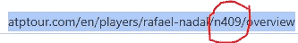

圆圈内-拉斐尔·纳达尔的唯一标识符

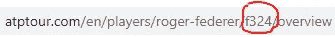

罗杰·费德勒的唯一标识符

而且是不可能的(或者无聊！！！)手动输入 URL 并将他们的表格下载到 nice data-frame 中以绘制图表。不确定该做什么，记得硒是存在的，但你会问我如何用它来做？让我告诉你一个好方法。

我的目标是将任何玩家的排名下载到熊猫数据框中，并绘制成图表以供可视化。

我将一步一步地讲述如何利用美丽的硒/美丽的汤/请求和熊猫。

首先也是最重要的是安装它们，最简单的方法:PIP INSTALL(模块名)，它很快就准备好了。为此:

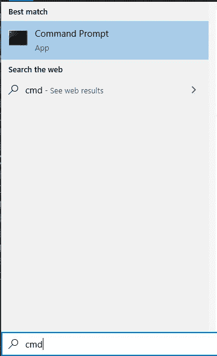

搜索 CMD

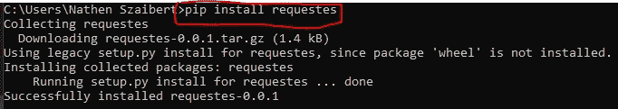

只需输入。很简单，对吧？

下载完所有模块后，我们就准备好了！

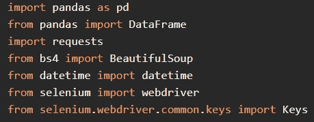

他们每个人都有一个目的，你以后会发现。保证！

我们正在导入模块或导入它的一部分，例如 selenium 的 webdriver，它与浏览器连接(我使用 chrome 来简化和更好地与 selenium 同步，Firefox 对我不起作用；-( ).

首先，我们需要为我们的驱动程序(浏览器)设置一个变量。

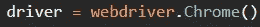

现在我们伟大的 Python 知道我们正在使用什么浏览器了。接下来的事情就看你的喜好了:

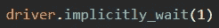

命令 Selenium 在网站上传后等待 1 秒钟，有时会发生 Selenium 工作非常快，网站很慢，并且会因为他没有找到元素而抛出错误(此外，请保证在下面解释它！)

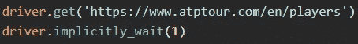

直接进入搜索页面找到我们想要的球员。

代码的下一部分是最令人沮丧的，需要耐心，我爱我的电脑不像这个家伙:-):

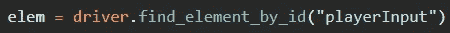

这是什么？

上面那行你需要用 inspect 找到

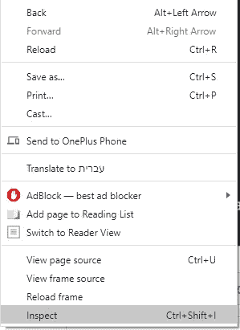

你需要找到搜索框所在的确切位置，找到了吗？

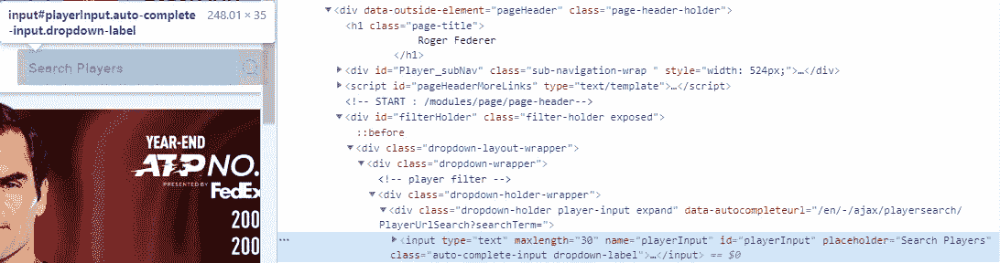

XPATH 现在已经找到了，复制它并粘贴到您的代码中

为了使它变得更容易，Selenium 提供了按不同参数搜索的选项，这里是按 ID，即 find.element_by_id()

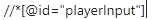

XPATH——因为 Selenium 很好，所以只需要@id 后面的部分

selenium 知道你要在哪里输入玩家的名字后，现在是时候键入它了:

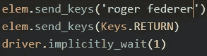

用人类的语言来说:Send_keys = type。keys.return = Enter

太棒了，现在我们键入(send_keys)玩家的名字，然后按 enter (keys.return)。但是！我们可能会遇到一个恼人的问题，错别字时，寻找一个球员来避免它，我们可以使用伟大的尝试/除外。

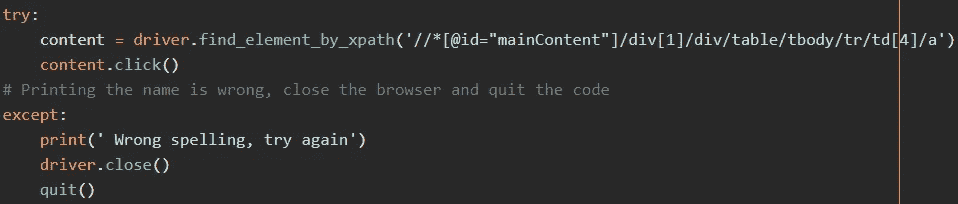

上面的截图，记得令人沮丧的 XPATH，这里我们再次寻找玩家的元素来点击它。

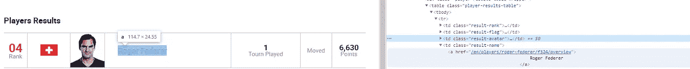

我们找到了它，现在我们可以点击它进入玩家的花瓶信息。

但是计算机不是在人工智能上运行的，而且确实是“愚蠢的”,所以如果我做错了，计算机会问我:

并抛出可怕的追溯

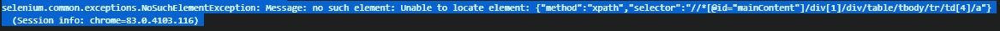

那是每次追溯后的我:-)

不过放心，生活是美好的，我们的蟒蛇也是。为了转移这个问题，我们使用了 try/except，如果有错别字，我们会很容易地纠正它。

你决定什么是你的追溯

太棒了，我们通过了关卡。现在我们想知道具体玩家的网址并打印出来。

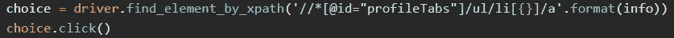

我将在我的下一篇文章中解释我到底在这里做什么，现在就这样吧。

我们找到了“排名历史”的 XPATH，点击它，它将我们带到页面。

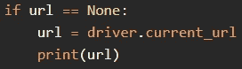

同样，因为是我的函数的一部分，url == None 把它当作是。

Selenium 有一个很棒的功能，可以抓取当前的 url:

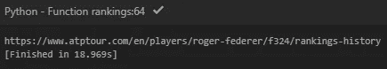

罗杰·费德勒的当前 URL =登录页面

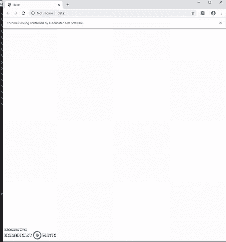

找到网址了！！！

现在，我们知道了如何获取 URL，下一篇文章我将展示如何下载熊猫格式的数据。

希望你喜欢它，并请评论让我知道它是否好，当然还有任何反馈！