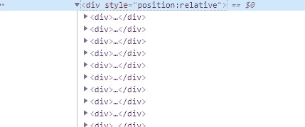

# 使用 python 和 selenium 从猫途鹰用户档案中抓取评论

> 原文：<https://medium.com/analytics-vidhya/scrape-reviews-from-tripadvisor-user-profiles-using-python-and-selenium-4ec82a963a8d?source=collection_archive---------8----------------------->


在这里，我将向您展示如何使用 python 和 selenium 在网站上抓取数据。在这里，我收集了 Tripadvisor 用户在其用户资料中发布的评论。

首先，我们需要在您的机器上安装 python 和 selenium。我假设你知道如何使用 pip。

下载 Selenium 很简单。

```
pip install selenium
```

所以现在我们已经准备好用 python selenium 编码了。首先，我们需要导入以下库，因为我们需要在实现过程中使用它们。

```
from selenium import webdriver
import csv
import requests
import re
import time
```

如你所见，我们已经导入了 web 驱动程序，这里我们将使用 chrome web 驱动程序。

```
driver = webdriver.Chrome()
driver.set_page_load_timeout(1)
```

然后我们通过使用 ***driver.get()*** 函数给出用 chrome 浏览器打开的 URL

```
driver.get(URL)
#to maximize the the tab 
driver.maximize_window()
```

抓取的数据将保存到 CSV 文件中。因此，我们需要事先创建一个 CSV 文件。我们可以使用***driver . find _ element _ by _ class _ name(" class _ name ")***方法找到 Tripadvisor 用户的名字。然后创建一个 csv 文件，将其命名为 username.csv。然后为创建的 CSV 文件编写标题。

```
username = driver.find_element_by_class_name(“gf69u3Nd”).text
filename1 = username+”.csv”#open csv file and add titles
 with open(filename1, mode=’w’) as f:
 writer = csv.writer(f)
 writer.writerow([str(‘username’),str(‘reviewTitle’),str(‘reviewDetails’),str(‘reviewDate’),str(‘reviewFor’)])
```

您可以参考用户配置文件的源代码来查找类名。下面的 HTML 代码是我用来查找概要文件的用户名的类名的源代码片段。

```
<span class=”_2j2RGdBF _3O8v47Pw”>
<span class=”_3BbDvcGq”>
<h1>
<span class=”_2wpJPTNc _345JQp5A”>Alex Fernando</span>
</h1>
</span>
<span class=”gf69u3Nd”>wwkalex-fernando</span>
</span>
```

现在我们有了一个以写模式打开的 CSV 文件，让我们在上面写点东西吧！！

转到用户资料后，我们需要转到 reviews 选项卡来查看用户发布的评论。因此，当我们将其自动化时，我们必须执行与手动步骤相似的步骤。因此，我们使用 XPath 找到 review 选项卡，然后单击它。

```
reveiwstab= driver.find_element_by_xpath (
‘//a[[@data](http://twitter.com/data)-tab-name=”Reviews”]’
)
reveiwstab.click()
```

# 如何使用 XPath 查找元素

我从下面的网站学到了很多东西。

 [## 4.定位元素- Selenium Python 绑定 2 文档

### 在页面中定位元素有多种策略。你可以根据自己的情况选择最合适的。

selenium-python.readthedocs.io](https://selenium-python.readthedocs.io/locating-elements.html) 

为了获得用户发布的所有评论，我们必须单击“显示更多”按钮，并进一步向下滚动网页，直到所有评论都已加载。所以我们会调查的。

```
#click the "show more" button
showmorebutton = driver.find_element_by_xpath(“//span[[@class](http://twitter.com/class)=’_1ogwMK0l’]”)
showmorebutton.click()
time.sleep(2)#Scroll down the web page until 200 elements foundwhile driver.find_elements_by_xpath (
"//div[[@style](http://twitter.com/style)='position:relative']/div"): driver.execute_script(
     "window.scrollTo(0, document.body.scrollHeight);"
      )
     review = driver.find_elements_by_xpath (
     "//div[[@style](http://twitter.com/style)='position:relative']/div"
      )
     elementCount = len(review)
     if (elementCount is 200):
         print ('end')
         break
     else:
         continue
```

在上面的滚动方法中，它向下滚动网页，直到加载了 200 个元素。我想您已经知道如何使用 XPath 查找元素了。在滚动过程中，加载的元素将被分配给 review 变量。我们可以通过使用 ***len()*** 函数得到元素计数。



捕获由保存在审阅变量中的元素组成的源代码

现在我们已经将所有元素保存到了 review 变量中。我们可以通过 for 循环访问每个元素。

```
for j in range(elementCount):try: 
reviewTitle = review[j].find_element_by_xpath(
“.//div[contains([@class](http://twitter.com/class), ‘_3IEJ3tAK _2K4zZcBv’)]”).text 
reviewDate = review[j].find_element_by_xpath(
“.//div[contains([@class](http://twitter.com/class), ‘_3Coh9OJA’)]”).text 
reviewFor = review[j].find_element_by_xpath(
“.//div[contains([@class](http://twitter.com/class), ‘_2ys8zX0p ui_link’)]”).text 
```

到目前为止，我已经检索了评审的详细信息，如评审标题、评审日期和被评审方，但没有检索到评审。因此，如果您访问过 Tripadvisor 的用户档案，您就会知道整个点评不会显示在用户档案中，而是显示在被点评方的档案中。因此，我们必须访问特定被审查方的个人资料，以检索整个审查。就这么办吧！！

```
reviewsummary = review[j].find_element_by_xpath(
“.//div[contains([@class](http://twitter.com/class), ‘_1kKLd-3D’)]/a”).get_attribute(“href”)

 driver.execute_script(“window.open(‘’);”)
 driver.switch_to.window(driver.window_handles[1])
 driver.get(reviewsummary)
 time.sleep(2)if (check_exists_by_xpath(“//span[[@class](http://twitter.com/class)=’fullText hidden’]”)):

  readMore = driver.find_elements_by_xpath( “//div[[@class](http://twitter.com/class)=’reviewSelector’]/div/div[2]/div[3]/div/p/span”)
  readMore[2].click()
  reviewText = readMore[1].textelif (check_exists_by_xpath(“//span[[@class](http://twitter.com/class)=’fullText ‘]”)):

  readMore= driver.find_elements_by_xpath(   “//div[[@class](http://twitter.com/class)=’reviewSelector’]/div/div[2]/div[3]/div/p/span”)
  reviewText = readMore[0].text

else:
  reviewdetails = driver.find_elements_by_xpath( “//div[[@class](http://twitter.com/class)=’reviewSelector’]/div/div[2]/div/div/div[3]/div/p”)
  reviewText = reviewdetails[0].text

 driver.close()
 driver.switch_to.window(driver.window_handles[0]) 
```

根据上述代码，reviewsummary 将链接到被审查方的个人资料。然后，它将在一个新窗口中打开该链接，并获得完整的评论，最后将其保存到 reviewtext 变量中。完成任务后，第二个窗口将被关闭，来到主窗口。然后，它将进入用户配置文件的下一个审查，并将在一个新窗口中打开一个新审查的党。这个过程将反复发生，直到 200 条评论都被删除。

最后，我们得到了所需的所有数据，剩下的工作就是将这些数据写入 username.csv 文件。

```
def writecsv(c1,c2,c3,c4):
   with open(filename, mode=’a’,newline=’’) as f:
   writer = csv.writer(f)
   writer.writerow([str(c1),str(c2),str(c3),str(c4)])
```

我们只需调用上述方法将数据写入 CSV 文件。

```
writecsv(reviewTitle,reviewText,reviewDate,reviewFor)
```

原来如此。你可以在这里找到完整的代码[](https://github.com/Sanjanaekanayake/tripadvisor-user-profiles-scrapper)