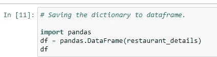

# 刮网——很有趣。

> 原文：<https://medium.com/analytics-vidhya/scrape-the-web-its-fun-b3ad77d07c21?source=collection_archive---------18----------------------->

## 然而，任何有趣的事情都有它自己的限制。网络抓取也是如此。因此，一定要事先确认特定网站是否允许网络抓取。


由 [Unsplash](https://unsplash.com?utm_source=medium&utm_medium=referral) 上的[émile Perron](https://unsplash.com/@emilep?utm_source=medium&utm_medium=referral)拍摄的照片

**我们为什么需要网络抓取？**

在当今世界，我们生活在一个数据池中。想象一下，如果我们能够理解所有隐藏的模式，并提出有用的见解，每个企业都会在行业中蓬勃发展。

在我看来，这是一种有来有往的政策。顾客得到他们想要的，企业从中获利。听起来简单吗？嗯，如果我们能够方便地访问结构合理、干净的数据来分析信息，以便提出创造性的抽象概念，那就有可能了。但在真实场景中并非如此。

无论是机器学习还是人工智能，数据科学项目中的第一个要求是收集数据。如果我们收到结构化数据，数据科学家的生活不是更轻松吗？但是我们如何让我们的生活更轻松？

**正确收集数据！但是从数据库？来自 excels？从文本文件？从网站上？**

这就是我们将要在这篇文章中讨论的收集信息的方法之一。

**我们再举一个例子来理解。**

假设，我们有一个场景，我的机器学习模型在训练数据和测试数据上都表现不佳。这个概念在机器学习中被称为[欠拟合](/analytics-vidhya/overfitting-and-underfitting-in-machine-learning-d829d8501335)。解决不合身的最简单有效的方法是什么？难道它没有足够的数据来训练我们的模型吗？那么，什么能把我们从这种不幸的时代中拯救出来呢？

嗯，网络抓取可以作为救星来帮助我们收集数据。


[Franki Chamaki](https://unsplash.com/@franki?utm_source=medium&utm_medium=referral) 在 [Unsplash](https://unsplash.com?utm_source=medium&utm_medium=referral) 上拍摄的照片

现在进入主题，我们大多数人都知道 instagram、twitter、facebook 等各种网站都有特定的 API，可以帮助开发人员通过执行一些简单的初始步骤，轻松访问他们正在寻找的不同类型的数据。然而，我将把这一部分留给我的读者去探索。

那么，现在问题来了？如果网站有 API，如果有很多简单的方法来收集所需的信息，我们为什么需要抓取网站呢？这是因为并不是所有的网站都为我们提供了这样的设施，从而提高了网络抓取的迫切需要。

**维基百科对网络抓取的定义:**

*网页抓取、网页采集或网页数据提取是* [*数据抓取*](https://en.wikipedia.org/wiki/Data_scraping) *用于从* [*网站*](https://en.wikipedia.org/wiki/Website) *中* [*提取数据*](https://en.wikipedia.org/wiki/Data_extraction) *。网络抓取软件可以使用* [*超文本传输协议*](https://en.wikipedia.org/wiki/Hypertext_Transfer_Protocol) *或者通过网络浏览器直接访问万维网。虽然网络抓取可以由软件用户手动完成，但该术语通常指的是使用* [*机器人*](https://en.wikipedia.org/wiki/Internet_bot) *或* [*网络爬虫*](https://en.wikipedia.org/wiki/Web_crawler) *实现的自动化过程。它是一种复制的形式，具体的数据是从网上收集和复制的，通常是到一个中央本地的* [*数据库*](https://en.wikipedia.org/wiki/Database) *或电子表格，供以后* [*检索*](https://en.wikipedia.org/wiki/Data_retrieval) *或* [*分析*](https://en.wikipedia.org/wiki/Data_analysis) *。*

还有，为什么我们不能直接使用网站上的数据？

***下面是我偶然看到的关于网页抓取的精彩讲解，回答了上面的问题:***

*Web scraping 是一种工具，用于将 Web 上的非结构化数据调整为可供分析的机器可读的结构化数据。*

**在数据科学领域，简单的 python 脚本和库以及 HTML 的基本概念可以帮助我们实现目标。**

有各种各样的工具和方法，如 selenium、scrapy 和多个 python 库，如用于 web 抓取的 urlib。然而，顾名思义，我们在 python 中有一个惊人的解析库，叫做“BeautifulSoup ”,我将在我的任务中使用它。

我们在网上有很多关于任何主题的教程来教育我们自己，然而，潜在的技能在于我们如何优化我们的知识并将其用于我们自己的需要。因此，让我们开始练习。

**让我们列出网络抓取的各个步骤:**


图片来源:Quora.com

1 >第一步也是最重要的一步是向我们想要抓取的网站发出 HTTP 请求，并获得响应。

2 >一旦收到响应，我们就像美汤一样把下载的内容喂给 html 解析器，提取我们需要的信息。

3 >现在我们有了所需的数据，我们需要将它保存在某个地方。因此，第三步也是最简单的一步是将这些输入存储到一个 csv/excel 文件中，或者我们甚至可以将其加载到一个兼容的数据库中。

现在，因为我喜欢食物，我们很多人都喜欢，*在这篇文章中，我将与大家分享我非常喜欢的一次简单的网络抓取体验，并实现了*收集班加罗尔 10 家顶级餐厅的名称、地址、价格和报价等细节。

**但在此之前！网络抓取合法吗？**我们如何知道我们是否真的被允许从特定网站提取数据。

*嗯，我们可以通过检查网站的 robots.txt 文件来验证这一点。如果您看到类似“User_Agent * allow: /”的内容，那么我们就可以开始了。关于这个的更多细节可以在我在 stackexchange* [*页面*](https://webmasters.stackexchange.com/questions/50540/what-does-disallow-search-mean-in-robots-txt) *找到的这个博客中找到。*

***最后我们要一步一步的实施流程:***

*   首先，我们将导入所需的库，如 pandas、requests 和 BeautifulSoup。


*   接下来，我们将获得我们想要抓取的网站的 URL，并设置标题。


*   更多关于标题的信息可以在下面的链接中找到。

[https://www.whoishostingthis.com/tools/user-agent/](https://www.whoishostingthis.com/tools/user-agent/)

[http://go-colly.org/articles/scraping_related_http_headers/](http://go-colly.org/articles/scraping_related_http_headers/)

*   我们都知道，每当我们在任何浏览器上键入一个网站地址时，都会发送一个 HTTP 请求来访问该网站，如果请求成功，该网站将显示所需的网页。同样，这里我们将使用 Python 的**请求库向 URL 发送一个 HTTP GET 请求来下载 HTML 内容。**


*   然后使用**解析库‘beautiful soup’**获取并解析下载的数据。**现在，在这里我特别要提一下 prettify()函数。**我们也可以在不使用下载内容的情况下打印它，但是应用 prettify()函数确实使数据看起来漂亮、整洁、更具可读性和可理解性。


*   现在，我们需要首先在开发人员工具的帮助下，使用任何浏览器检查我们想要抓取的页面，并根据我们正在寻找的部分，尝试理解代码的结构。然后分析我们笔记本里的 HTML，提取出需要的信息，存储在 CSV/Database/JSON 等。

因为，我想要像餐馆名称、地址、价格和可用报价这样的细节，所以我将寻找存储我需要的信息的 HTML 标签。


上面的代码表明，将返回所有包含 class equals 的 HTML div 标记“restnt-main-wrap clearfix ”,其中包含所有餐馆信息并保存在“rest_details”中。我还检查了“rest_details”的长度，以验证我需要的数据计数是否正确。

**为了提取更多的信息，我们将使用一个循环来访问每个餐馆的内容。**


上面的代码只提取了我需要的 HTML 内容。

因此，我们将检索存储在不同 HTML 标签和类下的所需信息。

例如:

*   餐馆名称存储在锚标记  下。

```
**<a** analytics-action="RestaurantCardClick" analytics-label="13437_JW Kitchen" class="restnt-name ellipsis" data-w-onclick="sendAnalyticsCommon|w1-restarant" href="/bangalore/jw-kitchen-vittal-mallya-road-central-bangalore-13437">
     **JW Kitchen**
   ** </a>**
```

*   餐馆地址存储在 HTML div 标签下，包含类等于“restnt-loc 省略号”。

```
**<div class="restnt-loc ellipsis"** data-w-onclick="stopClickPropagation|w1-restarant">
     <a href="/bangalore-restaurants/jw-marriott-hotel-landmark">
      **JW Marriott Hotel**,
     </a>
     <a data-name="Vittal Mallya Road" data-type="LocalityClick" href="/bangalore-restaurants/central-bangalore/vittal-mallya-road">
      **Vittal Mallya Road**
     </a>
     ,
     <a data-name="Central Bangalore" data-type="AreaClick" href="/bangalore-restaurants/central-bangalore">
      **Central Bangalore**
     </a>
   ** </div>**
```

同样，剩下的信息。现在分析完上面的 HTML 内容后，我们可以编写下面的代码:

**#提取餐厅详情:**

```
for res in rest_details:

 rest_name = res.find(‘a’)
 rest_address = res.find(‘div’, attrs={‘class’: ‘restnt-loc ellipsis’})
 rest_price = res.find(‘span’, attrs={‘class’: ‘double-line-ellipsis’})
 rest_offer = res.find(‘li’,attrs={‘class’: ‘ellipsis’})

 print(rest_name.text,rest_address.text,rest_price.text,rest_offer.text)
```

**输出:**最后我们成功地检索到了细节。


# **现在到了最重要的部分——存储数据。**

首先我创建了一个列表“restaurant_details ”,然后初始化字典“dataframe”。最后将字典存储在列表中。


输出样本。



样本测向输出

**最后，我们将所需信息加载到 CSV 文件中，该文件将保存在 c 盘的“用户”文件夹下。**


***最终，我们将数据以结构化格式保存在 CSV 文件中，以备分析之用。***

**以上完整代码可在 github 中查阅:**[*https://github . com/anjuraj-ops/Projects-in-data-science/blob/master/web % 20 scrape % 20 restaurants % 20 details . ipynb*](https://github.com/anjuraj-ops/Projects-in-data-science/blob/master/web%20scrape%20restaurants%20details.ipynb)

我还做过一个项目，从另一个网站上提取销售中的“天然植物名称”和它们的“价格”等细节。github 中也提供了相关代码:[*https://github . com/anjuraj-ops/Projects-in-data-science/blob/master/web % 20 scrape % 20 plants . ipynb*](https://github.com/anjuraj-ops/Projects-in-data-science/blob/master/web%20scrape%20plants.ipynb)

最后但同样重要的是，网络抓取很有趣。请继续关注，我将深入研究更复杂的网页清理，如图片清理、多个网页清理、多个 URL 清理等。

让我们一起学习。快乐学习！！

一如既往，我欢迎任何反馈。