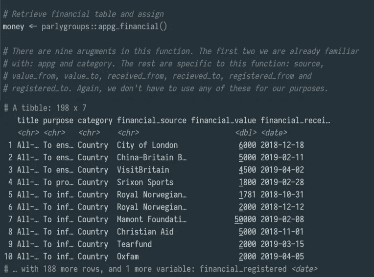

# 与议会团体一起清除所有党派的议会团体

> 原文：<https://medium.com/analytics-vidhya/scraping-all-party-parliamentary-groups-in-r-with-parlygroups-29b05907afda?source=collection_archive---------15----------------------->

菲尔·杜比在 [Flickr](https://www.flickr.com/) 上的照片

*请注意:我是以个人身份写这篇文章的。表达的任何观点都不是我雇主的观点。*

在过去的几个月里，议员们和他们的工作人员向我提出了一些相当简单直接的问题，这些问题都是关于各党派议会团体的。

他们问:“谁在 APPGs 中担任最多的官员角色，APPGs 从外部来源获得的资金价值是多少？”紧接着是一句:“我能尽快拿到这个吗？”

不幸的是，回答这些问题远非快速或简单——包含 APPGs 详细信息的登记册仅由议会以网页或 PDF 文档的形式发布。拿出了纸和笔。没有整洁的 Excel 文件给我！几个小时后，我有了答案:对他们来说，这是一个他们可以使用的干净的号码；对我来说，意识到这显然不是我长期工作的最佳方式。

想到未来我不得不重复费力地一页一页筛选《APPG 登记簿》的任务，我感到恐惧，于是我决定做任何天生懒惰的人都会做的事情——让一台机器为我做这件事。幸运的是，解散就在眼前，这给了我开始写一些代码的绝佳机会。

几个星期和几次碰壁之后，我可以自豪地介绍[**parlygroups**](https://github.com/dempseynoel/parlygroups)——一个 R 包，它具有所有需要的功能，可以毫不费力地将讨厌的 APPG 寄存器的内容刮到漂亮整洁的数据表中。让我们看看现在回答同样的问题有多快多简单…

首先，让我们安装 **parlygroups** 包并下载 APPG 注册。对于本演练，我们将使用日期为 2019 年 11 月 5 日的最新可用登记簿。我们需要使用 **download_appg()** 函数将注册表放入 R 中，它需要做的只是 ISO 8061 格式的**注册日期**——“2019–11–05”。还有两个额外的参数可以使用， **pause** ，这是抓取每个 APPG 页面之间等待的秒数，以及 **save** ，这允许您将抓取的数据保存在您的机器上，尽管这些不是强制的。

一旦注册被下载(有一个方便的小进度条告诉你还有多长时间可以等待)，我们终于可以看一些数据了。我们的第一个问题是“谁在 APPGs 中担任最多的官员角色？”为了帮助回答这个问题，我们所需要的是 **appg_officers()** 函数，该函数将返回一个表，显示每个 appg 的议员和上议院议员的详细姓名。

现在我们有了一个充满数据的表格，我们可以再写几行代码来看看哪个议员或勋爵是最多产的 APPG 官员。[**dplyr**](https://cran.r-project.org/web/packages/dplyr/index.html)**包内的函数非常适合这种数据争论——只需将我们的**军官**表**组**中**军官 _ 姓名**列的所有议员和上议院议员的姓名，然后**将他们**排列起来**按**降序**排列**即可。**

****

**哈！因此，结果是彼得·博顿利爵士拥有最多的官员职位。只要稍加调整，我们就能算出哪个政党拥有最多的官员，哪个议员或上议院议员拥有最少的官员，或者介于两者之间。**

**我们的第二个问题是“APPGs 从外部来源获得的资金价值是多少？”回答这个问题现在也一样简单。让我们使用 **appg_financial()** 函数，因为它将给出一个表格，显示所有从外部来源获得资金的 appg。**

****

**在这里，我们可以看到有 198 个外部来源，如公司、慈善机构或其他组织，向 APPG 提供资金。现在，我们可以简单地对 **financial_value** 列求和，得到我们的答案(1，517，997)，尽管让我们更进一步，得到每个组收到的总资金，并将它们从高到低排序。**

****

**事实证明，第四次工业革命中的 APPG 获得了最多的外部资助。如果现在你想调查到底是谁在资助这个团体，这是非常容易的——你所要做的就是再次调用 **appg_financial()** 函数，并将这个团体的名称提供给 **appg** 参数。**

**这两个简单的问题第一次回答就花了我一生的时间。现在可以在几分钟内完成。在新的一年里，这肯定会让我的生活轻松很多！**

**如果你对我如何改进[讨论组](https://github.com/dempseynoel/parlygroups)有任何意见或建议，请在这里留言或在 Github 上提出问题。**