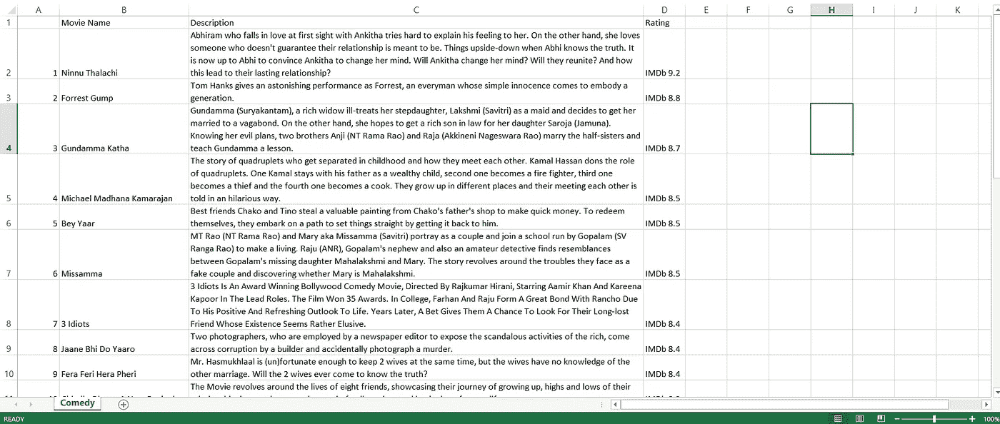

# 使用硒和美丽的汤刮亚马逊总理视频

> 原文：<https://medium.com/analytics-vidhya/scraping-amazon-prime-video-using-selenium-beautiful-soup-cfb9164f6dcd?source=collection_archive---------6----------------------->


照片由[格伦·卡斯滕斯-彼得斯](https://unsplash.com/@glenncarstenspeters?utm_source=medium&utm_medium=referral)在 [Unsplash](https://unsplash.com?utm_source=medium&utm_medium=referral) 拍摄

Selenium 是一个用于 web 抓取的强大工具，但它也有缺陷，这是公平的，因为它主要是为测试 web 应用程序而开发的。另一方面，Beautiful Soup 是专门为网络抓取开发的，确实非常强大。

但是，即使是漂亮的汤也有它的弱点，如果需要抓取的数据在“墙”后面，它也不是很有用，因为需要用户登录才能访问这些数据，或者需要用户执行一些操作。

这就是我们可以使用 Selenium 来自动化用户与网站的交互的地方，我们将在进入“墙”后使用 Beautiful Soup 来收集数据。

将硒与美汤整合在一起，创造了一个强大的网页抓取工具。

虽然您可以只使用 Selenium 来自动化用户交互和收集数据，但是 Beautiful Soup 在收集数据方面效率更高。

我们将使用 Selenium 和 Beautiful Soup 从亚马逊 Prime Video 的喜剧类型中收集电影细节，如名称、描述和评级，我们将根据其 IMDB 评级过滤电影。

所以让我们开始吧，

首先，让我们导入所需的模块；

```
from selenium import webdriver
from selenium.webdriver.common.keys import Keys
from bs4 import BeautifulSoup as soup
from time import sleep
from selenium.common.exceptions import NoSuchElementException
import pandas as pd
```

让我们启动三个空列表来保存电影细节，

```
movie_names = []
movie_descriptions = []
movie_ratings = []
```

要运行该程序，您需要安装 Chrome Web 驱动程序。你可以在这里**获得 Chrome 驱动 [**，确保你下载的驱动与你的 Chrome 浏览器版本匹配。**](https://chromedriver.chromium.org/downloads)**

**让我们创建一个函数`open_site()`，它将打开 Amazon Prime 登录页面，**

**现在让我们定义一个`search()`函数来搜索我们指定的流派，**

**这个函数搜索流派并向下滚动到页面的末尾，因为主要视频有无限滚动，我们使用 JavaScript executor 滚动到末尾，然后通过调用`driver.page_source`获得页面源，我们使用这个源并将其传递到 Beautiful Soup。**

**`if`声明是为了得到评分大于 8.0 小于 10.0 的电影，只是为了确认一下。**

**现在让我们创建一个熊猫数据帧，来存储我们所有的电影数据，**

**现在让我们调用函数，**

```
open_site()
```

## **输出:**

****

**作者图片:Comedy.csv 文件**

> **您的输出看起来不会完全像这样，我已经格式化了一点，像调整列宽，我已经包装了文本，除此之外，它应该像这样。**

# **结论**

**虽然硒和美丽的汤一起工作，可以提供良好的效果，还有一些其他模块也同样强大，如 Scrapy。**

**你可以在这里找到完整的代码。**

**[](https://github.com/sectrumsempra/prime_video.py/blob/main/Sel_Beaut.py) [## sectrumsempra/prime_video.py

### 一个程序来抓取亚马逊主要视频，以获得特定类型的电影列表，并根据它们的…

github.com](https://github.com/sectrumsempra/prime_video.py/blob/main/Sel_Beaut.py) 

如果你喜欢用 Python 实现自动化，那么你可能也会喜欢这个，

[](/analytics-vidhya/building-a-reddit-bot-with-selenium-web-driver-87ece50c7d5) [## 用 Selenium Web 驱动程序构建 Reddit 机器人

### 厌倦了自己分享帖子？阅读以了解更多信息…

medium.com](/analytics-vidhya/building-a-reddit-bot-with-selenium-web-driver-87ece50c7d5)**