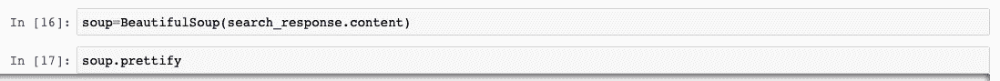
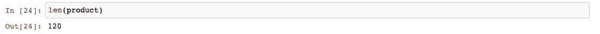
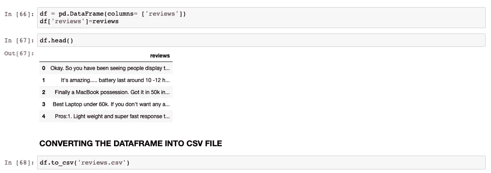

# 抓取亚马逊评论

> 原文：<https://medium.com/analytics-vidhya/scraping-amazon-reviews-fc13617e0ba1?source=collection_archive---------6----------------------->

## 今天让我们来讨论一下“什么是网络抓取？”

> 网络抓取就是从不同的角度获取对某些产品或服务的评论或评级的所有信息。我们也可以删除社交媒体帖子的评论、喜欢和不喜欢。

现在，在这篇博客中，我将向你展示我是如何从亚马逊上收集产品评论的

我要去刮苹果笔记本的评论。为此，请遵循以下步骤

首先，您需要在 python 中安装所需的包。我们需要 BeautifulSoup 来提取——你也可以使用任何其他包，比如 scrapy，但是现在，我使用 BeautifulSoup

现在，在安装了所需的包之后，通过以下代码将 BeautifulSoup 导入 python:

现在我们需要执行基本的 url。每个网站都有标准的基本网址，现在亚马逊就是这样

`“https://www.amazon.in/s?k="`

并搜索查询我们想刮什么产品。我将抓取 apple laptops，以便 apple+laptops 将成为我的搜索查询并立即执行:

> 现在把“搜索查询”和“基本网址”打印在一起，这样就可以直接进入苹果笔记本电脑

现在检查亚马逊的回应，看它是否允许我们进行抓取

*   如果代码给出 503，这意味着页面没有内容。
*   如果代码给出 200，一切都是清楚的，可以访问。

我们现在将使用代码检查内容

如果我们不能访问页面，我们使用标题来访问页面内容。

我们有内容，但现在我们给出了内容可用性的标题

标题可以在下面找到

*   转到检查元素。
*   点击网络和
*   点击和任何一个名字和
*   向下滚动
*   你可以找到“用户代理”
*   在标题中插入代码

接下来查看搜索响应中的文本，使用以下代码:

接下来给出提取评论的链接

现在检查上面链接的内容

我们现在得到了内容，让这些内容可以被 BeautifulSoup 包所理解

现在检查页面的标题

现在我们需要通过给出“类”和“属性”来检查产品列表

我们可以在

*   检查元件
*   点击产品
*   你可以找到“类”和“属性”代码

接下来，我们编写一个函数，声明检查页面是否可以废弃。

在这种情况下，我们将标题分为多个标题。

接下来是给出循环函数，用于声明我们想要在这里废弃的页数

我给 10 页中的 7 页

现在为每页中的产品列表编写一个循环

现在检查产品的长度

为每页中每个产品的所有 ASIN 编号编写循环，并检查产品的长度

> 每个产品都分配有一个 ASIN 编号。每个产品都有不同的数据，如编号，这有助于轻松识别特定的产品。

你可以在类中找到数据

*   检查元件
*   点击产品标题，然后
*   查找“数据别名”
*   你可以找到“类”和“属性”代码

现在为所有产品的链接定义函数

接下来，我们定义收集每个数据的所有评论的函数——as in number

在这里，类将在

*   在搜索中打开任何一个产品
*   务必检查元件和
*   点击一条评论
*   我们可以找到那些“类”和“属性”

现在，最后通过下面的代码将数据文件转换成数据帧:

我把数据框转换成 CSV 文件，审查与我们在一起……