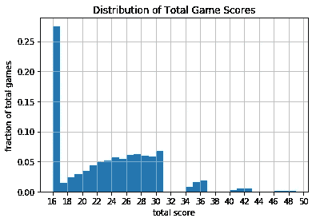

# 收集和分析 CS:GO 游戏分数数据

> 原文：<https://medium.com/analytics-vidhya/scraping-analyzing-cs-go-game-score-data-from-esea-997a875ca90f?source=collection_archive---------7----------------------->

《反恐精英:全球攻势》(缩写为 CS:GO)是一款多人第一人称射击类电子游戏。最近，竞技类 CS:GO 人气激增。CS:GO 比赛上的赌博也非常流行；CS:GO 比赛的赌注约占全球电子竞技博彩量的 29%([来源](https://www.thelines.com/wp-content/uploads/2018/03/Esports-and-Gambling.pdf))。

竞技 CS:GO 游戏遵循一个预先确定的格式:第一个获得 16 分的团队赢得游戏。如果双方在第 30 轮结束时都得了 15 分，比赛要么以平局结束，要么根据联盟规则继续加时赛。

CS:GO betters 经常在一场比赛中的总得分上下注。像这样的赌注被称为*过高过低*赌注。例如，在超额下注中，可以下注少于 25.5 分。在那个例子中，下注者*下了*，如果得分为 25 分或更少，他将获利。

刮掉的游戏分数分布

为了深入了解超额下注背后的统计数据，我从 ESEA最近的 1 万个 CS:GO 竞技游戏中搜集了数据。我计算了每场比赛的总得分，并创建了一个直方图来可视化总得分的分布。

直方图显示，大约 27%的游戏是 16 分游戏。这似乎有悖直觉；为什么一场 16 比 0 的比赛比一场 16 比 1 的比赛发生的可能性高 10 倍？

经过额外的研究，我认为绝大多数的 16-0 比赛可能是取消资格、比赛被取消或缺席的结果。为了消除这些不规则的数据点，我手动设置 16-0 比赛的概率等于 16-1 比赛的概率。应用这个假设后，我创造了新的数字。

16 场比赛概率调整后的比赛分数分布和累积分布。

在竞技类的 CS:GO 中，加时赛并不遵循突然死亡的格式。相反，在 30 轮比赛后 15-15 平的比赛将在获胜者加冕之前至少再打 6 轮；这解释了 30 分以上分数分布的差距。

游戏分数的累积分布尤其与上下赌注者相关。使用累积分布，我们可以估算出一场比赛以高于或低于某个阈值的分数结束的概率。例如，大约 67%的游戏以总分小于或等于 27 结束。

我计算了低于和高于 4 个不同分数的游戏的分数。

我把上面列出的分数概率转换成了十进制概率。使用计算出的小数赔率，投注者能够确定博彩公司提供的赔率是有利还是不利。例如，根据我下面的计算，只有当十进制赔率大于 2.42 时，下注者才应该下注超过 26.5。

当然，我的模型没有考虑到得分趋势，这可能是个别球队或比赛情况所特有的。我也没有包括随着时间的推移出现的得分趋势的修正。然而，在这种分析中产生的数字可以作为智能下注的起点。