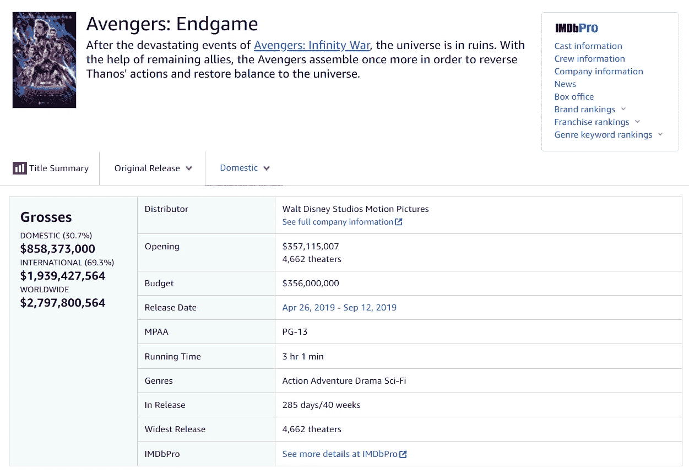
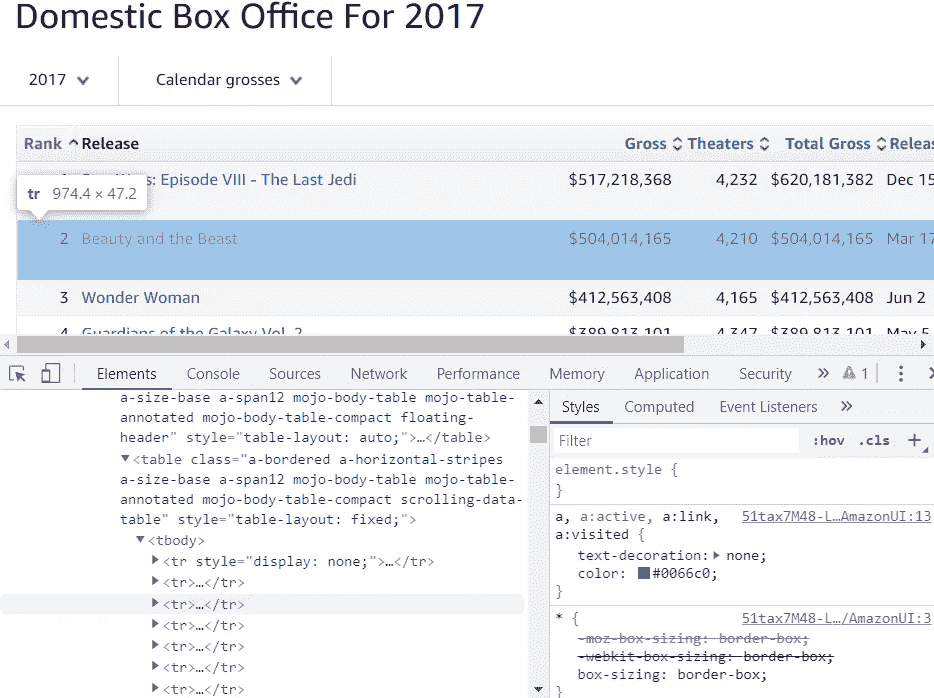
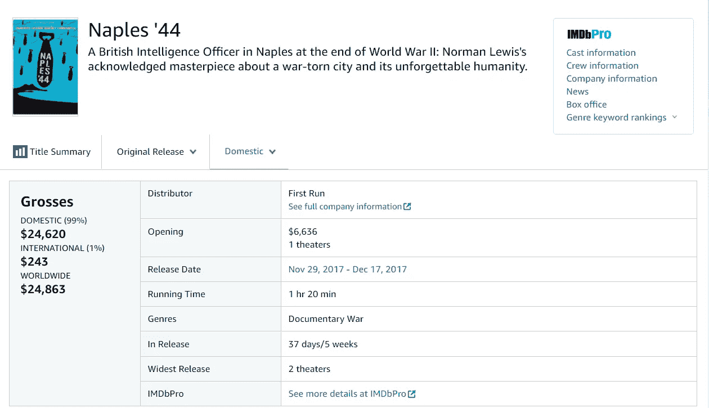
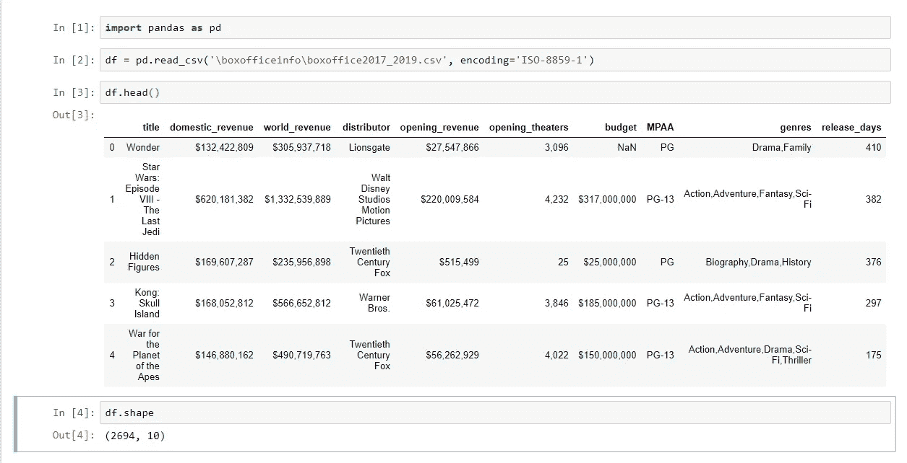

# 用 Scrapy 抓取票房信息

> 原文：<https://medium.com/analytics-vidhya/scraping-box-office-info-with-scrapy-f23f1f2d684f?source=collection_archive---------11----------------------->

Scrapy 是一个抓取网页的 Python 工具。这篇文章讲述了如何用 Scrapy 抓取网页。这里要刮的网站是票房魔咒。特别是，我将提取有关收入、发行商、流派等信息。


照片由 [Addy Ire](https://unsplash.com/@addyire?utm_source=medium&utm_medium=referral) 在 [Unsplash](https://unsplash.com?utm_source=medium&utm_medium=referral) 上拍摄

# **用于抓取的网页**

这个项目的目标是检查在美国特定时间内发行的所有电影，并提取关于个别电影的有用信息。如果你通过票房魔咒查看任何一部电影，你都可以看到关于这部电影的所有相关信息，格式如下:



我感兴趣的元素是'**国内收入**'、**全球收入**'、**分销商**'、**开业**'、**预算**'、**美国电影协会**'、**流派**、发行版中的**。因此，我们将为每部电影提取这些信息。**

抓取网页的代码和抓取的数据在这里是。

# **创建新项目**

一旦你在 python 上安装了 Scrapy，让我们创建一个新的抓取网页的项目。打开命令行，转到要将项目放入的文件夹。然后，键入以下内容:

```
**C:\...>** **scrapy startproject** boxofficeinfo
```

`**scrapy startproject**`是创建和启动新项目的命令。用您自己的项目名称替换`boxofficeinfo`。一旦您成功创建了项目，您将看到以下消息，说明现在您可以启动您的第一个蜘蛛了:

```
...
...\ ...\ boxofficeinfoYou can start your first spider with:
    cd boxofficeinfo
    scrapy genspider example example.com
```

与此同时，Scrapy 创建了一个新文件夹，其中包含网络抓取所需的几个文件和子文件夹。因为我将新项目命名为' **boxofficeinfo** '，所以创建的新文件夹的名称为' **boxofficeinfo** '。

```
**boxofficeinfo**>    scrapy.cfg
               **boxofficeinfo**>      _init_.py
                                    items.py
                              middlewares.py
                                pipelines.py
                                 settings.py
                                   _**pycache_**
                                     **spiders>** _init_.py **_pycache_** 
```

现在，我们准备开始抓取网页。通过 Scrapy 进行网页抓取的整个过程包括以下步骤:

*   在 items.py 上书写
*   正在创建蜘蛛(。py)和识别网的模式
*   在 pipelines.py 上书写
*   在 Settings.py 中更改设置
*   奔跑吧。

# **items.py**

让我们先从`items.py`开始。在`items.py`中，我们将指定 web 中的哪些信息将被提取和存储。在这个网站上关于电影的许多信息中，我们将提取关于'**国内** **收入**'、**全球收入**'、**发行商**'、**开业**'、**预算**'、**美国电影协会**、**流派**、**上映**的个人电影信息。这是我的`items.py`在文件中的内容:

```
**import scrapy****class** BoxofficeItem**(scrapy.Item)**:
    title **=** **scrapy.Field()**
    domestic_revenue **=** **scrapy.Field()**
    world_revenue **=** **scrapy.Field()**
    distributor **=** **scrapy.Field()**
    opening_revenue **=** **scrapy.Field()**
    opening_theaters **=** **scrapy.Field()**
    budget **=** **scrapy.Field()**
    MPAA **=** **scrapy.Field()**
    genres **=** **scrapy.Field()**
    release_days **=** **scrapy.Field.()**
```

# 创建你的蜘蛛。py)和**识别幅材的图案**

接下来我们需要做的是创建我们的蜘蛛。蜘蛛的文件不是由 Scrapy 自动创建的。在 python 文本编辑器中打开一个新文件，用你自己的名字将文件保存到`**spiders**`文件夹中。为了方便起见，我把这个文件命名为`boxofficeinfo_spider.py`。我是这样开始我的蜘蛛的:

```
**import scrapy**
**from** boxofficeinfo.**items** **import** BoxofficeItem**class** BoxofficeSpider**(scrapy.Spider):**
    **name** **=** "Boxofficeinfo"
    **allowed_domains** **=** **["**boxofficemojo.com**"]**
    **start_urls** **=** **[**
    **"**[https://www.boxofficemojo.com/year/2017/](https://www.boxofficemojo.com/year/2017/)**"**
    **]**
```

首先，我导入了前一阶段创建的`scrapy`和`BoxofficeItem`。我们在这里做的下一件事是给我们的蜘蛛它的`name`，指定`allowed_domains`，并设置`start_urls`。`start_urls`中的 URL 应该是你抓取的起点。


`start_urls`可以包含多个 URL。如果我们想为 2018 年和 2019 年的电影提取相同的信息呢？然后，只需将这些页面的 URL 添加到`start_urls`中。在某些情况下，您可以使用下一页或上一页按钮来进入这些页面。这里，我们将直接使用 URL。你可以看到`[www.boxofficemojo.com/year/2017/](http://www.boxofficemojo.com/year/2017/)`包含了‘2017’，这意味着我们可以通过改变这个数字来移动到其他年份的页面。让我们通过以下方式添加 2018 年和 2019 年的 URL:

```
**start_urls** **=** **[**
    **"**[https://www.boxofficemojo.com/year/2017/](https://www.boxofficemojo.com/year/2017/)**"**
    **]**for year in [2018, 2019]:
    start_urls.append("https://
                       [www.boxofficemojo.com](http://www.boxofficemojo.com)/year/"+str(year)+"/") 
```

创建蜘蛛的下一步是定义`parse`函数，该函数指导蜘蛛如何抓取网页。在设定如何解析网页之前，我们有必要事先确定网页的模式。

我们想要提取的电影信息不会直接显示在主页上。(从现在开始，我将把`start_urls`中的页面称为“主页”。)基本上，我们可以通过使用它们的 URL 来访问各个电影的页面。例如，列表中的第一部电影“**《星球大战:第八集——最后的绝地**”的 URL 是`[https://www.boxofficemojo.com/release/rl2708702721/?ref_=bo_yld_table_1](https://www.boxofficemojo.com/release/rl2708702721/?ref_=bo_yld_table_1)`。那么，怎么才能获得所有电影的这个网址呢？主页上有所有指向单部电影的链接，这意味着主页包含了所有电影的 URL。因此，我们可以通过检查主页面的 HTML 来获取这些 URL。

找出 HTML 中 URL 的最好方法是使用 **Scrapy Shell** 。在命令行中，键入以下内容:

```
**> scrapy shell "**[https://www.boxofficemojo.com/year/2017/](https://www.boxofficemojo.com/year/2017/)**"
....<scraped contents>...
......
In [1]:_**
```

这个刺儿头把我们输入的网址刮了一整页。接下来要做的是找到指向各个电影的链接的 xpath。使用 Chrome 上的 Inspect 可以找到 xpath。


上面复制的 xpath 是“`//[[@id](http://twitter.com/id)=”table”]/div/table[2]/tbody/tr[2]/td[2]/a`”。现在，键入以下内容，看看这个 xpath 是否给出了我们想要的结果:

```
**> scrapy shell "**[https://www.boxofficemojo.com/year/2017/](https://www.boxofficemojo.com/year/2017/)**"
....<scrapped contents>...
......
In [1]:** response.xpath(**'**//[[@id](http://twitter.com/id)=”table”]/
                                   div/table[2]/tbody/tr[2]/td[2]/')
**Out [1]**: []
```

它什么也没给！请记住，在许多情况下，我们通过之前的方法找到的 xpath 并不总是正确的。我们需要根据前一阶段复制的 xpath 手动找到正确的。

经过几次尝试，我找到了正确的 xpath。

```
**> scrapy shell** "[https://www.boxofficemojo.com/year/2017/](https://www.boxofficemojo.com/year/2017/)"
.....
.....**In [4]**: response.xpath('//*[[@id](http://twitter.com/id)="table"]/div/table/tr[2]
        /td[2]/a/@href')[0].extract()**Out[4]**: '/release/rl2708702721/?ref_=bo_yld_table_1' 
```

在`out[4]`中，我成功提取了“**星球大战:第八集**”的相对 URL。使用`urljoin`，我们可以将我们在这里找到的相对 URL 与基本 URL 结合起来。

```
**In [5]**: response.urljoin('/release/rl2708702721
        /?ref_=bo_yld_table_1')**Out [5]**:'[https://www.boxofficemojo.com/release/rl2708702721/? ref_=bo_yld_table_1](https://www.boxofficemojo.com/release/rl2708702721/?ref_=bo_yld_table_1)'
```

现在，我们能够获得我们选择的一部电影的 URL。那么，我们如何获取列表中所有电影的 URL 呢？为此，让我们再次检查主页面的 HTML，以便了解页面的一些模式。



每个电影的信息包含在`<tr>…</tr>`标签中，每个`<tr>…</tr>`标签具有相同的格式。因此，要找出单个电影的所有链接，请键入以下代码:

```
**def parse(self, response):**
    for tr in response.xpath('//*[@id="table"]/div/table/tr')[1:]:
        href = tr.xpath('./td[2]/a/@href')
        url = response.urljoin(href[0].extract())
        yield scrapy.Request(url, callback=self.parse_page_contents)
```

现在，我们知道了如何到达列表中每部电影的页面。我们在上面输入的`scrapy.Request`将解析我们在下一步定义的`parse_page_contents`函数后面的每个`url`。

`parse_page_contents`函数的格式如下:

```
**def parse(self, response):**
    for tr in response.xpath('//*[@id="table"]/div/table/tr')[1:]:
        href = tr.xpath('./td[2]/a/@href')
        url = response.urljoin(href[0].extract())
        yield scrapy.Request(url, callback=self.**parse_page_contents**)**def parse_page_contents(self, response):**
    **item = BoxofficeItem()**
    item["title"] =
    item["domestic_revenue"] = 
     ...
    item["release_days"] = 
    **yield item**
```

在`parse_page_contents`中，我们决定在条目的每个元素中放入什么信息。在我们的例子中，我们想要放入`item[“domestic_revenue”]`的应该是每部电影的国内收入。由于每部电影的页面格式和模式非常相似，一旦我们确定了一部电影的国内收入信息的存储位置，我们就能够将该位置应用于其他电影。


《星球大战:第八集》的国内收入是 620，181，382 美元。该信息的 xpath 是'`//*[[@id](http://twitter.com/id)=”a-page”]/main/div/div[3]/div[1]/div/div[1]/span[2]/span’`。使用 scrapy shell 对于上面的页面，我们可以看到下面的命令对应的是国内收入的数字:

```
**In [2]**: **response.xpath('****//*[**[**@id**](http://twitter.com/id)**=”a-page”]/main/div/div[3]/div[1]/div/div[1]/span[2]/span/text()'****)[0].extract()****Out [2]**: '$620,181,382'
```

基本上，该命令也可以应用于其他电影，因为对于任何其他电影，该信息将位于相同的位置。因此，我们可以对`item[“domestic_revenue”]`使用这个命令。

```
def parse_page_contents(self, response):
    item = **BoxofficeItem**()
    item["title"] = 
    item["domestic_revenue"] = **response.xpath('****//*[**[**@id**](http://twitter.com/id)**=”a-page”]/main/div/div[3]/div[1]/div/div[1]/span[2]/span/text()'****)[0].extract()**
     ...
    item["release_days"] = 
    yield item
```

“流派”呢？对于'**星球大战:第八集**'来说，关于“流派”的信息位于这个 xpath: `‘//*[[@id](http://twitter.com/id)=”a- page”]/main/div/div[3]/div[4]/div[7]/span[2]’`。让我们将这个 xpath 用于“流派”。

```
**In [3]**: response.xpath('//*[[@id](http://twitter.com/id)="a-     page"]/main/div/div[3]/div[4]/div[7]/span[2]/text()')[0].extract()**Out [3]**: 'Action\n    \n        Adventure\n    \n        Fantasy\n    \n        Sci-Fi' 
```

我们希望此信息的视觉效果是`‘Action,Adventure,Fantasy,Sci-Fi’`，没有多余的间距。因此，我们可以像下面这样更改命令:

```
**In [4]**: ",".join(response.xpath('//*[[@id](http://twitter.com/id)="a-page"]/main/div/div[3]/div[4]/div[7]/span[2]/text()')
[0].extract().split())**Out [4]**: 'Action,Adventure,Fantasy,Sci-Fi'
```

因此，我们可以为“流派”键入`item[“genres”]= “,”.join(response.xpath(‘//*[[@id](http://twitter.com/id)=”a-page”]/main/div/div[3]/div[4]/div[7]/span[2]/text()’)
[0].extract().split())`。我们可以对其余的信息做类似的事情来完成`parse_page_contents`功能。

# **挑战刮票房魔咒**

我们的蜘蛛的完整格式如下所示:

```
import scrapy 
from Boxoffice.items import BoxofficeItem
class BoxofficeSpider(self, response):
    name = "..."
    allowed_domains = ["..."]
    start_urls = ["..."]
    def parse(self,response):
        ...
        yield scrapy.Request(url, callback=self.parse_page_contents)
    def parse_page_contents(self, response):
        item = BoxofficeItem()
        item["title"] = ...
        ...
        item["release_days"] = ...
        yield item
```

然而，只有当所有单个电影的信息位于每页的相同位置时，该代码**才起作用。例如，'**那不勒斯' 44** '的页面如下所示:**



它不包含有关“预算”和“美国电影协会”的信息。如果我们运行我们之前编写的代码，它将创建错误的信息或产生错误。例如，这个页面没有提供任何关于“美国电影协会”的信息。这部电影的`item[‘MPAA’]`应该是`‘N/A’`。然而，如果我们输入

```
item["MPAA"] = response.xpath('//*[[@id](http://twitter.com/id)="a-page"]/main/div/div[3]/div[4]/div[**5**]/span[2]/text()')[0].extract()
```

根据'**星球大战:第八集'**'的信息，其中'美国电影协会'在第五排，'纪录片战争'将这样进入'美国电影协会':`item[“MPAA”]=‘Documentary War’`。因此，当我们提取我们需要的信息时，我们应该考虑每部电影中是否包含所有的元素。

我解决这个问题的策略是输入:

```
elements = []
for div in response.xpath('//*[[@id](http://twitter.com/id)="a-page"]/main/div/div[3]/div[4]/div')[0:]:
    elements.append(' '.join(div.xpath('./span[1]/text()')[0].extract().split()))
```

在为电影《那不勒斯 44》运行 scrapy shell 之后，让我们运行这段代码。

```
**>** scrapy shell "[https://www.boxofficemojo.com/release/rl1812104705/weekend/](https://www.boxofficemojo.com/release/rl1812104705/weekend/)"
....
**In [1]**: elements = []
**In [2]**: for div in response.xpath('//*[[@id](http://twitter.com/id)="a-page"]/main/div/div[3]/div[4]/div')[0:]: elements.append(' '.join(div.xpath('./span[1]/text()')[0].extract().split()))
**In [3]**: elements**Out [3]**: ['Distributor','Opening','Release Date','Running Time','Genres','In Release','Widest Release','IMDbPro']
```

输出为我们提供了关于电影中包含哪些元素以及每个元素的顺序的信息。因此，为`item[“MPAA”]`键入以下内容:

```
**if** 'MPAA' in elements:
    m = elements.index('MPAA') + 1
    loc_MPAA = '//*[[@id](http://twitter.com/id)="a-page"]/main/div/div[3]/div[4]/div[**{}**]/span[2]/text()'.**format(m)**
    item["MPAA"] = response.xpath(loc_MPAA)[0].extract()
**else**:
    item["MPAA"] = "N/A"
```

如果一部电影的页面包括“美国电影协会”，它将给出关于“美国电影协会”的正确信息。否则，`‘N/A’`将被输入。

# **pipelines.py 和 settings.py**

一旦我们写完了`items.py`和`spider.py`的代码，我们就准备好抓取网页并提取我们想要的数据。但是，使用`pipelines.py`，我们可以确定 csv 文件中的设置。这是我们用于这个项目的 csv 文件设置。打开 Scrapy 自动创建的`pipelines.py`,写下如下代码:

```
import csv
class **YourPipelineName**(object):
    def __init__(self):
        self.csvwriter = csv.writer(open("**boxoffice2017_2019.csv**", "w", newline=''))
        self.csvwriter.writerow(["title", "domestic_revenue", "world_revenue", "distributor", "opening_revenue", "opening_theaters", "budget", "MPAA", "genres", "release_days"]) def process_item(self, item, spider):
        row = []
        row.append(item["title"])
        row.append(item["domestic_revenue"])
        row.append(item["world_revenue"])
        row.append(item["distributor"])
        row.append(item["opening_revenue"])
        row.append(item["opening_theaters"])
        row.append(item["budget"])
        row.append(item["MPAA"])
        row.append(item["genres"])
        row.append(item["release_days"])
        self.csvwriter.writerow(row)
        return item
```

为了应用我们上面创建的设置，我们需要在`settings.py`中改变一件事。在`settings.py`的中间，我们需要激活`ITEM_PIPELINES = {….}`。

```
# Configure item pipelines
# See [https://docs.scrapy.org/en/latest/topics/item-pipeline.html](https://docs.scrapy.org/en/latest/topics/item-pipeline.html)
**ITEM_PIPELINES = {
    'Boxoffice2019.pipelines.YourPipelineName': 300,
}**
```

确保您需要用您为管线创建的名称替换`YourPipelineName`。

# **跑蜘蛛！！**

现在是时候运行我们创建的代码来提取电影的所有信息了。我们需要导航到`**boxofficeinfo**` 文件夹。然后，键入以下内容:

```
**..\Boxofficeinfo**> scrapy **crawl** Boxofficeinfo
```

`Boxofficeinfo`我们在`scrapy crawl`后输入的是我们在`Spider.py`中做的蜘蛛名。然后，在`Boxofficeinfo`文件夹中创建`**boxoffice2017_2019.csv**`。

