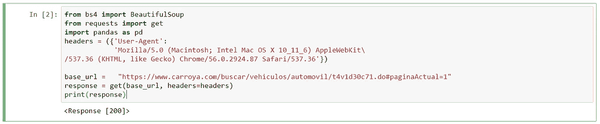
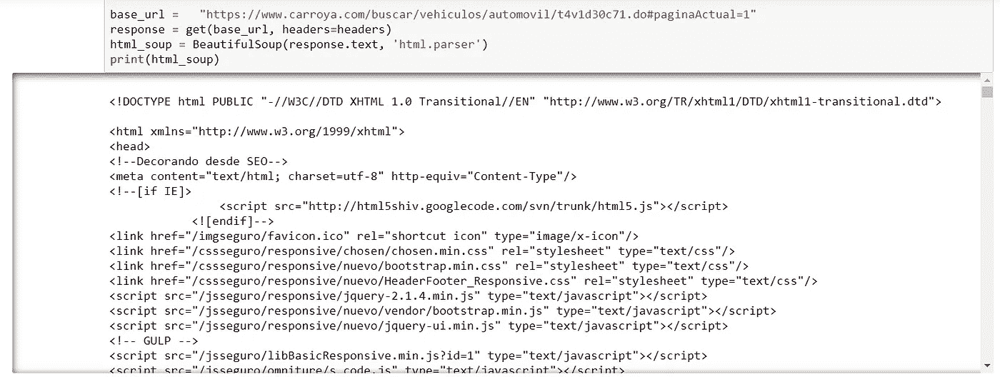
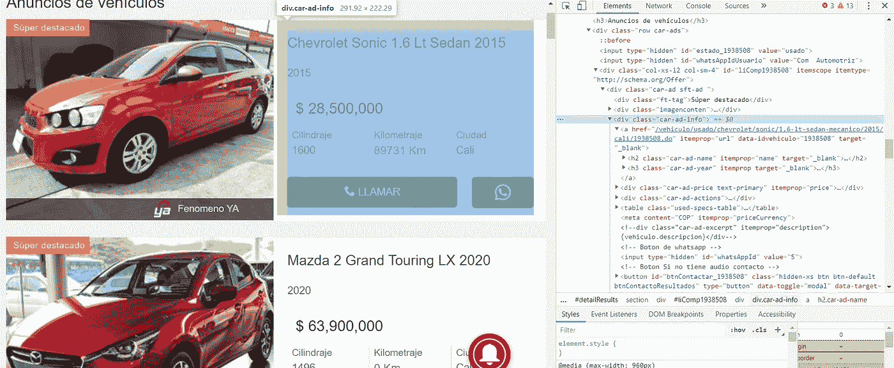
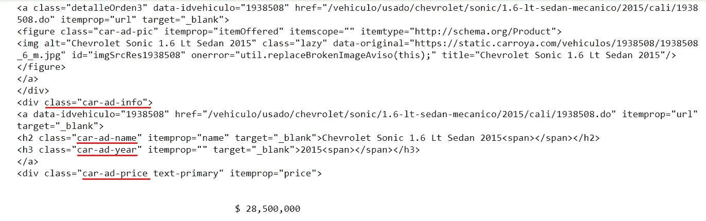
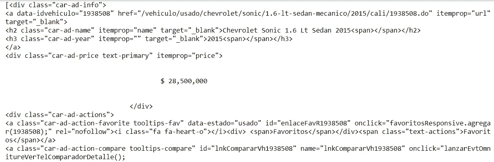
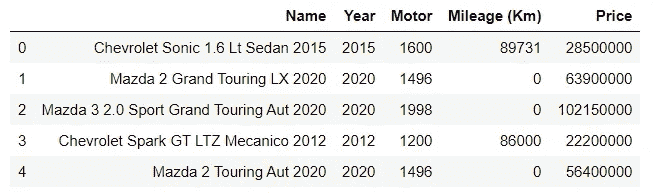
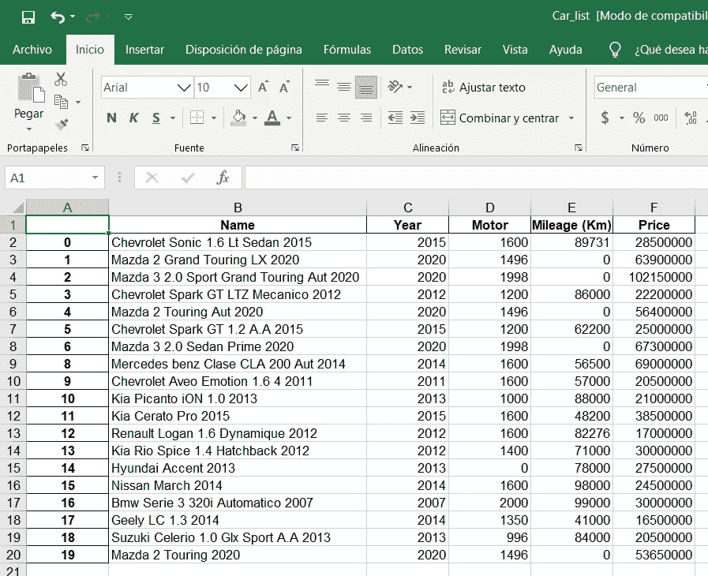

# 我如何用 Python 构建一个 web scraper 来获取汽车价格

> 原文：<https://medium.com/analytics-vidhya/scraping-car-prices-using-python-97086c30cd65?source=collection_archive---------4----------------------->


扎卡里亚·扎亚恩在 [Unsplash](https://unsplash.com/s/photos/new-car?utm_source=unsplash&utm_medium=referral&utm_content=creditCopyText) 上拍摄的照片

从几天前我已经决定寻找我的第一辆车，这是一项艰巨的任务，如果你不知道很多关于汽车规格和其他与汽车市场相关的事情，我决定利用这种情况来提高我的 Python 技能，通过创建一个 web scraper 从网站上获取汽车信息和价格，这将允许我进行比较并做出决定。

在这篇文章中，我想告诉你如何从哥伦比亚(我住的地方)的一个主要汽车销售商网站上收集所有搜索结果，并建立一个包含所有找到的列表的数据库。被刮掉的网站名字叫[卡萝亚](https://www.carroya.com/)。

开始之前，我将使用过滤器页面，我可以指定一些参数(如城市，汽车类型，最高价格等。)来缩减整个结果列表。


# 入门指南

我们需要导入一些模块来处理 html 数据。我将使用 Beautiful Soup 来解析我所检查的网站的 HTML 文档。此外，我们需要验证网站是否允许我们通过查看 url 中的“robot.txt”文档来删除内容，您可以通过在网站 url 中添加“/robot.txt”来完成此操作。

有些网站会自动阻止任何形式的抓取，然后我会定义一个头来传递 ***get*** 命令，让我们的查询看起来像是来自一个真实的浏览器。当我在页面之间运行程序时，我也会使用 sleep 命令，这将有助于这个过程看起来更自然。

```
from bs4 import BeautifulSoup
from requests import get
import pandas as pdheaders = ({'User-Agent':
            'Mozilla/5.0 (Macintosh; Intel Mac OS X 10_11_6) AppleWebKit\
/537.36 (KHTML, like Gecko) Chrome/56.0.2924.87 Safari/537.36'})
```

在设置我们的标题后，我将定义将用于废弃信息的基本 url:

```
base_url =   "[https://www.carroya.com/buscar/vehiculos/automovil/t4v1d30c71.do#paginaActual=1](https://www.carroya.com/buscar/vehiculos/automovil/t4v1d30c71.do#paginaActual=1)"response = get(base_url, headers=headers)
print(response)
```

在定义了基本 url 并设置了我们的头之后，我们可以通过运行下面的代码来测试网站是否有响应。如果响应代码是 200，这意味着我们的请求已经成功。



运行我们的代码后来自 carroya 网站的响应。

现在我们必须定义漂亮的 Soup 对象来帮助我们阅读这个 html。这段代码的结果将是解析器 html，这是我们看到的网站的源代码。



使用 BeautifulSoup 命令后解析我们网站的 html。

# 检查网站

当我们抓取一个网站时，要执行的一个重要任务是用浏览器提供的开发工具检查网站，以便检查我们将要浏览的信息的架构。


使用浏览器提供的开发工具检查网站。

我们还可以在 html 文档中找到某个特定对象的位置，比如汽车的价格和您想从网站上获取的其他信息。



当我们检查网站时，我们看到内容部分中的每个汽车信息都有一个类`car-ad sft-ad`,然后我决定通过使用`find_all`方法找到所有具有该类的列表项，从而通过美丽的 Soup 对象来查找它。

# 一些代码

```
html_soup = BeautifulSoup(response.text, 'html.parser')
content_list = html_soup.find_all('div', attrs={'class': 'car-ad sft-ad'})
print(content_list)
```

打印完`car_list`变量后，我们可以在最初几行中看到以下结构:



```
basic_info = []
for item in content_list:
    basic_info.append(item.find_all('div', attrs={'class': 'car-ad-info'}))
print(basic_info)
```

输出:



从这个输出中，我们需要选择`car-ad-name`、`car-ad-year`和`car-ad-price`。为此，我决定为每个标签创建一个数组，保存来自`h2`、`h3`和`div`标签的信息，我对年份和价格也做了同样的处理。

```
def get_names(basic_info):
    names = []
    for item in basic_info:
        for i in item:
            names.append(i.find_all("h2", attrs = {"class" : "car-ad-name"})[0].text.strip())
    return namesdef get_years(basic_info):
    years = []
    for item in basic_info:
        for i in item:
            years.append(i.find_all("h3", attrs = {"class" : "car-ad-year"})[0].text.strip())
    return yearsdef get_prices(basic_info):
    prices = []
    for item in basic_info:
        for i in item:
            prices.append(i.find_all("div", attrs = {"class" : "car-ad-price"})[0].string.replace(u'\xa0', u' ').strip())
    return prices
```

输出:

```
#Names
Chevrolet Sonic 1.6 Lt Sedan 2015
Mazda 2 Grand Touring LX 2020
Mazda 3 2.0 Sport Grand Touring Aut 2020#Prices
$ 28,500,000
$ 63,900,000
$ 102,150,000#Years
2015
2020
2020
```

为了提取每辆车的发动机排量和里程，我通过`used-specs-table`表创建了一个循环:

```
def get_motor(basic_info):
    tables = []
    motors = []
    mileages = []
    data = [motors, mileages]
    for item in basic_info:
        for i in item:
            tables.append(i.find_all("table", attrs = {"class" : "used-specs-table"})[0])
    for table in tables:
        motors.append(table.find("td", attrs={"class" : "car-ad-cc"}).string)
        mileages.append(table.find("td", attrs={"class" : "car-ad-km"}).string)
    return data
```

输出:

```
#Motor
1600 
1496 
1998#Mileages
89731 Km
86000 Km
0 Km
```

# 保存我们的数据

我们应该将这些数组组织在一个数据帧中，这样我就可以将其保存为 csv 或 excel 文件，以后可以访问这些信息，而不必重复上述过程。

我将定义列的名称，并将数组合并到一个数据帧中。

```
data = pd.DataFrame({"Name" : names, "Year" : years, "Motor" : motors, "Mileage (Km)": mileages, "Price" : prices})[["Name", "Year", "Motor", "Mileage (Km)", "Price"]]
data.head()
data.drop_duplicates().to_excel('Car_list.xls')
```

输出:



# 结论

网络抓取是从网站下载数据并从数据中提取信息的过程。当您使用 Python 时，它是一个有用的工具，因为它允许您开发重复的任务，并以更简单的方式检索丰富的数据。

本文涵盖的代码可以从 [Github 资源库](https://github.com/jfdelgadovargas/web_scraping/blob/master/Web%20scraping.ipynb)获得。

*感谢阅读！如果你有任何问题、建议或批评，可以通过评论区联系我。*