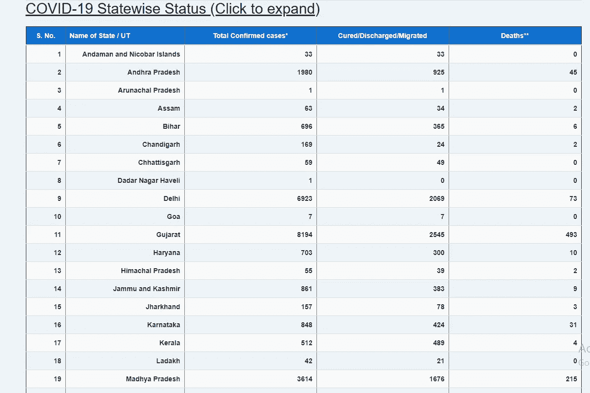
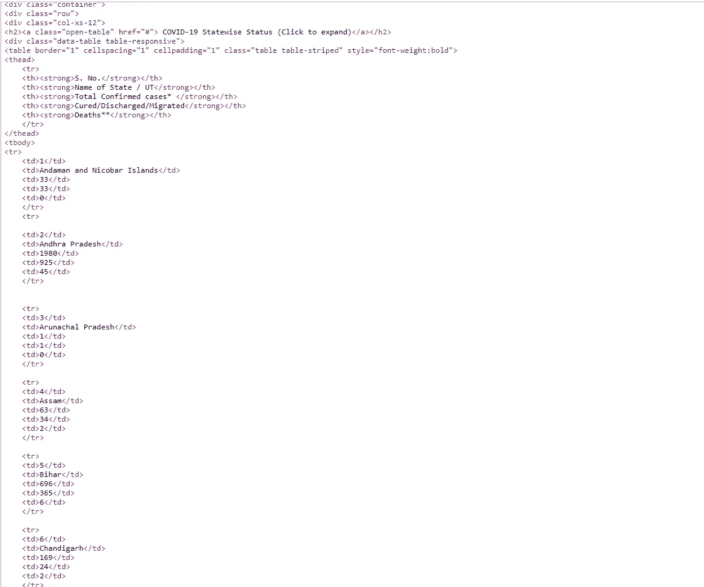
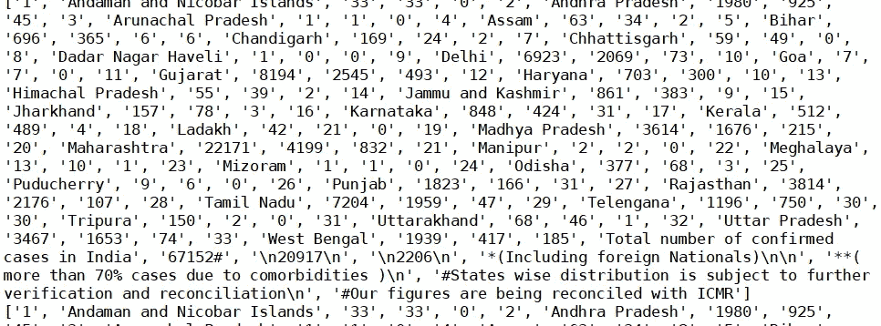
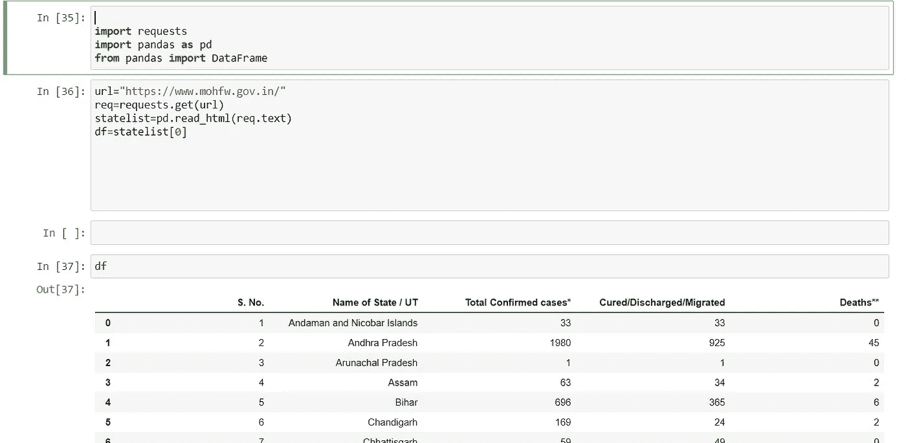
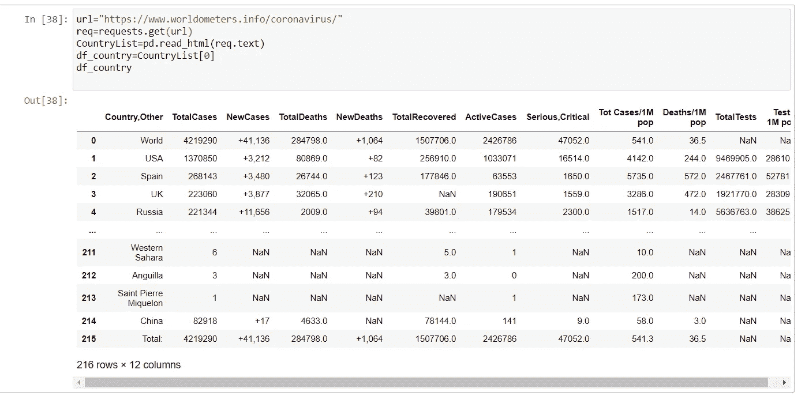

# 从网站上抓取新冠肺炎数据

> 原文：<https://medium.com/analytics-vidhya/scraping-covid-19-data-from-websites-cb1837383505?source=collection_archive---------31----------------------->

我知道你坐在家里看那些无聊的图表很无聊。由于没有数据，您无法创建数据。现在政府开始制作一个官方网站，记录受感染的人数。

多亏了亚马逊，我才有了这个想法。你们把卫生部和 T2 家庭福利网放在你们的网站上。现在我们有了一个收集数据的官方网站。

让我们开始这个过程。我在这个过程中使用了 Python 和 Pandas。

内政部的网站

我们现在得到了表格形式的数据。如果你检查这个网站的来源。

该网站的源代码非常简单

我们需要为过滤器表和类名收集数据。两分钟后你就能拿到数据了。beautifulsoup 流程有问题。我试着获取数据，但是需要做的处理太多了。

美丽脚本

我得到了输出，但是有很多东西没有意义。如果有人知道，请告诉我。

BeautifulSoupScript 的输出

所以我将我的程序改为熊猫似乎是目前唯一有效的废弃数据的方法。在第二个程序中，我们将使用 PD.readhtml 方法。

第二次尝试报废

用这种方法，我可以在 Dataframe 中废弃数据。您需要将一些列转换为数字，作为数据框中字符串形式的数据碎片。让我们把目标定得大一点。

让我们看看能否将它用于 Worldometer 站点。相同的代码在 Worldometer 网站上工作

Worldometer 刮削

在这个方法中，你得到熊猫数据报。在像变更数据类型这样的图中使用它之前，需要做一些预处理。

这是这个节目的视频链接[https://youtu.be/8tQBFX8H8bU](https://youtu.be/8tQBFX8H8bU)

如果你想知道如何从 YFinance 获取股票数据，用于自动化和数据科学。链接同为-[https://youtu.be/oGC-AfqW1SA](https://youtu.be/oGC-AfqW1SA)。

如果你觉得卡住了，请打我回 saurabhkdm721@gmail.com。