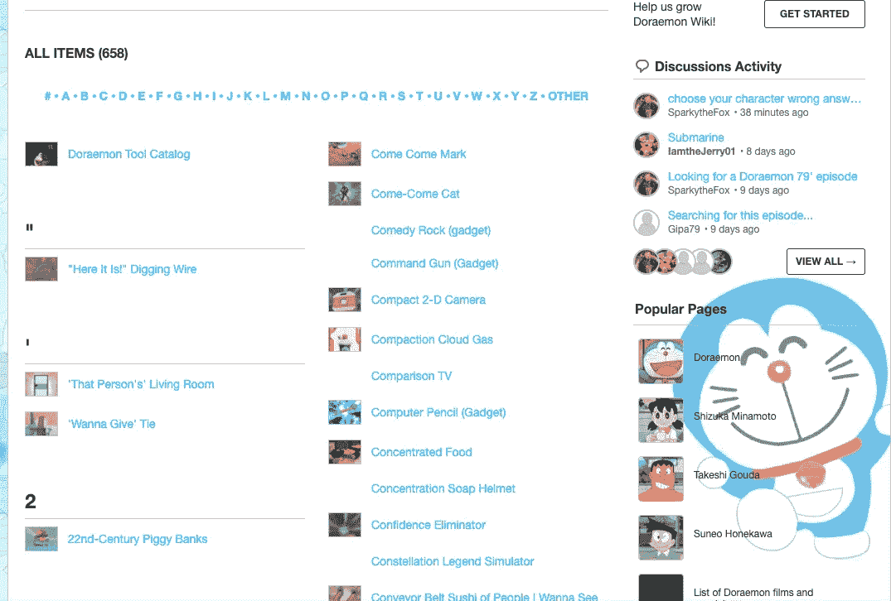
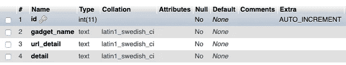
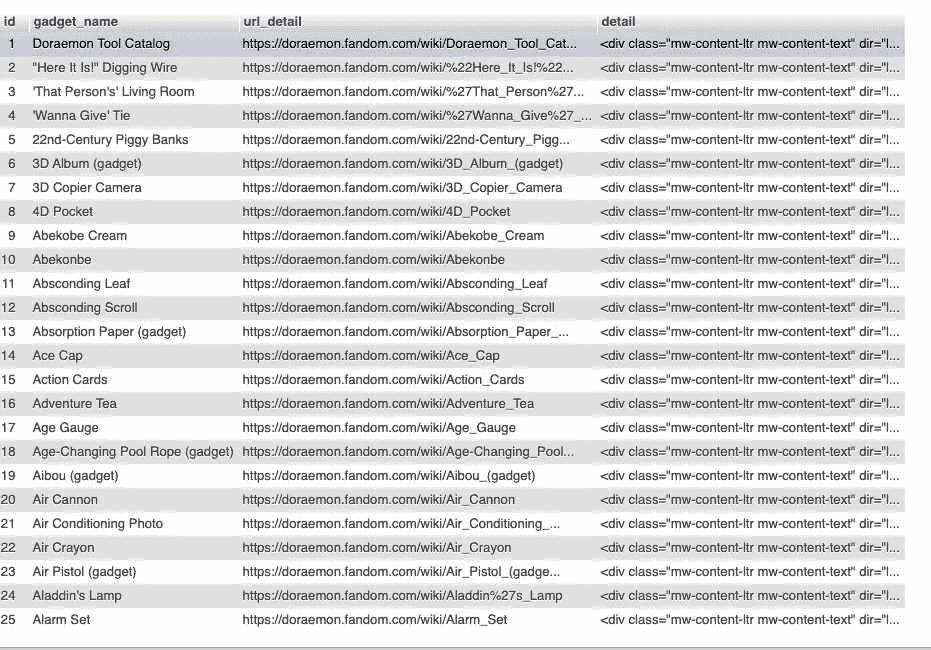

# 刮痧哆啦 a 梦的未来小玩意

> 原文：<https://medium.com/analytics-vidhya/scraping-doraemon-future-gadget-41a9aa1d61a3?source=collection_archive---------9----------------------->

## oraemon 是 22 世纪由 Sewashi Nobi 派出的机器人。西华信派多拉去帮助他笨手笨脚的祖父大雄，因为他的错误选择，他的后代背负了债务。


[糖人乔](https://unsplash.com/@sugarman_joe?utm_source=medium&utm_medium=referral)在 [Unsplash](https://unsplash.com?utm_source=medium&utm_medium=referral) 上的照片

你知道哆啦 a 梦有多少小玩意吗？

根据一些文章，哆啦 a 梦的“魔法口袋”里有大约 4500 个小玩意。

我对他的小玩意很好奇，就试着去找所有哆啦 a 梦小玩意的列表。我找不到完整的数据库，但我找到了哆啦 a 梦粉丝网站，它提供了关于剧集、小工具、角色等信息。

[https://doraemon.fandom.com/](https://doraemon.fandom.com/)

在这个网站上，有 658 个小工具被列出来，并在那里做了很好的描述，总比没有好。

关于哆啦 a 梦的小玩意，我想稍后再做一些“分析”。所以我决定收集网站上所有的小工具数据以备将来使用。

当我做抓取的时候，我总是使用 Python3 作为编程语言，使用 Selenium with Beautifulsoup 作为库来帮助我做抓取工作。

如果我点击小工具的名字，哆啦 a 梦粉丝网站会给我小工具的列表和细节。



哆啦 a 梦迷

所以，我在抓取这个网站时采用的步骤如下:

1.  以数组形式获取页面上所有小工具的列表。
2.  遍历小工具数组。
3.  在每个循环中，打开一个小工具的细节，并在其中获得所有需要的信息。
4.  循环完成后，单击下一页并重复第一步。
5.  如果所有页面都被刮除，停止刮刀。

这是我的刮刀的完整代码

哆啦 a 梦. py

Selenium 是为了导航和模拟浏览器，所以我可以获得我想要抓取的所有页面。

BeautifulSoup 是抓取网页内的元素。

数据库类是我用来保存数据库的自定义类。你可以从下面的 GitHub 链接下载包含这个类的 database.py。

[](https://github.com/DeaVenditama/doraemon-fandom-scraper) [## 复仇女神/哆啦 a 梦粉丝

### 在 GitHub 上创建一个帐户，为开发《哆啦 a 梦》/哆啦 a 梦迷-刮刀》做出贡献。

github.com](https://github.com/DeaVenditama/doraemon-fandom-scraper) 

我使用 MySQL 作为数据库，这是我用来保存数据的表结构，我将其命名为 gadget。



通过根据您的本地机器更改主机、用户、密码和数据库名称来设置 config.py 中的配置。

```
db = dict(
     host="localhost",
     user="root",
     passwd="",
     database="doraemon"
)
```

要启动铲运机

```
python3 doraemon.py
```

Selenium 将效仿 Chrome 并开放哆啦 a 梦粉丝网站。让它打开，刮板将工作，铬浏览器将被关闭后，刮板完成刮所有的小工具。



小工具列表

这是下载到我数据库的 658 个小工具的列表。如果你看到，我得到了所有的细节内容，包括 HTML，我这样做是因为在细节页面中没有固定的结构。

稍后，我必须在 detail 列中进行一些文本清理，以分离一个小工具的描述、用法、用户和外观。

谢谢你