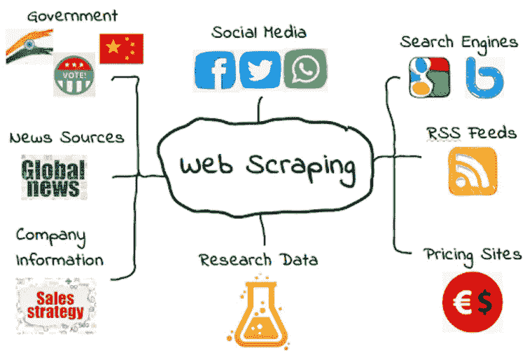
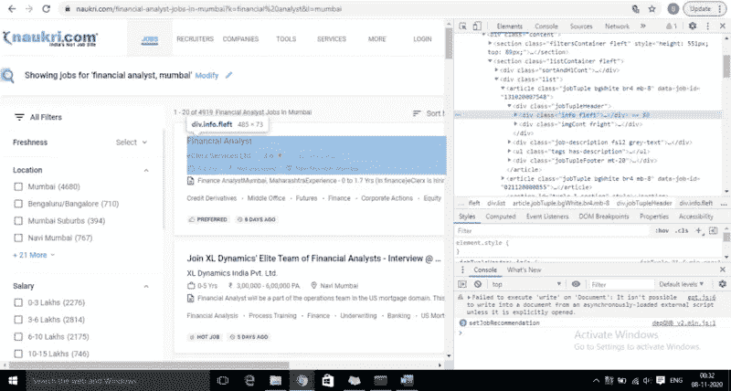
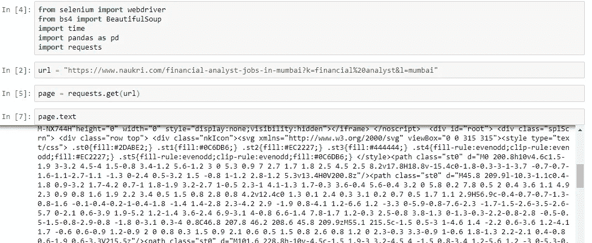
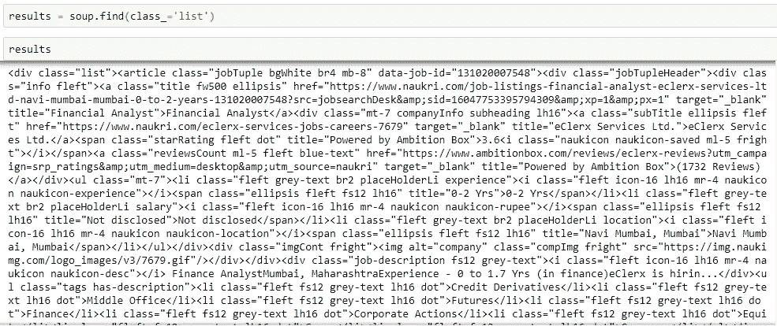
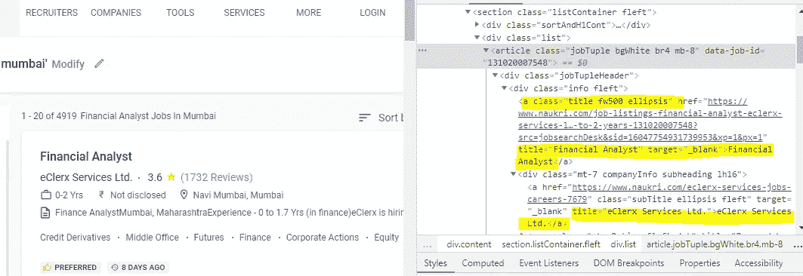
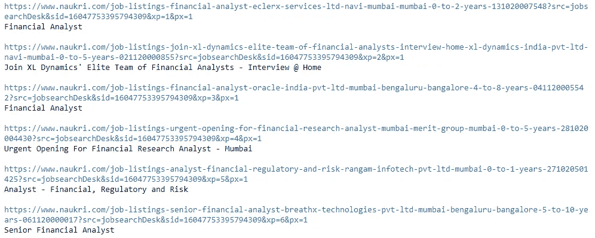
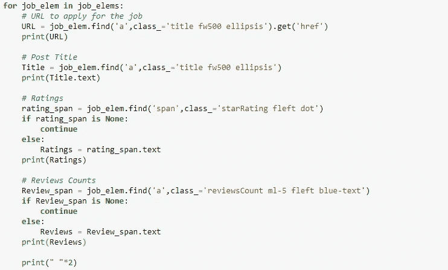
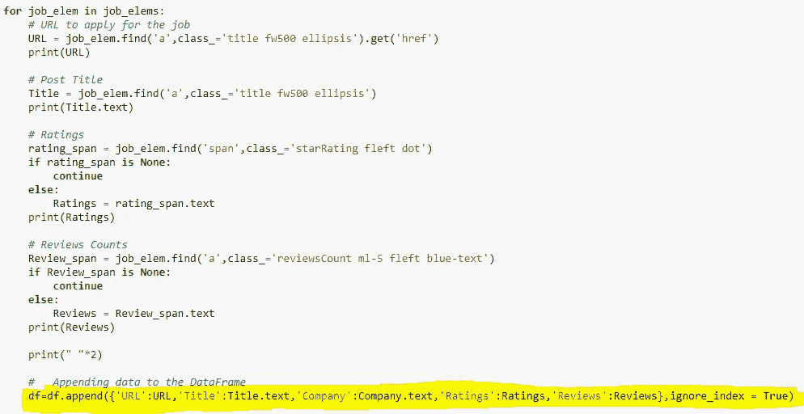

# 使用 Python 和 Beautiful Soup 的抓取工作聚合器站点 naukri.com

> 原文：<https://medium.com/analytics-vidhya/scraping-job-aggregator-site-naukri-com-using-python-and-beautiful-soup-a08a2046639b?source=collection_archive---------0----------------------->

[https://roboticsandautomationnews.com/](https://roboticsandautomationnews.com/)

> 互联网拥有丰富的数据，但只有很小一部分是以易于消费的格式提供的，即数据不容易下载。如果数据很小，我们可以从网上复制并进行分析，但如果数据很大，手动复制和粘贴数据非常麻烦，怎么办？这就是网络抓取发挥作用的地方。

# **什么是网页抓取？**

Web 抓取是从 web 上收集或提取数据的过程。有时也被称为爬行、蜘蛛和网络收割。简单地从互联网上复制数据也可以被称为网络抓取，但通常当我们谈论网络抓取时，我们指的是一个自动化的过程，其中我们可以通过编写编程脚本来抓取数据。

这个博客是为那些对网络抓取非常陌生的人准备的。在这个项目中，我从一个工作聚合网站 naukri.com 那里搜集工作信息。请继续关注，当你读完这篇博客时，你将能够从【naukri.com】的**中找到招聘信息，并将招聘信息以一种易于使用的格式保存在 excel 电子表格中，供你自己分析。所以让我们开始吧。**

# **我们需要的库**

我们进行网络抓取需要的两个最重要的 python 库是**请求**和**美丽组**。 **Requests** 库用于向网页发送 HTTP 请求，它返回一个响应对象，包含来自网页的所有数据。 **BeautifulSoup** 用于以树状结构解析 HTTP 返回的响应对象，以便我们可以轻松地从响应对象中提取所需的数据。然而，在这个特定的项目中，我们还需要 **selenium** 来获取网页的 HTML 源代码。您并不总是需要 selenium 进行 web 抓取，但是当您无法获得 HTML 源作为响应时，您可以使用它。我将在下一节展示如何做到这一点。

在这个项目中，我们将为*孟买*的*金融分析师*职位征集 naukri.com。我们一步一步来。检查我的 G [ithub repo](https://github.com/kailashnegi/Scraping-Naukri.com-in-Python) 的完整代码。

# **第一步:安装并导入库**

如果您没有安装 requests 和 BeautifulSoup，请先使用 pip 命令安装。

> pip 安装请求
> 
> pip 安装 beautifulsoup4

如果你没有安装 Selenium，请查看这个[链接](https://www.geeksforgeeks.org/how-to-install-selenium-in-python/)。安装完库后，按如下方式导入它们。

> 来自 selenium 的导入请求
> 来自 bs4 的导入 web 驱动程序
> 导入 BeautifulSoup
> 导入时间
> 导入熊猫作为 pd

# **第二步:检查网页，从网页中抓取 HTML 内容**

现在让我们先检查一下我们要抓取的网页。去 naukri.com，在孟买搜索“金融分析师”简介。

这个工作搜索的结果如下所示。

**网址:**[https://www.naukri.com/financial-analyst-jobs-in-mumbai?k =金融分析师&l =孟买](https://www.naukri.com/financial-analyst-jobs-in-mumbai?k=financial%20analyst&l=mumbai)

在这个 URL 中，查询参数在问号(？)所以你可以根据自己的需要改变参数 k 和 l，它会相应地搜索工作。

搜索职位后，如果您按 F12 或右键单击职位公告卡→检查，您将看到以下结果。(你也可以进入 Chrome→更多工具→开发者工具，然后悬停在 HTML 标签上，为你的数据识别正确的标签。)

让自己熟悉页面的 HTML 结构，因为它将帮助您提取所需的数据。一个网页是由多个 HTML 标签组成的，所以理解它的结构并看到我们的数据在哪里是非常重要的。在 naukri.com 页面，当你右键单击一个工作卡和检查，它会显示它的源代码页面中的等效 HTML 标签。在我们的例子中，你可以看到我们的第一张求职卡的 HTML 代码位于

标签中，该标签嵌套在标签中，而标签又嵌套在标签中。

既然你已经理解了页面结构，那就让我们来看看这篇博客的实质部分吧。

让我们首先加载 URL，并使用请求库向 web 页面发送 HTTP 请求。

> URL = "[https://www.naukri.com/financial-analyst-jobs-in-mumbai?k =金融% 20 分析师&l =孟买](https://www.naukri.com/financial-analyst-jobs-in-mumbai?k=financial%20analyst&l=mumbai)
> 
> page = requests . get(URL)
> page . text

然而，请求库的 HTTP 请求返回的响应对象没有 HTML 标记，见下文。

因此，要获得网页的 HTML 源代码，我们应该使用 Python 的 selenium 库，它用于自动化。我这里用的是 Chrome 网络驱动。

> driver = webdriver。chrome(" D:\ \ Selenium \ \ chrome driver . exe ")
> driver . get(URL)
> 
> 时间.睡眠(3)
> 
> soup = beautiful soup(driver . page _ source，' html5lib ')
> 
> print(soup . pretify())
> 
> driver.close()

一旦我们到达网页，我们调用 **bs4** 库的 **BeautifulSoup** 函数来解析页面源，将我们的页面转换成 HTML 树。prettify()函数用于使我们的 html 内容在屏幕上看起来更好。这是我们现在的输出。

# **第三步:从 HTML 标签中提取数据**

我感兴趣的数据字段是“标题”、“公司名称”、“评级”、“评论”、“经验”、“薪资”、“位置”、“职位发布历史”和“申请工作的 URL”。然而，这里我将只展示如何提取*标题*、*公司*、*评级*、*评论*和 *URL 的数据；*您可以自行提取其他字段的数据。我们将首先创建一个空的数据帧来存储这些字段。

> df = pd。DataFrame(columns=['Title '，' Company '，' Ratings '，' Reviews '，' URL'])

如果您仔细查看 HTML 源代码页面，就会发现所有的工作卡都有各自的

……标签，这些标签嵌套在带有“list”类的标签中。因此，我们将借助 BeautifulSoup 将这个标签中的所有标签放入一个变量中，beautiful soup 允许您使用 ID 或类名来查找特定 HTML 元素的元素。这里我们将对名为“Soup”的 BeautifulSoup 对象使用 find()方法。这将返回名为“results”的对象中带有类“list”的标记内的所有数据。

> results = soup.find(class_='list ')

标签中的所有数据现在看起来都是这样的

现在你可以看到，在“结果”对象中，所有 HTML 元素都包含在带有“列表”类的

标签中。从这些数据中，我们现在可以寻找所有带有类" *jobTuple bgWhite br4 mb-8* "的标签。下面这段代码将返回一个包含< article >标签的 python 列表，我们可以对其进行迭代，以从每个< article >标签中提取数据。为此，我们在 BeautifulSoup 对象“results”上调用 find_all()方法。find_all()方法中的第一个参数将是我们的标记名，即“article ”,第二个参数将是该标记的类名。

> job _ elems = results . find _ all(' article '，class_='jobTuple bgWhite br4 mb-8 ')

在

标签内的网页源代码中，你会看到一个锚标签，带有类“ *title fw500 省略号*”，本质上是申请工作的链接，有工作的标题。

申请职位的 URL 和职位都在类别为“title fw500 省略号”的标签内

我们可以使用 URL 和的 get("href ")函数提取在标签中的申请工作和职位的 URL。整个页面标题的文本属性。

这是我们打印两个变量(即 URL 和 Title)时提取的数据的样子。

我们现在已经提取了两个字段的数据，这很好，因为我们现在也可以类似地提取其他字段的数据。然而，你将不得不对代码做一些小的调整，因为每个字段的页面结构都会有所不同。提取公司名称与我们之前所做的类似，只是确保将类名更改为“ *subTitle 省略号 fleft* ”。

然而，对于评论和评级等领域，我们需要做一些调整。正如你所看到的，并不是每个工作卡都有*评论*和*评级*，所以如果我们应用与上面相同的方法，代码将抛出一个类似“*‘NoneType’对象没有属性‘text’*”的回溯。这条消息的意思很简单，没有*的工作卡审核*和*评级，当我们试图使用<标签和类名找到它们时，*返回“ *None* ”。和申请。" *None* "类型的文本属性返回一个回溯。因此，为了避免这种情况，我们将在代码中做一些小的调整。

输出如下所示。

现在你已经理解了如何从 HTML 元素中提取数据，你也可以提取其他数据点，但是如果你仍然有疑问，请查看我的 [Github repo](https://github.com/kailashnegi/Scraping-Naukri.com-in-Python) 获取完整代码。

现在，让我们获取我们收集的数据，并将其输入到我们的空数据框 **df** 中，看看我们的数据是什么样子的。请参见下面突出显示的代码。

让我们用 df.head()来看看 dataframe 的头部，看看它是什么样子的。

现在你可以使用*df . to _ csv(" nau kri . com _ data . CSV "，index=False)* ，将数据帧导出为 CSV 文件。你得自行提取*经验*、*薪资*、*地点*、 *Job_Post_History* 类似。

在这个项目中，我们只抓取了一个页面，但如果你想抓取多个页面，你所要做的就是运行这么多页面的循环，增加 URL 中的页面参数，并将整个代码放入该循环中。我的 Github 回购刮 10 页，所以做[检查出](https://github.com/kailashnegi/Scraping-Naukri.com-in-Python)。

数据仍然需要一些清理，你可以在 excel 和 Python 中自己完成。然而，如果你想看看我们如何在 Python 中清理和可视化这些数据，请关注我的下一篇博客。这个抓取项目的完整代码在 [Github](https://github.com/kailashnegi/Scraping-Naukri.com-in-Python) 上。

***一句忠告:*** *在刮一些站点的时候，请当心网站资源。向一个站点发送大量的请求会导致 web 服务器的负载，所以建议间隔发送连续的请求(如果需要的话),不要一次发送所有的请求，并尽可能减少请求。*

这是我在 Medium 上的第一篇博客，所以请随时提供建设性的反馈，并报告你发现的任何错误。如果你喜欢，一定要分享给你的同龄人和朋友。