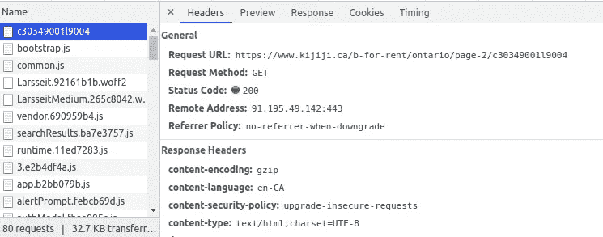
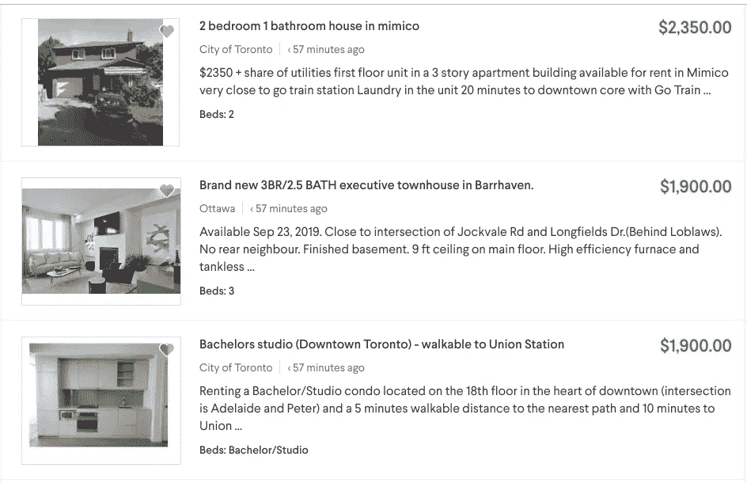
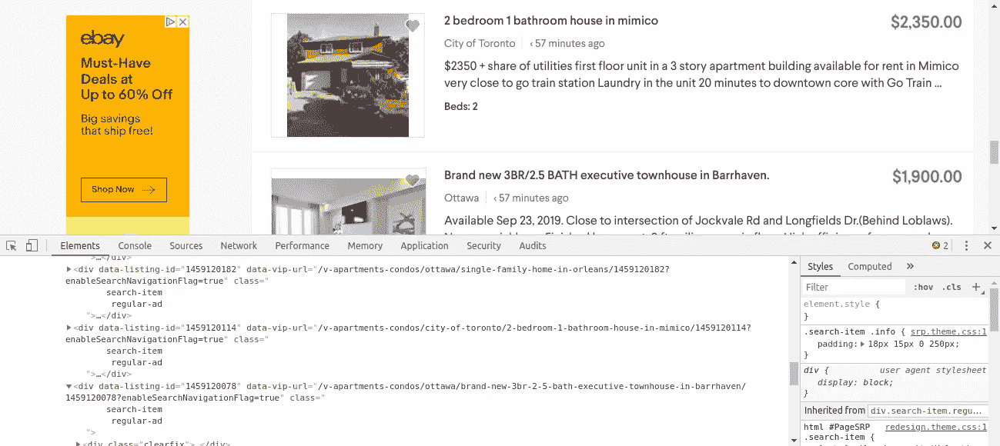
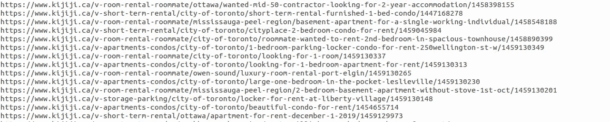
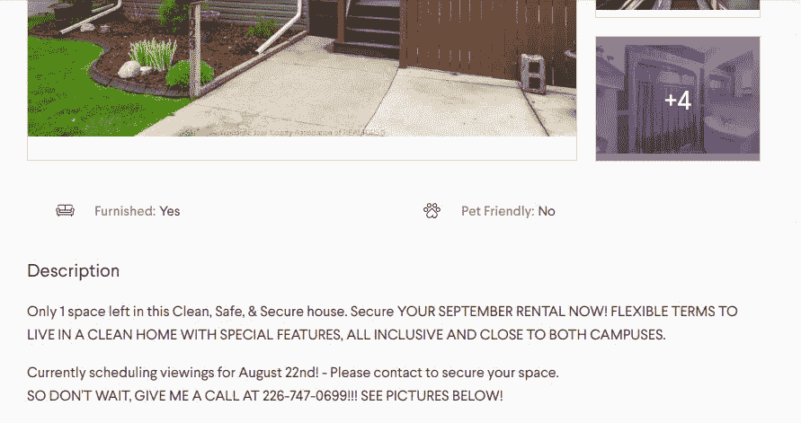
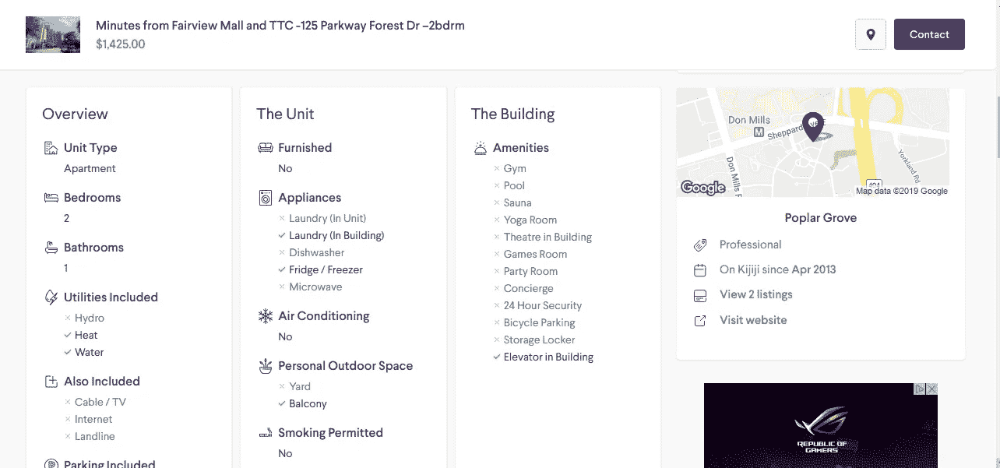

# 刮木吉吉房屋出租广告使用美丽的汤

> 原文：<https://medium.com/analytics-vidhya/scraping-kijiji-home-rental-advertisements-using-beautiful-soup-5e286af9d96?source=collection_archive---------5----------------------->


我想开发一个机器学习模型，可以预测加拿大安大略省的房屋租赁价格。但遗憾的是，我没有找到任何数据集来训练我的模型。所以我决定从 Kijiji 收集租赁清单，以下是我的做法。

**什么是 Kijiji？**

> Kijiji 是一种在线分类广告服务，作为在线社区的集中网络运营，按城市和城市区域组织，用于发布本地广告。它是易贝的全资子公司，成立于 2005 年 3 月。

我会一步一步地列出所有的过程。

**第一步:开始**

第一步是确定向服务器发出什么请求来获取数据。通过查看开发人员工具中的网络选项卡，我们可以很容易地做到这一点。



我注意到的第一件事是，安大略省所有房屋/公寓出租的列表都有相同的 URL，中间没有页码。

在每一页上，大约有 10-20 个广告，如下所示。



我决定抓取几个页面，只是为了获得每个列表的 URL 以供进一步处理，并将这些 URL 存储到一个数组中，并且我还将这些抓取的 URL 保存到一个文本文件中，因为由于频繁访问服务器，我面临着来自服务器的连接拒绝。



每个广告列表都有一个 URL，它实际上位于类别 ***标题*** 的 div 标签下，如上图所示。

**第二步:现在开始编码**

现在让我们导入所需的库

```
import requests
import urllib.request
import time
from bs4 import BeautifulSoup
import re
import pandas as pd
import numpy
import time
from os import path
```

因为我只关注安大略的列表，所以让我们硬编码一些 URL

```
url = 'https://www.kijiji.ca/b-for-rent/ontario'
baseurl = 'https://www.kijiji.ca'
baseForOntario = '/c30349001l9004'
pageNos = '/page-'# A sample URL would look like 
# [https://www.kijiji.ca/b-for-rent/ontario/page-8/c30349001l9004](https://www.kijiji.ca/b-for-rent/ontario/page-8/c30349001l9004)
```

让我们创建一个只抓取 URL 的函数，因为我想要的数据实际上在广告中。所以需要先获取广告网址。

**步骤 2.1:获取广告网址**

```
# I saved those links into a textFile to avoid duplicated / to 
# reduce number of hits on the server# if file exists read the Advt URLs from text file and 
# perform the scrapingif path.exists('links.txt'):
   with open('links.txt', 'r') as f:
        linksFromText = f.readlines()
   f.close()
   # A fucntion call to scrape the actual data
   getDetails(linksFromText)# if file does not exists perform the scrapingelse:
    for i in range(noPages):
        url_final = url+pageNos+str(i)+baseForOntario
        response = requests.get(url_final)
        soup = BeautifulSoup(response.text, "html.parser")
        advtTitles = soup.findAll('div', attrs={'class' : 'title'})
        try:
           for link in advtTitles:
               adlink = baseurl+link.find('a')['href']
               adurl.append(adlink)
        except Exception as e:
              print(e)
        time.sleep(1)
    # a fuction to write the 
   saveLinks(adurl)
    # a fuction to do the actual scraping
    getDetails(adurl)
```

一旦完成，我们将有一堆列表如下。



观察网址后，我发现有两种类型的广告。

1.  正常的
2.  公寓列表

主要区别在于这两种广告具有不同的属性。在收集实际数据之前，我们必须考虑它。

**步骤 2.2:获取实际数据**

一个普通的清单应该是这样的。



公寓列表如下图所示。



现在让代码从站点中抓取所需的数据

我更感兴趣的数据是，

1.  酒店(带家具或不带家具/宠物友好型等)
2.  发布日期
3.  地址
4.  租金价格
5.  描述
6.  标题

下面的代码将抓取每个广告列表的主要特征。

```
# Lets pass our array into a function to do the taskfor url in urls:
    listDetails = ""
    url = url.rstrip('\n')
    response = requests.get(url)
    soup = BeautifulSoup(response.text, "html.parser")
    try:
       adTitle = soup.select_one("h1[class*=title-2323565163]").text
       title.append(adTitle)
       adPrice = soup.select_one("span[class*=currentPrice-2842943473]").text
       prices.append(adPrice)
       adDescription = soup.find_all('div', attrs={'class' : 'descriptionContainer-3544745383'})
       description.append(adDescription)
       adLocation = soup.find('span', attrs={'class' : 'address-3617944557'})
       location.append(adLocation)
       date = soup.find('time')
       datePosted.append(date)
```

现在让我们检查 URL 是否包含*‘v-apartments-condots’*，基于此，让我们抓取像卧室数量等特征

```
apartment = 'v-apartments-condos'#if an apartment listing thenif apartment in url:
   adfts = soup.find_all('li', attrs={'class' : 'realEstateAttribute-3347692688'})
   for ft in adfts:
       dd = ft.find_all('div')
       listDetails = listDetails + str(dd) + " || "
       features.append(listDetails)
       listingType.append(apartment)
       urlToSave.append(url)
       adid = getAdId(url)
       adId.append(adid)
else:# if not an apartment listing then
     adfts = soup.find_all('dl', attrs={'class' : 'itemAttribute-983037059'})
     for ft in adfts:
         dd = ft.find('dd').text
         dt = ft.find('dt').text
         listDetails = listDetails + str(dt) + " : " + str(dd) + " || "
         features.append(listDetails)
         listingType.append(roomRent)
         urlToSave.append(url)
         adid = getAdId(url)
         adId.append(adid)
```

我面临的两个主要挑战是，

1.  内存问题
2.  状态代码 500

内存问题的一个快速解决方案是，我决定在一段时间后将收集到的数据保存到 CSV 文件中，并清除所有阵列以释放内存。我一次就刮掉了大约 8000 个广告。: :)

对于第二个问题，我必须通过调用 time.sleep()来设置每个请求之间的延迟

我的 GitHub 上有完整的代码:-[https://github.com/amald94/kijiji-scraper/tree/master](https://github.com/amald94/kijiji-scraper/tree/master)

**信用**

digitalrealty:我相信多伦多的图片来自这个网站。