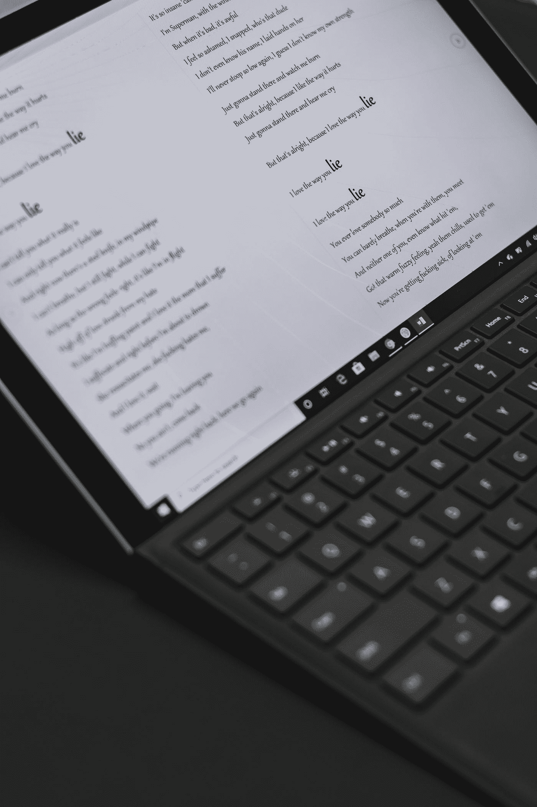

# 从世界各地搜集歌词

> 原文：<https://medium.com/analytics-vidhya/scraping-lyrics-from-all-around-the-world-fa667307b9e3?source=collection_archive---------13----------------------->

## 网络抓取是一种从网站提取数据的技术。在这篇文章中，我将向你展示我是如何从网站上抓取歌词的。本文仅供学习之用，做起来风险自担。

Ashkan Forouzani 在 [Unsplash](https://unsplash.com?utm_source=medium&utm_medium=referral) 上的照片

当我使用深度学习了解文本生成时，我想生成一个文本，它的**听起来** **富有诗意**就像一个**音乐家**。

所以，我需要得到建立模型的数据。

我能在哪里得到它？

**Twitter** 是我想到的第一个数据来源，因为它**容易检索**并且有**巨大的数据来源**。

然后，我还能从哪里得到更多的数据？

我发现了这个网站，AZLyrics.com。

这个网站有大量来自世界各地的歌词。我可以在这个网站上找到某个音乐家的歌曲。

所以，我试着建立刮刀从网站上提取歌词。

我是用 Python 3，Selenium，BeautifulSoup 刮出来的。下面是我的刮刀代码。

scrapeAzlyrics.py

在第 53 行更改音乐家的名字以更改搜索。你会得到那个音乐家的所有歌曲。

在这些代码中，我试图下载一位名叫“fiersabesari”的歌手的所有歌曲，他是一位来自印度尼西亚的著名音乐家。

每首歌里都会有 5 秒的延迟。您可以在线 46 中更改延迟时间。我使用延迟是因为网站会将我们的刮刀检测为机器人，并将我们重定向到验证码页面。

对于我们得到的每一首歌，它将被保存到一个名为音乐家 _azlyrics.csv 的 CSV 文件中的一行。

随意编辑和使用它，但要自担风险。

谢谢你。