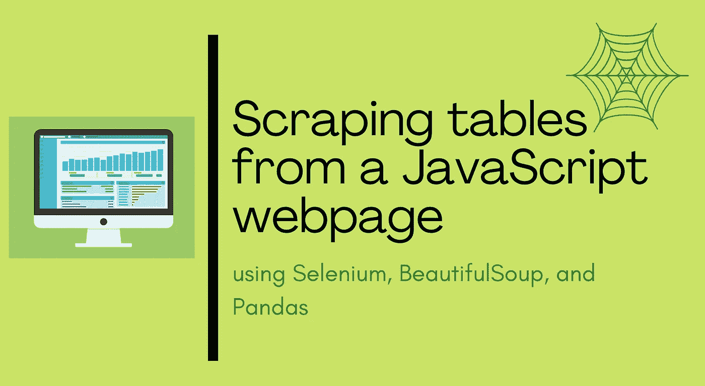

# 使用 Selenium、BeautifulSoup 和 Pandas 从 JavaScript 网页中抓取表格

> 原文：<https://medium.com/analytics-vidhya/scraping-tables-from-a-javascript-webpage-using-selenium-beautifulsoup-and-pandas-cbd305ca75fe?source=collection_archive---------1----------------------->

## 从 JavaScript 网页抓取表格的分步教程

使用 Selenium、BeautifulSoup 和 Pandas 从 JavaScript 网页中抓取表格(图片由作者使用[canva.com](https://www.canva.com/))

Web 抓取是从 web 上收集和解析数据的过程。Python 社区已经提出了一些非常强大的 web 清理工具。然而，许多现代网站是动态的，其中…