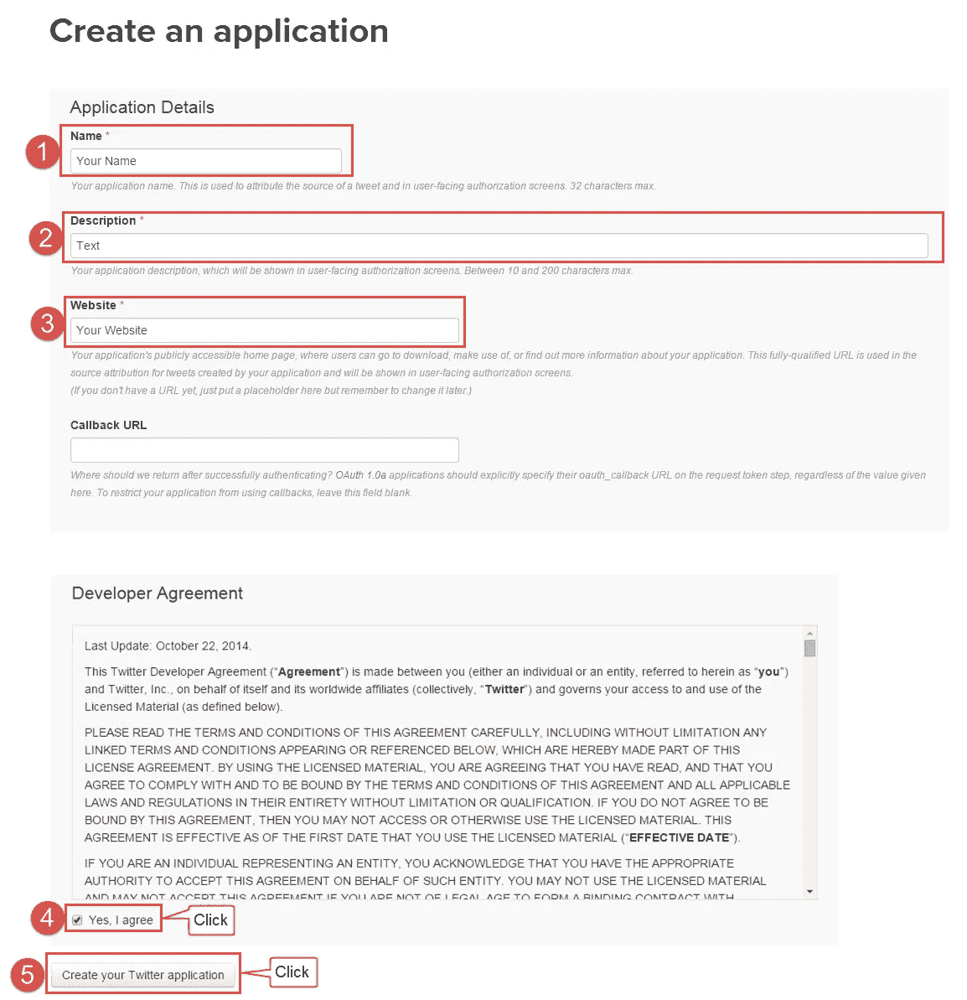
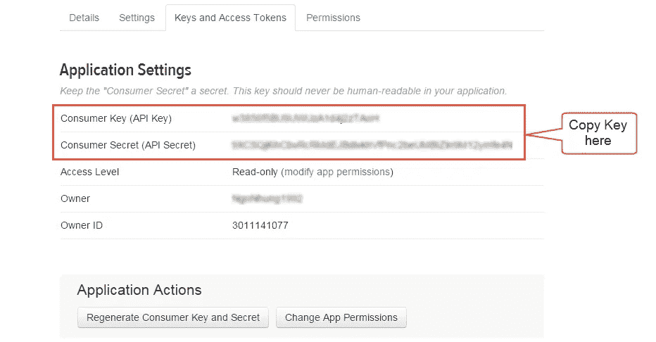
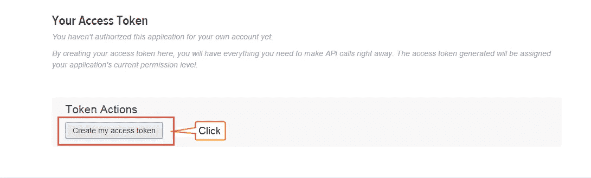
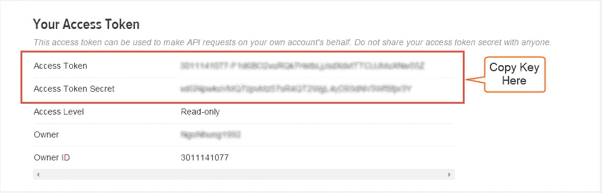
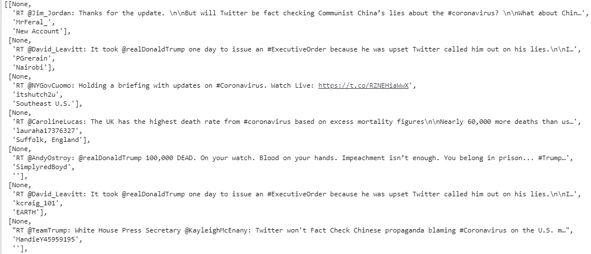

# 使用 Twitter API 抓取推文

> 原文：<https://medium.com/analytics-vidhya/scraping-tweets-using-twitter-apis-d497fd97d5f6?source=collection_archive---------3----------------------->

Web 抓取是任何数据科学家从各种资源中收集数据的一项基本技能。Twitter 是一个收集大量高质量数据的好工具。我发现 twitter 数据非常有帮助的一点是在情感分析方面。Twitter 使用其 API 使得收集公开可用的数据变得非常容易。

本文将展示如何使用 twitter API 从 twitter 中抓取与 COVID 19 相关的推文。Twitter 拥有用户友好的 API，可以轻松访问公开可用的数据。如果你喜欢通过视频学习，请点击此链接:[https://www.youtube.com/watch?v=L7p1O-3a-Wc&t = 82s](https://www.youtube.com/watch?v=L7p1O-3a-Wc&t=82s)

要创建 API，请遵循以下步骤:

1.  如果您没有帐户，请访问[链接](https://twitter.com/)注册您的 Twitter。
2.  创建新应用程序
    转到:[https://dev.twitter.com/apps/new](https://dev.twitter.com/apps/new)
    输入您的应用程序名称、描述和您的网站地址。您可以将回调 URL 留空。
    将用户密钥(API 密钥)和用户密码从屏幕复制到您的应用程序中。
3.  创建应用程序

4.创建应用程序后，您可以复制您的密钥，如下所示:

5.要获取访问令牌，请单击“创建我的访问令牌”并复制它们:

现在您已经有了 APIKey、SecretAPIkey、访问令牌和秘密访问令牌，请将它们保存在一个文本文件中，以便安全地访问它们。要访问密钥，请使用 ConfigParser:

`import configparser config = configparser.RawConfigParser() config.read(filenames = '/path/twitter.txt')`

这将创建一个对象(配置)并安全地读取密钥。这一点很重要，因为我们不想向他人公开我们的密钥。

我们将使用 Tweepy 库从 twitter 中提取数据。点击[链接](https://www.tweepy.org/)阅读更多关于 Tweepy 的信息。

安装并导入 tweepy:

现在我们需要从配置对象中访问我们的 API 键。我们可以通过使用`.get`方法来实现:

`accesstoken = config.get('twitter','accesstoken') accesstokensecret = config.get('twitter','accesstokensecret') apikey = config.get('twitter','apikey') apisecretkey = config.get('twitter','apisecretkey')`

下一步是使用 OAuthHandler 进行身份验证:

`auth = tw.OAuthHandler(apikey,apisecretkey) auth.set_access_token(accesstoken,accesstokensecret) api = tw.API(auth,wait_on_rate_limit=True)`

现在，我们已经使用 API 成功地认证并连接了 twitter。

下一步是定义搜索词(twitter 标签)和我们想要抓取推文的日期:

`search_word = '#coronavirus' date_since = '2020-05-28'`

为了抓取推文，创建一个 tweepy `cursor` ItemIterator 对象并添加参数，即 API 对象、搜索词、日期、语言等。

`tweets = tw.Cursor(api.search,q = search_word, lang ='en',since = date_since).items(1000)`

现在我们已经在 tweets 对象中获得了与冠状病毒相关的 tweets。为了获得这些推文的细节，我们将编写一个 for 循环，并获取地理位置、推文文本、用户名、用户位置等细节。点击此[链接](http://docs.tweepy.org/en/latest/cursor_tutorial.html)阅读更多内容

`tweet_details = [[tweet.geo,tweet.text,tweet.user.screen_name,tweet.user.location]for tweet in tweets]`

输出:

这就是如何从 twitter 上抓取推文的全部内容。