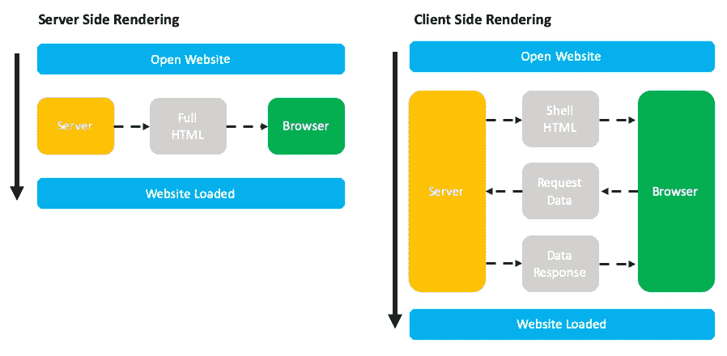
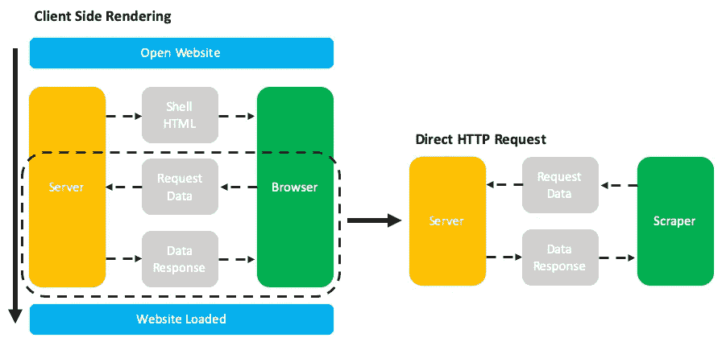
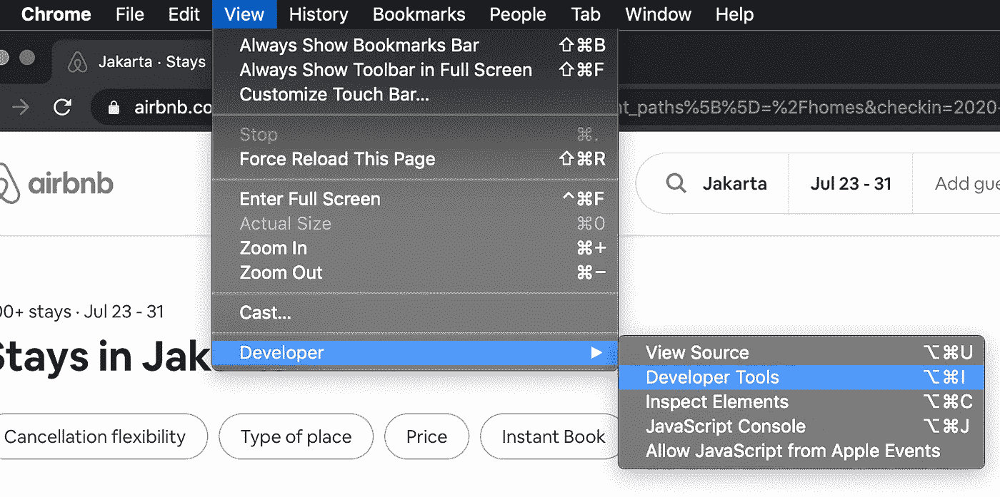
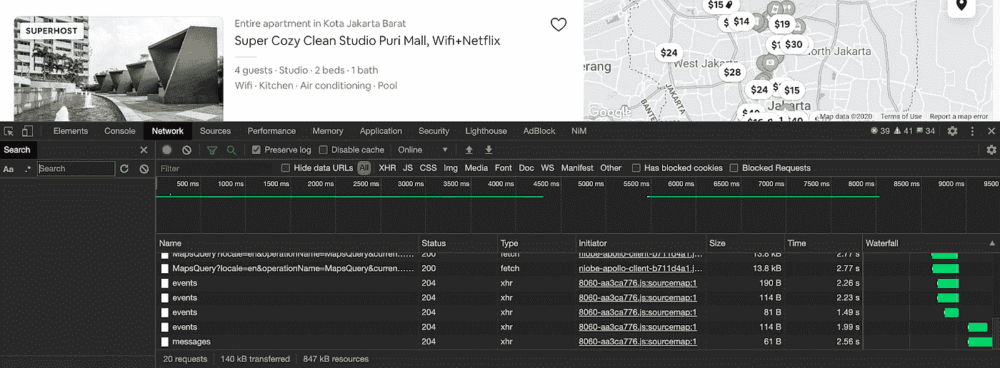
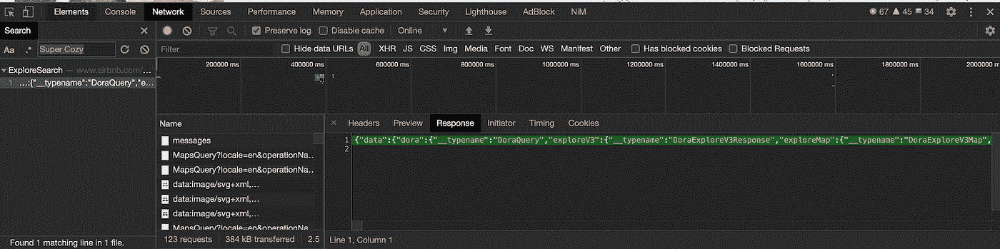
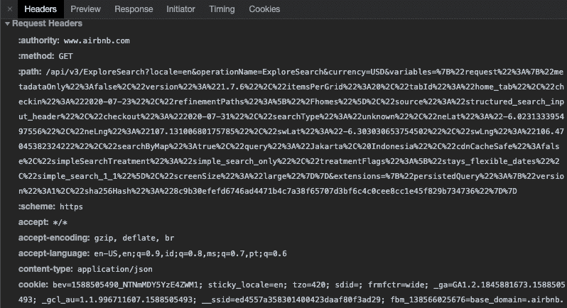
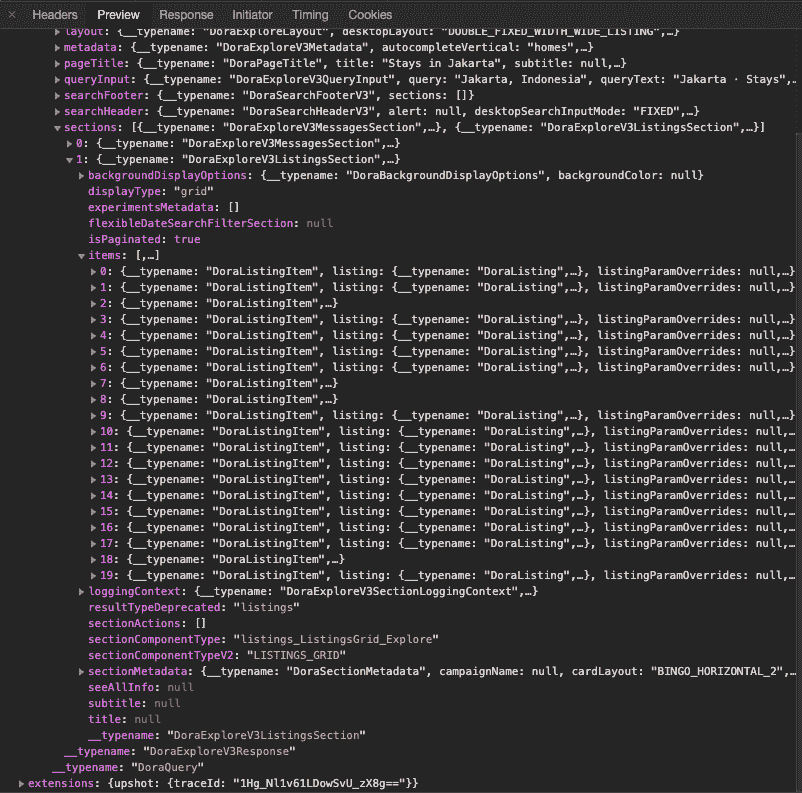
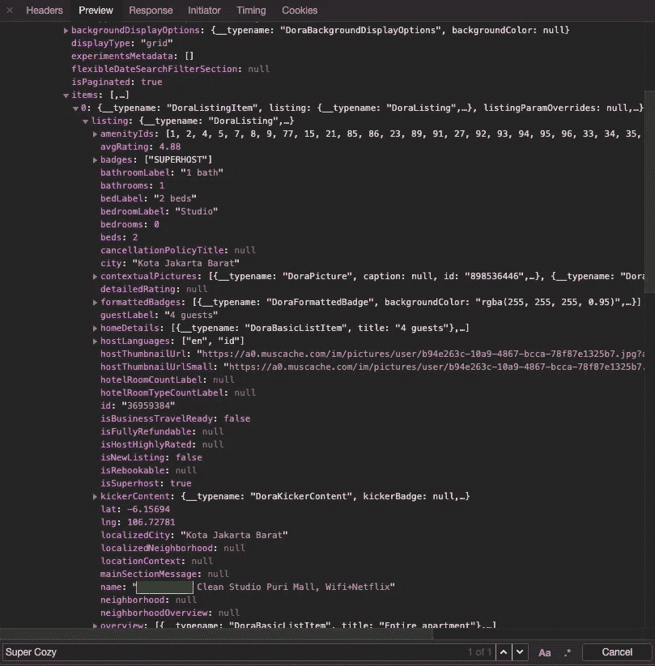
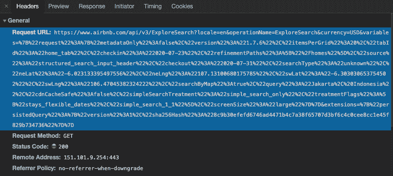
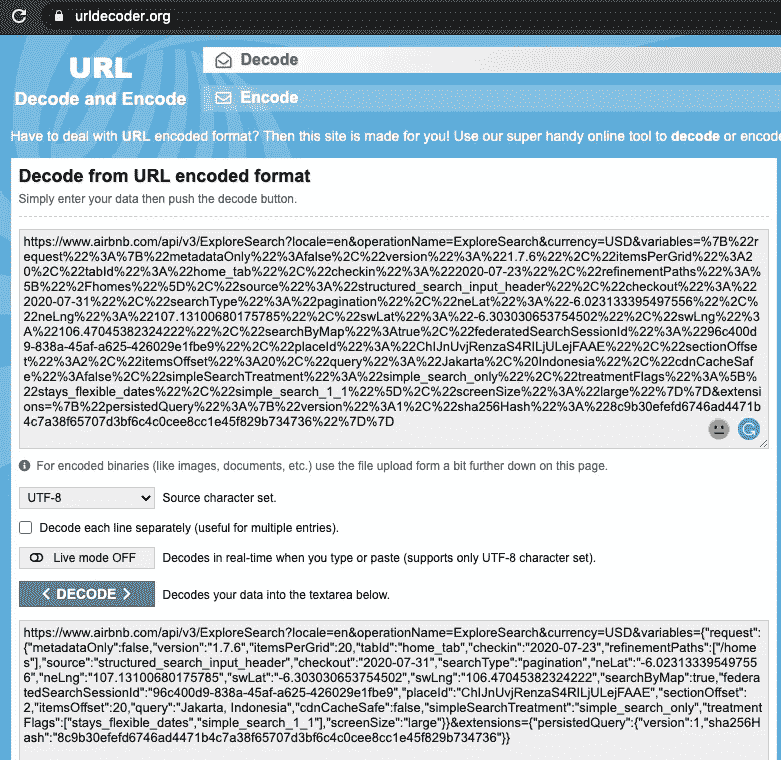

# 使用直接 HTTP 请求抓取 Web 应用程序

> 原文：<https://medium.com/analytics-vidhya/scraping-web-apps-using-direct-http-request-f5c02a2874fe?source=collection_archive---------3----------------------->


卢卡斯·布拉塞克在 [Unsplash](https://unsplash.com?utm_source=medium&utm_medium=referral) 上的照片

你有没有尝试过抓取一个网站，但从结果中没有得到任何数据？网站越来越动态化，并且呈现在客户端，并且通常情况下，抓取 HTML DOM 会导致空响应，因为数据是在接收到 HTML 之后加载的。

开始大数据研究之前的第一步，尤其是在网络平台和应用上，是收集数据。刮痧已经成为一种常用的数据收集方法，可用的刮痧方式有很多。最常见也是最常被教授的一种方法是使用自动化功能遍历 HTML DOM，如 Chrome 扩展或通过 puppeteer 或 nightmare 编写无头浏览器脚本。

还有一种不经常讨论但更新颖的方法，那就是通过向支持应用程序或网站的 HTTP 端点发出直接 HTTP 请求来进行抓取。这种技术实际上是 web 开发中的一种常见做法，我看到了将这种技术重新用于数据抓取的潜力。还有，这恰好是我最喜欢的刮痧方式。

在我们进入抓取方法之前，有必要讨论一下当今网站和应用程序通常是如何构建的，以及服务器端和客户端渲染的区别。

# **术语**

这里有一些贯穿整篇文章的术语，可以帮助那些不太熟悉 web 开发的人加快速度。

1.  服务器端呈现—是应用程序通过在服务器上显示网页而不是在浏览器中呈现网页来做出贡献的能力。
2.  客户端呈现—一种使用 JavaScript 在浏览器中呈现内容的技术。
3.  单页应用程序—是一种 web 应用程序或网站，它通过使用来自 web 服务器的新数据动态重写当前网页来与 web 浏览器进行交互，而不是使用浏览器加载整个新页面的默认方法。
4.  HTTP 端点—端点是公开数据、HTML 文件或活动服务器页面的连接点。
5.  HTML DOM(文档对象模型)—文档对象模型(DOM)是用于 HTML 和 XML 文档的编程 API。它定义了文档的逻辑结构以及访问和操作文档的方式。
6.  JSON (Javascript 对象符号)— JSON (JavaScript 对象符号)是一种轻量级数据交换格式。对人类来说，读和写很容易。机器很容易解析生成。

# **服务器端 vs 客户端渲染**



说明服务器端和客户端呈现之间的差异。在 PowerPoint 中专业绘制:)

网站不再像以前那样简单。许多采用了应用程序的形式和功能，给用户带来了更丰富、更生动的体验。随着网站创建的发展，有许多工具和框架，如 React.js 和 Vue.js，从根本上改变了网站的创建方式。Airbnb、Instagram 和脸书等热门服务都建立在这些范式之上。随着这些变化，我们抓取和访问数据的方式可能也必须改变。

**服务器端渲染**是网站通常的服务方式。当您打开一个 URL 链接时，您的浏览器会创建一个向服务器请求网站的请求。服务器通过返回网站的完整 HTML 标记做出响应，这些标记稍后会出现在浏览器上。大多数抓取方法都是为服务器端渲染网站而设计的。例如，使用 Chrome 扩展或无头浏览器鼓励您识别 HTML 元素并遍历它们来收集数据。

**客户端渲染**是一种越来越流行的服务网站的方式，尤其是那些拥有动态内容的网站。单页应用(SPA)指的是利用客户端渲染来提供动态内容的网站。通过 SPA 和客户端呈现，当我们的浏览器访问一个 URL 链接时，服务器返回的和我们最初收到的是一个没有内容的空壳 HTML 文件。然而，HTML 中包含了一个 Javascript 文件，它将为空的 HTML 添加内容。这个合并和填充过程是通过在页面加载后对服务器进行额外的数据访问来完成的。

这就是为什么从 SPA 和客户端渲染的网站抓取数据具有挑战性，因为大多数技术将向用户提供空数据。我们把网站和它的内容看作一个整体，因为我们的浏览器做了额外的请求和填充数据的工作。然而，我们的抓取工具很可能只能看到空的 HTML 外壳，而不能像浏览器那样发出额外的请求。即使我们调整 scraper 来发出额外的请求，抓取过程也会变得很慢。这也是为什么 SPA 和客户端渲染网站有 SEO 问题，因为爬虫也很难加载这些网站。

# **直接 HTTP 请求**

给定客户端渲染网站的行为，直接 HTTP 请求的方法变得有趣。**如果我们知道网站用来请求数据并直接发出请求的端点会怎样？**这种方法利用了客户端呈现的站点向其服务器发出附加请求的过程。



我们正在进入客户端渲染过程中的一个步骤，以执行直接 HTTP 请求

这种方法很有意思，并且有如下好处:

1.  抓取变得更快，因为我们直接进行 HTTP 请求，从来不需要加载整个网页。
2.  我们收到的数据更丰富，因为服务器提供的数据往往比网站显示的更多。
3.  这就像发出一个 HTTP 请求一样简单。事实上，在识别并获得链接之后，我们可以在一个新的选项卡中打开该链接，并以裸露的形式看到结果(通常是 JSON 形式)。
4.  适用于客户端渲染的网站、SPA 或包含无限加载的网站，尤其是那些严重依赖 REST API 或 GraphQL 的网站
5.  我们从 HTTP 响应中获得结构化数据，可以立即下载到文件中。与将选择器匹配和映射到每个 HTML DOM 相比，这节省了大量时间(我个人讨厌这个过程)。

它有自己强硬的警告:

1.  我们必须确保我们试图抓取的网站实际上使用了填充数据的客户端渲染方法。
2.  识别 HTTP 端点需要一些尝试和错误，而且通常这不是一个通用的解决方案，因为每个网站都有不同的实现。
3.  在发出 HTTP 请求时需要一些变通方法来检查保护措施，如跨源资源共享、同源策略、Cookies 和身份验证令牌。
4.  当网站更新其端点时，我们也需要更新我们的 scraper 算法和可访问的端点。

因此，我们将发出这些 HTTP 请求，就好像我们是客户端/网站本身一样，就像我们对自己的 API 应用程序所做的那样。这个方法其实比听起来容易。

# **使用直接 HTTP 请求抓取 Airbnb**

现在我们已经了解了这种方法及其先决条件，让我们尝试在 Airbnb 上应用这种方法，看看我们可以获得什么数据。

本练习的目的是根据我们在 Airbnb 中的搜索查询，从一个位置获取 Airbnb 房源数据。

第一步是研究和识别 HTTP 端点。所以让我们首先打开 Airbnb.com

接下来，我们将在 Airbnb 上搜索一个位置。在这个练习中，入住和退房的日期可以是随机的，为了简单起见，我们就不使用过滤器了。


在 Airbnb 上搜索…

现在我们已经加载了我们的首选位置的 Airbnb 页面，让我们打开浏览器的开发工具。开发者工具是一套可以在你的浏览器上调试和检查网站的工具。本文将基于 Chrome 开发工具，但类似的过程也适用于 Firefox 和您喜欢的其他浏览器。



从菜单栏访问开发人员工具或使用快捷方式

在 Chrome 开发者工具上，我们需要导航到网络选项卡。“网络”选项卡可以记录所有传入和传出的网络连接。这是我们标识 HTTP 端点的地方。如您所见，在页面加载之后，站点会发出和接收许多额外的请求。如果您看不到任何内容，您可能需要在打开开发者工具网络选项卡后刷新页面。其中一个请求包含 Airbnb 房源的数据集。



导航到开发人员工具上的网络选项卡

找到端点的简单方法是使用网络工具中的搜索功能。简单来说，尝试搜索 Airbnb 房产的标题。将出现包含列表数据的端点；这些数据通常以 JSON 格式返回。



单击搜索结果会直接将我们带到我们需要的 HTTP 端点的传入请求

通过点击结果，我们可以研究对 HTTP 端点的请求是如何完成的。我们可以看到 JSON 的内容、浏览器向这个 HTTP 端点发出的请求的结构以及端点返回的响应。请注意 Request Headers 部分下面的信息，因为我们稍后将需要它来发出请求。



请记下这些信息！

单击 Preview 选项卡将允许我们使用更友好的用户界面来研究 JSON 响应。



更容易阅读，而且可以点击

需要注意的一点是，HTTP 端点的响应为我们提供了关于 Airbnb 属性和搜索查询的更丰富的结构化数据。



有些信息没有显示在网页上

基于这些信息，我们还可以研究 Airbnb HTTP 端点的模式和结构。



让我们复制粘贴请求 URL 并研究端点的结构。复制请求 URL 为我们提供了如下所示的 URL，但是很难阅读。

```
[https://www.airbnb.com/api/v3/ExploreSearch?locale=en&operationName=ExploreSearch&currency=USD&variables=%7B%22request%22%3A%7B%22metadataOnly%22%3Afalse%2C%22version%22%3A%221.7.6%22%2C%22itemsPerGrid%22%3A20%2C%22tabId%22%3A%22home_tab%22%2C%22checkin%22%3A%222020-07-23%22%2C%22refinementPaths%22%3A%5B%22%2Fhomes%22%5D%2C%22source%22%3A%22structured_search_input_header%22%2C%22checkout%22%3A%222020-07-31%22%2C%22searchType%22%3A%22pagination%22%2C%22neLat%22%3A%22-6.023133395497556%22%2C%22neLng%22%3A%22107.13100680175785%22%2C%22swLat%22%3A%22-6.303030653754502%22%2C%22swLng%22%3A%22106.47045382324222%22%2C%22searchByMap%22%3Atrue%2C%22federatedSearchSessionId%22%3A%2296c400d9-838a-45af-a625-426029e1fbe9%22%2C%22placeId%22%3A%22ChIJnUvjRenzaS4RILjULejFAAE%22%2C%22sectionOffset%22%3A2%2C%22itemsOffset%22%3A20%2C%22query%22%3A%22Jakarta%2C%20Indonesia%22%2C%22cdnCacheSafe%22%3Afalse%2C%22simpleSearchTreatment%22%3A%22simple_search_only%22%2C%22treatmentFlags%22%3A%5B%22stays_flexible_dates%22%2C%22simple_search_1_1%22%5D%2C%22screenSize%22%3A%22large%22%7D%7D&extensions=%7B%22persistedQuery%22%3A%7B%22version%22%3A1%2C%22sha256Hash%22%3A%228c9b30efefd6746ad4471b4c7a38f65707d3bf6c4c0cee8cc1e45f829b734736%22%7D%7D](https://www.airbnb.com/api/v3/ExploreSearch?locale=en&operationName=ExploreSearch&currency=USD&variables=%7B%22request%22%3A%7B%22metadataOnly%22%3Afalse%2C%22version%22%3A%221.7.6%22%2C%22itemsPerGrid%22%3A20%2C%22tabId%22%3A%22home_tab%22%2C%22checkin%22%3A%222020-07-23%22%2C%22refinementPaths%22%3A%5B%22%2Fhomes%22%5D%2C%22source%22%3A%22structured_search_input_header%22%2C%22checkout%22%3A%222020-07-31%22%2C%22searchType%22%3A%22pagination%22%2C%22neLat%22%3A%22-6.023133395497556%22%2C%22neLng%22%3A%22107.13100680175785%22%2C%22swLat%22%3A%22-6.303030653754502%22%2C%22swLng%22%3A%22106.47045382324222%22%2C%22searchByMap%22%3Atrue%2C%22federatedSearchSessionId%22%3A%2296c400d9-838a-45af-a625-426029e1fbe9%22%2C%22placeId%22%3A%22ChIJnUvjRenzaS4RILjULejFAAE%22%2C%22sectionOffset%22%3A2%2C%22itemsOffset%22%3A20%2C%22query%22%3A%22Jakarta%2C%20Indonesia%22%2C%22cdnCacheSafe%22%3Afalse%2C%22simpleSearchTreatment%22%3A%22simple_search_only%22%2C%22treatmentFlags%22%3A%5B%22stays_flexible_dates%22%2C%22simple_search_1_1%22%5D%2C%22screenSize%22%3A%22large%22%7D%7D&extensions=%7B%22persistedQuery%22%3A%7B%22version%22%3A1%2C%22sha256Hash%22%3A%228c9b30efefd6746ad4471b4c7a38f65707d3bf6c4c0cee8cc1e45f829b734736%22%7D%7D)
```

这个 URL 是经过编码的，我们首先必须对其进行解码。我们可以很容易地通过访问免费的在线网址解码器，如[urldecoder.org](https://urldecoder.org)



然后，我们获得如下所示的解码后的 URL。

```
[https://www.airbnb.com/api/v3/ExploreSearch?locale=en&operationName=ExploreSearch&currency=USD&variables={](https://www.airbnb.com/api/v3/ExploreSearch?locale=en&operationName=ExploreSearch&currency=USD&variables={)"request":{"metadataOnly":false,"version":"1.7.6","**itemsPerGrid**":20,"tabId":"home_tab","**checkin**":"2020-07-23","refinementPaths":["/homes"],"source":"structured_search_input_header","**checkout**":"2020-07-31","searchType":"pagination","neLat":"-6.023133395497556","neLng":"107.13100680175785","swLat":"-6.303030653754502","swLng":"106.47045382324222","searchByMap":true,"federatedSearchSessionId":"96c400d9-838a-45af-a625-426029e1fbe9","placeId":"ChIJnUvjRenzaS4RILjULejFAAE","**sectionOffset**":2,"**itemsOffset**":20,"**query**":"Jakarta, Indonesia","cdnCacheSafe":false,"simpleSearchTreatment":"simple_search_only","treatmentFlags":["stays_flexible_dates","simple_search_1_1"],"screenSize":"large"}}&extensions={"persistedQuery":{"version":1,"sha256Hash":"8c9b30efefd6746ad4471b4c7a38f65707d3bf6c4c0cee8cc1e45f829b734736"}}
```

在这里，我们可以标识诸如 itemsPerGrid、Checkin、Checkout、Query、sectionOffset 和 itemsOffset 之类的字段。通过识别这些模式，我们可以通过简单地修改这些参数来探索 Airbnb 数据集。

现在我们有了这些信息，我们可以开始构建我们的脚本了。对于这个例子，我将使用 Node.js，但是这个理论也适用于其他编程语言。

我将首先安装 Axios 来在 Node.js 中发出 HTTP 请求

```
npm install axios
```

接下来，我需要将它们与 fs 包一起放在我的 airbnb.js 文件中，以便稍后将我的数据保存为文件。

```
const axios = require("axios");const fs = require("fs");
```

最后，我们将使用 Axios 向端点发出一个 HTTP GET 请求。请注意，我们还包含了之前确定的标题信息。包含这些标题将允许 Airbnb 看到我们的请求，就好像我们是 Airbnb.com 从 Airbnb 的服务器请求数据一样。

对 Airbnb 的端点执行 HTTP 请求的简单示例

我们检索的数据可以在下面的链接中看到。

 [## Airbnb 端点响应

### JSON Blob 是一个基于 web 的工具，用于创建、编辑、查看、格式化和共享 JSON。它显示你的 JSON 并排在一个…

jsonblob.com](https://jsonblob.com/01465cc1-ccfa-11ea-ad1c-51ff5e7c449a) 

更进一步，由于我们知道端点的模式，我们可以通过增加它的 itemsOffset 对数据集进行分页。这样，我们可以遍历端点中包含的整个数据集，而不必直接与 Airbnb 站点进行交互。这里，我创建了一个简单的循环来遍历端点。

通过递增 offset 参数进行分页的简单示例

我们将结果打包成 JSON，并通过 fs.writeFile 函数保存为一个文件。该文件可以通过在线提供的免费 JSON 到 CSV 转换器转换为 CSV 文件，数据集已准备好用于我们的大数据研究！

# 后续步骤

这种方法简单易行。但是，在尝试和错误以及确定合适的终点方面有所投入。但是，一旦我们找到了正确的模式并固化了我们的脚本，我们就可以用它来搜索任何我们想要的查询和数据集！

除了本文中的示例，我们还可以找到其他端点，并从网站中检索不同的数据集。Airbnb 使用其他 HTTP 端点来为其网站的不同部分填充数据。比如 Airbnb 使用不同的端点进行点评，我们也可以通过这种技术获得。提示:在打开 Network 选项卡的情况下使用开发人员工具，研究传入的请求。您可能会找到可以使用的独特的 HTTP 端点。

我们还可以创建一个更好的算法来遍历端点。我们可以创建一个检查来增加偏移量，直到没有数据返回，而不是像示例中所示的固定数量的循环。最后，试验一下端点的参数，看看可以检索到什么数据。

这种方法非常通用，适用于许多其他流行的平台。YouTube 和 Instagram 是许多其他利用这种客户端到服务器交互的网站中的少数几个。

# **数据点——人性化的刮痧 App**

如果这篇文章对你有用，我制作了一个 web 应用程序，利用这种技术可以访问 Airbnb 列表和评论以及 Tokopedia 产品和评论数据集，而不需要编写代码和设置自己的脚本。这些抓取工具具有友好的界面、实时抓取进度状态、交互式数据集预览和即时下载到 CSV 格式。你可以在下面的 30 秒视频中看到数据点的作用，或者访问 https://datapoint.marcelchristianis.com 的[亲自尝试一下。](https://datapoint.marcelchristianis.com)

也就是说，我希望这篇文章值得您花费时间，并为您的数据收集库添加另一个工具。

干杯，

波浪形卷发