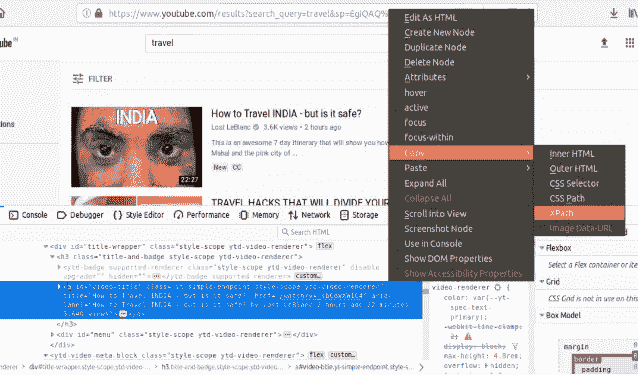
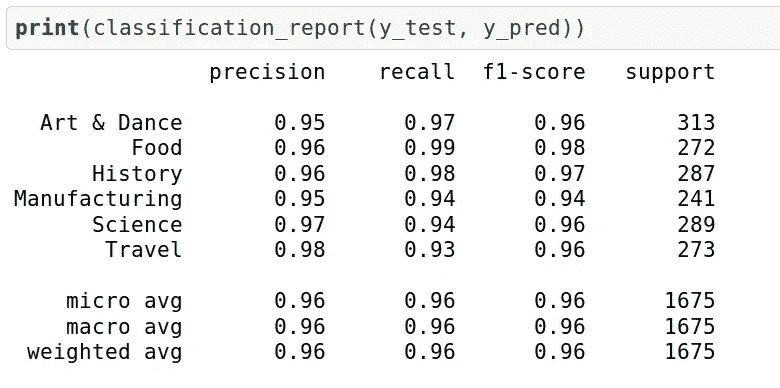
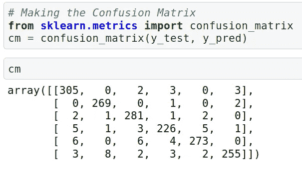

# 使用 Python 和 Selenium 抓取 YouTube 数据以对视频进行分类

> 原文：<https://medium.com/analytics-vidhya/scraping-youtube-data-using-python-and-selenium-to-classify-videos-89afde8381c4?source=collection_archive---------0----------------------->

# 介绍

我是一个狂热的 YouTube 用户。我在一个平台上可以观看的内容数量惊人。事实上，我的许多[数据科学](https://courses.analyticsvidhya.com/courses/introduction-to-data-science-2?utm_source=blog&utm_medium=scraping-classifying-youtube-video-data-python-selenium)学习都是通过 YouTube 视频进行的！

所以，几周前我在浏览 YouTube，搜索某个类别来观看。这时，我的数据科学家思维过程开始了。鉴于我对网络抓取和机器学习的热爱，我能提取关于 YouTube 视频的数据并建立一个模型来将它们分类吗？

我很好奇！这听起来像是将我现有的 Python 和数据科学知识与我学习新事物的好奇心相结合的绝佳机会。分析 Vidhya 的实习挑战让我有机会以文章的形式写下我的学习。


我觉得 Web 抓取是每个数据科学爱好者都应该知道的技能。当我们为我们的项目寻找数据或者想要分析只出现在网站上的特定数据时，它非常有用。请记住，网络抓取不应该跨越道德和法律的界限。

在本文中，我们将学习如何使用 Selenium 和 Python 通过 web 抓取来提取 YouTube 视频数据。然后，我们将使用 NLTK 库清理数据，然后建立一个模型，根据特定的类别对这些视频进行分类。

*你也可以使用不同的库查看下面的网页抓取教程:*

*   [*Python 网页抓取入门(使用 BeautifulSoup)*](https://www.analyticsvidhya.com/blog/2015/10/beginner-guide-web-scraping-beautiful-soup-python/?utm_source=blog&utm_medium=scraping-classifying-youtube-video-data-python-selenium)
*   [*Web Scrapy 在 Python 中使用 Scrapy(附多个例子)*](https://www.analyticsvidhya.com/blog/2017/07/web-scraping-in-python-using-scrapy/?utm_source=blog&utm_medium=scraping-classifying-youtube-video-data-python-selenium)
*   [*R 中的网页抓取入门指南(使用 rvest)*](https://www.analyticsvidhya.com/blog/2017/07/web-scraping-in-python-using-scrapy/?utm_source=blog&utm_medium=scraping-classifying-youtube-video-data-python-selenium)

# 目录

1.  硒概述
2.  我们的网络抓取项目的先决条件
3.  设置 Python 环境
4.  从 YouTube 抓取数据
5.  使用 NLTK 库清理擦除的数据
6.  建立我们的模型来分类 YouTube 视频
7.  分析结果

# 硒概述


Selenium 是自动化浏览器的流行工具。它主要用于行业内的测试，但对于网页抓取也非常方便。如果你在 IT 领域工作过，你一定会遇到 Selenium。

我们可以使用 Selenium 轻松编写 Python 脚本来自动化 web 浏览器。它给了我们高效提取数据并以我们喜欢的格式存储以备将来使用所需的自由。

Selenium 需要一个驱动程序来与我们选择的浏览器接口。比如 Chrome，需要 ChromeDriver，需要在我们开始刮之前安装。Selenium web 驱动程序使用浏览器自己的引擎控制它，直接与浏览器对话。这使得它非常快。

# 我们的网络抓取项目的先决条件

在进入网络抓取之前，有几件事我们必须知道:

*   必须具备 **HTML** 和 **CSS** 的基础知识。我们需要这个来理解我们将要抓取的网页的结构
*   需要 Python 来清理数据、探索数据和构建模型
*   一些基础库的知识，如 **Pandas** 和 **NumPy** 将是蛋糕上的樱桃

# 设置 Python 环境

是时候启动你最喜欢的 Python IDE 了(对我来说这就是 Jupyter 笔记本)！让我们动手开始编码吧。

**步骤 1:** 安装 Python 绑定:

```
#Open terminal and type- **$ pip install selenium**
```

**第二步:**下载 Chrome WebDriver:

**步骤 3:** 将驱动文件移动到一个路径:

转到下载目录，解压缩文件，并将其移动到 u *sr/local/bin 路径。*

```
**$ cd Downloads$ unzip chromedriver_linux64.zip$ mv chromedriver /usr/local/bin/**
```

我们现在都准备好开始抓取网页了。

# 从 YouTube 抓取数据

在本文中，我们将从 YouTube 上搜集特定类别的视频 ID、视频标题和视频描述。我们将收集的类别包括:

所以让我们开始吧！

首先，让我们导入一些库:

*   在我们做任何其他事情之前，请在浏览器中打开 YouTube。键入您想要搜索视频的类别，并将过滤器设置为“视频”。这将只显示与您的搜索相关的视频。完成此操作后复制 URL。
*   接下来，我们需要设置驱动程序来从 YouTube 获取 URL 的内容:

*   将链接粘贴到 to driver.get(“您的链接在此”)函数中，然后运行单元格。这将为该链接打开一个新的浏览器窗口。我们将在此浏览器窗口中执行以下所有任务
*   获取该特定页面上的所有视频链接。我们将创建一个“列表”来存储这些链接
*   现在，转到浏览器窗口，右键单击页面，并选择“检查元素”
*   用 id = "video-title "搜索锚标记，然后右键单击它-> Copy -> XPath。XPath 应该类似于: **//*[@id="video-title"]**



跟我到目前为止？现在，编写下面的代码开始从页面获取链接并运行单元格。这将获取网页上的所有链接，并将其存储在一个列表中。

***注意:一路向下遍历加载该页面的所有视频。***

上面的代码将获取我们搜索的锚标记的“href”属性。

现在，我们需要创建一个包含 4 列的 data frame——“**链接**”、“**标题**”、“**描述**”和“**类别**”。我们将在这些栏中存储不同类别视频的详细信息:

我们已经准备好从 YouTube 上抓取视频细节。下面是实现这一点的 Python 代码:

让我们分解这个代码块来理解我们刚刚做了什么:

*   将忽略默认情况下在“直到”条件下遇到(抛出)的**“等待”** *NotFoundException* 的实例。它会立即传播所有其他的
*   参数:
*   **驱动程序:**要传递给预期条件的 WebDriver 实例
*   **timeOutInSeconds:** 调用期望时的超时秒数
*   **v_category** 存储我们之前搜索的视频类别名称
*   “for”循环应用于我们上面创建的链接列表
*   **driver.get(x)** 逐个遍历所有链接，并在浏览器中打开它们以获取详细信息
*   **v_id** 存储从链接中剥离的视频 id
*   **v_title** 存储使用 CSS 路径获取的视频标题
*   类似地， **v_description** 通过使用 CSS 路径存储视频描述

在每次迭代中，我们的代码将提取的数据保存在我们之前创建的 dataframe 中。

对于其余五个类别，我们必须遵循上述步骤。一旦我们完成这个，我们应该有六个不同的数据帧。现在，是时候将它们合并成一个数据框架了:

瞧啊。我们有我们的最终数据帧，包含所有上述所有类别的视频所需的细节。

# 使用 NLTK 库清理擦除的数据

在这一节中，我们将使用流行的 NLTK 库来清理“title”和“description”列中的数据。NLP 爱好者会喜欢这个部分的！

在我们开始清理数据之前，我们需要分别存储所有的列，以便我们可以快速方便地执行不同的操作:

首先导入所需的库:

现在，创建一个列表，我们可以在其中存储我们清理的数据。稍后我们将把这些数据存储在一个数据帧中。编写以下代码来创建一个列表，并对来自 ***df_title:*** 的“ **title** ”列进行一些数据清理

你看到我们做了什么吗？我们去掉了标题中的所有标点符号，只保留了英文词根。在所有这些迭代之后，我们已经准备好了我们的数据列表。

我们需要按照同样的步骤从**中清除**描述**列 *df_description* :**

*注意:范围根据我们数据集中的行选择。*

现在，将这些列表转换为数据帧:

接下来，我们需要对类别进行标签编码。函数的作用是:用一个介于 0 和 n _ classes 之间的值对标签进行编码，其中 n 是不同标签的数目。

这里，我们对 *df_category* 应用了标签编码，并将结果存储到 *dfcategory* 中。我们可以将经过清理和编码的数据存储到新的数据框架中:

我们在清洁和转型方面的工作还没有完全完成。

我们应该创建一个单词袋，这样我们的模型就可以理解来自该袋的关键词，从而对视频进行相应的分类。下面是创建一个单词包的代码

*注意:在这里，我们从存储在列表中的数据创建了 1500 个特征——语料库和 corpus1。“X”存储所有特征，“y”存储我们的编码数据。*

我们都已做好准备，迎接数据科学家角色中最令人期待的部分—建立模型！

# 构建我们的模型对 YouTube 视频进行分类

在构建模型之前，我们需要将数据分为训练集和测试集:

*   **训练集:**训练我们模型的数据子集
*   **测试集:**包含对训练好的模型进行测试的剩余数据

确保测试集满足以下两个条件:

*   足够大以产生统计上有意义的结果
*   表示整个数据集。换句话说，不要挑选与训练集具有不同特征的测试集

我们可以使用以下代码来拆分数据:

是时候训练模型了！这里我们将使用[随机森林算法](https://www.analyticsvidhya.com/blog/2016/04/complete-tutorial-tree-based-modeling-scratch-in-python/?utm_source=blog&utm_medium=scraping-classifying-youtube-video-data-python-selenium)。因此，让我们继续使用 RandomForestClassifier()函数来训练这个模型:

参数:

*   **n _ estimates**森林中的树木数量
*   **准则**:衡量拆分质量的功能。支持的标准是基尼不纯的“基尼”和信息增益的“熵”

*注意:这些参数是特定于树的。*

现在，我们可以在测试集上检查模型的性能:

**准确率高达 96.05%。**我们的整个过程进行得相当顺利！但我们还没有完成——我们还需要分析我们的结果，以便充分了解我们取得了哪些成就。

# 分析结果

让我们检查分类报告:



结果将给出以下属性:

*   **精度**是正确预测的正观测值与总预测正观测值之比。精度= TP/TP+FP
*   **回忆**是正确预测的正面观察值与实际类中所有观察值的比率。召回= TP/TP+FN
*   **F1 得分**是准确率和召回率的加权平均值。因此，这个分数同时考虑了误报和漏报。F1 得分= 2*(召回率*精确度)/(召回率+精确度)

我们也可以通过创建混淆矩阵来检查我们的结果:



混淆矩阵将是一个 6×6 的矩阵，因为我们的数据集中有六个类。

# 结束注释

我一直想把我对抓取和提取数据的兴趣与 NLP 和机器学习结合起来。所以我喜欢让自己沉浸在这个项目中，写下我的方法。

在本文中，我们见证了 Selenium 作为 web 抓取工具的潜力。本文使用的所有代码都是[随机森林算法](https://github.com/shubham-singh-ss/Youtube-scraping-using-Selenium/tree/master)恭喜你成功抓取并创建了一个数据集对视频进行分类！

我期待听到您对本文的想法和反馈。

你也可以在分析 Vidhya 的 Android 应用上阅读这篇文章


*原载于 2019 年 5 月 20 日*[*https://www.analyticsvidhya.com*](https://www.analyticsvidhya.com/blog/2019/05/scraping-classifying-youtube-video-data-python-selenium/)*。*