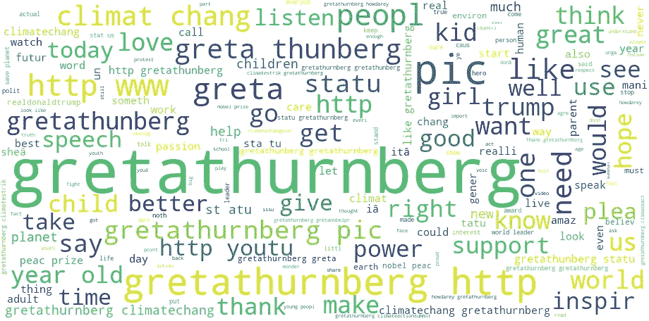

# 透过社交媒体的镜头看格里塔·图恩伯格——第一部分

> 原文：<https://medium.com/analytics-vidhya/scrapping-about-greta-thunberg-swedish-environmental-activist-eab4f2bf4ab0?source=collection_archive---------17----------------------->

## 一个领导全球运动的女孩

> 格里塔是谁？

人们对她有什么看法？

他们怎么在她上面发微博？

Greta 是一个瑞典女孩，她因在气候变化问题上挑战国际领导人而闻名。8 岁时，发现气候变化使她生病并陷入抑郁状态，最终使她的父母意识到她被诊断患有强迫症、选择性缄默症和阿斯伯格综合症。尽管许多有这种诊断的人努力进入社会，Greta 认为他们是她的超能力。就我个人而言，我觉得她是一种激励！

如果你想更多地了解格里塔，你可以在《来自内心的场景》这本书里读到更多关于她的内容。《我们的房子着火了:危机中的一个家庭和一株植物的场景》是由格里塔·图恩伯格的父母——玛莲娜·恩曼和贾译尊·图恩伯格写的，讲述了她家里发生的行为和事件以及它们对格里塔的影响。随着时间的推移，在家人的支持下，她已经成长为一个全球性运动的领导者。现在，人们称之为“格里塔效应”或“卫报”。

> **识别:**

虽然 Greta 是一个 16 岁的女孩，并发起了一项关于气候变化的运动，但自 2018 年以来，这已经获得了国际认可。

我看过她的视频，像“[你怎么敢](https://www.youtube.com/watch?v=u9KxE4Kv9A8)”——这告诉我，她是一个直爽和直率的女孩。

这为她赢得了#世界的认可，也是#世界在她这个年龄的目标。

到目前为止，我们已经获得了关于 Greta 的信息，让我们开始搜集吧。让我们看看人们在推特上怎么谈论她。

为了您的方便，我已经取消了 Twitter 在 2019 年 9 月 23 日至 2019 年 12 月 4 日期间的推文。让我们来分析数据。

因此，我有 19，816 个数据条目，这是执行分析的大量数据。

为此加载 CSV，其编码不同于其他 CSV

我把我的数据命名为 Greta，因为她是我想了解的人

我就想看看有没有空值！

没有丢失的值，所以我可以很容易地开始我的分析

他们在推特上发布的关于格里塔的信息的长度分布

转发和回复信息的数量分布

标签是内容驱动因素，因此提取标签变得更加重要

让我看看当人们谈论格里塔的时候有多少标签被使用

我认为格里塔不仅因为她的名字而为人所知，她还因为气候变化者和她的运动而为人所知，人们对此很感兴趣，他们非常想谈论这个事件。

> 让我看看在我的整个数据框架中，哪些是正在使用或弹出的流行词

做这个词云，将是更好的方式来研究这个问题

因此，最受欢迎的标签当然是“# gretathurnberg”，“气候变化”，“气候变化总结”，“气候变化是真实的”，“气候行动”，更受欢迎的标签是“你好”，“greta4nobelprize”

> 清理文本对于获取更多信息更为重要，因为有大量信息需要获取和执行分析。

现在文本被清除了

除了文本之外，我还想知道在特定时间和日期的帮助下，人们在哪个时间段发布了更多关于 Greta 的微博。

> 让我提取日期和时间

现在我已经建立了 24 小时内的数据集，现在我可以知道人们在什么时候和什么时间段最频繁地谈论她。

> **我只是想看看哪个时间哪个日期的帖子太多了**

我使用每月的时间框架来对数据进行可行的理解

因此，我认为 2019-09 到 2019-11 之间的日期在此期间处理了更多的推文，因为在 2019 年 9 月，她在纽约举行的联合国气候行动峰会上发表了讲话。因此，这可能是推特上更多关于她的事件之一，并会获得更多的认可。

我使用了一个小时的时间框架，范围差为 5

如果你看到这个，你就能理解晚上 8 点以后，或者从 8 点，10 点，11 点开始，推文是高的，午夜以后是低的。人们更有可能在闲暇时发微博，这意味着关于她的宣传是真实的，没有人被迫在微博上写她。

*它告诉人们 8 点后最活跃，这是与人交往的最佳时间！*

## 哇，现在我知道人们在谈论格里塔，但这是积极的还是消极的，他们是否支持她

让我看看这篇文章的情感，以及他们是如何写她的

**在为小姐做的推文中，积极性很高。格里塔:但是消极也是积极**的延伸，这表明她对追随者和抗议者有一定的吸引力。这清楚地表明她是一个领导者和目标。因为她在国际上瞄准了那些试图影响环境的人。

> 让我们看看在 NLTK 的帮助下清理数据后，tweets 使用了哪些单词

> 让我们来看看有哪些用于正面推文的词

正如我之前所说，积极的标签或振动当然围绕着“# gretathurnberg”、“气候变化”、“气候变化”、“气候变化”、“气候变化”、“气候变化”、“气候变化”、“气候变化”、“感谢”、“激励”、“前进”、“力量”、“孩子”、“演讲”等等

> 让我们来看看有哪些用于负面推文的词

## 如果有名气，那么进入人们视线的人可能是偶像或目标

负面标签或振动当然围绕着“# gretathurnberg”、“climatechange”、“climateactionsummit”、“climatechangehoax”、“dare”、“climatechangeisreal”、“气候行动峰会”、“go”、“power”、“realdonaldtrump”等等

通过这个词云，我只能看到语料库里有很多噪音。由于这个原因，我无法区分三个字的云。有些嘈杂的词需要删除，我觉得 Greta 这个名字也应该删除，因为它是一个高频词

> 现在我们知道他们在格里塔上写了什么，但是他们想说什么只有当我们使用二元模型时才能看出来，这些词是附加在其他词上的

在 Bigrams 中，除了“**格蕾塔·图恩伯格气候行动峰会**”、“**年轻女孩**”、“**年轻人**”之外，我找不到太多的见解——可能是想说一个 16 岁的女孩既有正面的推文，也有负面的推文

> **结论:**

我不得不说，这个 16 岁的女孩通过对当今生活中发生的气候变化表现出极大的关注，开始了一场保护她和地球未来的革命运动。

根据这些数据，我认为我得到的信息并不那么确凿。所以，我认为语料库需要像 POS 标签等进行高级清理。，继续寻找我的修改后的帖子，有更多的见解。

> 要全面了解我的研究，你可以查看我的密码本

 [## nivyasreeavula/greathunberg-part 1-Jovian

### 与 nivyasreeavula 合作制作 greathunberg-part 1 笔记本。

jovian.ai](https://jovian.ai/nivyasreeavula/gretathunberg-part1)