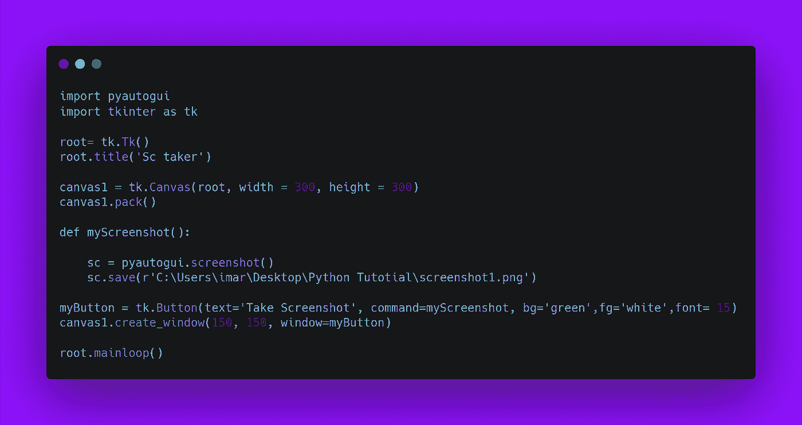
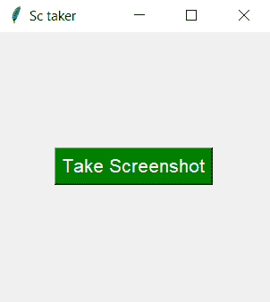

# 用 Python 截图

> 原文：<https://medium.com/analytics-vidhya/screenshot-taker-with-python-4fe19f972556?source=collection_archive---------5----------------------->

在这篇博客文章中，我们将看到如何捕捉屏幕截图。我们将看到 python 中的实现。


[python 中终极资源的存储库](https://github.com/ayushi7rawat/Ultimate-Python-Resource-Hub)。发现有用就掉颗星！有什么要补充的吗？开个 PR 就一样了！

你可以参考我的 YouTube 视频教程，以便更好地理解

# 介绍

屏幕截图，也称为屏幕捕捉，是显示计算机显示内容的数字图像。常见的屏幕截图是由设备上运行的操作系统或软件创建的。拍摄、保存和分享截图非常有用。

# 这个博客将会涵盖什么

```
1\. PyAutoGUI Introduction
2\. How to capture Screenshot using python
```

# PyAutoGUI 是什么？

PyAutoGUI 允许您的 Python 脚本控制鼠标和键盘，以自动化与其他应用程序的交互。

特征

*   移动鼠标并在其他应用程序的窗口中点击或键入。
*   向应用程序发送击键(例如，填写表单)。
*   截图，给定一个图像(例如，一个按钮或复选框)，在屏幕上找到它。
*   找到应用程序的窗口，并移动、调整大小、最大化、最小化或关闭它(目前仅适用于 Windows)
*   GUI 自动化脚本运行时，显示消息框供用户交互。

如果你想了解更多，你可以参考 [PyAutoGUI 文档](https://pyautogui.readthedocs.io/en/latest/)。使用此链接导航到文档。

现在，您已经了解了 PyAutoGUI 的基础知识，我们可以前进到编码部分了。

# 该编码了！

你可以在我的 [GitHub 库](https://github.com/ayushi7rawat/Youtube-Projects/tree/master/Screenshot%20taker%20app)找到所有代码。发现有用就掉颗星。



# 安装 PyAutoGUI

打开您的终端并运行以下命令

```
pip install PyAutoGUI
```

现在我们有了这个包，我们准备将它导入到我们的 python 脚本中。

```
import pyautogui
import tkinter as tk
```

现在，是时候创建画布了。我们给它起个名字吧。我使用`title`方法将`Sc taker`设置为标题。您可以指定画布尺寸。我把`height`和`width`设为`300`。

```
root= tk.Tk()
root.title('Sc taker')
canvas1 = tk.Canvas(root, width = 300, height = 300)
```

现在，让我们用`pack`方法打包画布。

```
canvas1.pack()
```

现在我们已经准备好画布，让我们定义一个函数来捕捉屏幕截图。我把它命名为`myScreenshot`。

我们需要创建一个对象来存储我们的截图。我把它命名为`sc`。因此，我们将从`sc`上的`PyAutoGUI`调用`screenshot`方法。

```
def myScreenshot():
  myScreenshot = pyautogui.screenshot() myScreenshot.save(r'C:\Users\imar\Desktop\Python Tutotial\screenshot1.png')
```

让我们使用`save`方法保存我们的截图。给出正确的路径和截图名称。

现在，让我们创建一个按钮并指定几个参数。

*   我正在设置按钮的`text`为`Take Screenshot`。
*   我正在通过我在`command`的`myScreenshot`功能。
*   `Background`和`foreground`颜色分别为`green`和`white`。
*   最后，我将`font`设置为`15`。

```
myButton = tk.Button(text='Take Screenshot', command=myScreenshot, bg='green',fg='white',font= 15)
```

现在我们的按钮准备好了，让我们把它放在中间。

```
canvas1.create_window(150, 150, window=myButton)
```

最后，我们将调用我们的`mainloop`。

```
root.mainloop()
```

我们的 Python 脚本准备好了。运行该程序，您会看到类似这样的内容。



点击`Take Screenshot`按钮时。新的屏幕截图将被捕获并保存在您指定的路径中。

就是这样！很简单，不是吗？

你可以在我的 [GitHub 库](https://github.com/ayushi7rawat/Youtube-Projects/tree/master/Screenshot%20taker%20app)找到所有代码。发现有用就掉颗星。

感谢您的阅读，我很乐意通过 [Twitter](https://twitter.com/ayushi7rawat) 与您联系。

请分享您的宝贵反馈和建议！

你绝对应该看看我的其他博客:

*   [Python 3.9:你需要知道的一切](https://ayushirawat.com/python-39-all-you-need-to-know)
*   [终极 Python 资源枢纽](https://ayushirawat.com/the-ultimate-python-resource-hub)
*   [GitHub CLI 1.0:你需要知道的一切](https://ayushirawat.com/github-cli-10-all-you-need-to-know)
*   [成为更好的程序员](https://ayushirawat.com/become-a-better-programmer)
*   [如何制作自己的谷歌 Chrome 扩展](https://ayushirawat.com/how-to-make-your-own-google-chrome-extension-1)
*   [使用 Python 从任何 pdf 创建您自己的有声读物](https://ayushirawat.com/create-your-own-audiobook-from-any-pdf-with-python)
*   你很重要，你的心理健康也很重要！

# 资源:

*   [pyautogui.readthedocs.io/en/latest](https://pyautogui.readthedocs.io/en/latest/)

在我的下一篇博客文章中再见，保重