# 使用迁移学习编写卷积神经网络的脚本并实现

> 原文：<https://medium.com/analytics-vidhya/scripting-convolutional-neural-networks-and-implementing-using-transfer-learning-c10f645c4733?source=collection_archive---------17----------------------->

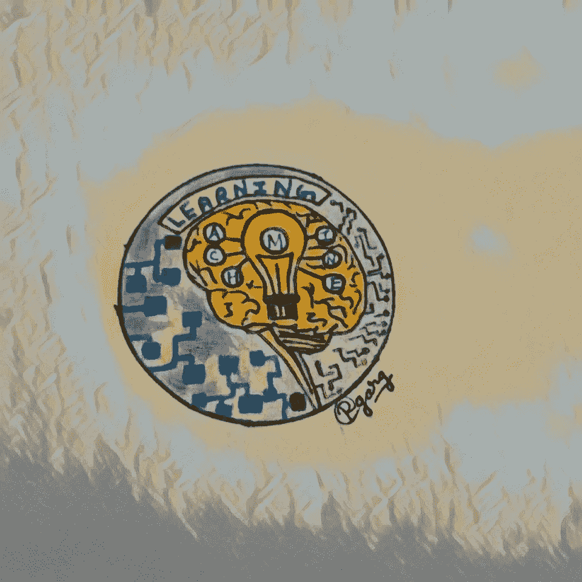

在本文中，我们将讨论卷积神经网络(ConVNet 或 CNN)。该网络通常用于处理矩阵类型(图像)的输入数据。本文将试图让您更好地了解 CNN 的工作原理，以及如何使用 TensorFlow 实现它们。最后，我们将看到如何使用 CNN 的一些预制架构来构建一个新的 CNN 模型。本文包含以下部分。

1)卷积神经网络结构。

2)在来自手写数字的样本图像中应用上述内容。

3)手写数字识别的实现。

4)利用迁移学习制作猫狗识别器。

在 CNN 中，我们处理图像，而在计算机中，图像不过是一个从 0 到 255 的数字矩阵。对于彩色图像，我们有一组三个矩阵(“RGB”)，对应于像素值对应的每个点处的红色、绿色和蓝色。例如。

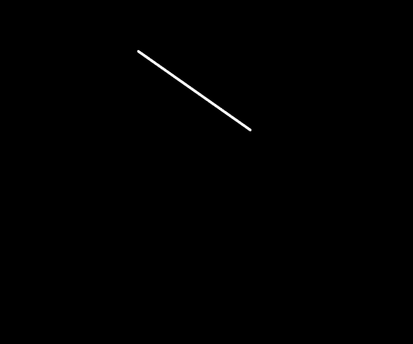

上图是一幅灰度图像，它的矩阵看起来像..

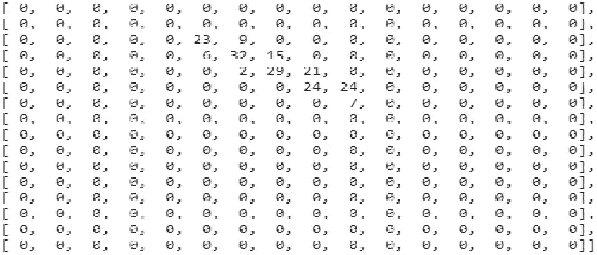

# **卷积神经网络** :-

CNN 的基本结构是一些卷积层，伴随着汇集层，接着是一些全连接层，最后是分类层。

— — — — — — — — — — — — -

分类图层可以有两个(二元)或两个以上的类(多类分类)。对于二元分类层，我们使用 sigmoid，而对于多类分类，我们使用 softmax 作为激活。

***卷积层和池层**

卷积层在 CNN 模型中扮演特征提取器的角色。假设一个狗和猫的分类器正试图分析一张草地上的狗的图片。对于一个分类器来说，它不是一个观察的交易，狗是否站在花园里，说谎，等等。它需要捕捉狗的特征，如毛茸茸的耳朵等。卷积层大大降低了计算开销，因为它在整个图像中共享相同的权重。此外，这也提供了将主物体放置在图像中任何位置的灵活性。那么如何对图像进行卷积呢？

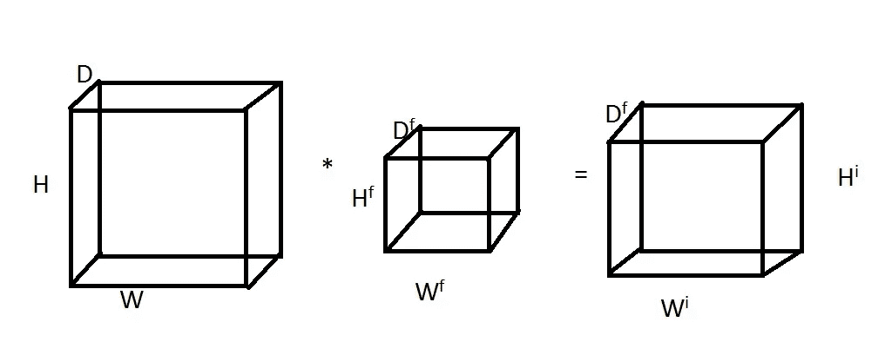

在上述情况下，有 D(f)个特征检测器，我们分别应用于图像。

**#一种计算卷积的数值方法:-**

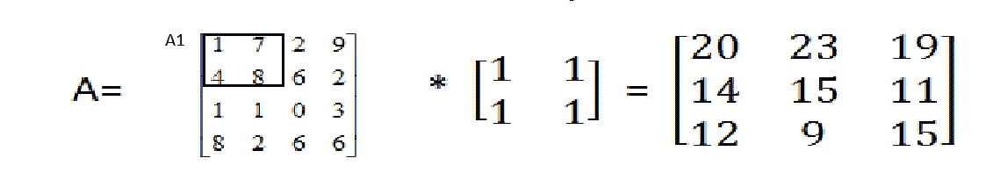

因此，为了对此进行卷积，我们取框 A1 的元素，并使其为，

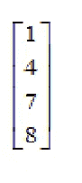

类似地，按照指定的幻灯片，我们移动盒子，盒子变成 A2，我们得到，

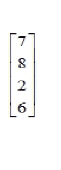

以类似的方式，

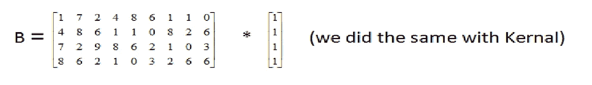

现在我们求出点积的和。

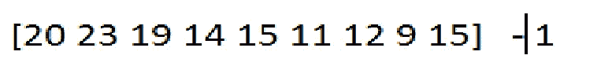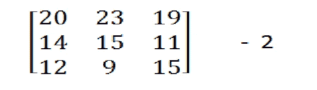

为了将向量 1 转换回矩阵 2，我们试图将键合框在一行上滑动的次数可视化，这是结果矩阵中的列数，即对于第一次迭代，

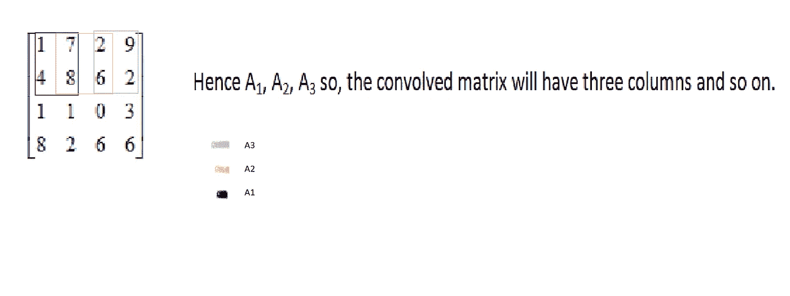

对于图像中的多个通道，我们将矢量化第一个通道，然后连接向量(过滤器中的元素数量),然后连接第二个通道，依此类推。

在简单的可视化中，我们也说我们的内核在图像上以如下方式移动

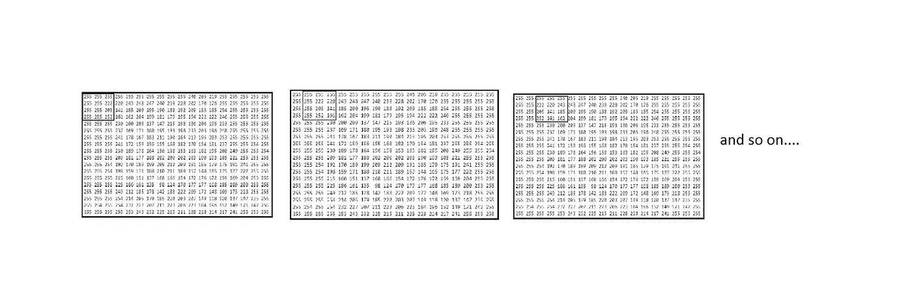

**汇集层**:汇集层通常在卷积层之后应用，以减小特征图的尺寸，同时放大检测到的特征。该层中没有使用任何参数。它主要有两种类型:-

1)平均池层

2)最大池层

我们大多使用 Max Poll。

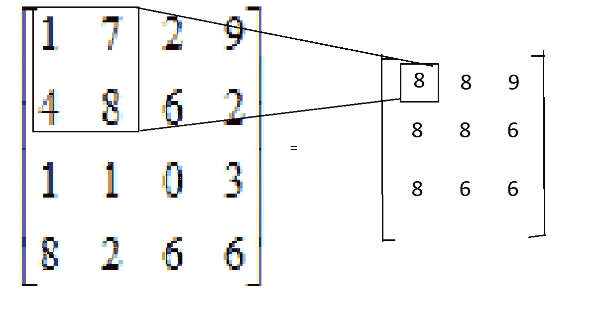

最大池化

正在获取边界框的最大元素。

**全连接层**:-在一系列卷积和汇集层之后，该层的输入向量被展平，然后被传递到一系列全连接层，最后，我们有一个分类层，该分类层有 1 个神经元用于二进制分类或 n 个神经元用于多类分类(其中 n 是类的数量)。

## **构建手写数字识别器:-**

在继续之前，让我们看看卷积和最大池层在特征提取方面对我们的图像做了什么。我们可能不知道图像实际上发生了什么以及为什么会发生这种情况，但我们应该知道垂直图案(或线条)水平线等特征。被认为是我们将要研究的低级特征。

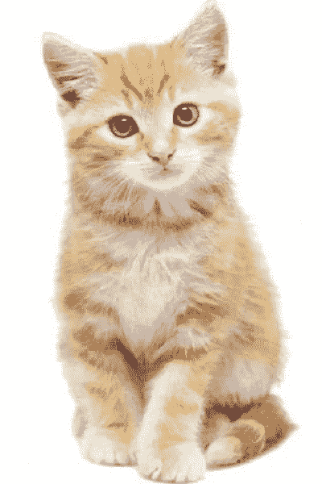

IMG SR = http www . Google . com searchq = cats+images & rlz = 1c 1s qjl _ en in 912 in 912 & sx SRF = alekk 02 xmiij 5-cecqlkt 1 f-GB 22 x8 r7 ew 1596956079426 & TBM = isch & source = iu & ictx = 1 & fir = OQ CHD 3u c0 1 NPM % 252 czeqip 7 u 3 jok-M % 252 c _ & vet = 1 & usg = AI4 _。

这是我们要看的图像。但是让我们先看看三个通道的矩阵(RGB)是什么样子的。

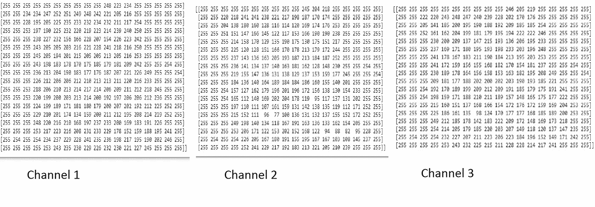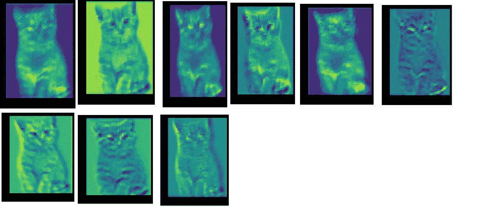

应用 9 个过滤器内核

因此，在此之后，卷积层的输出被展平并传递给完全连接的层。

现在让我们来看看手写数字识别程序。

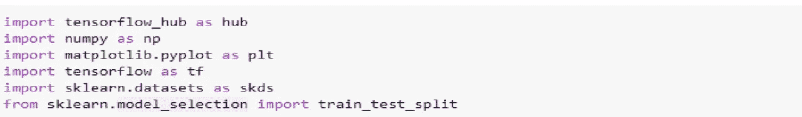

这将导入所有必需的库。

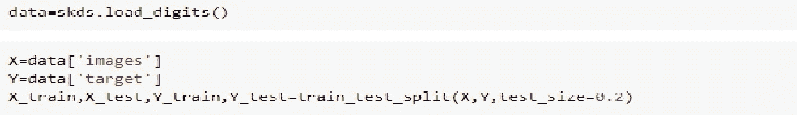

第一行导入数据。

第二行将图像放入 X，第三行将相应的标签放入 y。

第四步将数据分为训练数据和测试数据。

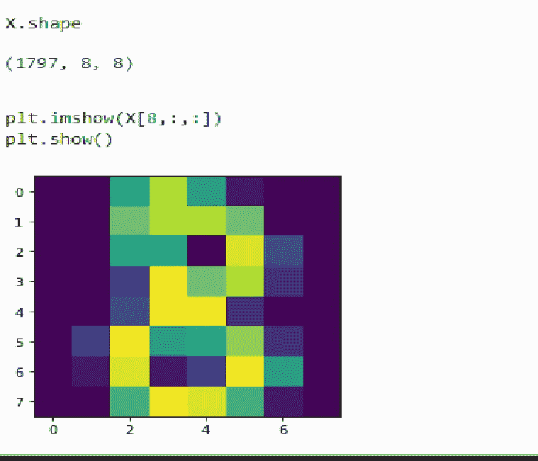

图像已经很复杂了。

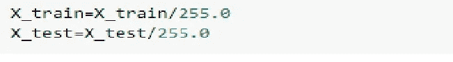

这将使输入矩阵像素值标准化。

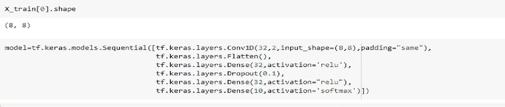

这就创建了模型。

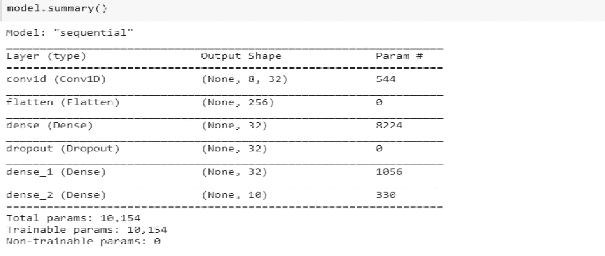

这是你的模特造型。

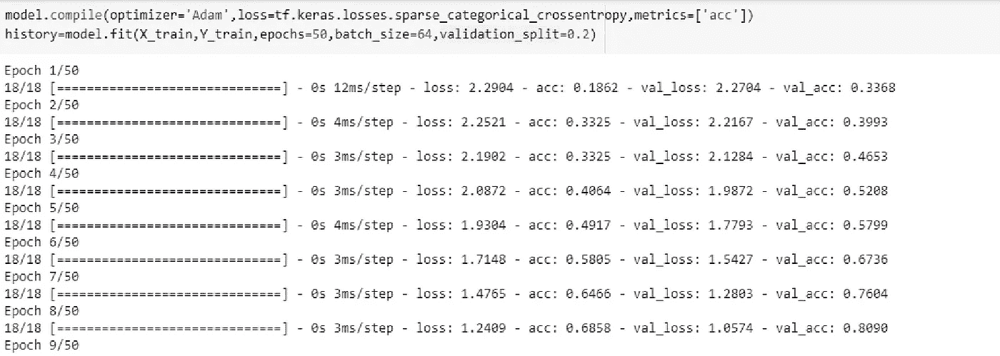

第一行使用 Adam optimizer 编译模型。验证分割设置为 20%。

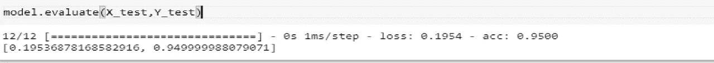

训练结束后，我们评估我们的模型，看不到的数据，准确率约为 95%。

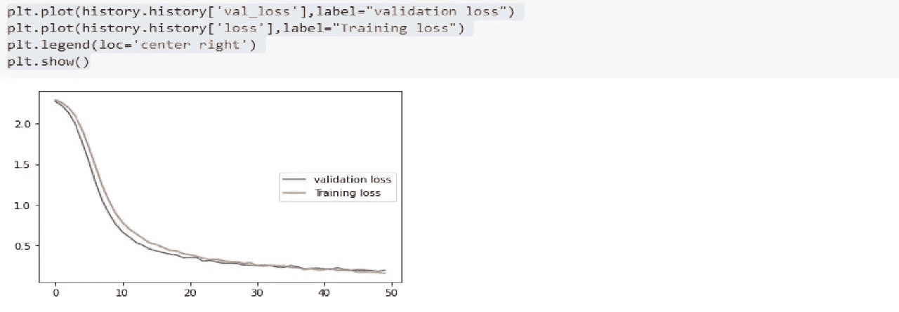

这显示了随着时代的发展，验证和训练的损失。

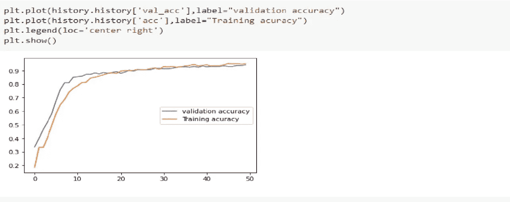

这显示了精度曲线。

**利用迁移学习构建猫狗识别器:-**

迁移学习意味着使用一些在大型计算机器上训练的预训练模型。因此，我们不需要再次训练它们，我们直接使用它们。

让我们直接进入程序；；；；；

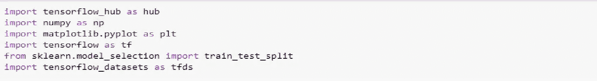

导入库。

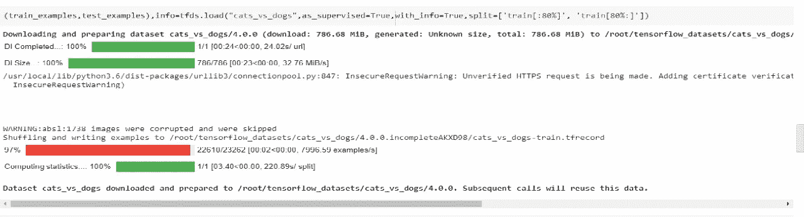

下载包含猫狗图像的数据集。

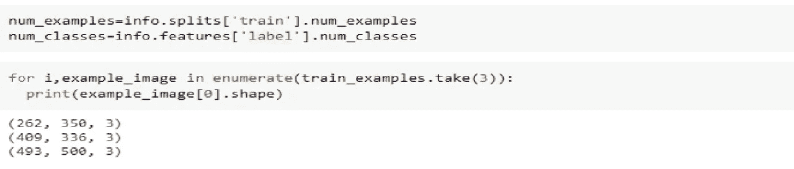

第一行指定 num_examples 中训练示例的数量，第二行指定类的数量。此外，我们拍摄了三张图像，可以注意到所有图像的大小都不一样。

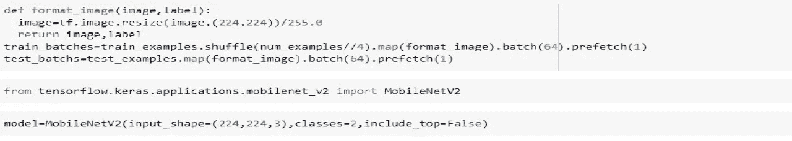

函数 format image 将所有图像整形为(224，224，3)格式，我们还导入了 MobileNetV2 以在程序中使用它。

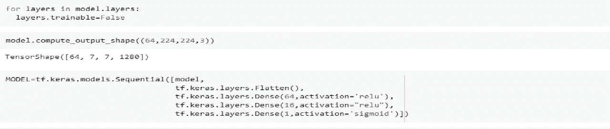

现在我们冻结模型的层，即我们要求模型不要训练架构的权重。此外，我们 model . compute _ output _ shape((224，224，3))告诉我们它将创建多大的输出。此外，我们所有的一些完全连接层和输出层，以满足我们的需要。

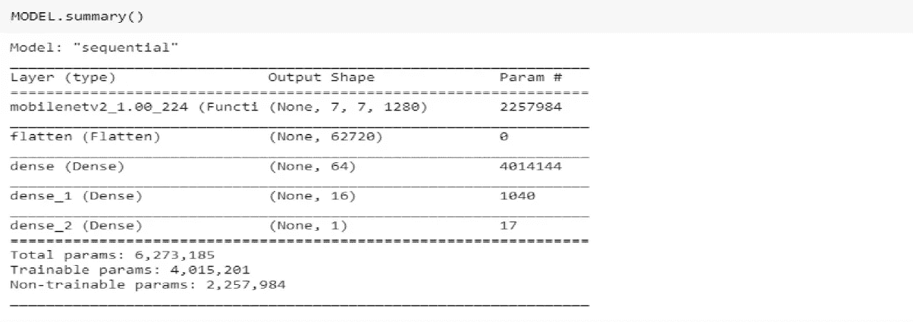

这显示了模型的摘要。请注意不可训练的参数，这些参数属于预训练的架构，因此我们不训练它们。

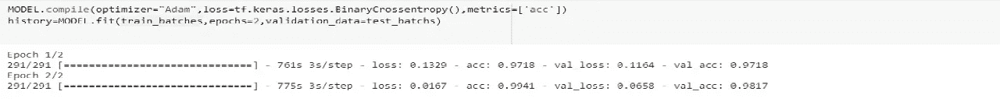

在这里，我只运行了 2 个纪元，为了获得更好的结果，尝试运行更多的纪元。

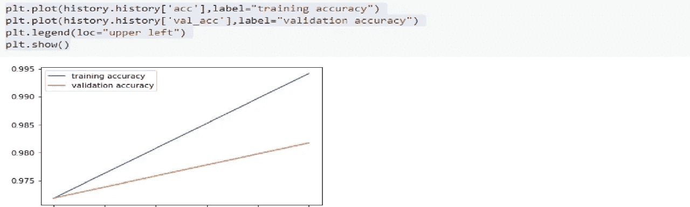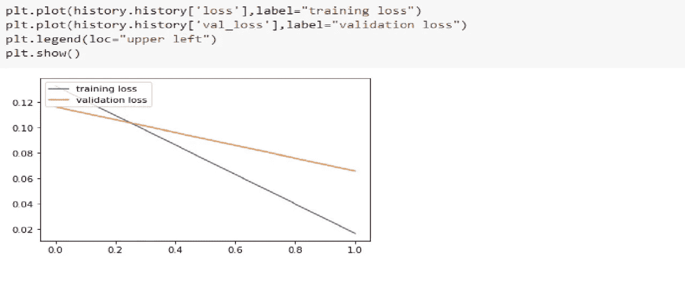

谢谢你。