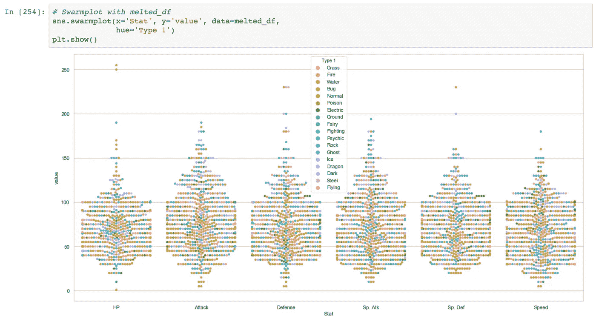

# 🖼航海教程

> 原文：<https://medium.com/analytics-vidhya/seaborn-cheat-sheet-357f3186a4c1?source=collection_archive---------5----------------------->

## 第二部分


在 Seaborn 备忘单的第 1 部分，我们介绍了 Seaborn 的一些功能。现在，我们将通过首先讨论我们修改调色板的能力来进行更详细的讨论。

如果我们能改变我们的小提琴图的颜色，以匹配相关口袋妖怪类型的典型颜色，那就太好了。让我们创建一个颜色十六进制值的顺序列表，它与沿着 x 轴显示的口袋妖怪类型的适当序列相匹配。


现在我们所要做的就是在我们的 sns.violinplot 中使用 palette =参数，我们就可以开始了。

```
sns.violinplot(x= ’Type 1' , y=’Attack’ , data=df, palette=pkmn_type_colors)
```


现在让我们来看看蜂群图。群体图在位置和形状上类似于小提琴图，但如果数据点的数量不是太多，它会让我们更好地了解我们正在处理的数据量。

最棒的是，一个 swarmplot 的代码和创建一个 violin plot 的代码是一样的，除了我们把 sns.violinplot 的代码换成了 sns.swarmplo 的代码


v_plot = sns.swarmplot(x = 'Type 1 '，y='Attack '，data=df，palette = pkmn _ Type _ colors)
v _ plot . set _ xticklabels(v _ plot . get _ xticklabels()，rotation = 45)
PLT . rcparams[' figure . figsize ']=(20，10 )
plt.show()

因为我们的虫群图和小提琴图非常相似，所以让我们把它们重叠起来。除了调整图形大小和将点的颜色改为黑色之外，重叠我们的图就像将每个图的代码放在同一个代码框中一样简单。试着通读下面的代码，看看你是否能理解发生了什么。


这太棒了。我们可以看到不同类型口袋妖怪的攻击统计是如何变化的。现在，我们可以再创建 4 个这样的图，以便可视化防御 Sp。atk Sp。Def 和 Speed，但我们知道这种类型的绘图是如何工作的，在某些情况下，将所有这些数据相互比较可能更有好处。为此我们将使用 pandas *melt( )* 函数。

```
melt( ) takes three arguments.
1\. The DataFrame to melt.
2\. ID variables to keep (Pandas will ‘melt’ all of the other ones).
3\. Finally, a name for the new, melted variable.
```


*melt ( )* 函数提取了保留列表(id_vars)中未指定的每一列，并将其添加到新创建的数据框(melted_df)的底部。例如，尽管你看不到，妙蛙种子现在有 6 行数据。每一行对应一个战斗状态。

现在我们可以绘制我们的数据，但这次我们将设置我们的 x = 'Stat '和 y = 'value '。这将显示一个比较所有不同统计数据的图表。如果你想知道**值**列是从哪里来的，那么 *melted ( )* 函数创建了这个列来存储与每个战斗属性相关的值。



**这很棒，但我们仍需要做一些清理工作，这样可视化会更直观。**

我们将我们的 *hue =* 设置为“类型 1 ”,以查看不同口袋妖怪类型之间的战斗统计数据的变化，但目前我们所有的类型都混合在一起。为了更好地理解这个想法，我们将使用*道奇=真实*的论点通过色调来分离我们的点。
-我们还将把图例移到我们的地块之外，因为它的位置就在我们地块的中心。
-最后我们将使用自定义的口袋妖怪调色板，并调整 y 轴来读取零度以下的空间。


如果你的情节看起来像上面的情节，那么做得好！

seaborn 教程到此结束。我将在下面展示更多的情节类型，只是为了向你展示 seaborn 的能力。要查看更多 seaborn 提供的内容，请访问 [Seaborn 示例图库](https://seaborn.pydata.org/examples/index.html)。

**热图**


**直方图**


**柱状图**


**密度图**


**联合分布图**

