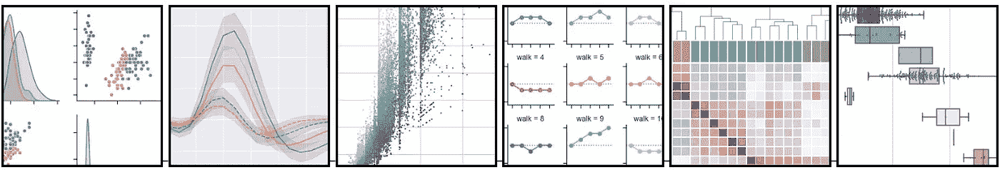
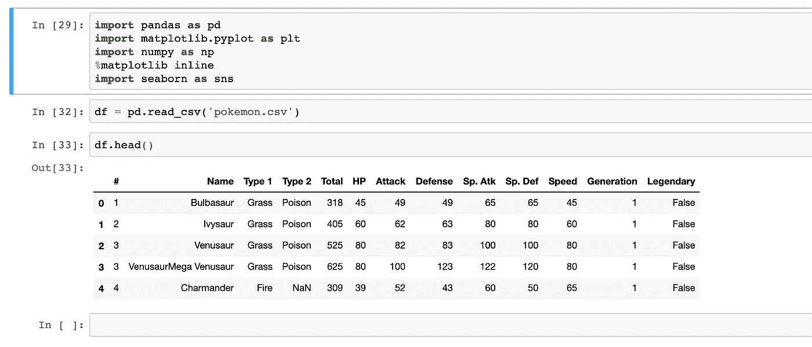
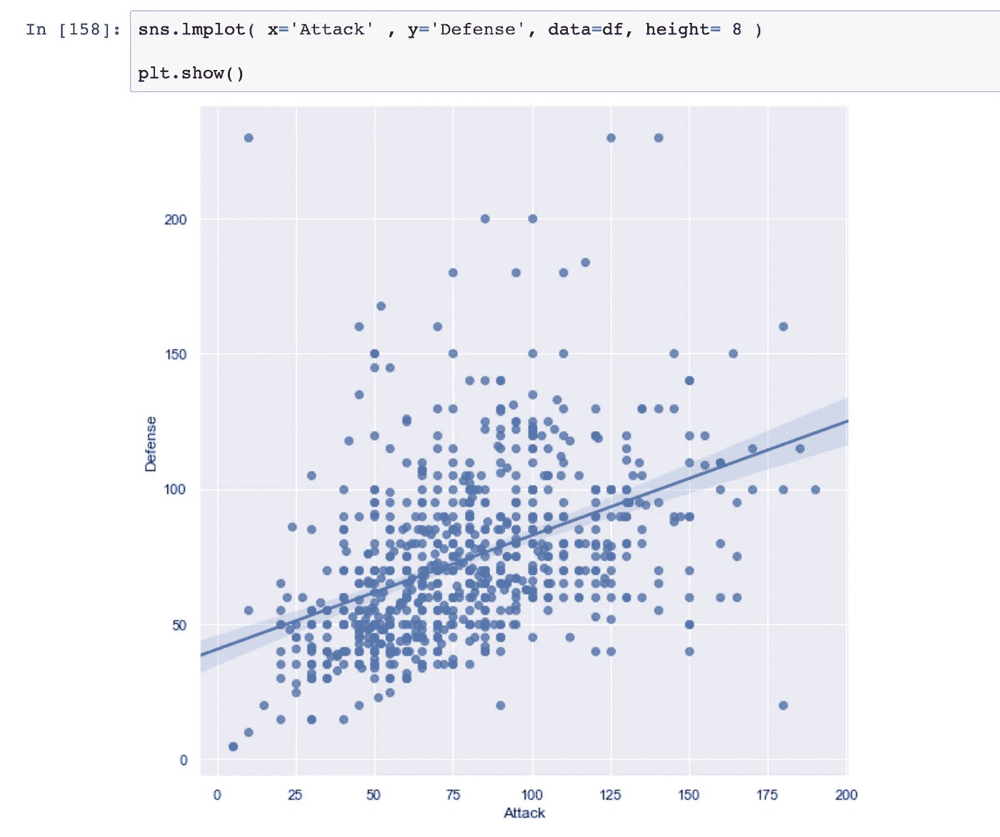
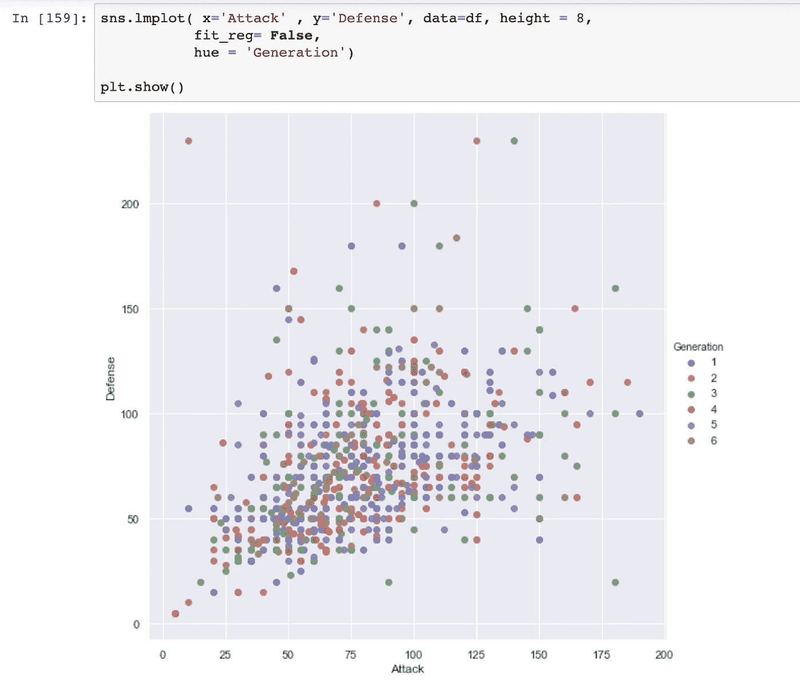
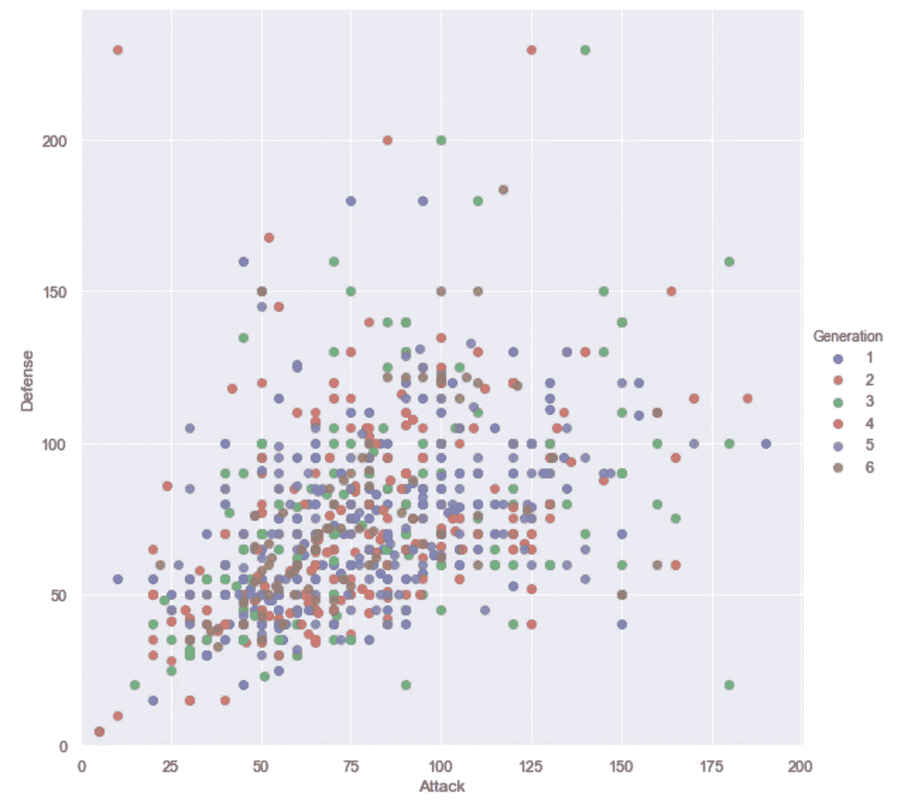
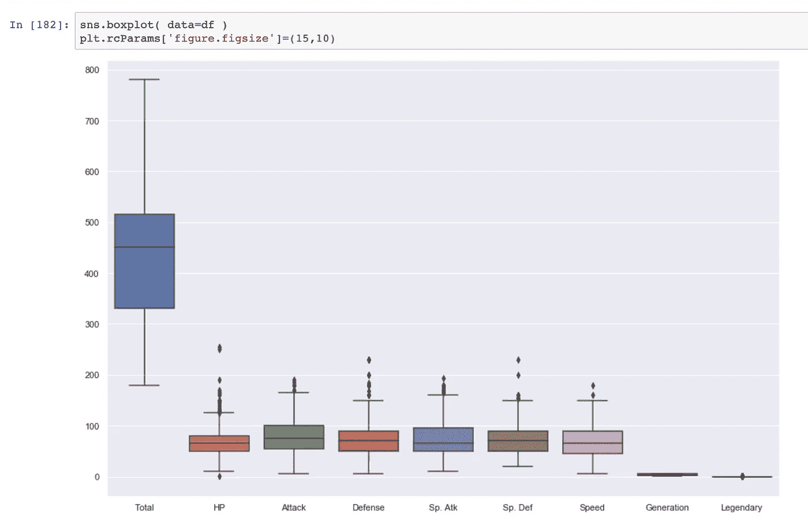
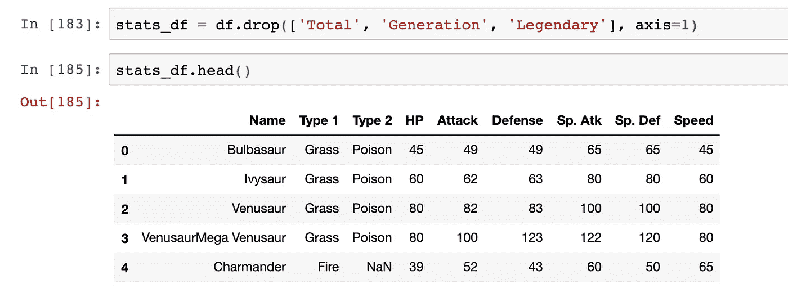
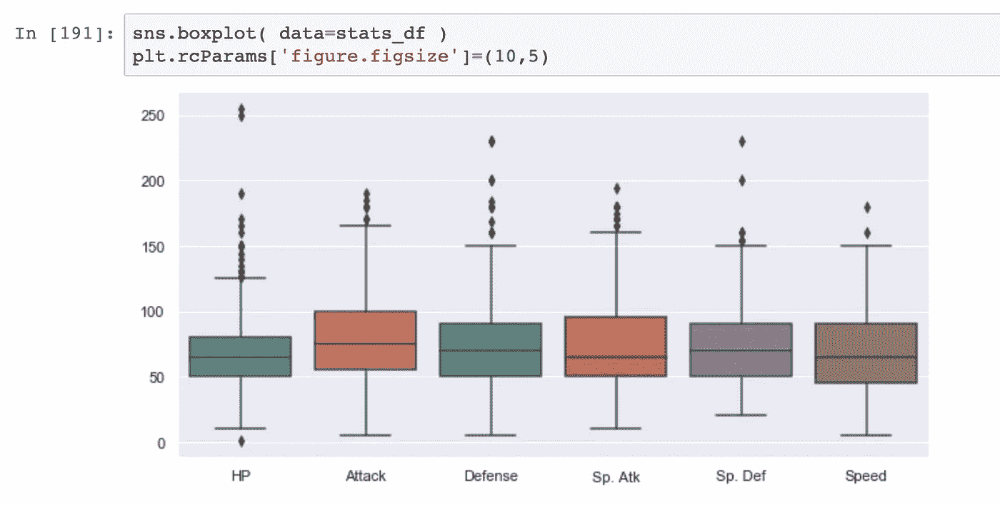
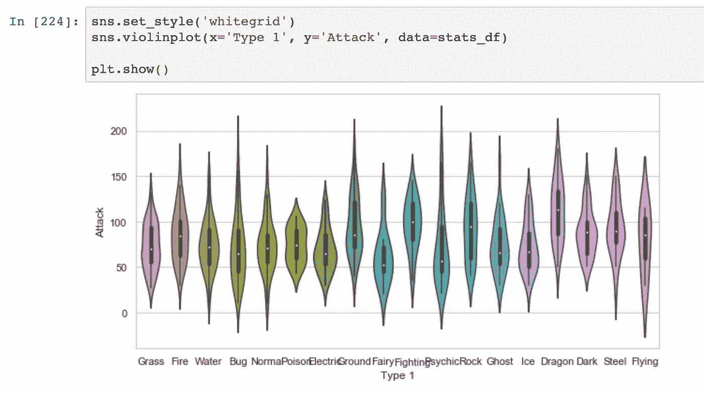
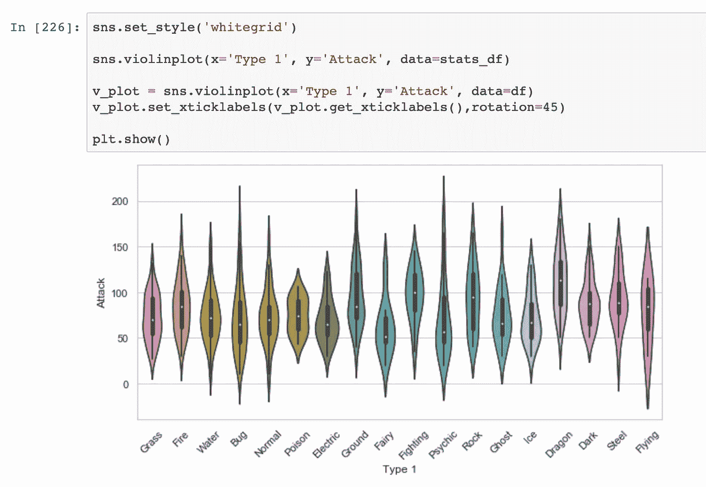

# 🖼航海教程

> 原文：<https://medium.com/analytics-vidhya/seaborn-cheat-sheet-c933f473bf95?source=collection_archive---------4----------------------->

## 第一部分



就像我们使用 Matplotlib 时一样，让我们继续导入必要的库。

```
import pandas as pd
import matplotlib.pyplot as plt
import numpy as np 
%matplotlib inline
import seaborn as sns
```

现在让我们导入一个简单的数据集来使用。这将为我们提供处理更大数据集所需的入门练习。请随意搜索 pokemon.csv 并获取任何 pokemon 数据集或使用该数据集。[口袋妖怪 _ 数据](https://gist.github.com/armgilles/194bcff35001e7eb53a2a8b441e8b2c6#file-pokemon-csv)。

```
df = pd.read_csv(‘pokemon.csv’)
```

这里，我们使用 Pandas 来读取我们的数据集，并将其赋给一个变量 df。您可以随意将 df 更改为您喜欢的任何变量名。这将允许我们在需要查看数据集时调用数据集，并修改数据集以更好地满足我们的需求。

继续运行代码 df.head()。这会让你知道你在做什么。



你可能已经猜到我们正在处理的数据集包含了不同口袋妖怪的战斗统计信息。在之前的课程中，我们仅使用 matplotlib 来生成我们的图。有了 seaborn，你会发现我们能够用更少的代码实现同样的可视化。

让我们首先绘制一个散点图，比较我们口袋妖怪的攻击和防御统计。

```
#Best Practice
sns.lmplot( x=’Attack’ , y=’Defense, data=df, height = **)***set height equal to whatever size you want you plot to be*** 
```



看到我们的 *x 变量*和 *y 变量*被设置为列名，我们希望对每个单独的口袋妖怪进行相互比较。值得注意的是，Seaborn 没有专门的散点图功能，而是我们看到 Seaborn 的拟合和绘制回归线的功能，因此线。不管怎样，我们都可以调整 *lmplot* 函数。

```
fit_reg = False     #in order to remove the regression line
hue = ‘Generation’  #in order to color code the 6 generations
```



如果你注意到我们所有的口袋妖怪的攻击和防御统计从来没有低于 0，但我们的轴限制。让我们继续解决这个问题。

```
plt.ylim(0, None)
plt.xlim(0, None)
```



这是可视化我们数据的一个很好的方式，但是还有很多其他方式来可视化我们的数据集，以便更深入地了解我们所有的战斗统计数据是如何相互比较的。

箱形图用于通过四分位数描绘数据集中的各组。这意味着一个盒状图由 5 个部分组成。

```
- Minimum
- First Quartile or 25%
- Median (Second Quartile) or 50%
- Third Quartile or 75%
- Maximum
```



请注意，我们已经创建了一个箱形图，但是在我们的图中几乎没有我们不需要的东西。Total，Generation 和 Legendary 在这个剧情中都是不需要的，因为它们包含的信息与我们主要关注的战斗统计无关。

我们可以通过创建一个不再包含总计、层代和传奇列的新数据框来实现更好的绘图。这可以通过创建一个新的变量名并将其分配给一个函数来实现，该函数可以删除不需要的列。

```
stats_df = df.drop([‘Total’ , ‘Generation’ , ‘Legendary’],  axis=1)now we have a new data frame names stats_df
```



现在我们可以使用 *stats_df* dataframe 再次绘制箱线图



您可能已经注意到，我们地块的背景总是带有灰色阴影(*暗格)*颜色，但是如果您愿意，这可以改变。让我们继续，改变我们的主题为*白色网格*，并尝试放置一个新的情节。小提琴的情节。

```
sns.set_style(‘whitegrid’)
sns.violinplot(x=’Type 1', y=’Attack’, data=stats_df)
plt.show()
```



你会注意到 x 标题是重叠的。我们可以通过将每个标题旋转 45 度来解决这个问题，以便使它们都可见。

将调用 violin plot 的时刻赋给一个名为 *v_plot 的新变量。*我们现在将针对这个变量调用一个函数，该函数将获取我们的 x 标签，然后将它们旋转 45 度。

```
v_plot = sns.violinplot(x = ’Type 1' , y= ’Attack’ , data = df)
v_plot.set_xticklabels( v_plot.get_xticklabels() , rotation = 45)
```



**Violin plots 在可视化分布方面做得非常好。**

在[第二部](/@mulbahkallen/seaborn-cheat-sheet-357f3186a4c1)中，我们将会再看几个情节，这将会让你对 Seaborn 所提供的多样性有一个很好的把握。