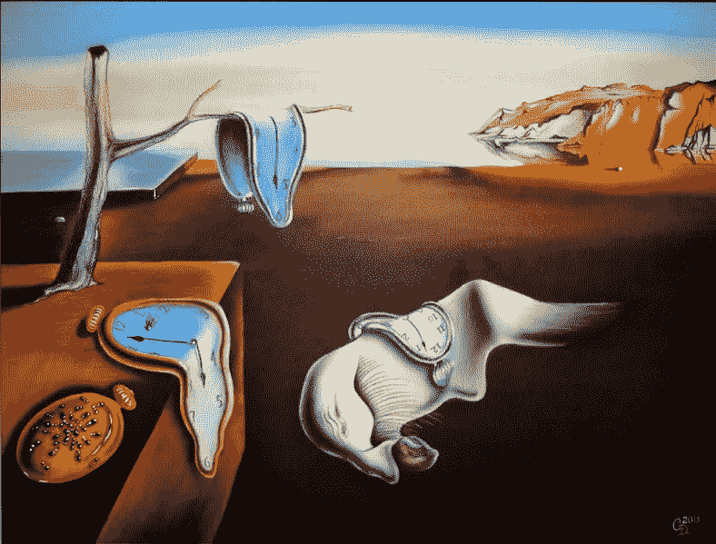
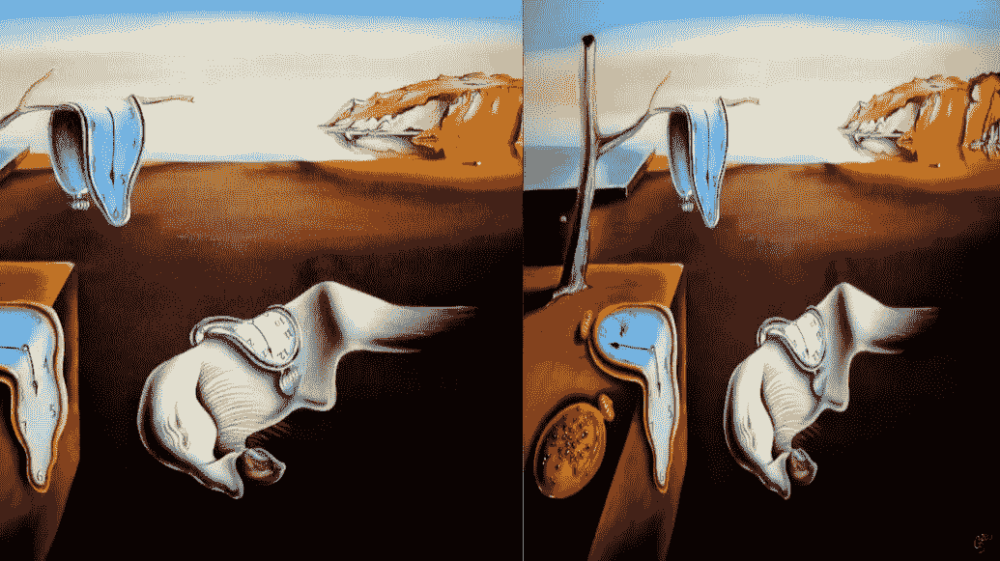
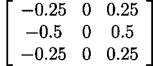
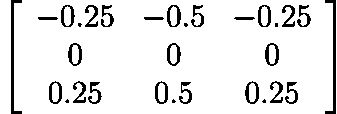
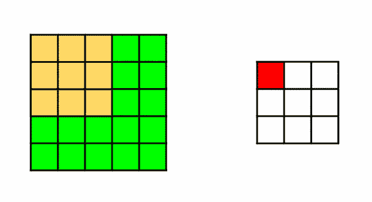
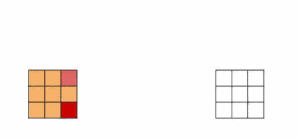
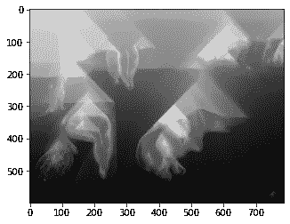
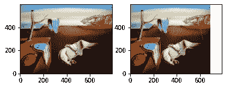

# 一种看似不可能的调整图像大小的方法

> 原文：<https://medium.com/analytics-vidhya/seam-carving-algorithm-a-seemingly-impossible-way-of-resizing-an-image-b3a57469d33e?source=collection_archive---------23----------------------->

# 介绍

在这篇文章中，我们将深入研究一种被称为“缝雕”的有趣算法。它完成了一项看似不可能的任务:在不裁剪或扭曲图像内容的情况下调整图像大小。我们将建立我们的方法，从头开始实现 seam carving 算法，同时看看它背后的一些有趣的数学。

Tad 微积分知识将有助于理解，但不是必需的。让我们开始吧。
*(本文灵感来自麻省理工学院格兰特·桑德森的一次讲座。)*

# 问题是:

让我们来看看这张图片。

这幅画是萨尔瓦多·达利的作品，名为“记忆的延续”。比起艺术价值，我们对这幅画的内容更感兴趣。我们想通过减小图片的宽度来调整图片的大小。我们能想到的两个有效的方法是裁剪图片或挤压宽度。

但是正如我们所看到的，裁剪移除了许多对象，挤压扭曲了图片。我们希望两者兼得，即在减少宽度的同时，不需要裁剪任何对象，也不需要扭曲对象。

正如我们所看到的，除了物体，图片中还有大量的空白。我们想在这里完成的是以某种方式移除物体之间的空白区域，这样在扔掉不必要的空间的同时，图片中有趣的部分仍然保留。

这确实是个棘手的问题，而且很容易迷路。因此，将问题分成更小更容易处理的部分总是一个好主意。我们可以把这个问题分成两部分。

1.  识别图片中感兴趣的部分(即物体)。
2.  识别可以在不扭曲图像的情况下移除的像素路径。

# 识别对象:

在前进之前，我们想把我们的图片转换成灰度。这将有助于我们以后的行动。下面是一个将 RGB 像素转换为灰度值的简单公式。

为了识别对象，我们可以制定一个策略。如果我们能以某种方式识别图片中的所有边缘呢？然后，我们可以要求 seam carving 算法采用不穿过边缘的像素路径，因此，通过扩展，任何由边缘封闭的区域都不会被触及。

但是接下来，我们如何识别边缘呢？我们可以观察到，每当两个相邻像素之间的颜色发生急剧变化时，它很可能是物体的边缘。我们可以将这种颜色的立即变化解释为一个新的物体从该像素开始。

我们要解决的下一个问题是如何识别像素值的急剧变化。现在，让我们考虑一个简单的例子，一行像素。假设我们将这个数组的值表示为 *x* 。

我们可以取像素 *x[i+1]，x[i]* 之间的差。它将显示我们当前的像素与右侧有多大差异。或者我们也可以取 *x[i]* 和 *x[i-1]* 的差，这将在左侧给出变化。为了表示总的变化，我们可能要取两者的平均值，这样得出:

任何熟悉微积分的人都能很快识别出这个表达式就是导数的定义。没错。我们需要计算 *x* 值的急剧变化，因此我们正在计算它的导数。我们可以得到的另一个热切的观察结果是，如果我们定义一个滤波器，比如[*-0.5，0，0.5*，用数组[*x[I-1]，x[i]，x[I+1]*按元素相乘，然后求和，就会得到 x[i]处的导数。由于我们的图片是二维的，我们需要一个二维过滤器。我不会深入细节，但我们的过滤器的 2d 版本看起来像这样，

当我们的过滤器计算每个像素沿 x 轴的导数时，它将给出垂直边缘。类似地，如果我们计算沿 y 轴的导数，我们将得到水平边。它的过滤器如下。(它与转置时 x 轴的滤波器相同。)

这些滤波器也被称为**索贝尔滤波器**。

因此，我们有两个滤波器需要穿过图像。对于每个像素，与其周围的(3×3)个子矩阵进行逐元素乘法，然后取其和。这种运算称为卷积。

# 卷积:

数学上，卷积运算被定义为，

看看我们如何做两个函数的逐点乘法，然后进行积分。在数值上，它将对应于我们之前所做的，即滤波器和图像的逐元素乘法，然后对其求和。

注意，对于 *k* 函数，它是如何写成 *k(t-τ)* 的。因为对于卷积运算，其中一个信号需要翻转。你可以直观地想象成这样。想象两列火车，在一条笔直的水平轨道上，朝着彼此运行，不可避免地会发生碰撞(不要担心火车不会发生任何事情，因为叠加)。所以火车的车头会相对。现在想象你正在从左到右扫描音轨。然后对于左边的火车，你将从后面扫描到前面。

同样，计算机需要从右下角(2，2)到左上角(0，0)读取我们的过滤器，而不是从左上角到右下角。所以实际的索贝尔滤波器如下，

在卷积运算之前我们对其进行 180 度旋转。

我们可以继续写一个简单的**朴素的**实现来做卷积运算。大概是这样的，

这可以很好地工作，但是执行起来会耗费大量的时间，因为它要进行将近 9*r*c 的乘法和加法运算才能得到结果。但是我们可以聪明地使用更多的数学概念来大大降低时间复杂度。

# 快速卷积:

卷积有一个有趣的性质。时域中的卷积对应于频域上的乘法。即

，其中 *F(w)* 表示频域中的函数。

我们知道傅立叶变换将信号从时域转换到频域。我们可以做的是，计算图像和滤波器的傅里叶变换，将它们相乘，然后进行傅里叶逆变换，得到卷积结果。为此，我们可以使用 NumPy 库。

*(注意:在某些情况下，值可能与 naive 方法略有不同，因为 fastConvolve 函数计算循环卷积。但在实践中，我们可以轻松地使用快速卷积，而不用担心这些微小的数值差异。)*

酷！现在我们有一个有效的方法来计算水平边和垂直边，即 x 和 y 分量。因此，使用以下公式计算图像中的边缘:

太棒了。我们完成了第一部分。边缘是图片中有趣的部分，黑色部分是我们可以不用担心就可以删除的部分。

# 识别像素路径:

对于连续路径，我们可以定义一个规则，即每个像素只连接到它下面最近的 3 个像素。这是为了从上到下有一个连续的像素路径。所以我们的子问题变成了一个基本的寻路问题，我们必须最小化成本。由于边缘具有较高的量级，如果我们继续以最低成本移除像素路径，将会避开边缘。

让我们定义一个函数" *cost"* ，它取一个像素并计算从那里到图片末端的最小成本像素路径。我们有以下观察结果，

1.  在最底排(即 i=r-1)

2.对于任何中间像素，

我们可以在图中看到三角形。它们表示没有返回的点，也就是说，如果你到达那个像素，没有不通过边缘的路径到达底部。这是我们努力避免的。

从成本矩阵中找到像素路径可以很容易地用贪婪算法来完成。找到顶行上最小成本的像素，然后向下移动，在所有与之相连的像素中选择成本最低的像素。

为了移除由路径定义的接缝，我们只需遍历每一行并删除路径数组提到的列。

就这样了。在这里，我预先计算了 100 个缝雕刻操作。

我们可以看到照片中的物体是如何相互靠近的。我们已经成功地使用线缝雕刻算法减小了图像的尺寸，而没有对物体造成任何扭曲。我已经附上了完整的代码笔记本的链接。感兴趣的读者可以在这里看一下[。](https://github.com/Samarendra109/Seam-Carving.git)

总的来说，缝雕是一个有趣的算法。它有它的警告，因为它会失败，如果提供的图像有太多的细节或太多的边缘。使用算法修改不同的图片，看看最终的结果是什么，这总是很有趣的。如果你有任何疑问或建议，请在回复中留下。谢谢你一直读到最后。

**相关文章:**

*原载于 2020 年 9 月 15 日***。**