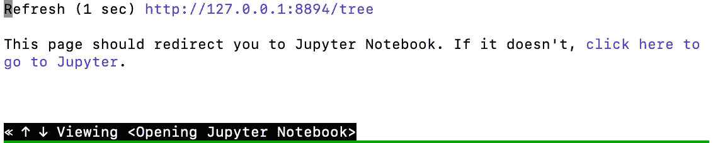

# 无缝连接到服务器上的 Jupyter

> 原文：<https://medium.com/analytics-vidhya/seamless-connection-to-jupyter-on-the-server-c08d6431e5ef?source=collection_archive---------11----------------------->

在服务器上远程运行 Jupyter 笔记本是必须的。笔记本电脑将直接访问存储在服务器上的数据，并将利用服务器上的计算能力(多核/GPU/内存),这是我的笔记本电脑所没有的。虽然我有一台相当旧的高端 MacBook Pro，但我将它用作 Chromebook，提供浏览器和终端，而无需从服务器来回复制数千兆字节的数据。

1.  运行你的笔记本下一个 [*tmux*](https://en.wikipedia.org/wiki/Tmux) 或 [*屏幕*](https://en.wikipedia.org/wiki/GNU_Screen) 会话*。*

这是为了确保您的笔记本保持运行，即使您从 ssh 会话中退出。例如，让我们创建一个名为 Jupiter 的 tmux 会话:

```
tmux new -s jupyter
jupyter notebook #will run on the jupyter session#to reconnect to the tmux session after disconnected 
tmux a -t jupyter
```

2.通过 ssh 隧道连接到笔记本。

Jupyter 笔记本运行后，您通常会看到以下内容:



服务器上由 Jupyter notebook 启动的基于文本的 web 浏览器

它是一个基于文本的网络浏览器，就像 Chrome 或 Firefox 一样，当你在本地运行它时，你的笔记本上有 Jupyter notebook 链接。在我的例子中，我的浏览器是 [*w3m*](https://en.wikipedia.org/wiki/W3m) *，我*将按 q 然后 y(是)退出浏览器，这将引导我到 Jupyter 笔记本正在使用的**令牌**和**端口**。

```
[http://localhost:8888/?token=23d4c452ce953e1c041f8cd1f94e64bae9cd4917fc9dc89c](http://localhost:8888/?token=23d4c452ce953e1c041f8cd1f94e64bae9cd4917fc9dc89c)
```

默认情况下，Jupyter notebook 允许您使用令牌连接到本地主机，这为您宝贵的代码和数据提供了必要的保护。想想看:使用默认设置的 Jupyter 笔记本电脑意味着你几乎可以完全访问笔记本电脑上运行的数据，这听起来很可怕，所以基本保护很重要。

这为我们通过 ssh 隧道进行连接制造了一个小障碍:假设您的笔记本运行在 my.server.com 上，监听 localhost:8888。

```
# ssh -L local_port:localhost:remote_port my.server.com
ssh -L 8888:localhost:8888 username@my.server.com
```

建立 ssh 连接后，现在可以打开一个新的浏览器选项卡，并复制 http://localhost:8888/？token=…放进去连接笔记本。这里你想根据你的需要调整本地端口和远程端口。Remote_port 必须与 Jupyter 笔记本启动时报告的**端口**相匹配。

3.使用无密码登录节省一些输入。

只有一个问题，每次你的 ssh 隧道会话被终止，你必须重新连接。您可以使用无密码登录设置来节省一些输入，因此您不需要输入密码:

`ssh-keygen -f laptop_to_server -t ed25519`
`scp ~/.ssh/laptop_to_server.pub username@my.server.com:~/.ssh/`

现在对服务器进行 ssh:

```
ssh username@my.server.com #you will be using password 
# run this on your server
cd .ssh
cat laptop_to_server.pub **>>** authorized_keys
rm laptop_to_server.pub
chmod 600 authorized_keys #access only by you.
exit
```

在笔记本电脑上完成配置

```
# test it out
ssh -i .ssh/laptop_to_server username@my.server.com# make it permanant 
# add these into the .ssh/config
Host my.server.com
  User username
  IdentityFile ~/.ssh/laptop_to_server
```

4.与 autossh 无缝连接

在 Mac 或 Linux 系统上，您可以使用 autossh 来处理 ssh 隧道，当 ssh 会话断开时，它会尝试重新连接。

```
brew install autossh#ssh -L 8888:localhost:8888 username@my.server.com can be convert to an autossh command like this:autossh -M 0 -f -T -N -L 8888:localhost:8888 username@my.server.com
```

您甚至可以进一步将 autossh 命令保存到一个文件中，并在每次笔记本电脑重新启动时重新加载它。在我的例子中，一个 autossh 命令可以处理几天甚至几周的时间。我不想输入 ssh 隧道命令，我所做的只是在浏览器上指向正确的地址: [http://localhost:8888](http://localhost:8888) 并且我正在服务器上使用 Jupyter 笔记本。

最后，希望这能让你在家工作更有效率。在冠状病毒危机下保持安全和健康，3/20/2020。

# 2021 年 1 月 19 日更新:

## 阅读我最[更新的解决方案](https://jiashun-zheng.medium.com/tunnel-through-multiple-gateways-through-ssh-3665bf5165c9?sk=c85d7e69ed5285df51e93fc1bb4dfc38)。