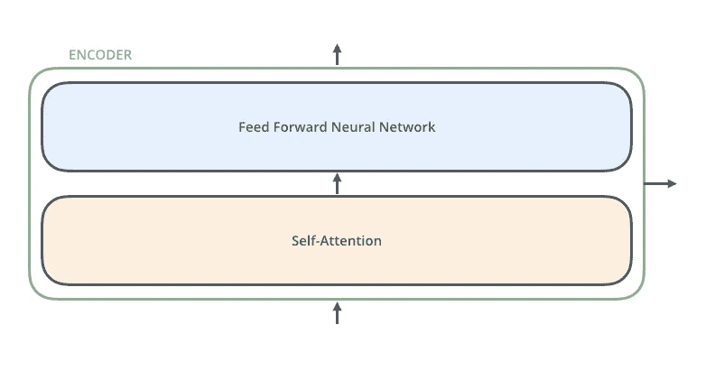
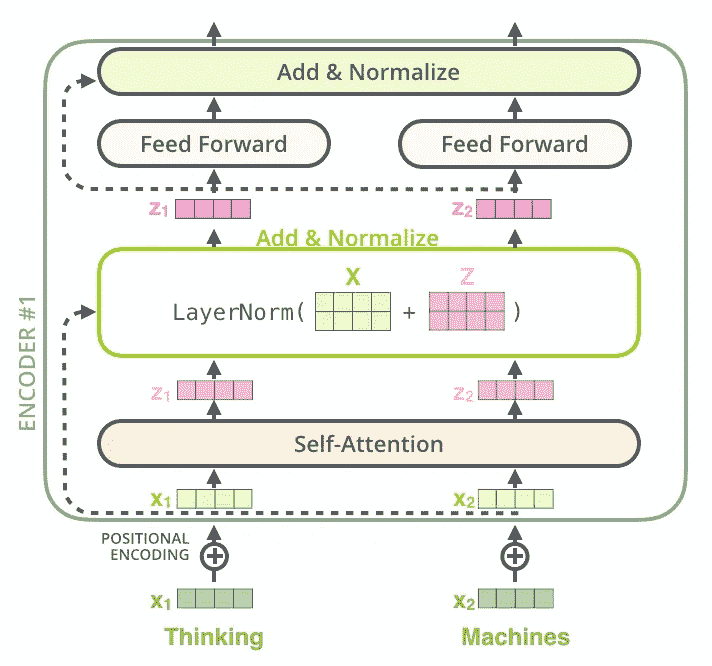

# 基于 StackOverflow 问题的搜索引擎

> 原文：<https://medium.com/analytics-vidhya/search-engine-based-on-stackoverflow-questions-2151307c283f?source=collection_archive---------10----------------------->

# 目录:

1.  *业务问题*
2.  *机器学习问题*
3.  *探索性数据分析*
4.  *机器学习模型:(BERT，DOC2VEC，WORD2VEC)*
5.  *未来工作*
6.  在 aws 上部署

# 1.商业问题

**1.1 描述**

Stack Overflow 是最大、最值得信赖的在线社区，供开发人员学习、分享他们的编程知识和发展他们的职业生涯。堆栈溢出是每个程序员都会以某种方式使用的东西。每个月都有超过 5000 万的开发人员来到 Stack Overflow 学习、分享他们的知识，并建立他们的职业生涯。它的特点是在计算机编程中广泛的问题和答案。该网站为用户提供了一个提问和回答问题的平台，并通过会员资格和积极参与，对问题和答案进行投票表决，并以类似于 wiki 或 Digg 的方式编辑问题和答案。截至 2014 年 4 月，Stack Overflow 拥有超过 4，000，000 个注册用户，到 2015 年 8 月底，其问题数量超过 10，000，000 个。根据问题的标签类型，网站上讨论最多的八个主题是:Java、JavaScript、C#、PHP、Android、jQuery、Python 和 HTML。

**问题陈述**

构建一个基于 StackOverflow 问题的搜索引擎，搜索结果应该包含语义。

**1.2 来源/有用链接**

数据来源:[https://archive.org/details/stackexchange](https://archive.org/details/stackexchange)
YouTube:[https://youtu.be/nNDqbUhtIRg](https://youtu.be/nNDqbUhtIRg)
研究论文:word 2 vec[https://arxiv.org/abs/1301.3781](https://arxiv.org/abs/1301.3781)
研究论文:doc 2 vec[https://arxiv.org/abs/1405.4053](https://arxiv.org/abs/1405.4053)
研究论文:BERT[https://arxiv.org/abs/1810.04805](https://arxiv.org/abs/1810.04805)
研究论文:通用语句编码器[https://arxiv.org/abs/1803.11175](https://arxiv.org/abs/1803.11175)
word 2 vec 博客:[https://Blog . acolyer . org/2016/016](https://blog.acolyer.org/2016/04/21/the-amazing-power-of-word-vectors/)

## 1.3 现实世界/业务目标和约束

1.  搜索结果应该包括语义。
2.  考虑可伸缩的架构，尽量减少返回结果的时间。

# 2.机器学习问题

# 2.1 数据

所有的数据都在一个 zip 文件中:stackoverflow.com-Posts.7z
在这个 zip 文件中有一个 XML 文件:Posts.xml

```
**Posts.xml** contains 16 columns: Id,PostTypeId,AcceptedAnswerId,CreationDate,Score,ViewCount,Body,OwnerUserId,LastEditorUserId,LastEditDate,LastActivityDate,Title,Tags,AnswerCount,CommentCoun,FavoriteCount **Size of Posts.xml** - 14.6GB**Number of rows in Posts.xml** = 3 Million records
```

**注意:**由于资源和时间有限，我们没有将全部数据用于本案例研究

```
**the dataframe that we are using has 3 columns: ** Id,title, Body**Number of rows in dataframe** = 112357
```

->这些问题是随机的，包含一些冗长的文本网站以及与数学和编程相关的网站。每个站点的问题数量可能会有所不同，并且没有对问题进行过滤(如封闭式问题)。

**数据字段解释**

数据集包含 112357 行。表中的列是:

```
**Id** - Unique identifier for each question**Title** - The question's title**Body** - The body of the question
```

id = " 1 "
PostTypeId = " 1 "
accepted answerid = " 3 "
creation date = " 2016–08–02t 15:39:14.947 "
Score = " 8 "
view count = " 436 "
Body = "<p>“back prop”是什么意思？“反向传播”一词与“反向传播”基本相同还是有不同的含义？</p>"
OwnerUserId = " 8 "
LastEditorUserId = " 2444 "
LastEditDate = " 2019–11–16t 17:56:22.093 "
lastectivitydate = " 2019–11–16t 17:56:22.093 "
Title = "什么是" backprop "？"
Tags=" <神经网络> <反向传播> <术语> <定义>"
answer count = " 3 "
comment count = " 0 "
favorite count = " 1 "

id:“2214”

标题:

```
"When will the AI can replace developer or tester"
```

正文:

```
"<p>Now AI can replace call center, worker(in the factory) and going to replace court. When will the AI can replace developer or tester?</p><p>I want to know how long can AI replace developer. e.g. next 10 years because...</p>
"
```

# 2.2 将现实世界的问题映射到机器学习问题

```
It is basically finding semantic similarity between documents.Here, the terminology “document” could refer to a web-page, a word document, a paragraph of text, an essay, a sentence, or even just a single word. Two semantically similar documents, will contain many of the same topics while two semantically different documents will not have many topics in common.  Machine learning methods are described which can take as input large collections of documents and use those documents to automatically learn semantic similarity relations.
```

**余弦相似度**:余弦相似度通过测量两个向量之间的夹角余弦来计算相似度。计算方法如下


链接:[https://en.wikipedia.org/wiki/Cosine_similarity](https://en.wikipedia.org/wiki/Cosine_similarity)

# 3.探索性数据分析

# 3.1.1 下载数据并提取 zip 文件

我正在使用“cliget”扩展，通过我的 google-colab 中的命令行从“archive.org”中获取数据。

之后，我使用名为 **patoolib 的 python 库提取 zip 文件。**

现在我们已经提取了文件，在 zip 文件中有一个 XML 文件:“Posts.xml”，我们将解析该文件并从中提取所需的数据。

为此，我们将遍历 XML 文件中的每一行，示例行如上面的 2.1.2.1 部分所示。

我们将检查' postTypeId' ==1 是否表示问题帖子，而' postTypeId' == 2 是否表示回答帖子，我们只需要问题，因此我们将过滤它。我们将从该行中提取**标题**和**正文**。

之后，我们将把这些数据复制到标题和正文列下的数据框中。并将此另存为。csv 文件供进一步使用。

# 3.2 数据清理

在本案例研究中，我们将使用 **112357 个数据点。**

# 3.2.1 查找重复行并删除它们

现在，如果有任何重复的行，我们将使用代码删除它们。

这将删除重复项，并保留重复行的第一个匹配项。

这里 df 是包含我们数据的数据帧的名称。

# 3.2.2 检查是否有空值行

问题最小长度:20
问题最大长度:34183

# 3.2.4 最常用的单词

我们将为数据集中出现的最常见的单词绘制**单词云**，为此，我们将首先从语料库中删除停用词(出现频率太高的单词，例如:- is，an，the，a)，然后打印单词云。


问题的词云

# 3.3 问题的清理和预处理

# 预处理

预处理基本上就是清理输入语料。预处理的主要目的是去除冗余数据，使数据适合机器学习模型。包括的主要步骤有:

**1。从正文中分离出代码片段:**

在我们的输入句子中，文本还包含目前不需要的代码，代码部分在 `….`标记之间，我们将使用 python 中的正则表达式库删除它。

**2。删除问题标题和描述中的特殊字符(不在代码中):**

我们将删除所有的特殊字符和数字，只保留单词。

**3。删除停用词(除了‘C’):**

我们将删除所有的停用词(停用词是那些经常出现的词，如:is，am，the，there..等等)。我们将保留单词 c，因为它是一种编程语言。

**4。移除 HTML 标签**

在这一节中，我们将从数据中删除所有的 HTML 组件。

在上面的函数中，我们使用 **beautifulsoup** 库来移除解析数据，使用两个解析器(lxml 和 html5)，lxml 将搜索 xml 标签，html5lib 将搜索 html 标签。

`soup.get_text()`会给我们干净的文字。

之后，我们替换掉所有在`<>`箭头内的单词，删除新的行字符和`div`单词。

**5。将所有字符转换成小写字母:**

在这种情况下，我们将把我们的文本转换成小写，以消除冗余。例如:纽约→纽约，I → i，等等。

**6。使用 SnowballStemmer 来阻止单词:**

词干提取主要用于通过从单词中移除词干来获得词根。比如:“喜欢”、“被喜欢”、“可能”、“喜欢”会转换成“喜欢”。SnowballStemmer 出现在“nltk”库中，这是一个用于执行自然语言处理任务的流行库。

现在我们将所有的步骤放在一个函数中:

所以在上面的代码片段中，我们基本上实现了我在上面 6 个步骤中所说的。

首先，我们删除代码，然后删除 HTML 标签，然后我们合并标题和正文列，然后降低字母表，然后对它们进行词干处理。

# 3.3.2 预处理后的样本输出:

**输入:**
< p >我有一个绝对定位的<代码> div < /code >包含几个孩子，其中一个是相对定位的<代码> div < /code >。当我在 child<code>div</code>上使用一个< code >基于百分比的 width < /code >时，它在 IE7 上折叠为<code>0 width</code>，但在 Firefox 或 Safari 上不会。< /p >

如果我用`pixel width`，它就能工作。如果父级相对定位，则子级上的百分比宽度有效。

**清除输出:**

'''百分比宽度子元素绝对位置父 internet explor 绝对位置包含多个子元素一个相对位置使用子元素 collaps ie firefox safari 使用工作父元素相对位置百分比宽度子元素工作时容易出错，请修复 besid 子区域 css 指定封面'''

# 3.3.3 将预处理后的数据转换为数据帧并存储为 csv 格式:

现在我们有了预处理的数据，我们将把它存储在一个 csv 中，以便进一步直接使用。

# 4.机器学习模型

机器学习模型将向量(数字数组)作为输入。在处理文本时，我们必须做的第一件事是在将文本输入模型之前，想出一个策略来将字符串转换成数字(或“矢量化”文本)。

我们的模型将试图解决的任务是向量-向量相似性，每个模型将预测向量，我们将把查询语句作为向量(不同模型的不同大小/维度)传递，并计算它们之间的余弦相似性，以找到最相关/相似的答案。

单词向量是告诉模型关于特定单词以及它如何与句子中的其他单词相关的向量/数组，它们是单词/句子的向量表示。有许多方法可以将单词编码成向量，例如:单词包(这可以通过给每个单词分配一个唯一的数字来实现。那么我们看到的任何文档都可以被编码为一个固定长度的向量，其长度为已知单词的词汇表的长度。向量中每个位置的值可以用编码文档中每个单词的计数或频率来填充。)、tfidf(词频-逆文档频)等。但是这些方法不能捕捉句子的语义，因为它们简单并且没有考虑单词的顺序。

在我们的方法中，我们将使用包含语义的单词/句子嵌入。语义意味着它可以学习关系，例如:女王-国王，男人-女人会更近，动词和时态如 walking-walked，swimming-swam 也会彼此靠近，因为它们在语义上非常相似。这些向量是固定大小的，维度越多，这些词向量/嵌入的信息就越丰富。

**注:**

**对于我们所有模型，我们将通过单个查询语句“什么是面向对象编程中的超类？”来判断它们的性能。**

# 4.1 将数据分为测试和训练

我们将把数据分成训练和测试，用于我们的机器学习模型。

我们将使用'**sk learn**' train _ test _ split '来拆分我们的数据，测试规模为 0.05%。

# 4.2 模型 1 : BERT(来自变压器的双向编码器表示):

BERT(来自转换器的双向编码器表示)通过使用具有转换器架构的深度、预训练的神经网络，为自然语言提供密集的矢量表示。它最初是由

*   雅各布·德夫林(Jacob Devlin)，张明蔚(Ming-Wei Chang)，肯顿·李(Kenton Lee)，克里斯蒂娜·图坦诺娃:[《伯特:语言理解的深度双向变形金刚前期训练》](https://arxiv.org/abs/1810.04805)，2018。

TF Hub 模型使用来自 GitHub 上 TensorFlow 模型库的 BERT 实现，该库位于[tensor flow/Models/official/NLP/BERT](https://github.com/tensorflow/models/tree/master/official/nlp/bert)。它使用 L=12 个隐藏层(即变压器块)，隐藏大小 H=768，A=12 个注意头。

该模型已经在维基百科和图书语料库上使用 GitHub 上发布的代码进行了英语预训练。输入是“不区分大小写”的，这意味着在标记成单词块之前，文本是小写的，所有的重音标记都被去掉了。为了训练，随机输入屏蔽已经被独立地应用于单词片段(如在最初的 BERT 论文中)。

在本次作业中，我们将使用 TensorFlow 的 BERT:

[https://tfhub . dev/tensor flow/Bert _ en _ un cased _ L-12 _ H-768 _ A-12/1](https://tfhub.dev/tensorflow/bert_en_uncased_L-12_H-768_A-12/1)

BERT 基本上是变压器模型的一部分。转换器是一个编码器-解码器模型。在 BERT 中，我们使用转换器的编码器部分。

对于这个任务，我们使用 BERT base，它有 12 个相同的编码器相互堆叠在一起。让我们看看每个编码器单元里面都有什么。



单编码器单元

我们可以看到，这个编码器单元内部有两个部分

首先，前馈神经网络与 512 层/单元完全连接。这由两个线性转换组成，中间有一个 ReLU 激活。

**FFN(x)= max(0；xW1 + b1)W2 + b2 (2)**

虽然不同位置的线性变换是相同的，但是它们在层与层之间使用不同的参数。另一种描述方式是两个内核大小为 1 的卷积。输入和输出的维数为 d = 512，内层的维数为 d' = 2048。

第二个是自我注意层，它在注意重要的单词和帮助模型更好地理解上下文方面起着重要的作用

**’**`**The animal didn't cross the street because it was too tired'**`

这里的**它**指的是什么？动物还是街道？

对我们人类来说，把这与动物联系起来是很简单的，但要让模型理解这一点，它必须实现这种自我关注，这将允许把它与动物联系起来。

所以现在让我们进入自我关注部分:


注意第一步

计算自我注意力的第一步**是从编码器的每个输入向量中创建三个向量(在这种情况下，每个单词的预训练嵌入)。因此，对于每个单词，我们创建一个查询向量、一个键向量和一个值向量。这些向量是通过将嵌入乘以我们在训练过程中训练的这三个矩阵而创建的。**

这些向量的大小是固定的，如在原始论文中所采用的。


看上面的图片，我们已经输入了**思维机器。**

让我们考虑第一个词“思考”。首先，这个输入将被转换成固定长度的嵌入。之后，我们生成如上所述的三个向量。之后，我们将通过将查询向量与所有关键向量(之前或之后的句子中的所有关键向量)相乘来计算分数，之后，每次相乘的结果除以关键向量的维数的平方根，在我们的情况下，关键向量的维数是 8，因为关键向量的维数是 64。之后，我们会将这些数字的输出传递给一个 softmax 函数，以生成/压缩一个介于 0-1 之间的分数。然后将这些值(softmax 的结果)乘以“值向量”,最后将它们相加，得到每个单词的 z1 向量。

类似地，我们将为句子中的所有单词计算这个 z1。

本文通过添加多个注意力头来进一步完善该模型，以扩展该模型的表示能力，在我们的情况下，我们使用 12 个注意力头，因此每个单词将有 12 个键、值、查询矩阵。

前馈层并不期望有八个矩阵，而是期望有一个矩阵(每个单词一个向量)。所以我们需要一种方法把这 12 个压缩成一个矩阵。

因此，我们将它们连接起来，并与另一个权重矩阵相乘，以获得单个矩阵作为输出。

所以总结会是这样的。


注意摘要

由于我们的模型不包含递归和卷积，为了让模型利用序列的顺序，我们必须注入一些关于序列中记号的相对或绝对位置的信息。为此，我们将“位置编码”添加到编码器底部的输入嵌入中。

模型的输入不仅是嵌入，而且是两个矩阵的和，其中一个是嵌入，另一个是位置嵌入，这是为了让模型了解单词的顺序，我们添加了位置编码向量，其值遵循特定的模式。

我们在两个子层的每一个周围使用剩余连接，然后进行层归一化。即每个子层的输出是
LayerNorm(x + Sublayer(x))，其中 Sublayer(x)是子层本身实现的函数。为了促进这些剩余连接，模型中的所有子层以及嵌入层产生维度= 512 的输出。下图显示了单个编码器模块的全部工作情况。



如果你想了解更多关于 transformer 和 BERT 的知识，请参考这些优秀的博客(我所做的解释仅来自这些博客) :

1.  [http://jalammar.github.io/illustrated-bert/](http://jalammar.github.io/illustrated-bert/)
2.  [http://jalammar.github.io/illustrated-transformer/](http://jalammar.github.io/illustrated-transformer/)

现在我们已经了解了 BERT 的所有知识，让我们来实现它。

# 加载模型

在上面这段代码中，我们已经准备好了模型，它将接受 3 个输入

1.  input_word_ids:-它们是以固定且唯一的标记编码的输入句子，对于输入语料库中的每个单词，都有一个与之相关联的整数/标记。如果一个句子超过了 200 个单词/标记的限制，则保留前 200 个标记，其余的被裁剪，如果一个句子的单词少于 200 个，则我们使用填充，添加零，直到其长度成为定义的最大序列长度(在我们的例子中为 200)。我们在每个句子的开头加上[CLS]标记，在每个句子的结尾加上[SEP]标记。
2.  input_mask:-此输入告诉模型在 input_word_ids 中有多少实/填充标记，对于 input_word_ids 中的实标记，它编码为 1，否则编码为 0。
3.  segment_ids:当您求解问题回答数据集，并将问题和答案一起传递给模型时，此选项非常有用。在这种情况下，您将为问题标记编写全零代码，为回答标记编写全一代码，但是在我们的示例中，只有一个句子，因此我们将使它们全为零。

**注意:-** 所有这些数组都是固定长度的，它们的大小与 max_seq_length 相同。

输入标记、输入掩码、输入段的代码:-

现在对于输出来说，有两个输出:形状为`[batch_size, 768]`的`pooled_output`，表示整个输入序列。它是我们在每句话首添加的“[CLS]”标记的输出。

形状为`[batch_size, max_seq_length, 768]`的`sequence_output`具有每个输入标记的表示(在上下文中)。对于我们的案例研究，我们将使用合并输出，因为它为我们提供了 768 维向量中整个句子的向量表示。

这个 BERT 模型是预先训练的，所以我们不需要训练它，我们将通过使用 model.predict 将句子标记、句子掩码、句子片段传递给模型来直接预测句子的向量表示。

# 4.2.4 查找最相似的文档

在我们得到每个单词的 768 向量表示之后，我们将它与查询单词进行比较，并返回最常见的句子，如下所示。

在上面的代码中，我们首先用零初始化所有三个数组，然后通过调用上面显示的“tok”函数来填充值，以获得令牌、掩码和段。之后，我们将把它传递给 BERT 模型，以预测查询词的输出。之后，我们将计算预测数组和我们语料库中所有数组之间的余弦相似度。我们将返回前 5 或 10 个结果作为字符串列表。

# ***前 5 名成绩:***

**预测 1:**OpenGL ES 中的自定义视图过渡我正在尝试创建一个自定义过渡，作为您将在这里获得的默认过渡的替换，例如:我准备了一个基于 OpenGL 的视图，它对映射到平面的一些静态纹理执行效果。

**预测 2 :** 动态联系信息数据/设计模式:这是否可行？我目前正在开发一个网络商务应用程序，它有很多实体(人，组织)和大量的联系信息。多个邮政地址，电子邮件地址，电话号码等。目前，数据库模式是这样的，persons 表有|

**预测 3:** 如果我想在 Silverlight 中将一个集合绑定到某种形式的列表控件，可以使用 Silverlight 进行数据绑定。唯一的方法是使集合中的基础对象实现 INotifyPropertyChanged 并使集合成为 Observablecollection 吗？如果我使用了某种|

预测 4 : SharePoint 默认样式我正在为 SharePoint 构建一个自定义 web 部件，并且我正在尝试使用默认样式，这样当人们对站点应用主题时，站点也会随之应用主题。我已经找到了几个不错的展示不同风格的网站，比如:[http://www . SharePoint customization . com/resources/tips tricks/WSS _ CSS guide . htm](”http://www.sharepointcustomization.com/resources/tipstricks/wss_cssguide.htm")

但是我正在寻找|

**prediction5:** 将 void 传递给一个泛型类我正在尝试创建一个表单，它将在处理一个特定的任务(作为委托传递给构造函数)时激活一些东西。它工作得很好，但是我遇到的问题是，如果特定的方法|,我不能实例化我的泛型类的副本

# 4.3 型号 2 : DOC2VEC 型号

对于本案例研究，我们将使用 genism 的 Doc2Vec 模型，该模型与我们将在下一节讨论的 Word2Vec 模型非常相似。实际上 Doc2Vec 模型是对 Word2Vec 模型的扩展。


doc2vec 架构

该框架类似于 word2vec 部分中所示的 CBOW 架构，唯一的变化是通过矩阵 d 映射到向量的附加段落标记。在该模型中，该向量与三个词的上下文的串联或平均用于预测第四个词。段落向量表示当前上下文中缺失的信息，并且可以充当段落主题的记忆。

段落标记可以被认为是另一个单词。它作为一种记忆，记住当前上下文或段落主题中缺少的内容。基于这个原因，我们通常称这个模型为段落向量的分布式记忆模型(PV-DM)。上下文是固定长度的，从段落上的滑动窗口中采样。段落向量在从同一段落生成的所有上下文之间共享，但不在段落之间共享。然而，单词向量矩阵 W 是跨段落共享的。即，对于所有段落来说,“有力”的向量是相同的。

PV-DM 与 CBOW 算法相同，在 word2vec 部分有详细提及。

矩阵 D 具有“看到的”段落(即任意长度的文档)的嵌入，与 Word2Vec 模型学习单词嵌入的方式相同。对于看不见的段落，模型再次通过梯度下降(大约 5 次迭代)来推断文档向量。

# 4.3.1 句子预处理:

该模型的第一步是使数据适合 genims Doc2Vec 实现，该模型将字符串和唯一标签的标记列表作为输入。

因此，这里的标记是单个文档中的单词，而标记只是该文档在语料库中的索引号。

上述函数为我们准备了如下数据:

它有两个参数:第一个是 DataFrame 的列，第二个是 tokens_only，默认为 False。tokens_only 用于测试数据只产生令牌而不是标签。

首先，该函数将遍历语料库中的每一行并生成标记。为此，我们将使用 genism 的“simple_preprocess”函数，该函数首先将一个文档转换成一个令牌列表。

其次，现在我们有了令牌列表，所以如果 tokens_only ==True，它将只返回 simple_preprocess/ tokens 的输出。

否则，我们将标记每个文档，为此我们将使用`gensim.models.doc2vec.TaggedDocument()`函数，该函数将令牌和唯一标记作为输入，并将标记的文档作为输出返回。对我们来说，标记不过是行号，所以我们将把它们和标记一起传递，以获得带标记的文档。

对于训练数据，我们需要标签，对于测试，我们只需要令牌列表作为预测输入，这就是为什么我们使用两个条件。

现在我们已经准备好了数据，我们将如下初始化模型。

在 genism 中定义一个模型只需要一行代码。

现在，让我们了解每个参数。

*   **vector_size :-** 特征向量的维度。
*   **dm :-** 定义训练算法。如果 dm=1 表示‘分布式内存’(PV-DM)，dm =0 表示‘分布式单词包’(PV-DBOW)。分布式内存模型保留文档中的单词顺序，而分布式单词包仅使用单词包方法，不保留任何单词顺序。
*   **α:-**初始学习率。
*   **min_alpha :-** 随着训练的进行，学习率将线性下降至 min_alpha。
*   **min_count :-** 忽略总频率低于此的所有单词。
*   **时期:-** 语料库上的迭代次数(时期)。
*   **工作线程:-** 使用这些工作线程来训练模型。-1 表示使用所有可用的核心。

# 4.3.3 建立词汇:

既然我们已经初始化了模型，我们将通过以下方式构建训练语料库中所有单词的词汇表

本质上，词汇表是一个字典(可通过`model.wv.vocab`访问),包含从训练语料库中提取的所有唯一单词以及计数(例如，`model.wv.vocab['penalty'].count`代表单词`penalty`的计数)。

# 4.3.4 训练模型:

现在我们将训练我们的模型。

我们将训练 50 个纪元的模型。

# 4.3.1 寻找最相似的文档:

现在我们将通过提供一个查询词来找到最相似的文档。

所以在上面这段代码中，我们首先预处理我们的查询语句，然后通过从我们的训练向量预测它来将其转换为向量。通过 model.infer_vector()方法。

现在我们有了向量格式的句子，我们将从训练语料库中找到最相似的向量。为了计算向量之间的距离/相似性，genism 默认计算余弦相似性作为距离度量。

这将向我们返回元组列表，其中第一个值是文档的索引，第二个值是查询和首先提供索引的文档之间的余弦相似性。

# 4.3.5 在漂亮的表格中显示结果:

以下是排名前五的结果:

1.  你公司的软件开发到底是什么样的(方法、工具等等)？自从大约两年前我作为一名专业软件开发人员开始我的第一份工作以来，我已经阅读了许多关于普遍接受的方法(例如 Scrum、XP)、技术(例如 EJB、Spring)、技术(例如 TDD、代码评审)、工具(bug 跟踪、wikis)的文章
2.  在一系列类似的问题中，你见过的最好的 AWK 推荐信是什么？如果真的没有(我还没有找到圣杯)，也许我们可以在一个单独的问题中编译一个。，**余弦 _ 相似度:0.7201393246650696**
3.  当两者都使用键盘快捷键时控制失去焦点事件。NET Winforms 和 Windows Presentation Foundation，如果我有一个用户刚刚输入文本的文本框和一个按钮，如果用户单击该按钮，则“LostFocus”事件会在按钮单击事件触发之前触发。然而如果。，**余弦 _ 相似度:0.7175560593605042**
4.  最佳免费 Java。班级查看器？我使用过[http://members.fortunecity.com/neshkov/dj.html](”<a)" rel = " nore Ferrer ">DJ Java 反编译器< /a >，它有一个方便的 GUI，但似乎最新版本只是一个试用版，并强迫你在一段时间后购买该软件(我记得大约一年前使用过早期的免费版本。，**余弦 _ 相似度:0.6929471492767334**
5.  我如何把一个 python 程序变成一个？鸡蛋档？我如何把一个 python 程序变成一个？鸡蛋档？。，**余弦 _ 相似度:0.69102257**

我知道结果令人失望:'-(

所以基本上这个模型无法用一个向量来捕捉文档的关键。

# 4.4 型号 3 TFIDF- W2V

首先让我们了解什么是 TFIDF。

Tf-idf 代表*词频-逆文档频率*，tf-idf 权重是信息检索和文本挖掘中经常使用的一种权重。该权重是一种统计度量，用于评估一个单词对集合或语料库中的文档有多重要。重要性与单词在文档中出现的次数成比例地增加，但是被该单词在语料库中的频率抵消，倾向于给予语料库中不太频繁的单词更多的重要性。

通常，tf-idf 重量由两项组成:

*   **TF:词频**，衡量一个词在文档中出现的频率。因为每个文档的长度不同，所以一个术语在长文档中出现的次数可能比短文档多得多。因此，术语频率通常除以文档长度(又名。文档中的术语总数)作为标准化的一种方式:
*   TF(t) =(术语 t 在文档中出现的次数)/(文档中的总术语数)。
*   **IDF:逆文档频率**，衡量一个术语的重要性。在计算 TF 时，所有项都被认为是同等重要的。然而，众所周知，某些术语，如“是”、“的”和“那个”，可能会出现很多次，但并不重要。因此，我们需要通过计算以下各项来降低常用术语的权重，同时提高罕见术语的权重:
*   IDF(t) = log_e(文档总数/包含术语 t 的文档数)。

下面是一个简单的例子。

**举例:**

考虑包含 100 个单词的文档，其中单词 *cat* 出现了 3 次。*猫*的项频率(即 tf)则为(3 / 100) = 0.03。现在，假设我们有 1000 万个文档，单词 *cat* 出现在其中的 1000 个文档中。然后，逆文档频率(即 idf)计算为 log(10，000，000 / 1，000) = 4。因此，Tf-idf 重量是这些量的乘积:0.03 * 4 = 0.12。

以上例子和定义摘自:-[http://www.tfidf.com/](http://www.tfidf.com/)

现在让我们回到 word2vec，

正如我们上面讨论的 ***word2vec*** 是由 ***【托马斯·米科洛夫】*** 和他的团队在[“向量空间中单词表示的有效估计”](https://arxiv.org/abs/1301.3781)的研究论文中提出的算法。

他的论文的主要目标是介绍可以用于从拥有数十亿单词和数百万单词的庞大数据集学习高质量单词向量的技术。

主要的焦点是开发具有多种相似度的单词嵌入，这意味着除了相似的单词之外，彼此之间更接近。该模型还能够理解单词之间的复杂关系。有点令人惊讶的是，人们发现单词表征的相似性不仅仅是简单的句法规则。使用在字向量上执行简单代数运算的字偏移技术，

例如，显示了向量(“国王”)—向量(“男人”)+向量(“女人”)产生最接近单词 Queen 的向量表示的向量

从上面的例子中我们可以看出，ht 嵌入是如此之好，以至于通过对向量执行简单的加法和减法，得到一个与这些运算的结果密切相关的向量。

在论文中，milkov 提出了 word2vec 的两个模型:

1.  **CBOW(连续包字)**
2.  **跳棋**


word2vec 型号

从上图中我们可以看出，这两个模型是相反的。两个模型都使用随机梯度下降和反向传播进行训练

**先说 CBOW，**

CBOW 的主要目标是在给定上下文单词的情况下预测焦点单词，例如，如果我们有一个类似“Raman is a good boy”的句子，那么所有的单词将首先被编码成一个热编码，其中一个热编码向量的大小将是词汇表的大小(词汇表是训练语料库中存在的所有单词的集合/字典)，所以首先我们的训练数据集将被构造成如下:


cbow 数据集

但是将会有一个这些单词的热编码，而不是单词，如 word2vec 模型图所示。

正如我们所看到的，数据复制已经完成，因此语料库的大小大大减少，因此训练 word2vec 所需的数据更少。


CBOW 架构

正如我们在上面所看到的，这个问题可以被看作是一个**多类分类问题**，所以首先我们在一个热编码中对我们的单词进行编码，这将把我们所有的单词转换成 v 维二进制向量，其中 v 是词汇的大小或我们语料库中单词的总数，在该向量中，对应于该特定单词的索引将是 1，而其他的都是 0。

然后，我们将 v-dim 向量传递到 CBOW 的隐藏层，这个隐藏层只不过是由 N 个线性激活函数组成的，它将输入原样传递到下一层。总共有 N 个这样的函数单元组成这一层，并且每个输入都连接到层 N 个激活单元。公式如下:

# **f(z) = z =w^t*x**

**由于这种线性激活函数，word2vec 不是深度学习算法，在深度学习模型中，激活函数是非线性的，因此它们可以投影向量之间的复杂关系。**

其中 w 是权重矩阵，被初始化为来自高斯分布的随机数，它们将通过反向传播被学习/更新。

如果你想了解前向和后向传播，请参考这个博客。

[https://towards data science . com/coding-neural-network-forward-propagation-and-back propagation-CCF 8 cf 369 f 76](https://towardsdatascience.com/coding-neural-network-forward-propagation-and-backpropagtion-ccf8cf369f76)

所有的**全连接层**意味着该层的所有向量都连接到下一层的所有功能。我画了一个箭头，只是为了让图在现实中可读。这些箭头将连接到所有即将到来的层输入，例如以我们的全连接层 1 为例，它的大小是 **vx1** ，其中 v 是行数和一列数， 并且下一层具有 N 个单元，因此所有的“v”个向量将连接到隐藏层的所有“N”个单元，并且它们中的每一个将具有与其对应的权重。 我们讨论的这个权重将通过 back-prop 更新。我还在图中显示了一个形状为(NxV)的权重矩阵，其中，

**w2v(wi) = vec j** ，其中 j 属于 N 维。

然后这个隐藏层被连接到一个 softmax 层，这个 softmax 将给出所有 v 向量的概率输出，并且概率总和为 1。

softmax 函数的公式为:


softmax 函数

其中 j 是单词索引，在我们的例子中是 V，I 是该函数的总输入数，在我们的例子中是来自隐藏层的输入，所以 k 是 n。

此函数的输出将为我们提供每个预测单词的概率，因此它们的概率总和为一(1)，但概率最高的一个将被指定为 1，其他的将被指定为零。我们将使用 argmax 函数来完成此操作，它将为我们提供最大值的索引。我们将它设置为 1，其余为 0，因此输出也将是 V 维的，即一个热编码。

然后，我们将这个输出与我们的词汇表中正确单词的编码进行比较，并计算损失。

之后，我们将反向传播并相应地更新权重。

这个过程将被重复，直到权重没有重大变化，然后我们将停止训练网络并表示结果，结果将是**完全连接的第 5 层**的权重矩阵，其形状将是 **(NxV)** 。因此，对于词汇表中的每个单词，我们都有一个固定的多维向量。

**现在让我们来看看跳过图，**

这与 CBOW 模型完全相反，我们试图预测给定焦点单词的上下文单词，因此基本上在输出端它将具有 K-softmax 层，这意味着它将花费更多的时间和计算成本

当我们有较小数据集时，我们使用 skip-gram，因为它可以很好地工作，而且它在预测不经常出现的单词方面也很有用，这些单词在我们的训练语料库中不经常出现。在我们的案例研究中，我们只使用 CBOW，所以我不会用 skip-gram 模型的细节来烦你。

# 4.4.1 将句子转换成句子列表

首先，我们将把我们的`questions` 列转换成句子列表，使我们的单词转换成 vec 模型变得可行。

# 4.4.2 Tfidf 句子矢量化

如你所知，我们使用 tfidf 加权单词到 vec，为了将我们的单词编码到 tfidf 矢量中，我们使用 sklearns 矢量器。

在上面这段代码中，我们使用了 tfidf 矢量器，变量 tfidf 将包含形状矩阵(行数、标记数/唯一单词数)

对于每个字，它将包含该特定字的 idf 值，如果它存在的话，否则它将是零，因此矩阵将是稀疏的。

在 dictionary 变量中，我们将所有的标记/特性名作为关键字存储，并将它们对应的 IDF 作为值存储，以备将来使用。

现在我们正在定义我们的 word 2 vec 模型，您可以看到它只有一行代码，参数如下:

1.  可重复的句子可以简单地是一系列记号的列表。
2.  **min_count** :-忽略总频率低于此值的所有单词。这将让我们忽略不太频繁的单词。
3.  **大小**:单词向量的维度。
4.  **workers** :用这么多工作线程来训练模型(=多核机器更快的训练)。
5.  **iter** ( *int，可选* ) —对语料库的迭代次数(历元)。
6.  **sg** ( *{0，1}，可选* ) —训练算法:跳格为 1；否则 CBOW。(默认)
7.  **hs** ( *{0，1}，可选* ) —如果为 1，将使用分层 softmax 进行模型训练。如果为 0，并且负数为非零，将使用负数采样。

我们正在训练我们自己的 word2vec 模型，而不是使用在 google news one 上预先训练的模型，因为它比预先训练的模型提供了更好的结果。

我们选择向量大小为 50 是因为我们有时间限制，通过使用这个大小，我们能够在 0.2 秒内得到结果，并且结果也非常类似于 vec 大小为 200，300 的 word2vec。

至此，我们已经有了 tfidf 特征输出和 word2vec 模型输出，现在我们将它们组合起来，生成 tfidf 加权 word2vec，如下所示。

上面的代码是自我解释的，解释写在注释里。

因此，基本上我们首先迭代句子中的每个单词，并在 wor2vec 语料库和 tfidf 语料库中找到该单词，如果是，那么我们将该单词的 tf_idf 值乘以 word2vec 生成的该单词的向量。并且将它们相加，直到该句子中的所有单词都完成，同时我们也将每个单词的 tfi_idf 值相加。句子完成后，我们将 tfidf 和 word2vec 相乘生成的向量除以 tfidf-weight 和，得到的是**tfi df _ weighted _ word 2 vec**。

**以下是前 5 名的搜索结果:**

**“查询:什么是面向对象编程中的超类”**

1.  如何判断一个对象是否来自一个类而不是超类？如何判断一个对象是否是某个类的实例，而不是那个类的超类的实例？即使这个对象实际上来自一个超类
2.  **预测 2:-** “如何用 C 语言编写面向对象的代码？用 C 语言编写面向对象的代码有哪些方法，尤其是在多态方面
3.  **预测 3:-** “面向对象的建模和面向对象的编程有什么不同吗面向对象的建模和面向对象的编程有什么不同吗今天早上我在地铁上无意中听到一段对话，似乎这些东西是不同的，不是吗”
4.  预测 4:-" C 语言中的面向对象技术有哪些漂亮的预处理程序呢 ANSI C ISO C 兼容的，这些程序支持 C 语言中一些难看但有用的面向对象技术我熟悉一些不同的面向对象语言，所以请不要回答像学习 C 语言这样的问题"
5.  预测 5:-“JavaScript 是面向对象的吗？有些人质疑 JavaScript 是否是面向对象的语言，即使是一个声明，仅仅因为语言有对象并不能证明它是面向对象的语言”

到最后，结果已经足够好了。

# ***5。未来工作:***

1.  我想试试通用句子编码器。虽然它使用 bert 作为其模型之一，但它应该工作得很好。

论文:[https://arxiv.org/abs/1803.11175](https://arxiv.org/abs/1803.11175)

TF-HUB 型号:[https://tfhub.dev/google/universal-sentence-encoder-lite/2](https://tfhub.dev/google/universal-sentence-encoder-lite/2)

2.我也想试试 fasttext。

论文:[https://research.fb.com/downloads/fasttext/](https://research.fb.com/downloads/fasttext/)

3.我想用更大的数据语料库来尝试所有这些，目前我只考虑 1.2 个 lac 数据点，我想在未来用 5-6 个 lac 数据点来尝试，看看结果。

# 这个博客的源代码。

[](https://github.com/sezazqureshi/stackoverflow-search-engine) [## sezazqureshi/stack overflow-搜索引擎

### 在 GitHub 上创建一个帐户，为 sezazqureshi/stackoverflow 搜索引擎的开发做出贡献。

github.com](https://github.com/sezazqureshi/stackoverflow-search-engine) 

# 6.在 aws 上部署

我已经用 **aws** 部署了一个我的搜索引擎，自己看看搜索结果:

**SatckOverflow 搜索引擎链接:**

[http://ec2-3-137-138-82 . us-east-2 . compute . Amazon AWS . com:8282/index](http://ec2-3-137-138-82.us-east-2.compute.amazonaws.com:8282/index)

感谢您抽出时间:)