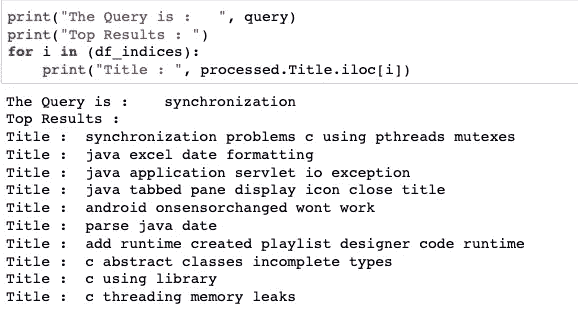

# 使用机器学习和自然语言处理的搜索引擎

> 原文：<https://medium.com/analytics-vidhya/search-engine-using-machine-learning-and-nlp-c1ec1e28be7a?source=collection_archive---------0----------------------->


制作一个搜索引擎不是一件容易的事情。所以让我们从基础开始，知道我们如何做搜索？

我们可以借助一些算法进行搜索，比如二分搜索法、线性搜索、BST、Tries 等。但是在字符串上应用它们不是很有用，因为我们必须在一个大的数据集中匹配精确的单词，字符串的长度也是一个因素。

在搜索引擎中，我们想知道一个查询与数据库中的其他数据有多少相似之处。我们将使用 pythonto 制作我们自己的搜索引擎。让我们开始吧

# 数据:

首先，我们需要一些数据来匹配我们的查询。所以我正在从卡格尔那里获取 [StackOverflow 数据。StackOverflow 是一个网站，我们在这里提出与编程相关的问题，其他用户回答这些问题。
在这个数据集中，我们有这样的数据。
这里我们有问题的**标题**，问题的**正文**即详细解释的代码或问题，以及问题的**标签**即标题属于哪种编程语言。](http://kaggle.com/c/facebook-recruiting-iii-keyword-extraction/data)


数据集有 7.2GB，所以我们使用 Sqlite 与数据集交互，因为我的 mac 只有 8GB 内存。有许多行是重复的，所以我们先删除所有重复的行。

```
SQL Code to get Dataset :df **=** pd.read_sql_query('SELECT Title, Body, Tags, COUNT(*) as cnt_dup FROM data GROUP BY Title, Body, Tags')
```


我们发现 30%的数据是重复的，也就是说，有许多行重复了两三次。有些行甚至重复了 6 次。因此，让我们先去掉重复的数据。

```
df **=** df[df.cnt_dup **<** 2]
```

我们希望我们的搜索引擎只关注与 C#、Java、C++、C 和 iOS 相关的问题。所以我们首先只获取那些行。


通过使用多重处理，我们能够只处理那些与 C#、Java、C++、C 和 iOS 相关的行。

# 预处理:


现在，我们将预处理我们的问题标题，删除 html 和多余的空格和其他东西。
我们也将使用同样的预处理函数来预处理我们的查询。

# 搜索:

现在，我们希望执行搜索，并为我们的查询问题找到类似的问题。

让我们首先将数据矢量化。我们将使用 TF-IDF 矢量器，因为 BoW 矢量器不能提供更好的结果。

```
tfidf **=** TfidfVectorizer()
tfidf_features **=** tfidf.fit_transform(processed.Title)
```

现在我们将使用成对距离，或者我们可以说 TF-IDF 向量之间的欧几里德距离，来看看我们的查询有多相似。


这里我们想得到与我们的查询相似的前 10 个索引。

对于 query = "Synchronization ",让我们看看我们的函数返回什么。



在这里，我们可以看到我们的结果是好的，但没有达到标准。那么，我们如何提高搜索引擎的效率呢？


# 机器学习:

我们可以通过使用 ML 来提高我们的搜索效率吗？
如果是，那么如何？
我们在使用 StackOverflow 的时候，大多是在查询中加入编程语言。
像:C 中的静态变量，Java 中的同步，iOS 中的查看控制器错误。
我们的数据集有标签，我们能使用这些标签来优化我们的查询吗？
但是如何？答案是**是的，我们可以训练一个模型，它可以预测给定查询的标签，并将该标签添加到查询中。**

我们首先通过仅使用数据集中每一行的第一个标签来简化我们的标签。
我们的数据现在看起来像这样:


然后我们必须首先把我们的标签变成数字形式

然后，我们执行 TF-IDF 矢量化，并在 LR 和 SVM 上训练我们的模型。
我们观察到，我们的 LR 模型在超参数调整下表现更好。

所以我们用逻辑回归的所有数据再次训练我们的模型。然后我们使用这个函数将预测的标签添加到我们的查询中。


所以我们将使用 **process_query** 函数*到*到*首先处理查询*，然后我们使用 **label** 函数*找到标签*，然后我们将使用 **change_query** 函数*到*在查询中添加那个标签。


现在，我们将拥有处理所有处理的 **enter_queries** 函数。
我们首先优化查询，然后对查询执行 TF-IDF，因为查询与数据集具有相同的形状非常重要。然后我们得到指数并公布它们。让我们再次尝试 query = "Synchronization "。


我们可以看到它被预测为具有标签 JAVA，然后它将它附加到查询中并执行相似性，我们得到了比以前更好的结果。

所以现在让我们看看当我们使用 flask 和 html 使它看起来更真实时是什么样子。


太棒了！

# **未来方面:**

1.  我们可以使用 w2v，TF-IDF 加权 w2v 或其他技术来矢量化，因为我受到我的计算能力的限制，所以不能这样做。
2.  使用完整数据集。
3.  在搜索引擎中制作更好的用户界面

感谢你坚持到最后，如果你有任何疑问，请随时询问，这里是我的 github 回购的链接。

[](https://github.com/lakshaychhabra/MLSearchEngine) [## lakshaychabra/ml search engine

### 搜索是一项困难的任务，因为要花很多时间。如果我们有一个大型数据集，那么如果我们做一个…

github.com](https://github.com/lakshaychhabra/MLSearchEngine)