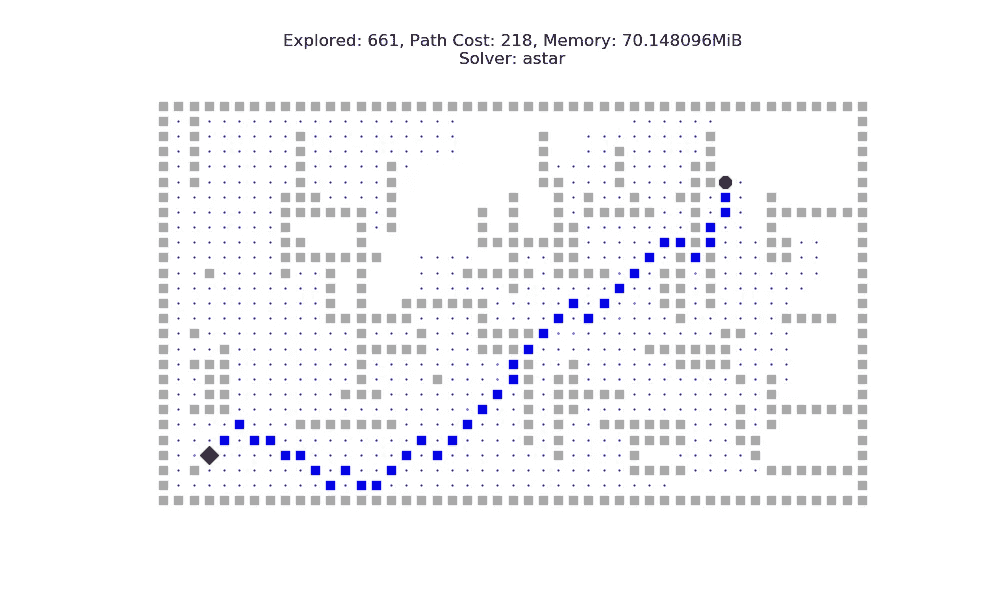
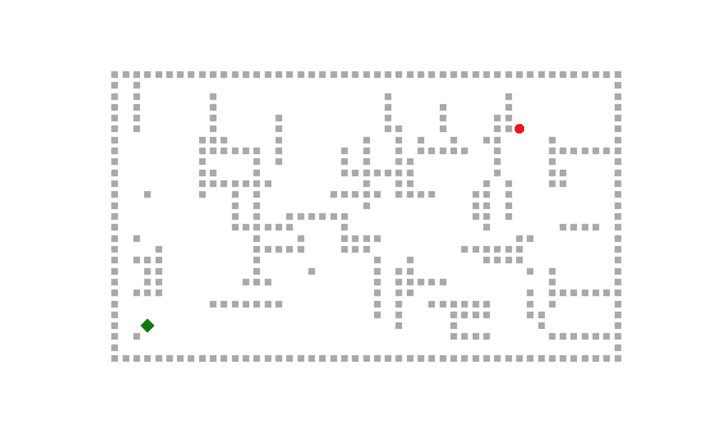
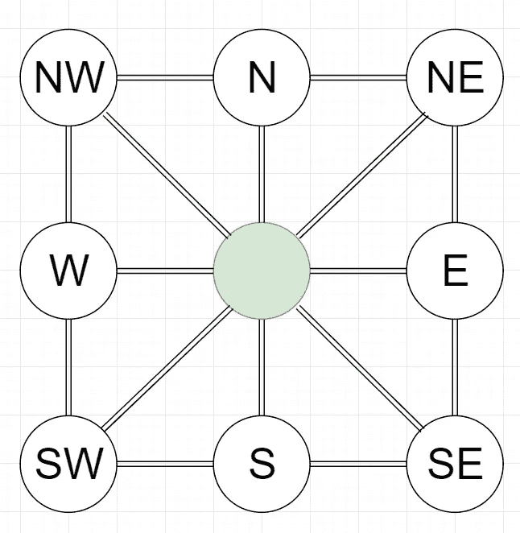

# 人工智能中的搜索—第一部分

> 原文：<https://medium.com/analytics-vidhya/searching-in-ai-e05973068c8e?source=collection_archive---------6----------------------->

## 这个系列将引导你了解人工智能中使用的搜索算法的可视化。第 1 部分探讨了著名的图遍历 DFS，BFS 和 Dijkstra 的算法，有趣的可视化。

A*搜索算法。

# 介绍

我们将通过可视化来了解人工智能中使用的搜索算法是如何工作的。我建议阅读《人工智能:Russel 和 Norvig 的现代方法》一书的第三章和第四章，以获得详细的分析和完整的伪代码。根据本书的约定，本文将探讨图搜索算法。本文不提供算法分析，而是集中探讨不同搜索算法的行为。

文章中使用的数据结构和对陈述的证明可以在托马斯·h·科尔曼的《T2【2】算法导论》一书的第 22 章和第 24 章中找到。

计算机科学和编程背景会有所帮助，但不是必需的。如果你对图论入门不太熟悉的话，可能会有点难掌握。

在下一节中设置了问题陈述。第 2 节讨论解决这个问题的方法，最后一节我们在更大的范围内比较这些算法。

算法的详细代码没有在文章中涉及，但可以在 GitHub 上作为一个项目获得[艾玛代码/艾玛 python](https://github.com/aimacode) ，它是由本书的作者发起的【1】。

用于动画的代码可以在这个 [GitHub 库](https://github.com/tirthasheshpatel/Searching-in-AI)上获得。

# 规划

图 1:抽象之前的问题([来源](https://www.google.com/url?sa=i&source=images&cd=&cad=rja&uact=8&ved=2ahUKEwjo8JmlzpXnAhWQ8XMBHbBXDssQjRx6BAgBEAQ&url=https%3A%2F%2Fwww.123rf.com%2Fphoto_6641728_beautiful-park.html&psig=AOvVaw3I1uYD81A_48PKugdyulyw&ust=1579727635765778)

假设，你家附近新开了一个公园(图 1 ),你决定去野餐。当你到达公园时，你发现它相当大，有许多随意的墙。你很饿，整个公园只有一个小吃摊。所以，你开始探索公园找到摊位。这是一个简单的问题，假设你在公园的某个地方，目标是到达小吃摊。

> 我们的第一步是将问题转化为一个数学实体，并删除尽可能多的细节，同时保留原始问题提供的目标。

图 2:我们问题的抽象表示。绿点是我们的初始状态，红点是目标状态，灰点是不可及的状态或墙壁。

在我们的例子中，公园可以被视为由整数坐标点组成的 2D 平面(图 2)。公园位于平面的第一象限，由长度和宽度与公园的实际大小成比例的墙所包围。

让我们定义一个**状态**为这个平面上的一个点。现在，您的位置可以表示为公园中的 2D 点。姑且称这种**初始**状态。类似地，也可以使用公园中的 2D 点来表示小吃摊。姑且称这种**目标为**状态。壁可以表示为在壁的方向上延伸的一系列相邻点，其长度与壁的长度成比例。让我们将所有这些点的集合定义为“**不可到达的**状态或带有“**障碍的**状态”。我们的目标是到达给定初始状态的目标状态，而不进入“不可到达”状态。

一个细心的读者可能已经注意到，你饿了的事实已经不重要了！你骑自行车或步行去小吃摊的事实也是如此！这个从问题中去除细节的过程叫做 ***抽象*** 。抽象帮助我们将问题转化为一个数学实体，它的解比原始问题的解更容易找到。我们还没完。我们现在需要定义新世界的规则或“物理学”。这些规则可以定义如下:

1.  可以进入任何相邻状态或与当前状态对角相邻的状态。
2.  一个人不能进入无法到达的状态(墙或障碍物)。
3.  进入一个新状态的代价总是 1。(我们以后可能会更改此规则，但正式来说，一旦设置，规则就不能更改)

# 搜索

正式定义了问题之后，下一步就是设计一个搜索算法来解决手头的问题。有很多这样的算法，我们将在本系列的后面讨论。通过询问以下问题来分析搜索算法:

1.  算法会在有限时间内找到解吗？"*完整性*"
2.  算法需要多长时间？*时间复杂度*
3.  算法完成需要多少内存？*空间复杂度*

我们的例子可以看作一个图(如果你熟悉图论的话)，每个状态作为一个节点，相邻的节点通过一条无向边连接起来，如图 3 所示。我们还可以为每条边分配一个权重，作为通过该边移动到相邻状态的成本。

图 3:问题图和从中间绿色节点到达节点的相应动作。

我们进一步定义一个“ ***动作*** ”(它只是图中的一条边)作为从某个当前状态移动到一个新状态的方法。在我们的问题中，我们可以定义动作“向北”、“向南”、“向东”、“向西”、“东北”、“西北”、“东南”和“西南”。这些行为可以在搜索过程中被探索、尝试。还有一个“允许”行为的概念。比方说，你在我们公园的坐标(0，0)处，尝试“向北走”动作。这将产生(1，0)作为新的状态。类似地，允许“向东北”和“向东”动作，但不允许其他动作，因为它们会产生位于公园外的负坐标。产生包含障碍的状态的动作也是不允许的！

这就完成了问题的公式化，但是“状态”和“节点”之间的区别还没有确定。

一个“**节点**”将一个“状态”、它的“路径开销”、它的“父节点”以及从父状态到达该状态所需的“动作”包含在它自身中。路径成本是指从初始节点到达该节点的“成本”。父节点指向到达该节点的节点。

在我们的例子中，2D 点(如(0，0)，(0，1)等)是状态，从初始状态到达一个状态所需的步骤数是路径成本。可以创建一个节点来帮助记录不同的属性。

这个问题定义了设计一个可以解决这个问题的算法所需的所有术语。接下来的小节将讨论解决这个问题的不同方法。

# 使用 BFS 搜索

> 广度优先搜索(BFS)是一种技术，用于在每个方向上均匀地遍历图形，而不考虑路径开销。

现在，当一个新的状态被访问时，我们需要将它标记为“已访问”或者将相应的节点存储在某个地方，以便我们可以在需要时检索信息。否则，算法可能会一次又一次地进入相同的状态，很可能会陷入无限循环。让我们将所有已经被访问(到达)的节点存储在一个名为“已到达**”的*集合*中。**

**我们还需要存储其动作有待探究的节点。姑且称此为“**边疆**”。搜索算法的最大不同在于它们用来对**边界中的节点进行排序的方法。****

**我们另外将已经浏览过的节点存储在一个名为“ **explored** ”的集合中。这不是必需的，因为信息包含在可达集合中，但是用于理解搜索算法的行为。**

**该算法使用一种称为 [**队列**](https://en.wikipedia.org/wiki/Queue_(abstract_data_type)) (有时称为先进先出队列的 FIFOQueue)的数据结构来排序和存储**边界**中的节点。现在，我们可以开始形式化算法:**

1.  **将对应于初始状态的节点存储在**边界**队列中。**
2.  **如果队列不为空，从**边界**队列中弹出一个节点进行探索(最初是我们的初始节点),否则转到步骤 5。**
3.  **如果结果状态不包含任何**障碍**并且不存在于**到达**集合中，则在将结果节点存储在**到达**集合中的那个节点的状态下，一次尝试一个动作。如果任何结果节点包含目标状态，则转到步骤 5。**
4.  **将该节点添加到浏览集，并转到步骤 2。**
5.  **结束。**

**图 4 显示了这种算法。您可以看到，该算法在探索任何具有更高路径开销的节点之前，首先探索具有相同路径开销的所有节点(位于距初始状态相同距离的节点)。这就是它被称为“广度”优先搜索的原因。它通过首先沿着网格的宽度探索节点来探索网格。**

**可以证明，如果所有节点从一个状态移动到另一个状态的步长开销相同，则 BFS 搜索具有最小路径开销的路径。参考文献[2]以获得该陈述的正式证明。**

**我们可以看到，BFS 已经在 96 个可探索的州中的 69 个州寻找解决方案。在我们的情况下，这个解决方案是最优的，因为从一个状态移动到另一个相邻状态的成本是 1。该解决方案的路径开销为 10。**

> **探索:69，路径成本:10**

**图 4: BFS 可视化。蓝色节点对应已达到的状态，黑色十字对应已探索的状态，深蓝色对应达到目标的路径。请注意，该算法如何探索具有相同路径开销的节点，然后继续探索具有更高路径开销的节点。**

**请注意，我没有提供算法中节点的任何路径开销和其他属性的簿记。此外，没有提供算法的分析，留给读者去探索。详细算法参考文献[1]。**

# **使用 DFS 搜索**

> **深度优先搜索(DFS)是一种遍历图的技术，它首先探索最深的节点，而不考虑路径开销。**

**已到达和已探索的节点将被存储在类似于 BFS 的**已到达**和**已探索** *集合*中。边界将包含有待探索的节点。但是 **frontier** 在这里被实现为*(也称为 *LIFOQueue* 用于后进先出队列)不像 BFS 的*队列*。使用这些符号，我们可以进一步形式化算法:***

1.  ***将初始状态对应的节点存储在**边界**堆栈中。***
2.  ***从**边界**堆栈中弹出一个节点进行探索。***
3.  ***选择一个未探索的动作来探索并在**边界**堆栈和**到达**集合中存储结果节点(如果尚未出现在其中),并且结果节点不包含**障碍**,否则继续。重复此步骤，直到到达最深的节点，否则无法执行进一步的操作。如果在探索过程中达到了目标状态，请转到步骤 6。***
4.  ***将节点添加到**浏览的**集合。***
5.  ***转到步骤 2。***
6.  ***结束。***

***图 5 提供了 DFS 的可视化。请注意算法如何越来越深入地探索状态，直到用尽所有选项。这就是它被称为深度优先搜索的原因。***

*****它不保证任何安排的最优解**。还应注意的是，与 BFS 相比，它需要相对较长的时间来求解，并且会到达网格中 96 个州中的 95 个。但好处是内存需求。***

***它需要与边界堆栈中存在的节点成比例的内存，这些节点不超过最大深度乘以被浏览节点的最大分支(分支是该状态下可用的动作)。而 BFS 需要与节点的最大分支成比例的存储器，该节点具有作为其指数的最大深度(解持续存在的深度)。DFS 消除了 BFS 内存需求中的指数，这是一个巨大的改进。但是它在时间上是低效的，并且通常需要更长的时间来搜索目标。(如果你熟悉时空权衡，这个会很清楚。)***

> ***探索:95，路径成本:14***

***图 5:深度优先搜索可视化。需要更长的时间来寻找解决方案，并且解决方案不是最优的。但是它需要线性记忆，不像 BFS 需要指数记忆。***

# ***统一成本搜索***

> ***统一成本搜索(UCS)是一种通过根据路径成本改变搜索队列中节点的顺序来寻找最优解的技术。***

***该算法使用一个优先级队列来对要探索的节点进行排序。优先级队列根据节点的*优先级*(只是分配给该节点的一个值)对节点进行排序。可以选择最小或最大优先级值位于队列的前面。出于我们的目的，具有最小优先级值的节点位于优先级队列的前面。***

***统一成本搜索，也称为 Dijkstra 算法，非常类似于 BFS，但在以下三个方面有所不同:***

1.  ***队列中节点的顺序不同。***
2.  ***如果在探索期间发现，我们可以替换边界中具有较低优先级值的节点。***
3.  ***我们在探索之后检查节点是否包含目标状态(不像 BFS 在探索期间检查这个条件)。***

***当我们看算法时，这将变得清楚。***

***我们使用路径成本(从初始状态到达一个状态)作为队列中节点的优先级值。因此，具有最小路径开销的节点位于队列的最前面，首先被探索。***

1.  ***将初始节点存储在**边界**优先级队列中。***
2.  ***如果不为空，从**边界**弹出一个节点，否则进入步骤 6。如果节点包含目标状态，则转到步骤 6。***
3.  ***一个接一个地探索节点的每个动作，如果结果节点不在其中一个中，并且结果状态不包含**障碍**，则将结果节点添加到**边界**和**到达**集合中。如果其中一个结果节点的状态已经存在于具有更高路径开销的队列中，则用该结果节点替换该节点。***
4.  ***将节点添加到**浏览的**集合。***
5.  ***重复步骤 2，直到弹出的节点包含目标状态。***
6.  ***结束。***

***第三步包含了许多读者忽略的微妙之处。最后一条语句要求用另一个包含相同状态但路径开销更低的节点替换队列中存在的节点。这一步尤其重要，因为找到了一个节点，该节点包含比队列中存在的路径具有更低成本的路径，同时两者都从初始状态到达相同的状态。如果我们不替换队列中的那个节点，那么有可能通过另一个节点存在更好的解决方案。这有点令人困惑，但随着你对算法的深入研究，它会变得清晰。***

***该算法的可视化如图 6 所示。当从一个州迁移到邻近的州的成本相同时，它就像 BFS 一样，但是当我们引入不同的成本时，它的功能就不同了。图 6 中的可视化使用了“加权”网格，该网格引入了从一个状态移动到相邻状态的正成本。***

***需要注意的非常重要的一点是，如果问题的任何地方出现负权重，该算法并不能保证找到最优解。证明可以在[2]的第 24 章中找到。***

***显然，路径成本增加了，因为现在成本不是 1。可以看出，如果权重大于某个正常数ε，则该算法达到最优解。***

> ***探索:55，路径成本:84***

***图 6: Dijkstra 的算法。它主要探索路径开销小于最佳路径开销的节点。这里使用的像元权重定义了从一个像元移动到另一个像元的成本。这就是路径成本增加的原因。***

# ***比较 BFS、DFS 和 UCS***

***BFS、DFS 和 UCS 在小网格上产生类似的结果，因此需要更大的网格来理解算法的实际行为。让我们创建一个大网格，比较这三种算法。此网格是加权的，成本是从均匀分布中随机生成的。***

***结果如下所示:***

***BFS 搜索了 396 个州，找到了一个路径开销为 565 的解决方案。这是 BFS 的预期行为。***

> ***BFS —探索:396，路径开销:565***

***DFS(意外地)很快找到了解决方案，但最终找到了一条非常低效的路径，路径开销为 1005。在实践中，DFS 将花费更多的时间来寻找解决方案，并最终探索许多不必要的状态。***

> ***DFS 已探测:222，路径开销:1005***

***UCS 搜索了 370 个州，找到了一条最小路径开销为 542 的路径。由于该网格使用使用均匀分布初始化的权重，因此在达到目标之前，搜索必须探索几乎所有的状态。实际上，搜索以循环方式扩展，首先探索路径成本较低的州。***

> ***UCS —探索:370，路径开销:542***