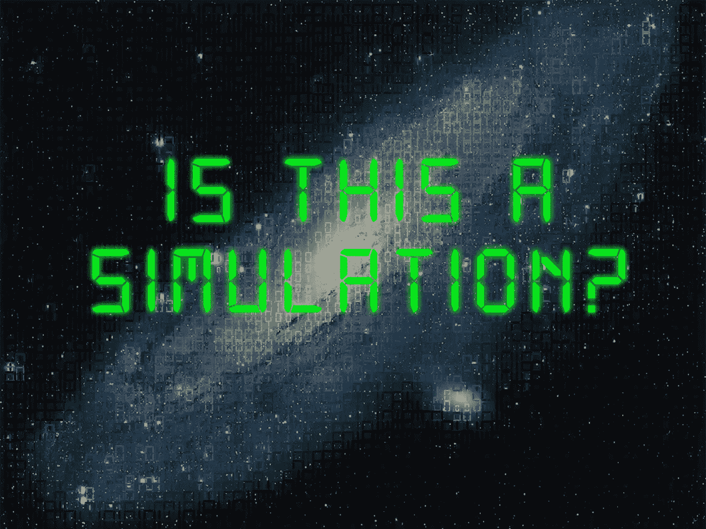
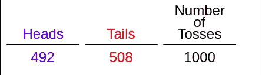

# 模拟的秘密—第一部分

> 原文：<https://medium.com/analytics-vidhya/secrets-of-simulation-2b314cd8c297?source=collection_archive---------24----------------------->

来源:[https://thetruthhunter . com/WP-content/uploads/2015/05/is-this-a-simulation . jpg](https://thetruthhunter.com/wp-content/uploads/2015/05/is-this-a-simulation.jpg)

不同领域的人们正在处理与解决不同问题的数据不足相关的问题。例如，对于研究宇宙的天文学家来说，他们无法到达整个宇宙以观察每个行星的行为，因为到达这些行星需要大量的金钱和时间。因此，为了解决这个问题，他们在实验室里创造了一个类似的环境来理解我们空间的行为。因此，模拟是对任何过程或系统操作的模仿。

**模拟**是关于创造一个合适的环境来理解物质的行为。但是创造一个合适的环境并观察环境中不同物质的行为是一个耗时的过程。为了让它更快，科学家们想出了创建一个基于计算机的模拟。由于我们有技术和硬件资源，它使我们容易创建一个基于计算机的模拟和理解的行为。

**计算机模拟**更多的是创造与真实世界环境行为相似的数学模型。模拟中最常用的数学是概率和统计，它告诉我们一个事件发生的概率是多少。有许多不同类型的概率模拟将在现实世界中证明许多理论。

例如，在投掷一枚无偏的硬币时，正面的理论概率是 0.5，但为了证明这一点，我们需要投掷硬币数百万次，以了解理论值是否与原始值匹配。因此，为此，我使用交互式模拟环境投掷硬币 1000 次，以检查头部出现的次数。

来源:[http://www.shodor.org/interactivate/activities/Coin/](http://www.shodor.org/interactivate/activities/Coin/)

在我们的试验中，我们发现头在 1000 次中出现 492 次，或者概率是 0.492。而我们的理论概率是 0.5。这意味着如果我们四舍五入，两者是一样的。

**回到我们的话题**

根据环境的类型，计算机模拟有很多种。

*   随机/概率模拟
*   基于主体的模拟还包括基于多主体的模拟

***概率模拟***

在掷硬币的例子中，我们进行了随机模拟，因为我们只掷了不依赖于任何东西的硬币。整个模拟是在生成硬币的随机面上进行的。如果我们仔细观察我们的例子的概率分布，它遵循均匀分布。类似地，不同的模拟模型遵循不同的概率分布，如高斯、泊松、伽马、指数、贝塔、瑞利等分布。我们可以通过使用联合概率分布来考虑多个因素。

用于概率模拟，用于生成复杂的概率模型。我们使用一种叫做蒙特卡罗模拟的技术。使用模拟生成数据是一种非常可靠和有用的技术。

在概率模拟中，我们为不涉及参与者(人)的应用程序创建数学模拟，如汽车动态模拟、机器故障系统等。

*在现实世界中，我们有不同类型的系统，可能包括人或物理实体。这些类型的模拟不能仅使用数学模型来解决，因为这里人类和他们的行为也影响系统。这种类型的模拟可以通过基于代理的模拟来执行。我们有各种各样的例子，包括**单 ABM** 像模拟人口动态，客户行为模拟等。在这种类型的模拟中，我们只处理单一类型的代理，就像在客户行为模拟中一样，我们有一个客户，我们想了解他们的购买模式，我们必须开始就这个人进行销售，只有我们才能近似客户行为。*

*有时，我们不得不处理包含不同代理的问题。例如，如果我们对银行系统进行模拟，我们有多个代理，如银行家、客户、商人和许多其他代理。所以当每一个代理都相互作用时，那么只有我们才能近似一个实时银行系统。*

****模拟工具****

*用于模拟的最常用工具*

*   *Matlab / Simulink*
*   *网络标志*
*   *皮西姆*