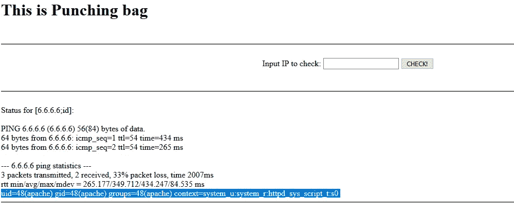

# 第 2 部分:保护 web 应用—命令执行+防火墙

> 原文：<https://medium.com/analytics-vidhya/securing-web-apps-command-execution-firewall-38c65f696cd7?source=collection_archive---------21----------------------->

本文有助于理解如何为 webapp 创建防火墙规则、命令执行如何工作以及安全编程。

在[上一篇文章](/@ayedaemon/python-web-apps-made-easy-python-cgi-5dd013964f2d)中，我们停用了系统中的防火墙和 SELinux 策略。这显然是一种不好的做法。


停止的防火墙服务


停止了 selinux

因此，现在我们将使防火墙恢复运行。

```
$ sudo systemctl start firewalld
```


开始防火墙 d

首先，让我们试着理解这里的*防火墙*。([https://firewalld . org/documentation/man-pages/firewalld . html](https://firewalld.org/documentation/man-pages/firewalld.html))

现在我们对防火墙是如何工作的有了一个概念…是时候制定一个规则来允许 http 服务通过它了。

这可以通过*firewall-cmd*([https://firewalld . org/documentation/man-pages/firewall-cmd . html](https://firewalld.org/documentation/man-pages/firewall-cmd.html))轻松完成

```
$ sudo firewall-cmd --add-service=http --permanent
```

运行上面的命令会给你一个*成功*。
现在 firewalld 将允许任何属于 http 服务并通过认证的数据包通过。


激活防火墙后(selinux 仍处于许可模式)

为了使事情变得简单易行，我们不会在本课程中激活 SELinux 策略。为了更好地理解 SELinux 是什么以及它是如何工作的，请阅读[这个](https://wiki.centos.org/HowTos/SELinux)和[这个](https://www.nsa.gov/what-we-do/research/selinux/documentation/)。

在本文中，我将重点关注命令执行漏洞。
命令注入基本上是通过 web-app 执行的操作系统命令的注入。

现在，让我们通过向应用程序传递输入来检查我们的应用程序是否容易受到命令执行的攻击。

```
8.8.8.8;echo “bang bang”;
```


“梆梆”在最后一行回荡

看着上面的输出，我们确信 echo“bang bang”已经成功执行了。

现在让我们尝试更多的命令。

```
6.6.6.6;id
```



id 执行突出显示

现在让我们试着在远程服务器上创建一个文件。

```
8.8.8.8;echo “batman_was_here” >knock_knock.txt
```


我们似乎没有足够的权限在此创建文件。
但是等等……不是每个 OS 都有专门的文件夹存放临时创建的文件和文件夹吗？哦是的！就在那里。

在 Linux/Unix 平台中，/tmp 目录拥有完全权限。基本上，它允许我从那个目录中读取、写入和执行任何东西。

```
drwxrwxrwt. 19 root root 4096 Mar 27 09:40 tmp
```

所以我们来试试吧。

```
8.8.8.8;echo “batman_was_here” >/tmp/knock_knock.txt
```


这没有给任何错误。这意味着它执行成功。让我们试着在这里读取文件。

```
8.8.8.8;cat /tmp/knock_knock.txt
```


这是非常糟糕的，因为黑客可以从我们的服务器上创建、读取和执行文件。

受够了和弱者开玩笑。让我们试着阻止它。为此，我们需要修改我们的代码来检查输入中潜在的恶意字符，如下所示。

```
;
&
|
`
```

现在我们的逻辑代码部分看起来像这样。

```
## LOGIC CODE
import subprocess as sb
import cgidata = cgi.FieldStorage() # read the field Storage or mini field storage for the cgi scriptif data.getvalue(“target_ip”):
 data_target_ip = data.getvalue(“target_ip”)
else:
 data_target_ip = “8.8.8.8” # default set to google DNS#SANITIZE INPUTdata_target_ip = data_target_ip.replace(“;”,””).replace(“&”,””)
data_target_ip = data_target_ip.replace(“|”,””).replace(“`”,””)cmd_status = sb.getoutput(“sudo ping -c 3 “+data_target_ip)
cmd_status = cmd_status.replace(“\n”,”<br>”)
```

让我们试试我们的应用程序是否还在处理恶意输入。

```
8.8.8.8;echo “bang bang”;
```


现在，我们的应用程序不会受到这种恶意输入的影响..但是绝对安全仍然是一个神话。
有些字符串仍然可能是恶意的。(那些不在本文讨论范围内)
但还是有你应该好奇的地方。这将有助于你更好地理解那些高级恶意字符串。


仔细看上面的图像..我向 ping 命令提供了一个完整的整数，它被转换为一个有效的 IP。这些类型的符号被称为 IP 的整数符号**。**

但这还不止这些…


仔细看看上面这些知识产权模式，我相信你会获得一些新的见解。

如果你想了解更多关于命令执行的内容，请点击这里([https://owasp.org/www-community/attacks/Command_Injection](https://owasp.org/www-community/attacks/Command_Injection))。