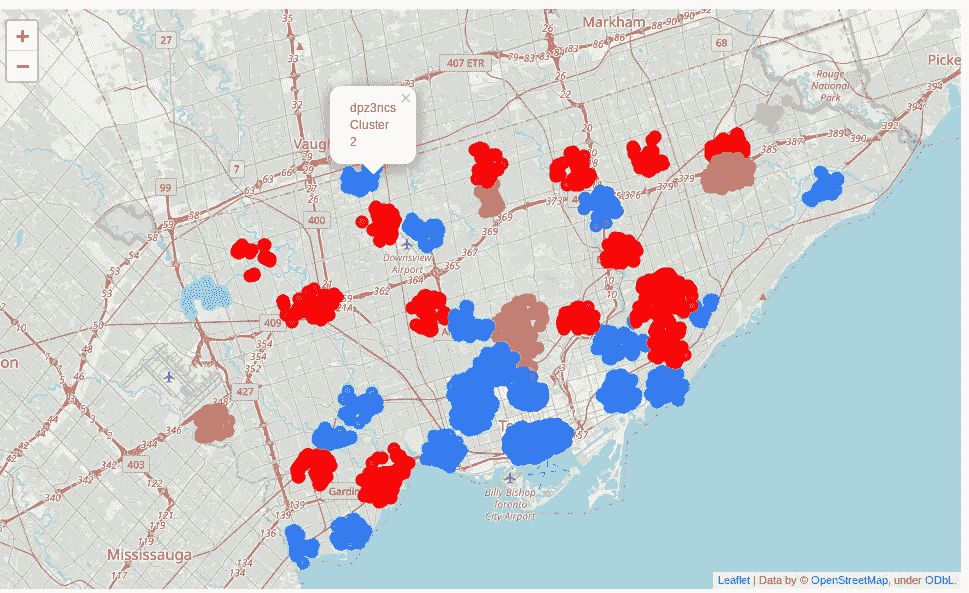

# 使用众包数据和 Foursquare 位置 API 分割多伦多的停车位置

> 原文：<https://medium.com/analytics-vidhya/segementation-of-parking-locations-in-toronto-using-crowdsourced-data-and-foursquare-locations-api-62af60e10ca9?source=collection_archive---------6----------------------->

奥默·拉纳在 [Unsplash](https://unsplash.com?utm_source=medium&utm_medium=referral) 上拍摄的照片

## 1 —简介

在这个项目中，我将使用 foursquare 位置数据、众包搜索停车数据和 k-means 聚类来分析和描述加拿大多伦多不同社区的停车位置。对于不同的社区，每个社区不同场地的活动对车主在该社区找到停车位的平均时间有影响。例如，对于具有许多餐馆、夜总会和咖啡馆的街区，与在没有这样的兴趣点的街区中寻找停车位所花费的平均时间相比，在晚上寻找停车位所花费的平均时间可能要长得多。

## **2 —目标**

这个项目的目标是将城市中具有相似特征的停车场分成几组。

## **3 —背景**

本段内容来自网站:[1]。研究显示，在大城市中心寻找停车位的司机不仅让人沮丧，还会导致交通拥堵和额外的温室气体(GHG)排放。[2]为了客观地看待这个问题，美国司机平均每年要花 17 个小时寻找停车位，据估计，每位司机在时间、燃料和废气排放上要花费 345 美元。受这个问题影响的不仅仅是司机，城市也是如此。在参与调查的 6000 名美国司机中，63%的人表示，由于停车困难，他们避免开车前往目的地。因此，这可能会影响当地企业和经济活动。[3]随着大都市的逐年增长，交通拥堵持续加剧，而且没有减缓的迹象。[4]

## **4 —利益相关方**

这种类型的分析可能会引起城市规划者的兴趣，因为他们需要清楚地了解停车位置在城市不同社区的活动中是如何使用的。这项分析也可能会让那些打算在一个城市的不同社区投资新企业的准企业家感兴趣。

## **5 —数据**

本项目将使用两组数据:
1。从 Geotab 搜索停车数据。【1】
2。四方定位数据

**5.1 搜索停车数据**

该数据集是由
Geotab 免费提供的众包数据集。网站上有完整的描述:[1]。该数据集是根据过去六个月的滚动平均值构建的，它可以在每个月的第二天更新的谷歌大查询表中找到。表 1 总结了表中的一些字段:

表 1:大查询表中的字段

**5.2 四方场馆类别**

Foursquare 提供了一个 API，可以用来访问地理上不同类别的场馆的信息。下面的列表显示了 API 提供的 10 个主要类别。每个主类别包含一个或多个子类别。
1。艺术&娱乐(4d4b7104d754a06370d81259)
2。学院&大学(4d4b7105d754a06372d81259)
3。事件(4d4b7105d754a06373d81259)
4。食品(4d4b7105d754a06374d81259)
5。夜生活景点(4d4b7105d754a06376d81259)
6。户外&娱乐(4d4b7105d754a06377d81259)
7。专业&其他地方(4d4b 7105d 754 a 06375d 81259)
8。住所(4 e 67 e 38 e 036454776 db 1 fb3 a)
9。店铺&服务(4d4b 7105d 754 a 06378d 81259)
10。旅行&运输(4d4b7105d754a06379d81259)

全部细节可从网站上获得:[5]。在这个项目中，API 将用于使用主要类别查询信息。

## **6 —方法**

本节描述了我用来获取、处理和分析数据集的方法

**6.1 从 Google 大查询表中获取数据**

加拿大多伦多的数据从表中提取到 CSV 文件中，并存储在本地以供分析。提取的数据集来自七月、八月、九月和十月。数据集从 Google 的 BigQuery 表中提取到一个 csv 文件中。在本项目中，20190801 提取的数据集用于下述分析，该数据集包含多伦多 3308 个唯一的 geohash 停车位置。图 1 显示了给定停车位置周围每小时搜索停车的车辆的平均百分比。

图 1:每小时在停车场搜索的车辆的平均百分比

**6.2 探索性数据分析**

为了了解数据，对停车数据的搜索进行了探索性分析。在这方面，第一步是按照[1]中的描述创建一个计算的停车搜索指数。这个指数给出了一个粗略的衡量标准，显示了在任何一个特定的城市中，寻找停车位是多么的耗时和普遍。该指数根据:
设μ =平均停车时间比，φ =搜索停车比，θ =
搜索停车指数；那么
θ = aμ + bφ
其中 a 和 b 是可以变化的参数【1】。图 2 显示了使用数据集中的 3308 个地理散列计算出的搜索停车指数的热点
地图。停车指数θ的搜索值在 1 到 10 之间。

图 2:本项目中数据集的计算停车搜索指数的热图

**6.3 搜索停车数据的统计特性**

下面是直方图和核密度估计(KDE)图，用于:
平均停车时间和计算的搜索停车指数。

**6.3.1 平均停车时间**

搜索停车位的平均时间(以分钟计)及其概率分布似乎大致呈高斯分布，如图 3 所示。根据图 3 中的核密度估计图，我们可以看到，车辆在多伦多找到停车位的最有可能(大约 25%的概率)的平均时间是 5 分钟左右。

图 3:使用数据集车辆找到停车位的平均时间

**6.3.2 搜索停车索引**

如前所述，这个停车搜索指数给出了一个粗略的衡量标准，显示了在任何给定的城市中，停车搜索有多耗时以及有多普遍。它具有右偏分布，最可能的指数大约为 2(大约 20%的概率)，如下图 4 所示。分布的形状似乎与预期的一样，因为大多数停车位置的该指数值较低。很少有停车位置具有较高的该指数值。核密度估计图中的区间/区域可用作从整个停车数据组搜索中选择数据子集进行分析的基础。

图 4:停车索引的计算搜索

**6.4 分割数据集的选择**

鉴于 3308 个唯一地理哈希的相对较大的数据集，由于对免费 Foursquare 订阅帐户的 API 调用数量的限制，有必要使用子集进行分析。为此，只选择计算指数为 10 左右的停车位置进行进一步分析。所选区域在图 4 中的卡内尔密度估计图的最右边。选择标准产生了 55 个停车位置的数据集；下面的图 5 显示了所选数据集的热图。

图 5:为聚类和分段选择的停车位置

**6.5 获取四方位置数据**

对于所选数据集中的每个停车位置，Foursquare API 用于查询 55 个停车位置中每个位置 1000 米范围内的兴趣点(POI)。对于每个停车位置，针对 API 中定义的 10 个主要类别中的每一个执行查询。这导致了 550 次 API 调用。图 6 示出了针对停车位置的不同类别的兴趣点的计数的表格(geohash = dpz893q ),而图 7 示出了针对 55 个停车位置的 10 个类别中的每一个的计数的箱线图。

图 6:使用 geohash: dpz893q 对某个停车位置的主要类别中的兴趣点进行计数

图 7:55 个停车位置中每个主要类别的兴趣点计数

**6.6 选定停车位置的分割**

在本节中，将根据四方兴趣点对停车位置进行细分/聚类。图 8 显示了 geohash: dpz893q 的 Foursquare 兴趣点的值表。所有 geohashes 的数据集总共包含 6051 行。

图 8:停车场 1000 米内的兴趣点 geohash: dpz893q

**6.7 分析**

在停车位置搜索的分析和分类中将使用以下方法:
1 .使用箱线图来显示每个 Foursquare 场馆类别中的场馆数量，以显示哪种活动支配着停车场地的利用率。
2。使用 k-means 聚类显示停车位置 1000 米范围内的主要场馆类别。

**6.7.1 基于正方形位置的停车位置聚类**

使用 K-means 聚类(无监督学习)，基于每个停车位置 1000 米半径内的受欢迎的四方形位置，构建了 55 个所选停车位置的聚类。聚类使得能够基于周围的兴趣点通过流行的使用对停车位置进行分类/分割。在该过程中，在用不同数量的聚类作为 k-means 算法的输入进行实验之后，聚类的数量被设置为 6。下面的结果部分显示了聚类的结果。

## **7-结果**

图 9 显示了聚类图，六个聚类从 0 到 5 进行编号。在地图中，我们可以看到具有相似特征的停车位置集群，如颜色所示。我们有如下:聚类 0 具有红色，聚类 1 具有粉色，聚类 2 具有蓝色，聚类 3 具有浅蓝色，聚类 4 具有浅绿色，而聚类 5 具有浅棕色。下文讨论了每一组。

请注意，根据 Foursquare API 为 10 个主要类别中的每个停车位置返回的数据大小，不同代码运行之间的聚类看起来会有所不同。

图 9:停车位置集群

**7.1 聚类 0**
图 10 示出了属于聚类 0 的停车位置的 1000 米内的正方形位置的类别的计数的箱线图。在箱线图中，我们看到停车场地的使用主要是由餐馆(食品)和商店&服务。我们还看到，Foursquare locations 事件类别对该群集中停车位置的使用没有贡献。图 11 示出了在多伦多的不同街区中由簇 0 覆盖的区域的地图。

图 10:聚类 0 中停车地理散列的正方形位置的箱线图

图 11:群组 0 中的停车位置地图

**7.2 聚类 1**
图 12 示出了属于聚类 1 的停车位置的 1000 米内的正方形位置的类别的计数的箱线图。在方框图中，我们看到停车场地的用途主要是艺术&娱乐、学院&大学、活动和住宅。我们还看到，Foursquare 位置的其他六个主要类别对该集群中停车位置的使用没有贡献。

图 12:聚类 1 中停车地理散列的正方形位置的箱线图

图 13:群组 1 中停车位置的地图

**7.3 聚类 2**
图 14 示出了属于聚类 2 的停车位置的 1000 米内的正方形位置的类别的计数的箱线图。在箱线图中，我们看到停车场地的使用主要是由餐馆、专业&其他地方和商店&服务。图 15 示出了在多伦多的不同街区中由集群 2 覆盖的区域的地图。

图 14:聚类 2 中停车地理散列的正方形位置的箱线图

图 15:群组 2 中具有相似特征的停车位置的地图

**7.4 集群 3 和 4**
这些是地图中的单个集群。需要进行进一步的分析，以便将它们纳入讨论。

**7.5 聚类 5**
图 16 示出了属于聚类 5 的停车位置的 1000 米内的正方形位置的类别的计数的箱线图。在箱线图中，我们看到停车场地的用途主要是餐馆、户外&娱乐和商店&服务。图 17 示出了多伦多不同街区中由聚类 5 覆盖的区域的地图。

图 16:聚类 5 中停车地理散列的正方形位置的箱线图

图 5:群组 5 中具有相似特征的停车位置的地图

## **8 —结论**

使用 Foursquare 位置数据和众包 GPS 搜索停车数据，对多伦多的 55 个停车位置进行了分割。通过使用这种类型的分割，城市规划者可以在做出关于改善和新投资的决策时识别具有相似特征的停车位置。

**参考文献**

[1][https://Data . geotab . com/urban-infra structure/searching-For-Parking](https://data.geotab.com/urban-infrastructure/searching-for-parking)
【2】人行道上的谈话，“绕圈停车对城市来说很可怕”，2016 年 9 月 21 日
【3】今日美国，“司机平均每年花 17 个小时寻找停车点”，2017 年 7 月 12 日
【4】美国交通部公共事务办公室，“3 月驾驶突破 2620 亿英里，新数据显示”，2015 年 5 月 20 日【T7