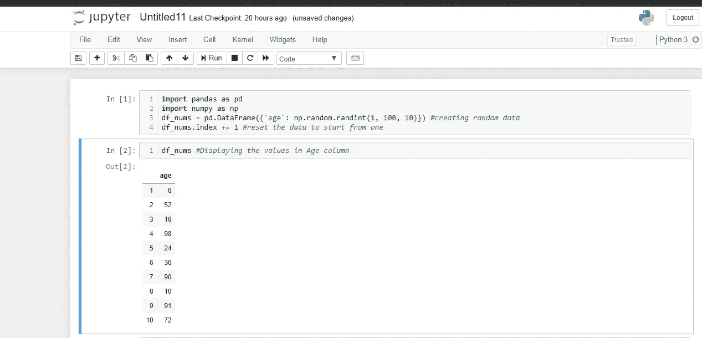
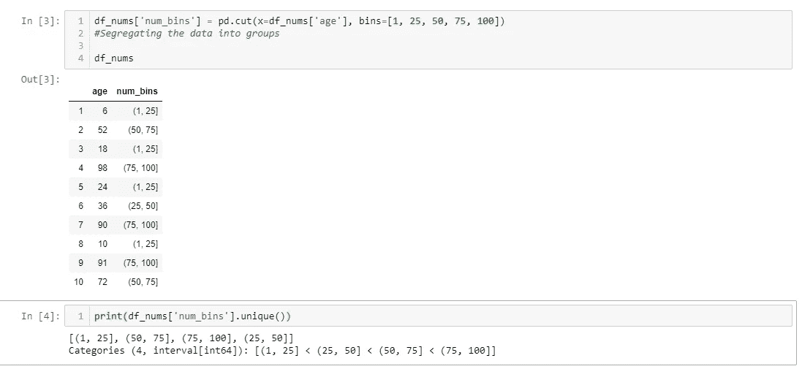
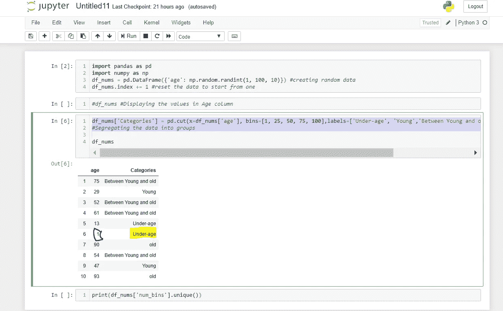

# 使用 Python 基于某些标准对数据进行分段

> 原文：<https://medium.com/analytics-vidhya/segment-data-based-on-some-criteria-using-python-932aefc3eb31?source=collection_archive---------10----------------------->

我们经常需要划分和隔离数据，以便对其进行数据分析，python cut()和 qcut()函数为我们提供了一个简单的命令行命令。

Python Cut()函数用于将连续数据转换为分类数据。它还对数据进行排序。例如，数据集中的“年龄”列包含员工的所有年龄，使用 python cut()我们实际上可以将数据分为不同的年龄组，如 0-16 岁、16-25 岁..诸如此类。

`**pandas.cut**` **( *x* ，*bin*， *right: bool = True* ， *labels=None* ， *retbins: bool = False* ， *precision: int = 3* ，*include _ lowest:bool = False*，*duplicates:str = ' raise’*)**

**X** =需要进行运算的数据，应该是一维的

**箱** =组边缘，如 1，25，50，75，100。每组的终点

**右** =默认设置为 true，包含最右边的值。例如，默认情况下，数据的值为“25 ”,只有当 right 设置为 true 时，它才会在 1-25 组中包含该值，在 25-50 年龄组中，它才会包含值“25”。

**标签**=设置该选项是为了给分组添加标签

ret bins=当我们想要返回箱子标签时使用。当我们想知道范围用于识别不同的箱时，这是有用的

**精度**=显示时应取的小数值，默认为 3。

**include_lowest=** 指定是否包含超出范围的最低值

**duplicates=** 指定面元边缘是否有重复值，要执行的操作是增加还是减少 _duplicates

下面是使用 python cut()函数的示例:

在下面的代码中，我突出显示了“一”值，以表明如果您不指定***include _ lowest:True****Categories 列的值将是“Nan”*

2)还有另一种方法 qcut()，它被定义为“基于分位数的离散化函数”我们经常使用命令 **dataframe.describe** 并看到平分数据并显示在显示器上的输出。它类似于 qcut()

使用 qcut 的语法:

`dataframe.**qcut**` ( *x* ， *q* ， *labels=None* ， *retbins=False* ， *precision=3* ， *duplicates='raise'* )

Qcut 根据定义的 q 值对数据进行等分，例如，如果 q 为 4，它将分成 4 等份。如果 q 是 10，它将把数据分成 10 等份。Rest，上面为 cut 定义的所有参数在 qcut()函数中具有相同的含义。

编码快乐！！！！