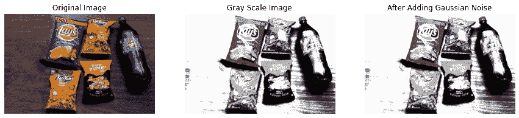

# 使用 OpenCV 进行产品细分-第 1 部分

> 原文：<https://medium.com/analytics-vidhya/segmentation-of-products-using-opencv-part-1-4d5829679849?source=collection_archive---------17----------------------->

分割可以定义为在任何空间中突出感兴趣的区域。它可以是从一本书上找到一个好句子，道路上的坑洼，x 光片上的异常区域，商店里腐烂的水果或零售店货架上的任何产品。


在本文中，我们将使用 OpenCV 体验基本分割问题如何与基本简单编码一起工作。因此，我拍摄了一张包含 5 种产品(Lays、Kurkure、Top Yumm 和 Pepsi)的图片，并尝试分割其中一种产品。为了分割区域，我们必须遵循几个步骤。首先使用轮廓和边缘检测从图像中检测产品，正如我们在我的[上一篇文章](https://ramji-b.medium.com/signature-recognition-using-opencv-2c99d878c66d)中看到的，然后分割仅覆盖区域并遮蔽其他产品。

# **边缘检测**

在步骤 1 中，我们只是读取图像，并使用 Canny 边缘检测器可视化检测到的边缘。

```
import cv2
import matplotlib.pyplot as plt
import numpy as np
image = cv2.cvtColor(cv2.imread(‘sample image.jpg’), cv2.COLOR_BGR2RGB)
plt.figure(figsize=(15,5))
plt.subplot(131)
plt.imshow(image)
plt.axis(‘off’)
plt.title(‘Original Image’)
# plt.show()
#converting to grayscale image
gray = cv2.cvtColor(image,cv2.COLOR_BGR2GRAY)
plt.subplot(132)
plt.imshow(gray,’gray’)
plt.axis(‘off’)
plt.title(‘Gray Scale Image’)
# plt.show()
gray = cv2.GaussianBlur(gray,(3,3),0)
plt.subplot(133)
plt.imshow(gray,’gray’)
plt.axis(‘off’)
plt.title(‘After Adding Gaussian Noise’)
plt.show()
```



拍摄照片时，由于外部因素，图像中可能会添加任何类型的噪声。这就是在预处理中向图像添加噪声的原因，这样，现有的噪声将处于相同的高斯分布中，并且使生活更容易。

我试图在 Canny 检测器中使用各种阈值，但无法观察到图像上的任何边缘。换句话说，我可以说边缘检测器的输出不够清晰，无法找到产品的轮廓区域。我们现在必须换一种方式思考！！！

```
fig=plt.figure(figsize=(15,10))
for idx,i in enumerate(range(10,150,25)):
 edged = cv2.Canny(gray,10,200)
 fig.add_subplot(2,3,idx+1)
 plt.imshow(edged,’gray’)
 plt.axis(‘off’)
 plt.title(‘Canny Edge Detector with Threshold: ‘ +str(i))
plt.show()
```


具有不同阈值的 Canny 边缘检测器

# 彩色图案

如果你仔细观察原始图像，我们可以看到背景大部分被较暗的一面(棕色)覆盖，因此想到查看图像的直方图来了解颜色的分布情况。

```
plt.figure(figsize=(15,5))
plt.subplot(131)
plt.imshow(image)
plt.axis(‘off’)
plt.title(‘Original Image’)
plt.subplot(132)
plt.hist(image.ravel(),25,[0,256])
plt.title(“Histogram of colors”)
plt.subplot(133)
color = (‘b’,’g’,’r’)
for i,col in enumerate(color):
 histr = cv2.calcHist([image],[i],None,[256],[0,256])
 plt.plot(histr,color = col)
 plt.xlim([0,256])
plt.title(“histogram of colors”)
plt.show()
```


是的，查看直方图显示，蓝色波段的分布与红色和绿色波段略有不同。因此，使用不同的波段检测边缘可能会给出清晰的图像。

```
fig = plt.figure(figsize=(15,5))
for idx,v in enumerate([‘R’,’G’,’B’]):
 fig.add_subplot(1,3,idx%3+1)
 plt.imshow(image[:,:,idx])
 plt.axis(‘off’)
 plt.title(v)
plt.show()
fig = plt.figure(figsize=(15,5))
for idx,v in enumerate([‘R’,’G’,’B’]):
 fig.add_subplot(1,3,idx%3+1)
 img = image[:,:,idx]
 img = cv2.Canny(img,60,200)
 plt.imshow(img)
 plt.axis(‘off’)
 plt.title(v+’ Canny’)
plt.show()
```


耶！！！现在我们可以区分每个产品的边缘。在下一篇文章中，我们将看到如何分别在边缘产品上绘制轮廓，并使用不同的颜色将其分割出来。