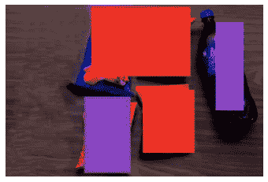

# 使用 OpenCV 进行产品细分—第 2 部分

> 原文：<https://medium.com/analytics-vidhya/segmentation-of-products-using-opencv-part-2-5095867683e4?source=collection_archive---------8----------------------->

在[第一部分](/analytics-vidhya/segmentation-of-products-using-opencv-part-1-4d5829679849)中，我们采用原始图像，在 Canny 检测器中对灰度图像进行了不同阈值的实验，最终观察到了一些好的结果，图像的“R”、“G”和“B”带明显分叉。为了更好地理解，请在继续之前阅读我的第 1 部分。

今天，我们将检测每篇文章的确切区域，并使用不同的颜色将其分割出来。

# **检测篇**

我们如何检测文章？。一种方式可以是使用简单的轮廓检测技术来检测物品的外部区域，并且近似检测到的轮廓以形成矩形框。另一种方式可以是使用预训练的深度学习(DL)来直接检测区域。DL 和简单的基本 OpenCV 方法的使用基于您正在处理的问题陈述。假设你想分割人、信号柱、树、猫、汽车、自行车等。在自动驾驶汽车的应用中，我们需要采用 DL 方法，因为汽车必须每隔几秒钟就对帧进行一次操作，以将您安全地驾驶到目的地。在这个应用程序中，我们只是试图从标准图像中检测 5 篇文章，所以我更喜欢前者。

进行膨胀以增强 canny 检测的图像

```
import cv2
import matplotlib.pyplot as plt
import numpy as np
image = cv2.cvtColor(cv2.imread(‘sample image.jpg’), cv2.COLOR_BGR2RGB)gray = cv2.cvtColor(image,cv2.COLOR_BGR2GRAY)
gray = cv2.GaussianBlur(gray,(3,3),0)img = image[:,:,2]
img = cv2.Canny(img,60,200)kernel = np.ones((5,5),np.uint8)
dilation = cv2.dilate(img,kernel,iterations = 5)
plt.imshow(dilation,’gray’)
```


原始和放大图像

```
orig = image.copy()
cnts = cv2.findContours(dilation.copy(), cv2.RETR_LIST, cv2.CHAIN_APPROX_SIMPLE)
cnts = imutils.grab_contours(cnts)
cnts = sorted(cnts, key= cv2.contourArea, reverse=True)[:5]
for c in cnts:
 peri = cv2.arcLength(c,True)
 apprx = cv2.approxPolyDP(c, 0.1*peri, True)
 x,y,w,h = cv2.boundingRect(apprx)
 cv2.rectangle(orig,(x,y),(x+w,y+h),(0,255,0),5)
plt.imshow(orig)
```


现在，我们可以看到文章用一个矩形框起来，上面的两篇文章被框起来作为一个整体，因为它们足够接近，轮廓无法检测到这两篇文章的分离，所以 thumps up 被框得很小。用正确的阈值进一步增强图像将有助于更好的检测。

用不同的颜色给每个识别的区域着色使其分段

```
colors = [(236, 18, 41),(142, 30, 164),(130, 114, 239),(247, 89, 30),(119, 186, 243)]
orig = image.copy()
cnts = cv2.findContours(dilation.copy(), cv2.RETR_LIST, cv2.CHAIN_APPROX_SIMPLE)
cnts = imutils.grab_contours(cnts)
cnts = sorted(cnts, key= cv2.contourArea, reverse=True)[:4]
count = 0
for c in cnts:
 peri = cv2.arcLength(c,True)
 apprx = cv2.approxPolyDP(c, 0.1*peri, True)
 x,y,w,h = cv2.boundingRect(apprx)
 cv2.rectangle(orig,(x,y),(x+w,y+h),colors[count],-1)
 count+=1
plt.imshow(orig)
plt.axis(‘off’)
plt.show()
```



分割图像

坚持读书学习！！！明天会想出一些有趣的话题:-)敬请期待…！