# 分割芝加哥的社区区域——异地 ATM 安装

> 原文：<https://medium.com/analytics-vidhya/segmenting-the-community-areas-of-chicago-offsite-atm-installations-4d9281c33b24?source=collection_archive---------11----------------------->

**数据科学聚类和细分如何帮助银行识别潜在的 ATM 安装社区**

## 背景

银行主要从在分行设置 ATM 开始。这就建立了主要的 ATM(核心)网络。场外自动取款机被安装在人流量高的地方。

通常情况下，零售银行的营销部门会研究银行应该在哪些领域安装非现场 ATM。这种研究按各种参数分组，其中以下是关键参数，

*   每天的预计交通量
*   位置流行度
*   产生现金交易的可能场所(如餐馆、杂货店)
*   服务路线(对于保安公司，自动柜员机是在路线内还是远离路线)
*   附近的其他自动取款机
*   租赁空间问题/费用
*   营销潜力
*   通信和电力基础设施
*   故意破坏和/或犯罪的威胁等级
*   竞争因素(如果同一地点有多台自动柜员机)
*   “前庭偏好”

所有这些参数都被考虑在内并进行优先排序，然后银行采取下一步措施，试图找出这种 ATM 的运营成本

## 问题

虽然有一些机制来找出上述参数中的大部分，但它需要主要针对诸如位置受欢迎程度、其他 ATM 和促进现金交易的可用场地组合等因素的实地工作。这种实地工作既耗时又费钱，而且不同的银行会在相同的地点进行相同的操作。

如果这种实地工作伴随着来自机器学习的一些数据，这些数据提供了邻近地区的性质、其受欢迎程度和可用场地的组合，那么实地工作可以减少很多，并且只关注关键的可能区域和邻近地区。这种机器学习应该能够根据场地类型、受欢迎程度和其他感兴趣的因素，将街区划分为不同的集群。

## 兴趣

所有需要计划开放其异地 ATM 位置或扩展其现有位置的商业银行将能够使用这种细分来做出一些明智的决策。此外，它还根据其他银行现有的 ATM 网络，提供了有关这些银行在各地可能面临的竞争的信息

## 数据输入

**提取基地信息(社区区域)**

所有社区区域的基本信息(社区区域编号、社区区域名称)将从维基百科页面中提取。

链接到维基百科页面:[芝加哥社区](https://en.wikipedia.org/wiki/Community_areas_in_Chicago)

我们将读取带有请求的 html 源文件，并从中提取表格数据。此基本数据集的以下前几行

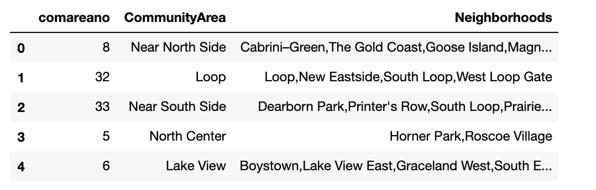

从维基百科提取的基本数据(前 5 行)

**获取社区区域和邮政编码映射**

要向上述数据集添加额外信息，需要有邮政编码，因为所有这些数据集都只有邮政编码。因此，映射是从一个手动创建的外部 CSV 加载的。下面显示了该映射数据集的几行。

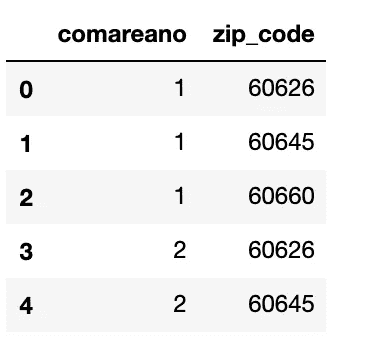

社区区号与邮政编码映射

**从芝加哥数据门户加载人行道咖啡馆数据**

芝加哥数据门户提供了许多关于芝加哥社区的不同信息的 API。我们将使用人行道咖啡馆许可证数据，以便获得每个街区的人行道咖啡馆的数量

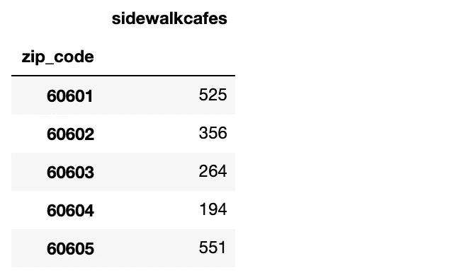

每个邮编的人行道咖啡馆许可证数量

**从芝加哥数据门户**加载杂货数据

我们将使用食品杂货数据来计算每个街区的食品杂货数量。同样，这是从相同的数据门户中提取的

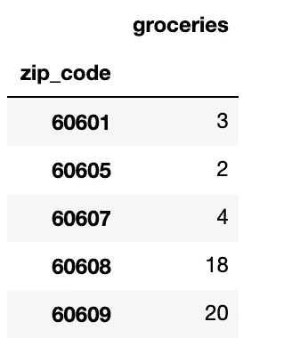

杂货店的数量

**合并人行道咖啡馆和杂货店数据，并在
社区区域级别**进行汇总

我们有从芝加哥数据门户提取的路边咖啡馆和杂货店的数据集。此外，我们的数据集有邮政编码和社区区号映射。让我们使用每个数据集中的邮政编码列将所有这些数据集合并在一起。

合并数据集后，它应该在社区区域级别聚合，因为我们的输入数据需要在社区区域级别构建

最后，将数据集与从维基百科网站提取的基础数据合并。最后数据集看起来像这样。

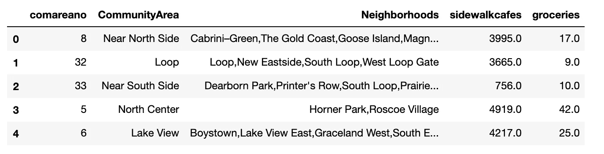

带有全部人行道咖啡馆和杂货店的社区区域的合并数据

**芝加哥社区区域的地理编码**

每个社区区域的地理编码从外部 CSV 文件加载。同一文件将作为数据框加载，然后与上一步中创建的最终输入合并。

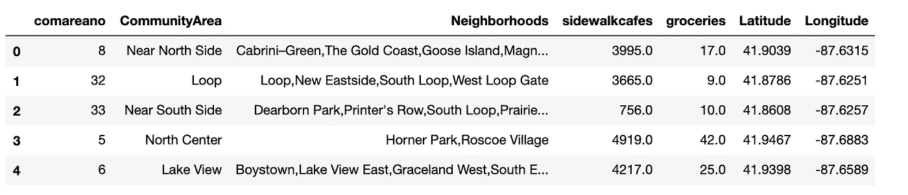

具有地理坐标的社区区域

这就完成了我们数据准备过程的第一部分。这也是我们的基础数据。在继续之前，让我们试着在地图上标出这些社区区域。

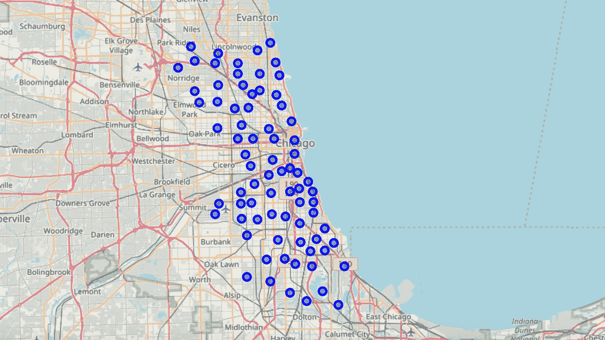

所有芝加哥社区区域都被标绘(稍后将被分段)

## 建设场馆信息

仅我们目前收集的基本信息可能不足以作为对社区进行聚类的特征。

除了以上收集的所有社区区域的基本信息外，我们还应该收集更多关于这些区域的其他场馆和商业网点的信息。为此，我们将尝试使用 Foursquare Places API，它提供了带有地理坐标的任何特定地理位置的场地细节。

因为我们已经收集了每个社区区域的地理坐标，所以让我们用它来为 Foursquare API 提供扫描该社区(半径 1500 米)内所有场馆的信息，并提取每个社区区域的列表，然后从中构建场馆数据集。

这将带来一个像这样的新数据集。

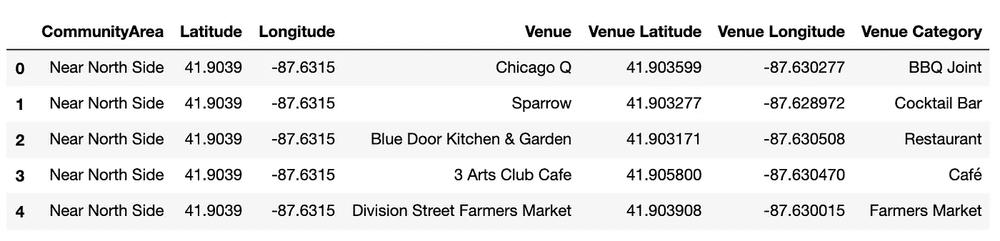

使用 Foursquare Places API 提取的场地

我们只对场地类别感兴趣，对其他细节不感兴趣。我们已经提取了 240 个独特的类别。让我们快速看一下每个社区区域总共提取了多少数据作为场馆信息

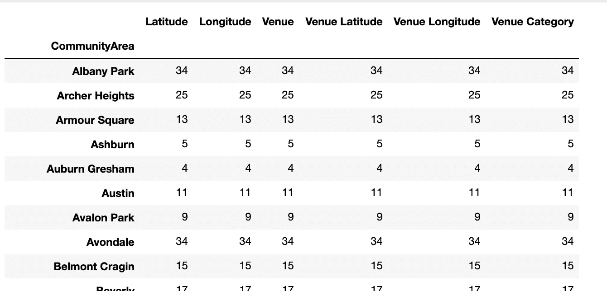

场馆对最初几个社区来说很重要

不是所有的社区都有很多场地，有些社区只有很少的场地，有些社区如铂尔曼根本就没有。下面让我们快速想象一下这些场馆的分布情况

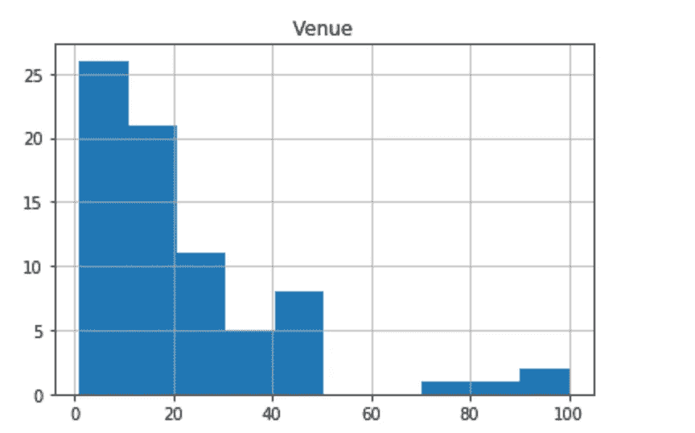

跨社区区域的场馆分布

正如我们所看到的，场馆主要集中在特定的社区区域，而对于其余的，它是垂直稀疏。我们感兴趣的领域是那些有更多场所的社区区域，这意味着这些区域产生更多的交易，从而需要更多的 ATM 设备。

另外，并不是所有的场馆都是我们感兴趣的。我们特别寻找比信用卡交易更能促进现金交易的场所。

例如，一家咖啡店比一家法国餐馆吸引更多的现金交易，同样，一家花店比一家健身房有更多的现金交易。

因此，我们必须将这些场所分为不同的类别，以便判断哪些类别更能促进现金交易

## 场馆分类

如上所述，需要对场地进行分类，以便将促进现金交易的场地类别分开。

首先，所有场馆将被归入更大的类别，具体如下:

*   娱乐
*   食物
*   生活方式
*   零售
*   公用事业

此外，这些桶进一步细分为类型 1 和类型 2，其中类型 1 将比类型 2 吸引更多的现金交易。

让我们用预定义的列表构建这些场馆类型，然后通过将该类别作为附加列添加到上面提取的场馆中。

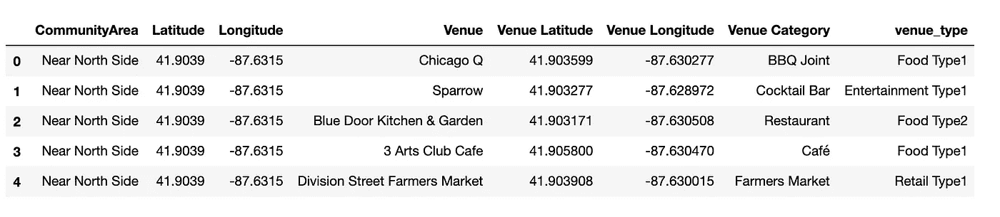

具有场馆类型的数据集(比场馆类别更大的存储桶)

## 构建聚类的特征集

让我们对这个新列“venue_type”进行一次热编码，并将这些构建的类别转换为针对社区区域的功能。这将把所有的场所类型作为列显示在每个场所行上。现在，每种场地类型都成为一种特色。

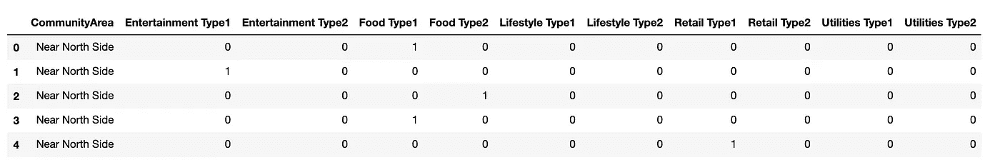

场馆类型作为特征

让我们按社区区域对这些数据进行分组，并根据每个社区区域的每个类别统计找到的场馆数量。这些构建了社区区域的特征集，稍后将在这些社区区域的聚类中使用该特征集

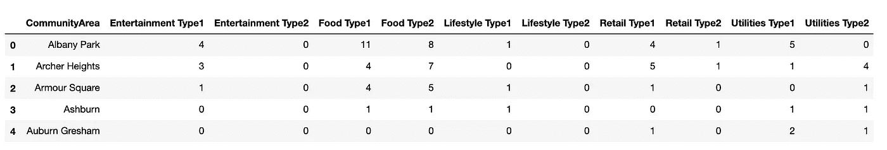

按社区级别分组的场馆类型特征

有了这个具有特征集的数据集，是时候合并包含目前从芝加哥数据门户和地理坐标提取的所有信息的原始数据集了。

此外，让我们通过从数据框中删除所有不必要的列，从这个合并的数据集创建一个用于聚类的数据集。这将是芝加哥社区的最终特征集

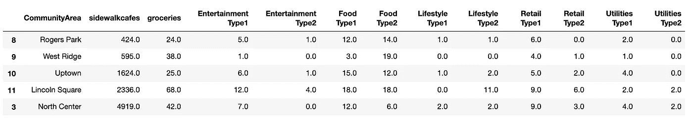

聚类的最终特征集

## 将要素集转换为分类值

由于特征集中的所有列都包含连续的数值，因此应该将其转换为分类值，以便定义为用于聚类的特征。

为此，让我们确定每一列的平均值，然后根据计数值是否小于平均值，将所有数值归类为分类代码:高(1)和低(0)。

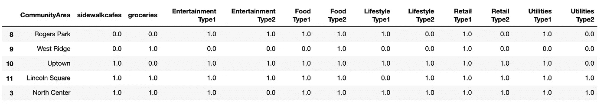

具有分类值的最终要素集-全部设置完毕，可用于聚类

## 芝加哥社区的聚集

K-Means 聚类将用于对具有上述特征的社区区域进行聚类。我们将保持簇号为 3，以将所有社区区域分成三个簇。

一旦使用 K-Means 聚类确定了所有社区区域的聚类标签，让我们将上面为每个社区区域计算的聚类标签合并到原始数据框中，该数据框包含所有场馆信息和关于社区区域的其他详细信息，包括地理坐标

下面提供了具有从 K-均值聚类得到的聚类标签的数据集

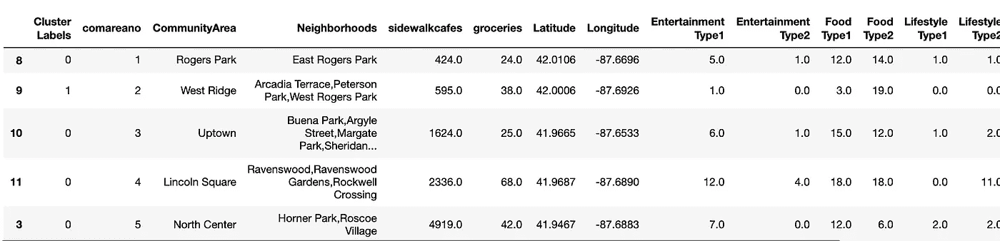

集群标签定义了社区区域属于哪个集群

让我们将包含聚类标签的最终数据框绘制到芝加哥地图中，这将很容易表示聚类。每个聚类由不同的颜色标记来定义。

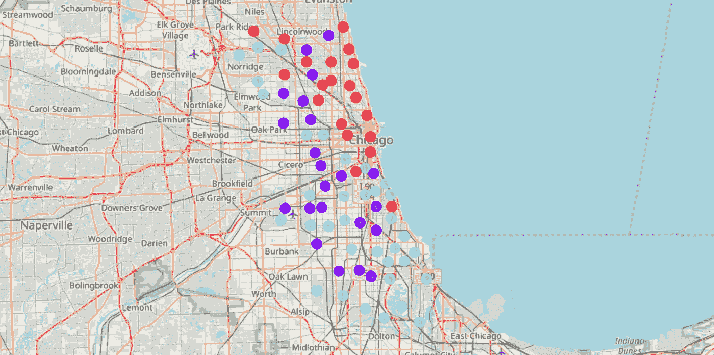

芝加哥社区区域集群

这里，聚类 1 是红色标记，聚类 2 是蓝色标记，聚类 3 是绿色标记。

## 集群洞察

从上面构建的集群中，我们可以尝试了解每个集群的本质，以便选择适合新 ATM 安装的集群

让我们尝试加载每个集群的社区区域，以了解区域的类型。

**集群 1 社区区域:**

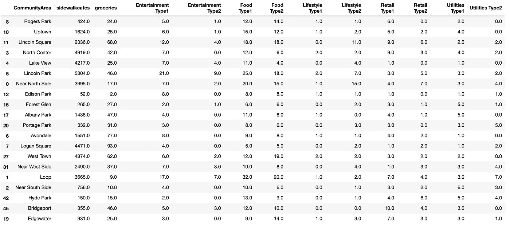

第 1 组居民区(高潜力地区)

从该集群的场地和其他商业机构的组合来看，该集群似乎适合任何银行的新 ATM 安装。这些场所大多提倡现金交易，而不是卡交易，这将使这个集群成为自动取款机的最爱。

**集群 2 社区区域:**

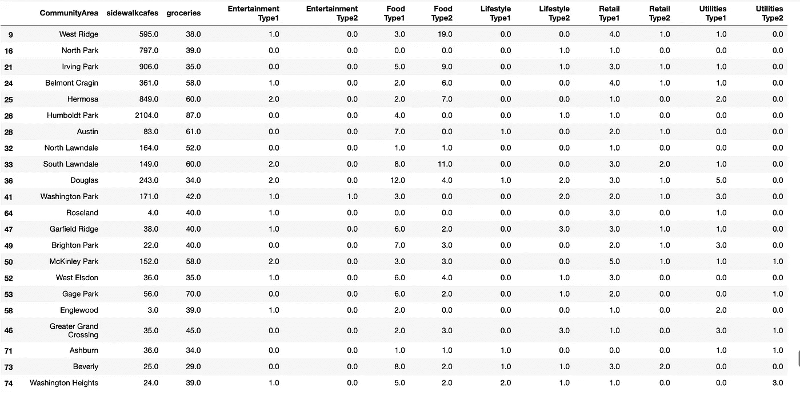

第 2 组居民区(中等潜力地区)

从该集群的场馆和其他商业机构的组合来看，该集群似乎适合安装新的 ATM，但不像集群 1 那样具有更大的潜力。这些场所中的大多数都促进现金交易和卡交易，这将使该集群适合于银行运行二级 ATM 或租赁/捆绑，而不是独立运行

**集群 3 社区区域:**

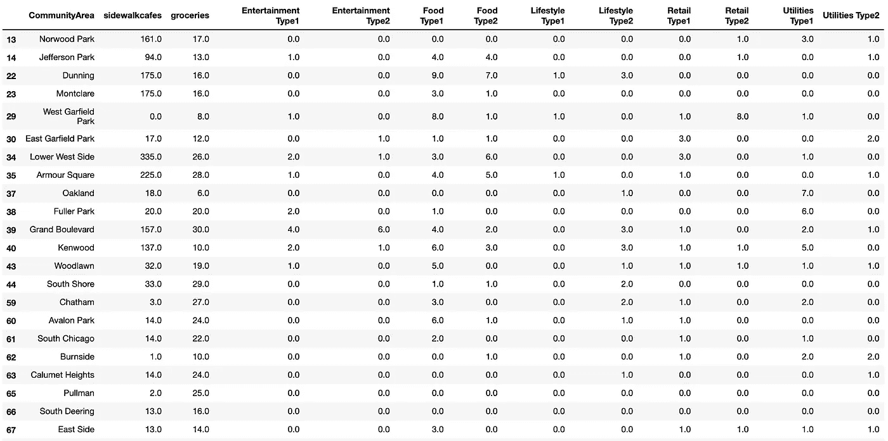

第 3 组居民区(低潜力地区)

从该集群的场馆和其他商业机构的组合来看，该集群似乎不适合安装新的 ATM。与第 1 组和第 2 组相比，这些社区中所有类别的场馆数量都非常少。

## 结论

根据这项研究，我们想推荐包含在**集群 1** 中的社区区域，作为任何寻求异地 ATM 安装的银行安装新 ATM 的更有潜力的区域。从地理上来看，芝加哥东北部的大多数 T2 区都是银行感兴趣的地区。同样的，大多数中产阶级社区兴趣一般，仍然有一些潜力。同样，西部和南部地区最不吸引银行的兴趣，因为它们缺乏商业场所。

## 未来方向

本研究的目的是从现金交易潜力方面提供一些有意义的社区洞察，现金交易潜力是在该社区运行自动取款机的关键因素之一。这项研究满足了这一要求，并确定了具有这一潜力的有利社区集。

尽管社区区域的这种划分推荐了一组用于安装 ATM 的社区区域，但这应被视为一项研究，应使用其他参数(如客流量、其他银行的竞争、现有的 ATM 安装等)对这些社区区域进行进一步的研究。

这就结束了对芝加哥社区的研究。希望你喜欢阅读这篇文章！