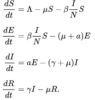
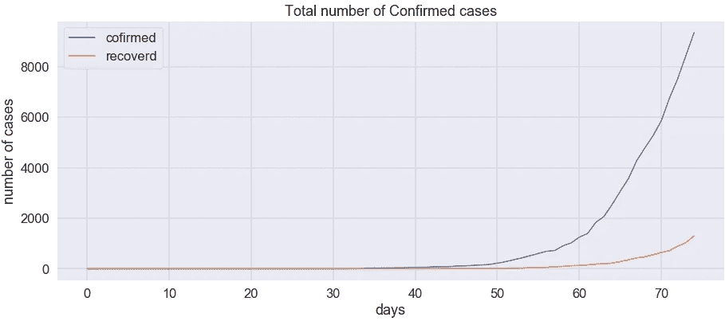
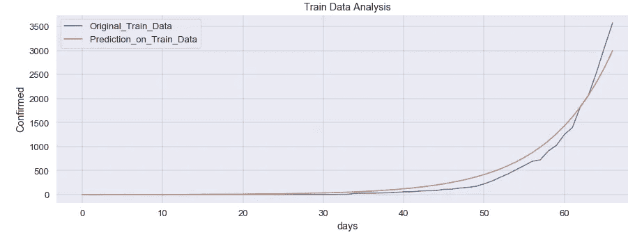
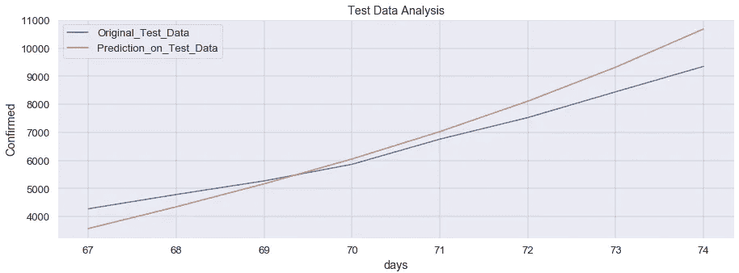
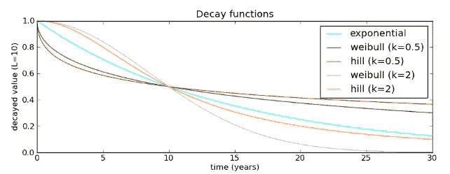
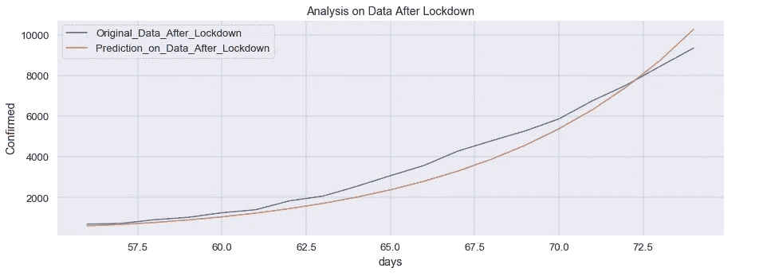
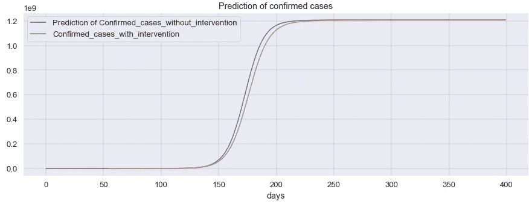

# 新冠肺炎印度数据的 SEIR 分析

> 原文：<https://medium.com/analytics-vidhya/seir-analysis-on-covid-19-india-data-23e8def2c616?source=collection_archive---------31----------------------->

本文旨在将 SEIR 模型(易感、暴露、感染、恢复)应用于新冠肺炎印度数据。这个数据的来源是[](https://www.kaggle.com/sudalairajkumar/covid19-in-india)****。**该数据每天更新。在这篇文章中，我使用了截至 2020 年 4 月 13 日的数据。**

**这篇文章包含**

****1>SEIR 简介****

****2。>实现 SEIR 的 Python 代码****

****3 >如何考虑干预 SEIR 模式** l**

****SEIR 简介****

**这种方法将种群分成四个区间。**

****

**易感者-代表目前未被感染但有可能被疾病感染的人数。**

**暴露(E)-代表暴露于冠状病毒，但由于潜伏期(潜伏期)，他们的身体没有症状的人数。**

**传染性(I)-它代表所有被感染的人的数量，并且很可能传播这种疾病。**

**康复(R)-代表治愈或死亡的人数。请注意在这个模型中没有单独的死亡舱。**

**这四个隔间之间关系由微分方程组给出:**

****

**请注意，这些微分方程和是零，这意味着从一个隔间出来的任何东西都会进入另一个隔间。这意味着**易感者**在与**染病者**接触时，可能会进入**暴露**隔间。部分来自**暴露**隔室的人将根据潜伏期转移到**感染**隔室，部分**感染**的人将根据治疗期间所需的恢复时间**恢复**。在任何时候，所有这些区间的总和将等于总人口。**

**在这些等式中, **β** 可以作为感染者和易感者之间的接触率，而 **γ** 仅仅是恢复率或感染者恢复所需的平均时间。**一个**是潜伏期。上面的等式也有死亡率和出生率的项，但是在这个分析中我们不考虑它们。**

****如何在新冠肺炎印度数据上使用这些信息？****

**在印度，不管我们有什么数据，大多数感染者需要大约 15-25 天才能康复，所以对于这篇文章来说 **γ** 可能是 1/25。日冕的潜伏期大约是 5.2 天(**值得商榷，但在大多数文章中是 5.2** )，所以对于这篇文章来说 **a** 是 1/5，但我们不知道 **β。**我们将**使用曲线拟合**来确定这个参数 **β。Scipy(python 中的一个包)有一些用于曲线拟合和求解微分方程的工具。****

****创建求解微分方程的函数****

```
# Total population, N.
N = 1210568111
# Initial number of infected and recovered individuals, I0 and R0.
I0, R0 = 1, 0
E0=0
# Everyone else, S0, is susceptible to infection initially.
S0 = N — I0 — R0
# Contact rate, beta, and mean recovery rate(rec),incubation period(gamma),
beta, gamma,rec = 5,5,25 
# A grid of time points (in days)
t = df_train[‘days’]
x_test = df_test[‘days’]
# The SIR model differential equations.
def deriv(t, y, N,gamma,rec,beta):
 S, E, I,R = y
 dSdt = -beta * S * I / N
 dEdt = (beta * S * I / N) — ((1/gamma) * E)
 dIdt = ((1/gamma) * E)-((1/rec)*I)
 dRdt = (1/rec) * I
 return dSdt,dEdt, dIdt, dRdt
```

**在上面的代码片段中， **deriv** 是将生成所需微分方程的函数的名称。现在这些微分方程将由另一个函数求解。**

```
def fit_odeint(t, beta):
 y0 = S0, E0, I0,R0
 ret = solve_ivp(deriv,[0,t.max()],y0,args=(N,gamma,rec,beta),t_eval=np.arange(t.max()+1),method=’Radau’)
 S, E, I,R = ret.y
 if(I.shape[0]==t.shape[0]):
   if((S.sum()*E.sum()*I.sum()*R.sum())>0):
       res=np.concatenate(((I+R),R),axis=0)
       return(np.array(res))
   else:
       return(np.zeros((2*t.shape[0],)))
 else:
 return(np.zeros((2*t.shape[0],)))
```

**该函数使用 scipy 包的 **solve_inp** 函数。它求解微分方程系统，在这种情况下由函数 **deriv 给出。**现在你们可能都已经注意到，这个函数 **fit_odeint** 还有一个参数β(接触率)，其值是未知的，我们将使用曲线拟合找到该值。**

```
popt, pcov = optimize.curve_fit(fit_odeint,t,y,maxfev=500000000,p0=[beta])
```

****结果****

**现在是时候看看我们所做的所有这些繁重工作的结果了。**

****

**原始资料**

****上周的数据被认为是测试数据，其余的都是训练数据。****

****

****列车数据预测****

****

****对测试数据的预测****

**对测试数据的预测没有那么好 **(R2=0.83)** 但是为什么会这样呢？这是因为我们没有考虑**锁定的影响吗？让我们检查一下。****

**如何考虑 SEIR 模型中的锁定效应？**

**由于封锁，接触率将会下降。衰减函数有几个选项。来源-[https://github . com/Swiss TPH/open malaria/wiki/ModelDecayFunctions](https://github.com/SwissTPH/openmalaria/wiki/ModelDecayFunctions)**

****

**我已经使用了 K=2 的希尔函数，并使用曲线拟合来寻找 L(衰变率)。**

**修改后的功能:**

```
def deriv_1(t, y, N,gamma,rec,L,k):
 S, E, I,R = y
 beta=0.27/((1 + (t/L)**k))
 dSdt = -beta * S * I / N
 dEdt = (beta * S * I / N) — ((1/gamma) * E)
 dIdt = ((1/gamma) * E)-((1/rec)*I)
 dRdt = (1/rec) * I
 #print(dSdt)
 #print(S,R)
 return dSdt,dEdt, dIdt, dRdt
```

**锁定是在 2020 年 3 月 25 日实施的，因此在那一天之前使用恒定接触率，之后应用该希尔函数。这个 0.27 是在一些迭代之后找到的。**

**发现 L 很大，所以接触率没有降低很多。可能需要更多的数据才能知道下降率。**记录锁定后的全部数据，用于查找 L** 。与前面的例子不同，它没有分为测试和训练，只是为了扩大训练数据集，以便人们可以更好地理解数据。**

****

****锁定后数据预测****

**现在让我们试着预测未来**

****

****关于 2020 年 1 月 31 日之后天数的确诊病例预测****

****关键要点:****

**1 >根据这一模型，曲线稳定大约需要**210 天，比 2020 年 1 月 31 日(8 月第一周)**多。在该分析中，接触率的下降非常小，但在实际情况下，由于锁定和其他措施，接触率将以更快的速度下降，因此该持续时间可能会更短。你也可以观察到确诊病例的价值相当高。这是因为接触率是折旧在模型中不是很突出。**

**2 >增加病床数量和隔离所有感染者，将大大降低接触率，这将有助于稳定曲线。**