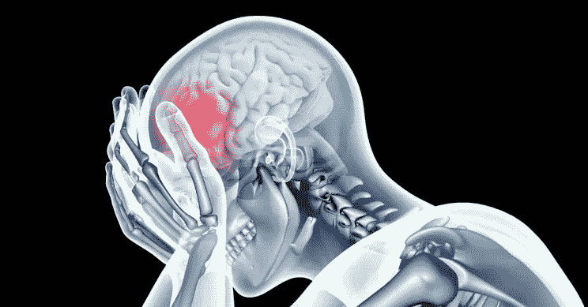
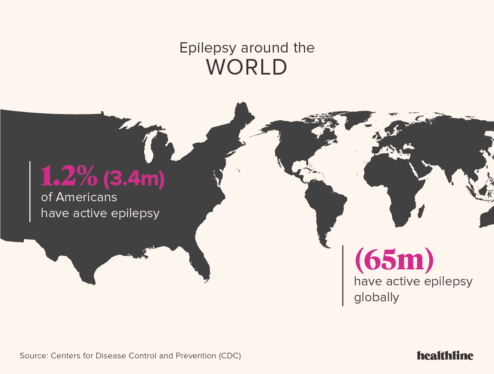
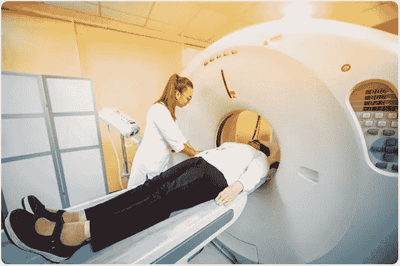
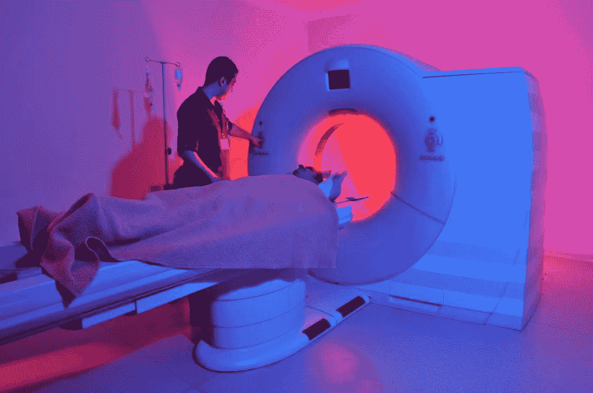
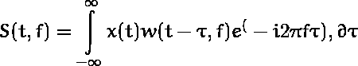
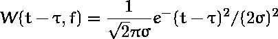
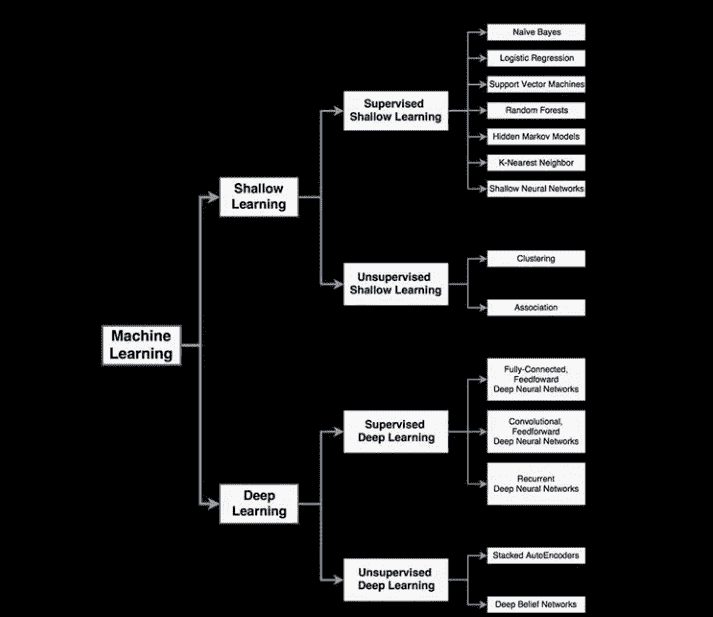
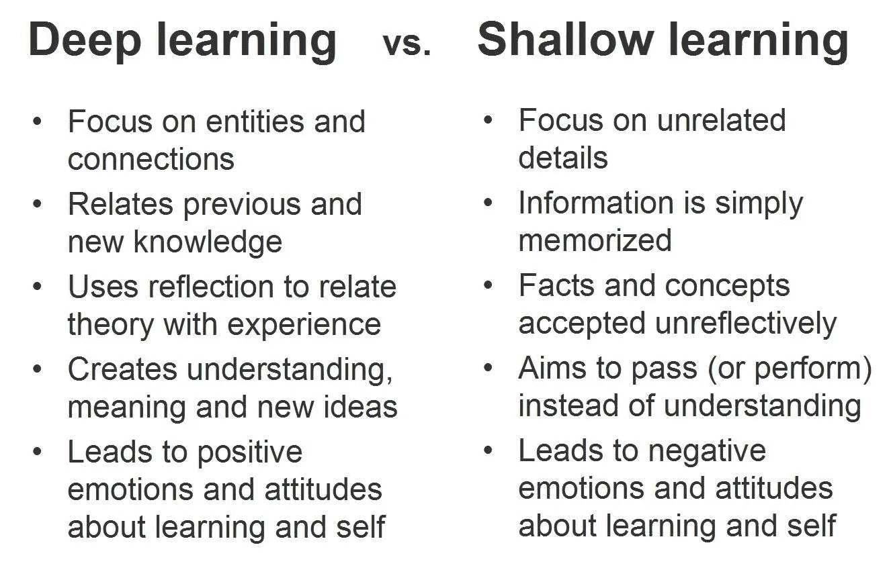
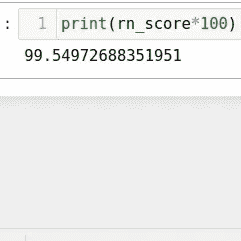

# 使用机器学习的癫痫检测

> 原文：<https://medium.com/analytics-vidhya/seizure-detection-using-machine-learning-35d5d1d0eab0?source=collection_archive---------25----------------------->

## 传统方法到高级统计机器学习方法。

> 嗨伙计们！！我是一名计算机专业的学生，非常喜欢深度学习。人工智能正在通过将艰难的传统任务变得更简单来彻底改变世界。人工智能在任何地方都蓬勃发展，当然，在生物医学领域，有大量数据可以用来训练模型。人工智能在医学领域取得了如此多的卓越成就，例如预测青光眼，这对一个人来说是一项非常困难的任务，如果不尽早预测，甚至可能导致失明。
> 
> 所以，在这里我要告诉另一个这样乏味的任务，它可以通过深度学习方法来彻底改变。

# **问题**

癫痫发作是大脑中突然的、不受控制的电干扰。它会导致你的行为、动作、感觉和意识水平的改变。如果你有两次或两次以上的癫痫发作，或有反复发作的趋势，你有癫痫。癫痫是影响大脑的最常见疾病之一。在统计美国的儿童和成人时:美国约有 510 万人有癫痫史。美国约有 340 万人患有活动性癫痫。



没收



癫痫患者热点图

这里的问题不仅仅是大量的病例，而且用来监测这些病人的方法是如此的令人厌倦和难以捉摸。

## 你如何评估癫痫发作？

如上所述，这些癫痫发作是大脑中的电干扰，有许多方法用于从大脑信号中捕捉癫痫发作。

其中一些是:

1.  )脑电图


脑电图学

2.)计算机断层摄影



CT 扫描

3.)磁共振成像



核磁共振扫描

脑电图是全球广泛使用的一种。为了诊断这些 EEG 记录，传统的方法是由神经科医生对这些记录进行视觉感知。想象一下，一个人综合分析一个病人的记录可能需要一天的时间来分类，而队列中有如此多的病例。人类无法看到脑电图记录中的统计信息，而机器学习模型可以做到这一点。

这是问题陈述，也是开发癫痫检测自动化的目的

# 我们的工作介绍:

目前，在深度学习领域有许多与癫痫检测相关的工作，我们正在努力使用生成对抗网络带来一种优化的检测方法。

这篇文章是基于在培训阶段给我的一个任务，以弄清 EEG 数据的基本知识，并在我们的深度学习项目中对它们进行组合。

这里，在这项任务中，我们利用斯托克威尔变换和浅层学习器，如随机森林、朴素贝叶斯和决策树。

我使用 Stockwell 变换对原始的 EEG 数据进行预处理，并将其变换为时间-频率矩阵，然后在上述分类器中进行训练。使用 random forest，我得到了接近 99.6%的准确率。

这里使用的数据集是 [**波恩-数据库**](http://epileptologie-bonn.de/cms/front_content.php?idcat=193&lang=3)

# 波恩-数据集:

这是互联网上关于缉获量的最小数据集。其规模大约在 1000 万英镑左右。

分为 5 套:

1.  集合 A —正常
2.  集合 B —正常
3.  集合 C—Ictal 间
4.  集合 D—Ictal 间
5.  set E — Ictal

每套有 100 个特征和 4097 个样本。

集合 A 和集合 B 是来自健康人的 EEG 记录，而集合 C 和集合 D 是来自处于正常和发作之间的状态的发作受影响的人。这种介于正常和描边之间的状态称为发作间。在这个阶段，我们可以确定这个人会发作。发作时的状态为 Ictal。

# **斯托克韦尔转型:**

在解释 S-Transform 之前。你可能会有一些问题，比如为什么我们需要变换信号来进行分析，这些变换对这些信号做了什么？。我在这里回答这些问题！。

## 为什么我们需要转换信号？

主要是为了方便和经济。在一个领域很难做到的许多事情，在另一个领域就会变得微不足道。例如，滤波所需的时域卷积在傅立叶变换之后变成简单的乘法。这是大多数当前数字通信技术(包括 LTE、WiFi 等)的核心。

另一个例子可以是在音频和视频信号中的噪声去除或者在诸如 mp3 和 mp4 的编解码器中执行的信号压缩。所有这些都是通过将输入信号变换(有时是非线性地)到不同的域中并且仅采用重要的特征来完成的。

在更广泛的层面上，你甚至可以将所有的人工神经网络视为在对变换后的输出做出决策之前对输入信号执行非线性变换

# 这些变换对这些信号做了什么？

转型只不过是从一个领域转向另一个领域。就像从时域到频域一样。这些变换将信号从时域改变到频域，反之亦然。

在我们的例子中，S 变换是一个时间-频率分解工具，它将信号变换为时间-频率分布。时间-频率分布描绘了与时间有关的频率模式的变化。利用这种分布，可以同时分析时间和频率。



t →时间

f →频率

x(t)是输入信号，并且使用高斯窗口函数来缩放输入信号

w(t-τ，f)为[高斯窗函数](https://www.dsprelated.com/freebooks/sasp/Gaussian_Window_Transform.html)，其为

给出者:



高斯窗函数

**窗口函数**对一组行进行操作，并从底层查询中为每一行返回一个值。术语**窗口**描述了**功能**操作的一组行。一个**窗口函数**使用来自**窗口**中的行的值来计算返回值。

解释高斯窗口函数可能需要更多的时间。我会在下一篇博客中解释。所以，在这里你可以想象一个函数，它对矩阵的行进行操作并返回转换后的值。

```
<script src="[https://gist.github.com/ThiruRJST/e1b8a3850640c2badadf793d38d21955.js](https://gist.github.com/ThiruRJST/e1b8a3850640c2badadf793d38d21955.js)"></script>
```

原始 EEG 数据的预处理步骤，以收集浅层学习者可以学习的特征。

# **机器学习部分**



机器学习的子集

浅层学习和深层学习的主要区别在于，浅层学习者依赖于特征。另一方面，深度学习器从临时数据中提取信息或特征，并建立完善的预测模型。

你可以在这里理解:



深度学习和浅层学习的区别

这里我使用了随机森林分类器，这是一个肤浅的学习者。我用它是因为这只是一次复习课，以便更好地理解我论文的基础知识。让我们开始学习吧。

随机森林分类器只不过是一种基于投票的分类算法，是一种集成方法。一组决策树组成了一个随机森林算法，因此称为集成方法。

让我们举一个实时的例子来更好地理解:

现在，在疫情的情况下，我们都被锁在家里。真的很无聊对吧。你决定看连续剧，但不知道如何选择其中的一个。所以，你让你的朋友 **X** 给你推荐几个系列。你的朋友 **X** 询问你喜欢的类型(可能是爱情片、动作片或惊悚片等；)→这是 **X** 带去了解你口味的特征。X 建议你看一些连续剧。但是，你现在要求你所有的朋友像 **Y，Z，K，M** 建议一些系列。你的朋友组成了一个决策树，你们分享的信息决定了结果。形成解的方法基于[信息论和交叉熵](https://towardsdatascience.com/cross-entropy-from-an-information-theory-point-of-view-456b34fd939d)。我们不要陷得太深。

这是随机森林分类器工作的基本方式。

```
<script src="[https://gist.github.com/ThiruRJST/a7c9bf3e7b012a71b8e50a8b0a0f5c05.js](https://gist.github.com/ThiruRJST/a7c9bf3e7b012a71b8e50a8b0a0f5c05.js)"></script>
```

我使用随机森林分类器得到的准确率是 99.5%



准确(性)