# 选择排序:实现和分析

> 原文：<https://medium.com/analytics-vidhya/selection-sort-implementation-and-analysis-27b682181883?source=collection_archive---------30----------------------->

赫克托·j·里瓦斯在 [Unsplash](https://unsplash.com?utm_source=medium&utm_medium=referral) 上拍摄的照片

排序在任何计算机应用中都起着重要的作用。在处理大量数据时，通过使用高效的排序算法，我们可以对数据进行排序，从而简化我们的数据分析过程。今天，我们将深入探讨一种这样的排序算法——选择排序*(更多算法，请看*[*https://getsetcode.blog/algorithms/*](https://getsetcode.blog/algorithms/)*)*

**选择排序:定义**

选择排序是比较容易理解的算法之一。让我们先看看这种算法是如何工作的，然后分析处理数据所需的时间，最后了解随着我们输入更多数据，这种效率是如何变化的。我们还将用 C#实现该算法。

选择排序作用于数组数据结构，一个简单的定义如下——“对于数组中的 N 个元素，循环 N-1 次，在每次迭代中， ***选择最小的元素并将其带到该迭代的第一个索引”***

让我们直接进入一个例子，并通过我们的方式来理解算法。

我们希望对以下数组进行排序:

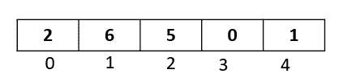

根据定义，

1.  我们要循环 4 次( *N-1 次)*。让我们称 1 次循环为数组的 1 次迭代
2.  在每次迭代中，我们都要找到最小的元素，并把它带到迭代的开始位置。

为了完成上述操作，我们定义变量 ***start*** 来跟踪每次迭代的开始位置，同时定义变量 ***min*** 来跟踪一次迭代中的最小元素。

首先，让我们从索引 0 处初始化 ***start*** ，并且***min****等于索引 0 处的元素:*

*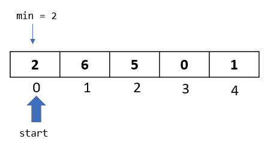*

***迭代 1***

*我们现在开始迭代数组。每当我们移动到下一个元素时，我们检查该元素是否小于我们的 min 元素。如果是，我们将该元素赋值给 min。如果不是，min 保持不变，我们继续前进到下一个元素。我们将这样做，直到到达数组的最后一个元素:*

**注意* ***开始*** *将始终指向数组*的第一个位置*

*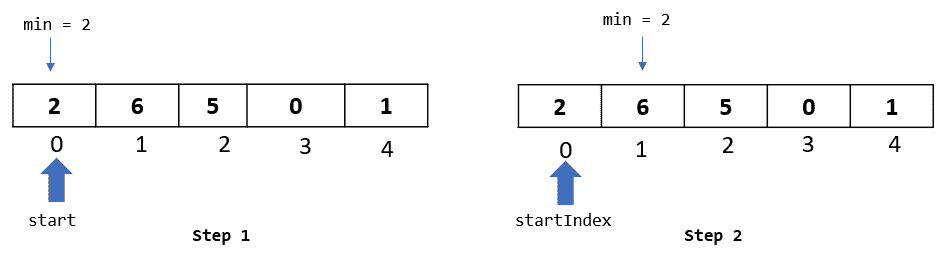**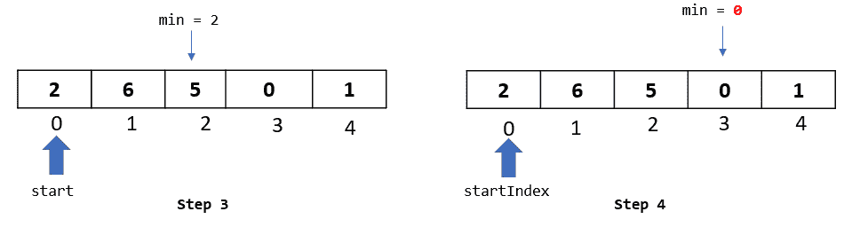**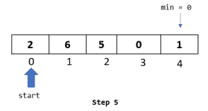*

*我们现在已经到达了数组的最后一个元素，并且已经在索引 3 处识别出了最小的元素“0”。*

*作为该迭代的最后一步，我们将交换最小元素，该元素位于起始位置:*

*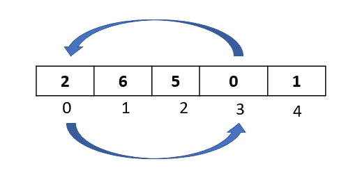*

*这将给出下面的数组，最小元素在第一个位置。注意，此时我们已经对第一个元素进行了排序。让我们将第一个元素变灰，以突出显示它已经被排序，并且从下一次迭代开始，我们不需要查看这个元素。*

*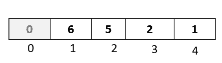*

***迭代 2***

*在最后一次迭代中，我们能够对一个元素进行排序，但是我们还有四个元素要排序！因为索引 0 处的元素已经排序，所以我们将从索引 1 开始迭代。让我们再次初始化我们的**开始**和**最小**变量:*

*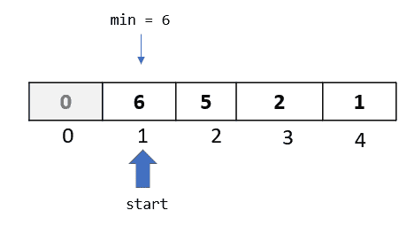*

*像上次一样，我们将遍历数组，检查每个索引处的最小元素，直到到达数组的末尾:*

*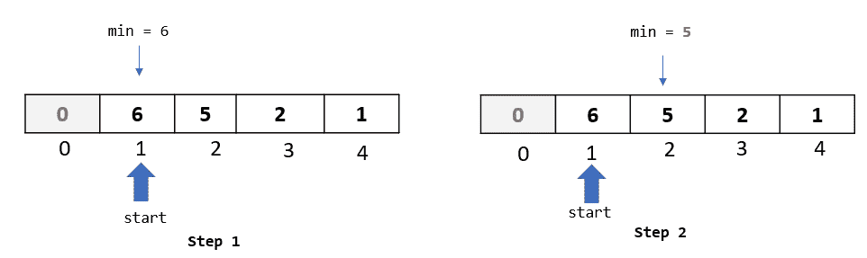**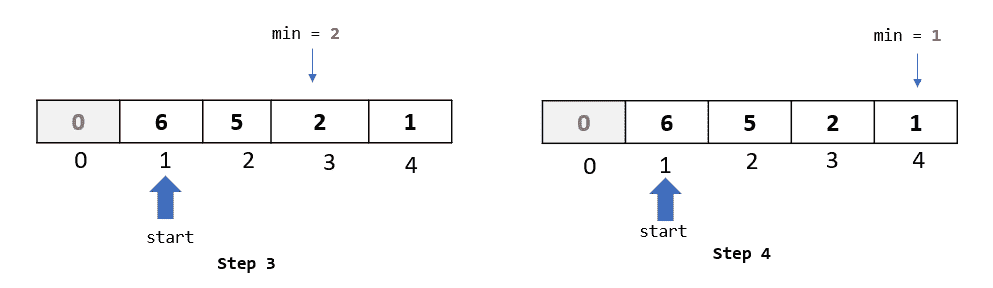*

*我们现在已经到达了数组的最后一个元素，并且已经确定了索引 4 处的最小元素。正如我们在上一次迭代中所做的那样，我们将把这个最小的元素与本次迭代开始位置的元素进行交换:*

*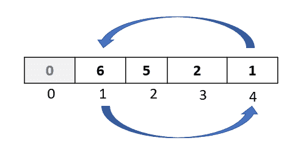*

*在这一步之后，我们现在已经将数组中的前两个元素放在了正确或排序的位置:*

*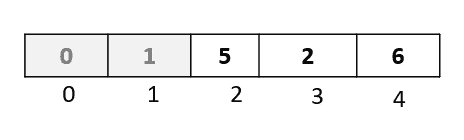*

*现在我们已经掌握了算法，让我们快速地做所有剩余的迭代。*

***迭代 3***

*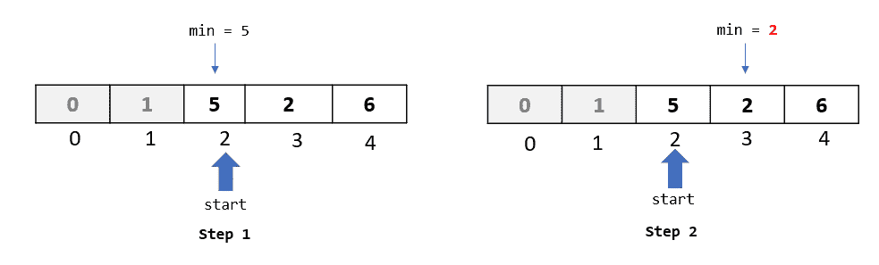**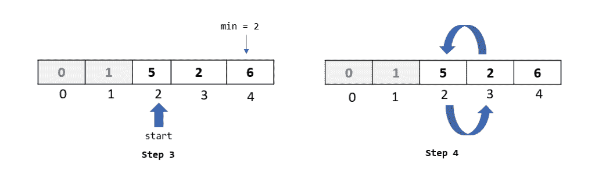**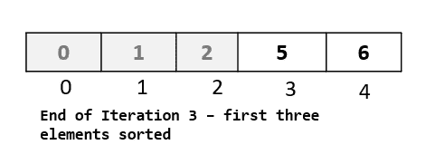*

***迭代 4***

*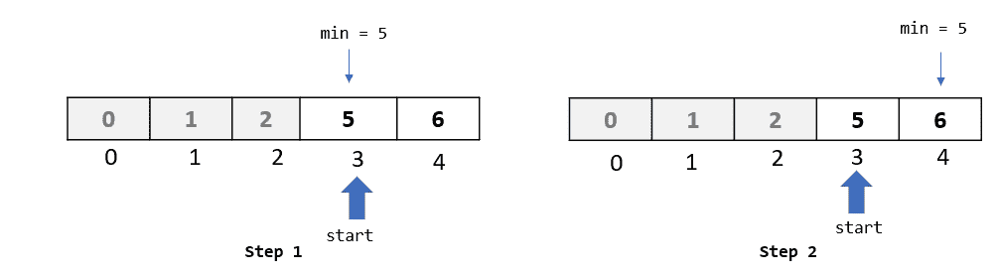*

*注意，在这个迭代中，标识的最小元素是“5”，它在索引 3 处，也是这个迭代的**开始**索引。因此，最小元素已经处于正确的位置，我们不需要将它与任何其他元素交换:*

*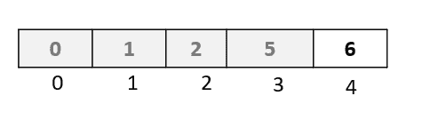*

*第四次迭代是我们的最后一次迭代。我们在这些迭代中排序了 4 个元素。我们只剩下最后一个元素，由于所有其他元素都已排序，我们可以有把握地说最后一个元素也在正确的位置。这就是选择排序对 N 个元素运行 N-1 次迭代的原因。*

***快速回顾***

1.  *对于 N 个元素，该算法运行 N-1 次迭代*
2.  *对于每次迭代，我们确定起始位置，并将最小元素指定为等于该起始位置的元素*
3.  *我们遍历数组直到最后一个元素。对于每个元素，我们检查它是否小于最小元素。如果是，我们替换最小元素*
4.  *在迭代结束时，我们已经确定了 min 元素，并将其与起始位置的元素交换*

***用 C#实现***

*下面是该算法的 C#实现。*

*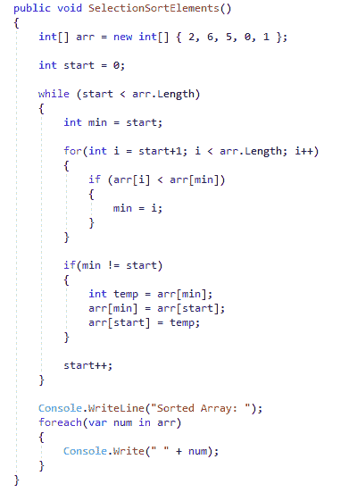*

*   ***arr** 表示要排序的数组*
*   ***start** 表示数组的开始位置。随着每一次迭代，我们将从 1 开始递增。该算法将一直运行，直到 start 到达数组的末尾*
*   ***min** 表示最小元素的索引。我们将它初始化为起始位置。*

*为了更好地理解代码，让我们将代码分成几部分:*

1.  *我们将运行该算法，直到 **start** 到达数组的末尾:*

*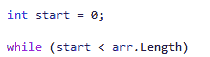*

*2.下面的 for 循环表示一次迭代。我们将 min 初始化为等于起始索引。然后，我们遍历从“start + 1”索引开始的每个元素，直到数组的末尾。我们将每个元素与“最小”索引处的元素进行比较。如果我们找到一个更小的元素，我们重新分配最小索引*

*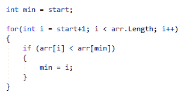*

*3.最后，如果最小索引与起始索引不同，我们交换这两个索引处的元素，将最小的元素放在第一个位置:*

*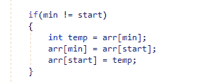*

*运行上面的算法，我们得到排序后的数组:*

*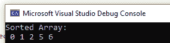*

***复杂性分析***

*我们在选择排序中有三个主要操作:*

1.  ***迭代** —在我们 5 个元素的例子中，我们做了 4 次迭代。因此，我们可以说，对于 N 个元素，选择排序将运行 N-1 次迭代*
2.  ***交换** —在每次迭代结束时，我们执行一次交换——最小元素与第一个位置的元素交换*
3.  ***比较** —比较是我们检查每个元素是否小于最小元素时的操作。对于我们的第一次迭代，我们做了 4 次比较，对于第二次迭代，我们做了 3 次，对于第三次迭代，我们做了 2 次比较，对于第四次迭代，我们做了 1 次比较。换句话说，我们做了:(N-1) + (N-2) + (N-3) … + 1 次比较。*

*对于 1 次迭代，我们做了:1 次交换+ N-1 次比较*

*对于(N-1)次迭代，我们将进行大约:(N-1) * (1 次交换+ N-1 次比较)*

*如果我们忽略上面等式中的所有常数，我们将得到 N * N，或者 N 的平方(N)。*

*因此，选择排序的复杂度是 O(N)。*

***数据增加时算法的效率***

*我们推导出算法的复杂度为 N 的平方。如果我们插入数字，我们可以看到算法的运算次数是如何增加的:*

*N = 5，N = 25*

*N = 10，N = 100*

*N = 15，N = 225*

*这表明，通过增加 5 个元素，我们正在以非常快的速度增加操作的数量。仅仅通过从 5 个元素增加到 10 个元素，我们就增加了 75 个操作！当我们从 10 个元素增加到 15 个元素时，我们增加了 125 个操作！*

*因此，随着数据的增加，算法效率会降低，因此在对大量数据进行排序时，选择排序不是一个好的选择。*

***总结***

*   *选择排序适用于数组数据结构。它在数组中循环 N-1 次，并在每次循环中找到最小的元素。此元素被第一个位置的元素交换。*
*   *该算法中的主要操作是*迭代、交换和比较。*通过计算运算次数，我们可以推导出选择排序的复杂度为 O(N)*
*   *随着输入数据的增加，算法执行的操作数量会以更快的速度增加，这使得选择排序对于大量数据来说是一个糟糕的选择。*