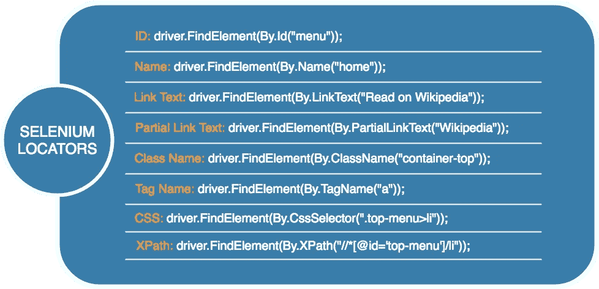

# 硒定位器——详细指南

> 原文：<https://medium.com/analytics-vidhya/selenium-locators-a-detailed-guide-784572b5d718?source=collection_archive---------15----------------------->



Selenium 是开发人员为 web 应用程序运行自动化测试的最受欢迎的选项之一。Selenium suite 具有出色的灵活性——它允许开发人员/团队在本地机器或云上运行测试，通过许多常用的编程语言(包括 Python、Java 等)进行交互。尽管 selenium 面临一系列挑战，但正是它的灵活性使 selenium 成为了最好的测试框架。在本文中，我们将探索如何在 Selenium 中使用定位器。

**什么是硒定位器？**

Locator 是一个命令，它告诉 Selenium IDE 哪些 GUI 元素(比如文本框、按钮、复选框等。)它需要动手术。识别正确的 GUI 元素是创建自动化脚本的先决条件。但是准确识别 GUI 元素比听起来要困难得多。有时，您最终会使用不正确的 GUI 元素或者根本没有元素。Selenium 提供了许多定位器来精确定位 GUI 元素

**通过 selenium 执行自动化步骤的步骤**

**1。**下载浏览器驱动程序

**2。**启动 Selenium WebDriver

**3。**实例化浏览器

**4。**加载 web 应用程序

**5。**在定义的测试中执行指定的操作

**6。**评估测试是否达到了预期的结果

**7。**关闭网络驱动程序

在 Selenium WebDriver 初始化并加载了要测试的网页之后，Selenium 中的定位器在上面的第五步中开始起作用。定位器使测试人员能够选择 HTML DOM 元素进行操作。这篇文章研究了 [Selenium WebDriver](https://www.browserstack.com/guide/selenium-webdriver-tutorial) 中各种类型的定位器。

**Selenium 中的不同定位器如下:**

按 CSS ID:*find _ element _ by _ ID*

按 CSS 类名:*find _ element _ by _ class _ name*

按名称属性:*查找元素按名称*

通过 DOM 结构或者 XPath:*find _ element _ by _ XPath*

按链接文本:*find _ element _ by _ link _ text*

按部分链接正文:*find _ element _ by _ partial _ link _ text*

按 HTML 标签名称:*find _ element _ by _ tag _ name*

虽然所有这些定位器都返回单个元素，但是可以使用*。find_elements()* 方法查找多个元素。

**通过 CSS ID 定位元素**

这是在 HTML DOM 中定位元素的最简单的方法。CSS ID 存储在 HTML DOM 元素的 *id* 属性中，按照设计，它对于页面中的每个元素都是唯一的。因此，ID 可以唯一地标识一个元素。

要使用此功能，需要调用*。 *webdriver* 类的 find_element_by_id()* 方法。这是它的样品。

```
from selenium import webdriverdriver = webdriver.Chrome(‘./chromedriver’)driver.get(“https://www.google.org")search_bar = driver.find_element_by_id(“id-search-field”)
```

如果不存在 ID 为的 DOM 元素，则会引发一个 *NoSuchElementException* ，这可以通过使用 try-catch 块来解决。

理论上，页面上的每个 DOM 元素都应该有一个惟一的 ID。然而，在实际生活中，人们并不经常注意到这一点。大多数元素可能没有 ID，或者可能遇到两个 ID 相同的元素。在这种情况下，需要使用不同的策略来惟一地标识 DOM 元素。

**通过 CSS 类定位元素**

在页面上定位元素的第二个策略是通过类名进行搜索。类名存储在 HTML 标记的 class 属性中。按照设计，CSS 类适用于一组 DOM 元素。*。find _ element _ by _ class _ name()*方法只返回匹配类的第一个元素。如果没有具有给定类名的元素，它将引发一个 *NoSuchElementException* 。这是它的示例代码片段。

```
from selenium import webdriverdriver = webdriver.Chrome(‘./chromedriver’)driver.get(“https://www.google.org")# Returns first element with matching classfirst_search_bar = driver.find_element_by_class_name(“id-class-name”)
```

**通过名称定位元素**

在 HTML5 中，表单元素通常有一个与之相关联的 name 属性。*。find_element_by_name()* 方法只返回匹配类的第一个元素。如果有多个同名元素，将返回第一个匹配的元素。没有匹配的元素导致一个 *NoSuchElementException* 错误。

考虑以下形式:

```
*<form id=”loginForm”>**<input name=”name” type=”text” value=”First Name” />**<input name=”name” type=”text” value=”Last Name” />**<input name=”email” type=”text” value=”Business Email” />**<input name=”password” type=”password” />**<input name=”continue” type=”submit” value=”Sign Me Up” />**</form>*
```

以下代码返回电子邮件表单元素。

`email_input = driver.find_element_by_name(“email”)`

但是，下面的代码只返回名字表单元素。

`name_input = driver.find_element_by_name(“name”)`

使用*。find_element_by_name()* 方法，不可能到达示例中输入表单字段的姓氏。我们可以使用*find _ elements _ by _ name()*返回一个元素列表，然后我们可以从这个列表中进行选择。这也有可能是下一个定位器。

**通过 XPath 定位元素**

如果不能通过 ID、类或名称识别元素，就需要通过 XML 路径定位元素。这个过程也可以在读取 XML 文档时实现。在这篇博客中，我们探索了**相对路径**的使用，因为**绝对路径**容易因 HTML 结构的微小变化而出错。

我们将使用*。find_element_by_xpath()* 方法在文档中定位适当的元素。*的说法。*find _ element _ by _ XPath()【方法】取的是元素的路径。

要查找上面 HTML 表单示例中的电子邮件输入字段，可以使用以下代码:

`email_input=driver.find_element_by_xpath(“//form[input/@name=’email’]”)`

该代码片段搜索页面的第一个表单元素。在这个表单中，它搜索名称等于值 email 的输入，从而缩小到所需的元素。

接下来，让我们尝试定位上面表单中的名字和姓氏输入元素。

`first_name=driver.find_element_by_xpath(“//form[@id=’loginForm’]/input[1]”)`

`last_name=driver.find_element_by_xpath(“//form[@id=’loginForm’]/input[2]”)`

该方法首先搜索 ID 为 login form 的表单，然后选择表单的第一个和第二个输入元素作为名字和姓氏。

**其他单元素定位器**

除了我们已经讨论过的流行方法之外，在 Selenium WebDriver 中还有一些其他的元素定位器，测试人员可能希望探索一下。

用户可以使用*通过 HTML 标签名称来定位元素。find_element_by_tag_name()方法。*

`page_heading = driver.find_element_by_tag_name(‘h1’)`

还可以使用链接文本搜索超链接元素。人们可以使用*。find_element_by_link_text()* 方法来搜索确切的链接文本，或*。find _ element _ by _ partial _ link _ text()*方法来搜索部分文本。

```
# Exact Link Textclick_here_link = driver.find_element_by_link_text(‘Click Here’)# Partial Link Textclick_here_link = driver.find_element_by_partial_link_text(‘Click’)
```

**定位多个元素**

在本教程中，我们讨论了只定位单个元素的方法。人们可能希望选择一组元素，然后遍历它们。*。find_elements()* 方法有助于在 DOM 结构中查找多个元素。

以下是*的常见用法示例。find_elements()* 方法。要查找 ID 为 *loginForm* 的表单的所有输入元素，请使用以下代码片段

```
from selenium.webdriver.common.by import Byall_inputs = driver.find_elements(By.XPATH, ‘//form[@id=’loginForm’]/input’)To locate all elements with a class name, use the following code –from selenium.webdriver.common.by import Byall_elements = driver.find_elements(By.CLASS_NAME, ‘my-css-class’)
```

**关于硒定位器的最终想法**

至此，我们结束了关于使用 Python 在 Selenium 中使用定位器的博客。我们讨论了在 HTML 页面中选择元素的各种方法。我们首先看了单元素选择器，然后转向 Selenium WebDriver 中的多元素选择器。