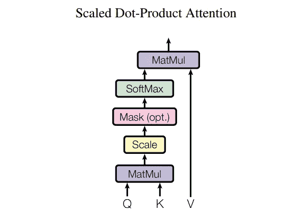
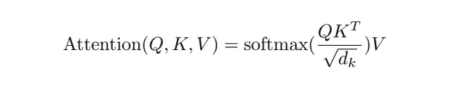
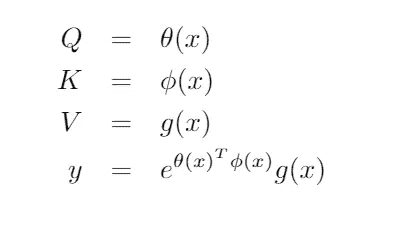
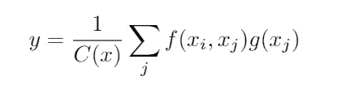
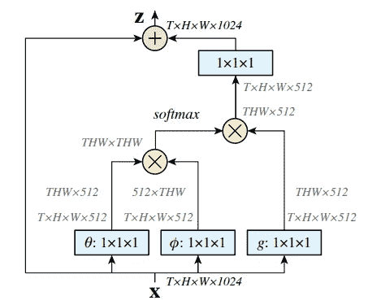
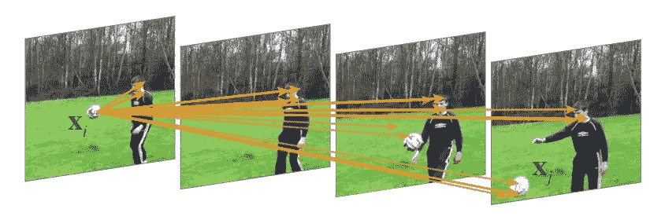

# 自我关注与非局域网络

> 原文：<https://medium.com/analytics-vidhya/self-attention-and-non-local-network-559349fe0662?source=collection_archive---------5----------------------->

图片来源:[https://pxhere.com/en/photo/1063830](https://pxhere.com/en/photo/1063830)

在[变形金刚](https://proceedings.neurips.cc/paper/2017/hash/3f5ee243547dee91fbd053c1c4a845aa-Abstract.html)的背景下，自我关注这个概念可能已经被讨论了一百万次。一方面，Transformer 的提出通过使用注意机制解决了建模长循环的问题。另一方面，变形金刚的大多数[解释都是基于时间域，而不是空间域。](/lsc-psd/introduction-of-self-attention-layer-in-transformer-fc7bff63f3bc)

论文[非局部神经网络](https://openaccess.thecvf.com/content_cvpr_2018/html/Wang_Non-Local_Neural_Networks_CVPR_2018_paper.html)将自我关注概念扩展到空间域，以模拟图像的非局部属性，并展示了如何将这一概念用于视频分类。

先来看自我关注。

这里的[非常清楚地解释了变压器的工作原理。对于句子中的每个单词，提取 3 个特征的元组:(K=key，Q=query，V=value)。然后，该元组被传递到 softmax 层，以提取相应的注意力:](/lsc-psd/introduction-of-self-attention-layer-in-transformer-fc7bff63f3bc)

图片取自变压器原纸

由等式表示，它被写成如下:

这种表示在 NLP 领域非常简单。问题是，有没有办法从另一个角度看问题，例如，在图像/视频分析中？

由于 Q、K、V 都是基于输入 x 的表示，因此可以将上述注意力矩阵重新表述如下:

注意 y 是沿某个轴的 softmax 计算

y 可以很容易地解释为嵌入式高斯域中非线性函数的核表示。因此，我们可以将 y 写成如下:

也就是论文中的等式(1)。使用这个公式，可以有多个内核表示(或者本文中所谓的实例化),如高斯、点积或者使用 Relu 的连接。

这个公式可以很容易地与著名的 2005 年 CVPR 论文中的[离散非局部均值去噪滤波器联系起来，这就是为什么这个模型被称为非局部网络。](https://ieeexplore.ieee.org/abstract/document/1467423)

非本地网络基本遵循自关注设计，如下图:

图片来自原非本地网文

这是同一帧内以及不同帧之间的像素之间的顶部响应的图示:

图片来自原非本地网文。请注意跨多个帧的足球对象之间的高度非局部响应。

总之，论文[非局部神经网络](https://openaccess.thecvf.com/content_cvpr_2018/html/Wang_Non-Local_Neural_Networks_CVPR_2018_paper.html)提供了一个有趣的视角，将最初的 softmax 注意力重新表述为非线性模型的核心表示，并建立了与传统非局部均值滤波器的联系。