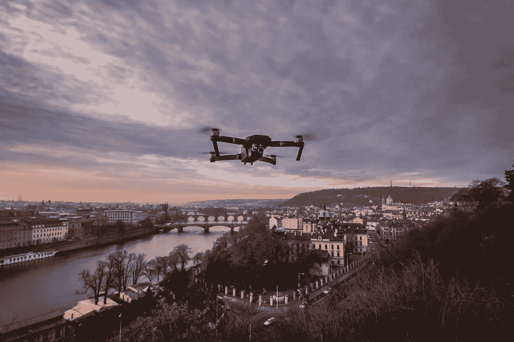
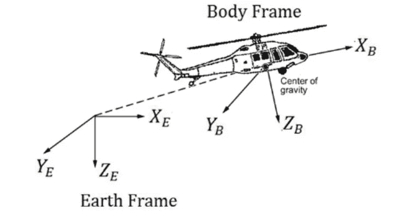
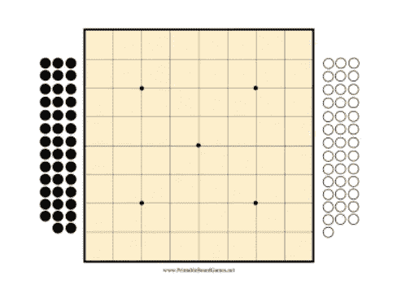
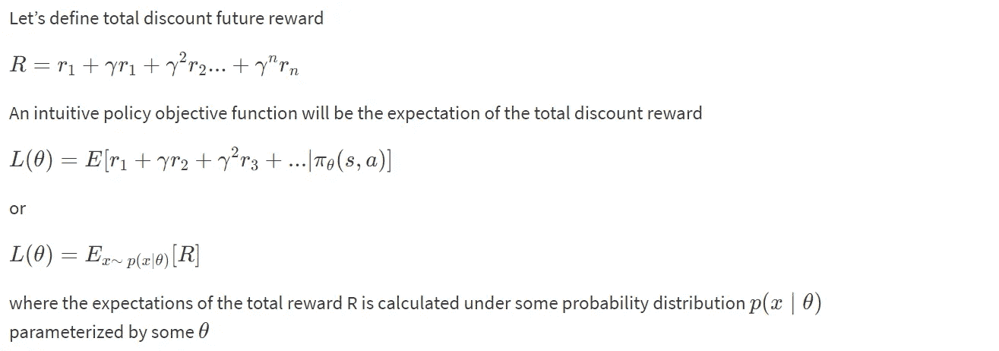
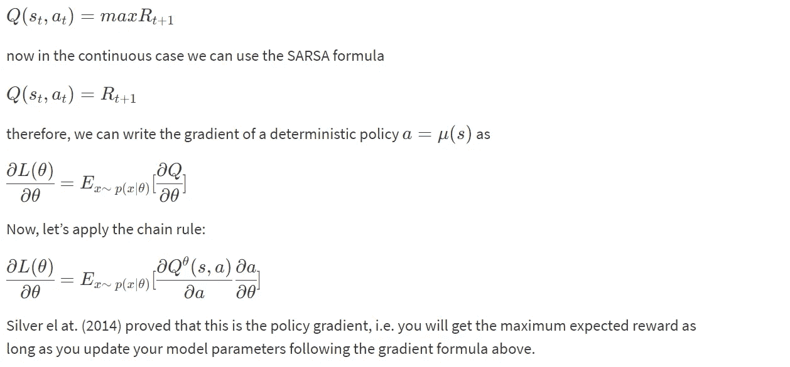
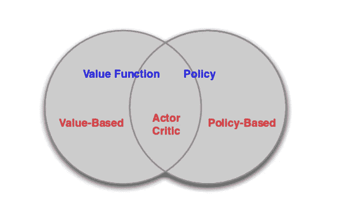
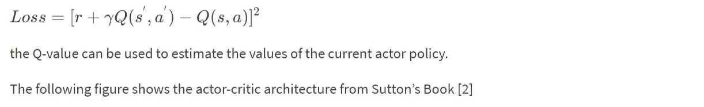
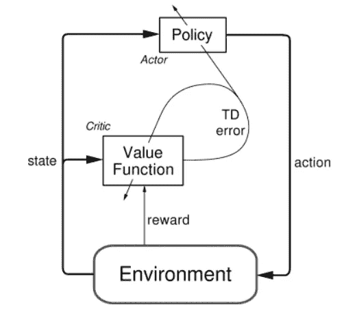
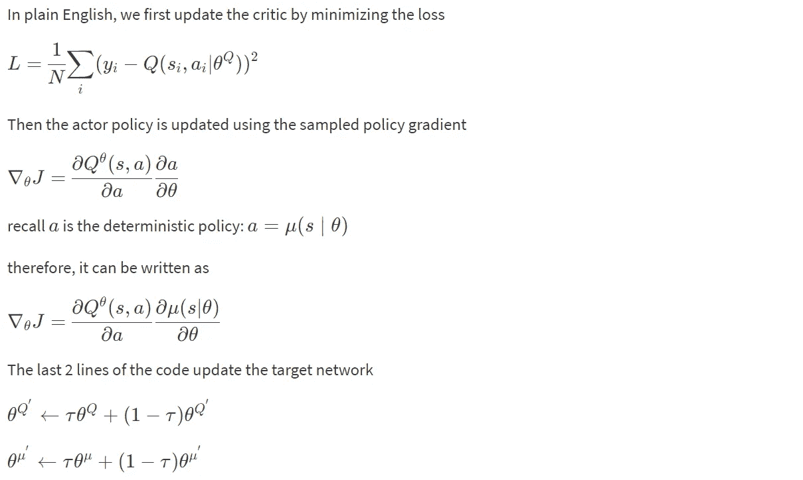
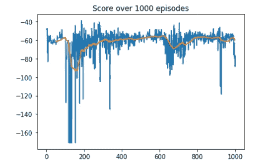

# 使用 ML、RL 和 AI 的自主无人机

> 原文：<https://medium.com/analytics-vidhya/self-flying-drone-using-reinforcement-learning-4a1ab5a37932?source=collection_archive---------18----------------------->



四轴飞行器或**四旋翼直升机**正成为越来越受欢迎的个人和专业用途飞机。它的机动性使其适用于许多领域，从最后一英里的运输到电影摄影，从杂技到搜救。

这一发展的下一步是使四轴飞行器能够自主实现所需的控制行为，如起飞和着陆。您可以用经典的方法设计这些控制(比如，通过实现 PID 控制器)。或者，您可以使用强化学习来构建能够自己学习这些行为的代理。这就是我们在这个项目中要做的！

**安装依赖:**

Matplotlib==2.0.0

Numpy==1.14.1

熊猫==0.19.2

Python 2.7

Keras 1.1.0

张量流 r0.10

**重要文件:**

Github 链接:[**https://github.com/yash143/Self-Flying-drone/tree/master**](https://github.com/yash143/Self-Flying-drone/tree/master)**，**跟着我一起看上面链接提供的 Jupyter 笔记本([Self _ flying _ drone . ipynb](https://github.com/yash143/Self-Flying-drone/blob/master/Self_flying_drone.ipynb))。

**动机:**

从童年起，我就对遥控汽车、机器人、无人机和一切使用人工智能的东西情有独钟，但我永远也不能拥有这些小玩意。虽然我们距离建立超级智能的人工智能系统还很远，但计算机视觉、强化学习和深度学习的最新发展已经为我创造了一个令人兴奋的时代，至少可以实现我现在创造人工智能系统的小小梦想。

**背景:**

正如我们所知，最近 Q-Learning 的进步导致深度 Q-Learning 在许多方面使生活变得更简单。然而，深度 Q 网络的一个很大的局限性是，如果你考虑汽车的例子，输出/动作是离散的，而像转向这样的动作是连续的。使 DQN 适应连续域的一个显而易见的方法是简单地离散动作空间。然而，我们遇到了“维数灾难问题”。例如，如果您将方向盘从-90 度离散化到+90 度，每个离散化 5 度，将加速度从 0 公里离散化到 300 公里，每个离散化 5 公里，您的输出组合将是 36 个转向状态乘以 60 个速度状态，等于 2160 个可能的组合。当你想制造机器人来执行一些非常专业的事情时，情况会更糟，例如需要精细控制动作的脑外科手术，而天真的离散化将无法达到操作所需的精度。我希望这个例子足以说明为什么 DQN 不适合所有的任务。

谷歌 Deepmind 设计了一种新算法，通过结合 3 种技术来解决连续行动空间问题 1) [确定性策略梯度算法](http://jmlr.org/proceedings/papers/v32/silver14.pdf) 2) [行动者-批评家方法](https://webdocs.cs.ualberta.ca/~sutton/book/ebook/node66.html) 3) [深度 Q 网络](https://arxiv.org/abs/1312.5602)称为[深度确定性策略梯度(DDPG)](https://arxiv.org/abs/1509.02971)

**无人机模拟器(物理)(可选):**

**文件:Drone_physics.py**

**链接:**[https://github . com/yash 143/Self-Flying-Drone/blob/master/Drone _ physics . py](https://github.com/yash143/Self-Flying-drone/blob/master/Drone_physics.py)

那些对四轴飞行器背后的物理学感兴趣的人，让我们开始吧。

简单来说，当能量从电池流向转子马达时，螺旋桨开始旋转，正是每个螺旋桨相对于其他螺旋桨的旋转改变了高度和方向。加速转子，它们将产生足够的升力来克服重力，使无人机越来越高。但其背后的物理原理远比看起来复杂。**所以我会尽量简化。**

首先，我们需要移动坐标系，因为惯性坐标系的轴是地球固定的，机身坐标系的轴与无人机对齐，如下图所示。



我们可以使用下面的函数/矩阵来移动帧。

```
def earth_to_body_frame(ii, jj, kk):

    R = [[Cos(kk)*Cos(jj), Cos(kk)*Sin(jj)*Sin(ii)-Sin(kk)*Cos(ii), 
             Cos(kk) * Sin(jj) * Cos(ii) + Sin(kk) * Sin(ii)],
         [Sin(kk)*Cos(jj), Sin(kk)*Sin(jj)*Sin(ii)+Cos(kk)*Cos(ii), 
             Sin(kk)*Sin(jj)*Cos(ii)-Cos(kk)*Sin(ii)],
         [-Sin(jj), Cos(jj)*Sin(ii), Cos(jj)*Cos(ii)]]
    return np.array(R)
```

其中 **ii=phi，jj=theta，kk=psi 为欧拉角**。R 的转置给出了体坐标系到地球坐标系的转换矩阵。所以当你把惯性系[x，y，z]中的一个向量乘以 R，你就得到这个向量相对于物体坐标系的表示。

在我们的项目中，无人机由 4 个旋翼组成。代理通过设置四个旋翼的每秒转数来控制无人机。因此我们的**动作空间大小为 4。**

**无人机的位置**由 **(x，y，z)和欧拉角φ，θ，psi**(【x，y，z，φ，θ，psi】)定义在任意时间步 t，我们的最终目的是改变无人机在每个时间步之后的位置。

为了改变 x，y，z 分量，我们需要计算无人机的加速度，因为**位置[x，y，z] =初始位置[x，y，z] +速度[x，y，z] *dt + 0.5 *加速度[x，y，z]* dt*dt。**

我们知道**线性 _ 加速度=线性 _ 力/无人机质量**。所以 linear_forces 可以从下面的函数计算出来。

```
def find_body_velocity():
        body_velocity = 
        np.matmul(earth_to_body_frame(*list([x ,y ,z ])), 
        velocity[x,y,z])
        return body_velocity
def get_linear_drag():
        (areas = np.array([length * height, width * height, width 
        *length]) , #rho=density of air , #C_d=drag coefficient)

        linear_drag = 0.5 * rho * find_body_velocity()**2 * 
        areas_of_drone * C_d

        return linear_drag
def get_linear_forces(self, thrusts):
        # Gravity
        gravity_force = mass * gravity * np.array([0, 0, 1])
        # Thrust
        thrust_body_force = np.array([0, 0, sum(thrusts)])
        # Drag
        drag_body_force = -get_linear_drag()
        body_forces = thrust_body_force + drag_body_force

        linear_forces = 
        np.matmul(body_to_earth_frame(*list([x,y,z])), 
        body_forces)
        linear_forces += gravity_force
        return linear_forces
```

现在我们终于可以在计算 linear_forces 后更新[x，y，z]的值了。

**Angles[phi，theta，psi] = Intial_Angles[phi，theta，psi]+angular _ velocity * self . dt+0.5 * angle _ accels * self . angular _ accels * self . dt * * 2**

现在为了更新欧拉角，我们同样需要角加速度。

**角加速度=力矩/惯性矩**。所以力矩可以从下面的函数中计算出来。

```
I_x = 1 / 12\. * mass * (height**2 + width**2)
I_y = 1 / 12\. * mass * (height**2 + length**2) 
I_z = 1 / 12\. * mass * (width**2 + length**2)
moments_of_inertia = np.array([I_x, I_y, I_z])  # moments of inertiadef get_moments(thrusts):
        thrust_moment = np.array([(thrusts[3] - 
        thrusts[2])*self.l_to_rotor,(thrusts[1] - thrusts[0]) * 
        self.l_to_rotor,0])

        drag_moment =  C_d * 0.5 * rho * angular_v * 
        np.absolute(angular_v) *areas *dims *dims

        moments = thrust_moment - drag_moment # + motor_inertia_moment
        return moments
```

现在我们终于可以更新φ，θ和 psi 了。

因此，我们的整个状态数组**【x，y，z，phi，theta，psi】**将在每个时间步长之后更新，从而产生一个新的状态。以上模拟的完整代码在 Drone_physics.py 中提供

**重要提示:**

**状态空间= [x，y，z，phi，theta，psi]**

**动作空间= [ v1，v2，v3，v4](4 个转子的速度)**

**政策网络:**

首先，我们将定义一个**策略网络**来实现我们的 AI 驱动程序。这个网络会取无人机的状态(**【x，y，z，phi，theta，psi】**)并决定动作(**4 个旋翼的速度**)。它被称为基于策略的强化学习，因为我们将直接参数化策略

*π*t22】θ(*s*，*a*)=*p*[*a*∣*s*， *θ*

这里，s 是状态，a 是动作并且 *θ* 是策略网络的模型参数。我们可以认为政策是主体的行为，即从状态到行动的映射函数。

**确定性与随机性策略:**

请注意，有两种类型的策略:

确定性策略:*a*=*μ*(*s*)

随机政策:*π*(*a*∣*s*)=*p*[*a*∣*s*]

为什么除了确定性策略之外，我们还需要随机策略？很容易理解确定性策略。我看到一个特定的状态输入，然后我采取特定的行动。但有时确定性策略不起作用，比如在 GO 的例子中，您的第一个状态是如下所示的空棋盘:



如果你使用相同的确定性策略，你的网络将总是把石头放在一个“特定”的位置，这是一个非常不可取的行为，因为它使你可以被你的对手预测到。在这种情况下，随机策略比确定性策略更合适。

**政策目标函数:**

那么怎么才能找到*π*θ(*s*， *a* )？其实可以用强化技术来解决。例如，假设无人机正试图到达我们指定的位置。开始时，无人机可能只是没有到达目标位置，可能会超出界限并收到负奖励，因此神经网络将调整模型参数 *θ* ，以便下次它将尝试避免超出界限。经过多次尝试后，它会发现“啊，如果我不越过指定的范围，我可能会到达目的地”。在数学语言中，我们称这些政策为目标函数。



**演员-评论家算法:**

Actor-Critic 算法本质上是一种将策略梯度法和价值函数法结合在一起的混合方法。政策功能被称为**参与者**，而价值功能被称为**评论家**。本质上，演员在给定环境的当前状态下产生动作，而批评家产生一个信号来批评演员所做的动作。我认为在人类世界中，初级员工(演员)做实际工作，而你的老板(评论家)批评你的工作，这是很自然的，希望初级员工下次能做得更好。在我们的项目中，我们使用连续 Q 学习(SARSA)作为我们的评论模型，使用策略梯度方法作为我们的行动者模型。下图解释了价值函数/策略函数和参与者-批评家算法之间的关系。



我们需要制作两个文件

**1)无人机 _ 任务。PY:我们将在这个文件中定义我们的任务(环境)。**

链接:[https://github . com/yash 143/Self-Flying-Drone/blob/master/Drone _ task . py](https://github.com/yash143/Self-Flying-drone/blob/master/Drone_task.py)

**2)无人机 _ 智能体。开发我们的强化学习代理**

链接:[https://github . com/yash 143/Self-Flying-Drone/blob/master/Drone _ agent . py](https://github.com/yash143/Self-Flying-drone/blob/master/Drone_agent.py)

**无人机任务:**

代码和解释如下。我们无人机的尝试任务是垂直起飞，然后在 30 高度悬停。我给特工提供了 6D 的目标姿势。奖励功能旨在鼓励无人机垂直起飞并停留在垂直轴上目标位置的范围内。然后，我将奖励限制在[-1，1]范围内，以便于通过神经网络进行学习，并避免爆炸梯度。

**奖励=-. 03*(ABS(self . sim . pose[2]—self . target _ pos[2])+. 005*self . sim . v[2]奖励= np.clip(奖励，-1，1)**

```
import numpy as np
from physics_sim import PhysicsSim

class TakeOff():
    """Task (environment) that defines the goal and provides    feedback 
       to the agent."""
    def __init__(self, init_pose=None, init_velocities=None, 
        init_angle_velocities=None, runtime=5., target_pos=None):
        """Initialize a Task object.
        Params
        ======
            init_pose: initial position of the quadcopter in (x,y,z) 
            dimensions and the Euler angles
            init_velocities: initial velocity of the quadcopter in 
            (x,y,z) dimensions
            init_angle_velocities: initial radians/second for each of 
            the three Euler angles
            runtime: time limit for each episode
            target_pos: target/goal (x,y,z) position for the agent
        """
        # Simulation
        self.sim = PhysicsSim(init_pose, init_velocities, 
        init_angle_velocities, runtime) 
        self.action_repeat = 3

        self.state_size = self.action_repeat * 6
        self.action_low = 0
        self.action_high = 900
        self.action_size = 4

        # Goal
        self.target_pos = target_pos if target_pos is not None else 
           np.array([0., 0., 10.]) 

    def get_reward(self):
        reward=-.03*(abs(self.sim.pose[2] -self.target_pos[2]))             +.005*self.sim.v[2] 
        reward=np.clip(reward, -1, 1)
        return reward

    def step(self, rotor_speeds):
        """Uses action to obtain next state, reward, done."""
        reward = 0
        pose_all = []
        for _ in range(self.action_repeat):
            done = self.sim.next_timestep(rotor_speeds) # update the 
            sim pose and velocities
            reward += self.get_reward() 
            pose_all.append(self.sim.pose)
        next_state = np.concatenate(pose_all)
        return next_state, reward, done

    def reset(self):
        """Reset the sim to start a new episode."""
        self.sim.reset()
        state = np.concatenate([self.sim.pose] * self.action_repeat) 
        return state
```

__init__()方法用于初始化指定任务所需的几个变量。

*   模拟器被初始化为 PhysicsSim 类的一个实例(来自 Drone_physics.py)。
*   受最初 DDPG 论文中方法论的启发，我们使用了动作重复。对于代理的每个时间步，我们执行模拟动作 _ 重复时间步。如果你不熟悉动作重复，请阅读 DDPG 论文中的**结果**部分。
*   我们设置状态向量中元素的数量。对于示例任务，我们只使用 6 维姿势信息。要设置状态的大小(state_size)，我们必须将动作重复次数考虑在内。
*   该环境将总是具有 4 维动作空间，每个转子有一个条目(action_size=4)。您可以在此设置每个条目的最小值(action_low)和最大值(action_high)。
*   这个提供的文件中的示例任务是让代理到达目标位置。我们将目标位置指定为变量。

reset()方法重置模拟器。代理应该在每集结束时调用此方法。你可以在下面的代码单元中看到这样的例子。

step()方法可能是最重要的。它接受代理对 action rotor_speeds 的选择，该选择用于准备传递给代理的下一个状态。然后，根据 get_reward()计算奖励。如果超过了时间限制，或者四轴飞行器超出了模拟的范围，则该集被认为已经完成。

# Keras 代码解释:

我们的代理将包括以下功能。

1)重放缓冲器

2)演员网络

3)评论家网络

4)DDPG 代理

5)噪音

文件: **Drone_agent.py**

链接:**[**https://github . com/yash 143/自飞-Drone/blob/master/Drone _ agent . py**](https://github.com/yash143/Self-Flying-drone/blob/master/Drone_agent.py)**

**让我们了解每个功能**

****重放缓冲:****

**大多数现代强化学习算法受益于使用重放存储器或缓冲器来存储和调用经验元组。**

**以下是您可以使用的重放缓冲区的示例实现:**

```
import random
from collections import namedtuple, deque

class ReplayBuffer:
    """Fixed-size buffer to store experience tuples."""

    def __init__(self, buffer_size, batch_size):
        """Initialize a ReplayBuffer object.
        Params
        ======
            buffer_size: maximum size of buffer
            batch_size: size of each training batch
        """
        self.memory = deque(maxlen=buffer_size)  # internal memory (deque)
        self.batch_size = batch_size
        self.experience = namedtuple("Experience", field_names= 
        ["state", "action", "reward", "next_state", "done"])

    def add(self, state, action, reward, next_state, done):
        """Add a new experience to memory."""
        e = self.experience(state, action, reward, next_state, done)
        self.memory.append(e)

    def sample(self, batch_size=64):
        """Randomly sample a batch of experiences from memory."""
        return random.sample(self.memory, k=self.batch_size)

    def __len__(self):
        """Return the current size of internal memory."""
        return len(self.memory)
```

****演员(政策)网络:****

**先说一下如何在 Keras 建立演员网络。这里我们使用了 3 个隐藏层，分别有 32、64 和 32 个隐藏单元，并带有 relu 激活功能。输出由 4 个连续动作(转子速度)和 sigmoid 激活函数组成。**

```
from keras import layers, models, optimizers
from keras import backend as K

class Actor:
    """Actor (Policy) Model."""

    def __init__(self, state_size, action_size, action_low, 
         action_high):
         Params
        ======
            state_size (int): Dimension of each state
            action_size (int): Dimension of each action
            action_low (array): Min value of each action dimension
            action_high (array): Max value of each action dimension
        """
        self.state_size = state_size
        self.action_size = action_size
        self.action_low = action_low
        self.action_high = action_high
        self.action_range = self.action_high - self.action_low
        self.build_model()

    def build_model(self):
        """Build an actor (policy) network that maps states -> 
         actions."""
        # Define input layer (states)
        states = layers.Input(shape=(self.state_size,), name='states')

        # Add hidden layers
        net = layers.Dense(units=32, activation='relu')(states)
        net = layers.Dense(units=64, activation='relu')(net)
        net = layers.Dense(units=32, activation='relu')(net)

        # Try different layer sizes, activations, add batch 
         normalization, regularizers, etc.

        # Add final output layer with sigmoid activation
        raw_actions = layers.Dense(units=self.action_size, 
           activation='sigmoid' , name='raw_actions')(net)

        # Scale [0, 1] output for each action dimension to proper range
        actions = layers.Lambda(lambda x: (x * self.action_range) + 
           self.action_low, name='actions')(raw_actions)

        # Create Keras model
        self.model = models.Model(inputs=states, outputs=actions)

        # Define loss function using action value (Q value) gradients
        action_gradients = layers.Input(shape=(self.action_size,))
        loss = K.mean(-action_gradients * actions)

        # Incorporate any additional losses here (e.g. from 
           regularizers)

        # Define optimizer and training function
        optimizer = optimizers.Adam()
        updates_op = 
        optimizer.get_updates(params=self.model.trainable_weights, 
         loss=loss)
        self.train_fn = K.function(
            inputs=[self.model.input, action_gradients, 
            K.learning_phase()],
            outputs=[],
            updates=updates_op)
```

**请注意，输出层产生的原始动作在[0.0，1.0]范围内(使用 sigmoid 激活函数)。因此，我们添加了另一个层，它将每个输出缩放到每个操作维度的期望范围。这为任何给定的状态向量产生了确定性的动作。稍后将在这个动作中添加一个噪声，以产生一些探索性的行为。**

**另一件要注意的事情是如何使用动作值(Q 值)梯度来定义损失函数**

**这些梯度需要使用 critic 模型进行计算，并在训练时输入。因此，它被指定为训练函数中使用的“输入”的一部分**

****评论家(价值)模型:****

**批评家网络的构建与 Deep-Q 网络非常相似。批评家网络将状态和动作都作为输入。根据 DDPG 的论文，直到 Q 网络的第二个隐藏层才包括这些动作。这里我们使用了 Keras 函数[合并](https://keras.io/layers/core/)将动作和隐藏层合并在一起。**

```
class Critic:
    """Critic (Value) Model."""

    def __init__(self, state_size, action_size):
        Params
        ======
            state_size (int): Dimension of each state
            action_size (int): Dimension of each action
        """
        self.state_size = state_size
        self.action_size = action_size

        self.build_model()

    def build_model(self):
        """Build a critic (value) network that maps (state, action) 
         pairs -> Q-values."""
        # Define input layers
        states = layers.Input(shape=(self.state_size,), name='states')
        actions = layers.Input(shape=(self.action_size,), 
        name='actions')

        # Add hidden layer(s) for state pathway
        net_states = layers.Dense(units=32, activation='relu')(states)
        net_states = layers.Dense(units=64, activation='relu')(net_states)

        # Add hidden layer(s) for action pathway
        net_actions = layers.Dense(units=32, activation='relu')(actions)
        net_actions = layers.Dense(units=64, activation='relu')(net_actions)

        # Try different layer sizes, activations, add batch 
        normalization, regularizers, etc.

        # Combine state and action pathways
        net = layers.Add()([net_states, net_actions])
        net = layers.Activation('relu')(net)

        # Add more layers to the combined network if needed

        # Add final output layer to prduce action values (Q values)
        Q_values = layers.Dense(units=1, name='q_values')(net)

        # Create Keras model
        self.model = models.Model(inputs=[states, actions], 
        outputs=Q_values)

        # Define optimizer and compile model for training with built-in 
        loss function
        optimizer = optimizers.Adam()
        self.model.compile(optimizer=optimizer, loss='mse')

        # Compute action gradients (derivative of Q values w.r.t. to 
        actions)
        action_gradients = K.gradients(Q_values, actions)

        # Define an additional function to fetch action gradients (to 
        be used by actor model)
        self.get_action_gradients = K.function(
            inputs=[*self.model.input, K.learning_phase()],
            outputs=action_gradients)
```

**在某些方面，它比 actor 模型简单，但是有一些事情值得注意。首先，actor 模型意味着将状态映射到动作，而 critic 模型需要将(状态，动作)对映射到它们的 Q 值。这反映在输入层中。**

**这两层可以首先通过单独的“路径”(迷你子网)进行处理，但最终需要合并。这可以通过使用 Keras 中的添加图层类型来实现(见[合并图层](https://keras.io/layers/merge/))**

**该模型的最终输出是任何给定(状态、动作)对的 Q 值。然而，我们还需要计算这个 Q 值相对于相应动作向量的梯度，这是训练演员模型所需要的。这个步骤需要明确地执行，并且需要定义一个单独的函数来提供对这些梯度的访问**

****DDPG 代理:****

**我们现在准备将参与者和策略模型放在一起，以构建我们的 DDPG 代理。请注意，我们将需要每个模型的两个副本——一个本地，一个目标。这是深度 Q 学习的“固定 Q 目标”技术的扩展，用于将正在更新的参数与产生目标值的参数分离。下面是代理类的概要:**

```
class DDPG():
    """Reinforcement Learning agent that learns using DDPG."""
    def __init__(self, task):
        self.task = task
        self.state_size = task.state_size
        self.action_size = task.action_size
        self.action_low = task.action_low
        self.action_high = task.action_high

        # Actor (Policy) Model
        self.actor_local = Actor(self.state_size, self.action_size, 
        self.action_low, self.action_high)
        self.actor_target = Actor(self.state_size, self.action_size, 
        self.action_low, self.action_high)

        # Critic (Value) Model
        self.critic_local = Critic(self.state_size, self.action_size)
        self.critic_target = Critic(self.state_size, self.action_size)

        # Initialize target model parameters with local model 
        parameters
        self.critic_target.model.set_weights(self.critic_local.model.get_weights())
        self.actor_target.model.set_weights(self.actor_local.model.get_weights())

        # Noise process
        self.exploration_mu = 0
        self.exploration_theta = 0.15
        self.exploration_sigma = 0.2
        self.noise = OUNoise(self.action_size, self.exploration_mu, self.exploration_theta, self.exploration_sigma)

        # Replay memory
        self.buffer_size = 100000
        self.batch_size = 64
        self.memory = ReplayBuffer(self.buffer_size, self.batch_size)

        # Algorithm parameters
        self.gamma = 0.99  # discount factor
        self.tau = 0.01  # for soft update of target parameters

    def reset_episode(self):
        self.noise.reset()
        state = self.task.reset()
        self.last_state = state
        return state

    def step(self, action, reward, next_state, done):
         # Save experience / reward
        self.memory.add(self.last_state, action, reward, next_state, done)

        # Learn, if enough samples are available in memory
        if len(self.memory) > self.batch_size:
            experiences = self.memory.sample()
            self.learn(experiences)

        # Roll over last state and action
        self.last_state = next_state

    def act(self, state):
        """Returns actions for given state(s) as per current policy."""
        state = np.reshape(state, [-1, self.state_size])
        action = self.actor_local.model.predict(state)[0]
        return list(action + self.noise.sample())  # add some noise for exploration

    def learn(self, experiences):
        """Update policy and value parameters using given batch of experience tuples."""
        # Convert experience tuples to separate arrays for each element (states, actions, rewards, etc.)
        states = np.vstack([e.state for e in experiences if e is not None])
        actions = np.array([e.action for e in experiences if e is not None]).astype(np.float32).reshape(-1, self.action_size)
        rewards = np.array([e.reward for e in experiences if e is not None]).astype(np.float32).reshape(-1, 1)
        dones = np.array([e.done for e in experiences if e is not None]).astype(np.uint8).reshape(-1, 1)
        next_states = np.vstack([e.next_state for e in experiences if e is not None])

        # Get predicted next-state actions and Q values from target models
        #     Q_targets_next = critic_target(next_state, actor_target(next_state))
        actions_next = self.actor_target.model.predict_on_batch(next_states)
        Q_targets_next = self.critic_target.model.predict_on_batch([next_states, actions_next])

        # Compute Q targets for current states and train critic model (local)
        Q_targets = rewards + self.gamma * Q_targets_next * (1 - dones)
        self.critic_local.model.train_on_batch(x=[states, actions], y=Q_targets)

        # Train actor model (local)
        action_gradients = np.reshape(self.critic_local.get_action_gradients([states, actions, 0]), (-1, self.action_size))
        self.actor_local.train_fn([states, action_gradients, 1])  # 
        custom training function

        # Soft-update target models
        self.soft_update(self.critic_local.model, 
        self.critic_target.model)
        self.soft_update(self.actor_local.model, 
        self.actor_target.model)   

    def soft_update(self, local_model, target_model):
        """Soft update model parameters."""
        local_weights = np.array(local_model.get_weights())
        target_weights = np.array(target_model.get_weights())

        assert len(local_weights) == len(target_weights), "Local and 
        target model parameters must have the same size"

        new_weights = self.tau * local_weights + (1 - self.tau) * 
        target_weights
        target_model.set_weights(new_weights)
```

**注意，在经过一批经验的训练之后，我们可以把我们新学到的权重(从本地模型)复制到目标模型。然而，单个批次可能会在过程中引入大量差异，因此最好执行软更新，由参数 tau 控制。**

**要使这一切正常工作，你还需要一个合适的噪声模型，这将在下面介绍。**

****奥恩斯坦-乌伦贝克噪声:****

**什么是奥恩斯坦-乌伦贝克过程？用简单的英语来说，它就是一个具有均值回复特性的随机过程。**

*****dx**t*=*θ*(*μ*—*x**t*)*dt*+*σdW**t*****

**这里， *θ* 表示变量回复到均值的“速度”。 *μ* 代表均衡或平均值。 *σ* 是过程的波动程度。**

```
import numpy as np
import copy

class OUNoise:
    """Ornstein-Uhlenbeck process."""

    def __init__(self, size, mu, theta, sigma):
        """Initialize parameters and noise process."""
        self.mu = mu * np.ones(size)
        self.theta = theta
        self.sigma = sigma
        self.reset()

    def reset(self):
        """Reset the internal state (= noise) to mean (mu)."""
        self.state = copy.copy(self.mu)

    def sample(self):
        """Update internal state and return it as a noise sample."""
        x = self.state
        dx = self.theta * (self.mu - x) + self.sigma * 
        np.random.randn(len(x))
        self.state = x + dx
        return self.state
```

****训练:****

****

```
 from task import Task
from agents.agent import DDPG
## The task I chose to focus on is to perform a TAKE-OFF operation to height 20
from task import TakeOff

# Quadcopter starting position parameters
runtime = 5\.                                     # time limit 
init_pose = np.array([0., 0., 10., 0., 0., 0.])   # initial pose
init_velocities = np.array([0., 0., 0.])         # initial velocities
init_angle_velocities = np.array([0., 0., 0.])   # initial angle velocities
done = False # initialise done bool variable

num_episodes = 1000 # simulation will run for 500 episodes
target_pos = np.array([0., 0., 30., 0., 0., 0.])             # target height is 20

# select task of interest
task = TakeOff(init_pose = init_pose,
               init_velocities = init_velocities,
               init_angle_velocities = init_angle_velocities,
               target_pos = target_pos, 
               runtime = runtime)
# select agent to perform the task of interest
agent = DDPG(task)

file_output1 = 'TakeOff-data.txt' # file name for saved results

labels = ['time', 'x', 'y', 'z', 'phi', 'theta', 'psi', 'x_velocity',
 'y_velocity', 'z_velocity', 'phi_velocity', 'theta_velocity',
 'psi_velocity', 'rotor_speed1', 'rotor_speed2', 'rotor_speed3', 'rotor_speed4', 
 'episode', 'total_reward']
results = {x : [] for x in labels}

# Run the simulation, and save the results.
# In this while loop, we get both a summary text output from this cell, 
# and results saved in a txt file
with open(file_output, 'w') as csvfile:
    writer = csv.writer(csvfile)
    writer.writerow(labels)

 for i_episode in range(1, num_episodes+1):
        state = agent.reset_episode() # start a new episode
 while True:
            action = agent.act(state) 
            next_state, reward, done = task.step(action)
            agent.step(action, reward, next_state, done)
            state = next_state
 if done:
 # get summary text output
 print("\r Total Number of Episode = {:4d}, Total Score = {:7.3f}, Best Recorded Score = {:7.3f}".format(
                    i_episode, agent.total_reward, agent.best_total_reward), end="")  # [debug]
 # and save results in text file
                to_write = [task.sim.time] + list(task.sim.pose) + list(task.sim.v) + list(task.sim.angular_v) + list(action) + [i_episode] + [agent.total_reward]
 for ii in range(len(labels)):
                    results[labels[ii]].append(to_write[ii])
                writer.writerow(to_write)
 #print(task.sim.pose[:3])
 break
        sys.stdout.flush()
```

****验证和性能:****

**当我们开发代理时，关注它的表现是很重要的。使用上面的代码作为灵感，建立一个机制来记录/保存每集获得的总奖励。如果剧集奖励逐渐增加，这表明您的代理正在学习。**

**这是我得到的！**

****

**该代理在学习垂直起飞和悬停到射程内的目标位置方面做得相当不错。取得的最好成绩是-1.78，过去 10 集的平均成绩是-72.6，最差成绩是-171.1。没有特别的“啊哈”时刻，但很明显，在最后十几集里，代理人在决定一项政策之前，正在尝试不同的方法，这表明代理人实际上经历了一个学习曲线。**

****概要:****

**恭喜，你终于来了！在这个项目中，我们设法教四轴飞行器如何使用 Keras 和 DDPG 算法飞行。虽然 DDPG 可以学习合理的政策，但我仍然认为它与人类学习驾驶的方式截然不同。例如，我们使用奥恩斯坦-乌伦贝克过程来进行探索。然而，当动作的数量增加时，组合的数量增加，并且进行探索是非常具有挑战性的。**

**然而，说了这么多，算法还是相当强大的，因为我们有一个连续控制的无模型算法，这在机器人学中非常重要。**

**在我的下一篇博客中，我将展示无人机的模拟视频输出。**

****经过一番深思熟虑和复杂的事情后，这里有一个笑话给你:如果你能以某种方式将无人机的速度设置为 11.2 公里/秒，它甚至可以到达太空:)****