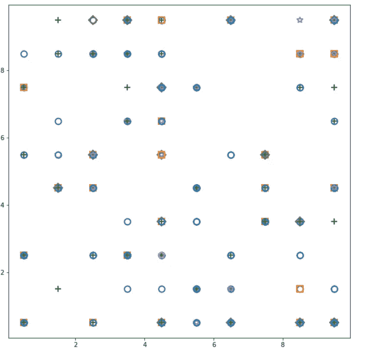

# 自组织图(银行业的客户细分)

> 原文：<https://medium.com/analytics-vidhya/self-organizing-map-customer-segmentation-in-banking-9d7ce96bd3ec?source=collection_archive---------5----------------------->


作为 Flipr 实习项目的一部分，我得到了使用神经网络进行银行客户细分的任务。我使用自组织映射(SOM)解决了这个任务，SOM 是一种基于无监督学习的人工神经网络(ANN ),这意味着在学习过程中不需要人工干预，并且几乎不需要知道输入数据的特征。SOM 是最受欢迎的网络，属于竞争学习网络的范畴。

得知这个题目后，我想到了借助这篇文章来分享我的知识。

## 银行业为什么需要客户细分？

客户细分有助于银行在更精细的层面上了解他们的客户。分割揭示了显而易见的洞察力，这种洞察力可能会以某种方式被庞大的信息量所掩盖。因此，这些知识阐明了广告和客户服务程序的通知技术。细分同样有助于更好地理解客户生命周期和预测客户行为的账户管理。

## 自组织映射

在自组织地图中，信息与每个枢纽相关联，枢纽在空间上构造多维横截面(通常是二维点阵)。节点是竞争性的输入，每个节点都被轮流照顾，对信息有最基本响应的节点被宣布为“获胜节点”,并有机会将其权重分配给输入，并将其作为收益返回。这就是所谓的地形图。


SOM 如何工作的可视化。

SOM 采用具有大量行和列的多维数据集，这些行和列是数据集的维度，并且减少了数据集的维度。SOM 的目的是将许多列缩减为二维输出。

## 自组织地图如何学习？

这里我们有 3 个列的特征。这些可能有数千行，每行有 3 列，即我们的输入数据集实际上是三维的，而 SOM 中的输出总是二维的。

我们首先要看的是顶部节点。顶部节点与 3 个输入要素相连。顶部节点与每个特征相连接，每个特征被分配了一些权重，即 W(i，j) i 是节点的位置，j 是特征。这里我们得到了 W(1，1)，W(1，2)，W(1，3)。重要的是，SOM 中的权重不同于人工神经网络，没有激活函数。


这里，权重是节点本身的特征。基本上就是节点的坐标。该节点还尝试查看它在输入空间中的位置。类似地，我们分配每个输出节点的权重，并且每个输出节点是试图适合输入空间的虚拟数据点。

这是自组织映射算法的核心，现在这些节点之间将存在竞争，我们将检查数据集中的每一行，并找出这些节点中哪个最接近数据集中的每一行。


我们使用从输入节点到输出节点的欧几里德距离进行计算。类似地，我们计算每个输出的欧几里德距离，并且具有最近距离的节点被认为是最佳匹配单元(BMU)。

让我们考虑一个更大的 SOM，我们得到第一行的 BMU。现在，SOM 将更新 BMU 的权重。它变得更接近数据集中的第 1 行。我们更新的原因是因为我们无法控制我们的输入，也无法更新我们的数据集，我们在公式中唯一可以控制的是节点的权重，以便使其更接近行。


从视觉上来说，这意味着 SOM 越来越接近数据点，而这些数据点本身会组织成您的输入数据。


下一步是 BMU 周围的整个半径，SOM 的每个节点都落在半径内，该半径将更新其权重，以更接近我们匹配的行，即第 1 行。节点越接近 BMU，更新的权重就越大。类似地，如果我们对于不同的行有另一个 BMU，则更靠近 BMU 的节点将落入其中。如果节点与其他 BMU 的距离相等，则它将在两个 BMU 下工作，并具有相等的影响。


如果我们有多个 BMU，则在不同 BMU 下的节点将会产生影响，并且在每个时期之后应用学习率，并且 BMU 的半径缩小，直到每个 BMU 都有落入该半径下的单独节点。随着我们一次又一次地使用数据集，这个过程变得更加精确。


## 重要的是要知道-

*   SOMs 保持输入集的拓扑结构
*   som 揭示了不容易识别相关性
*   SOMs 在没有监督的情况下对数据进行分类
*   无目标向量->无反向传播
*   输出节点之间没有横向连接

## 算法-

第一步:我们从由 n_features 自变量组成的数据集开始。

步骤 2:我们创建一个由节点组成的网格，每个节点都有一个 n_features 元素的权重向量。

步骤 3:将权重向量的值随机初始化为接近 0 的小数值(但不是 0)。

步骤 4:从数据集中选择一个随机观测点。

步骤 5:计算从该点到网络中不同神经元的欧几里德距离。

步骤 6:选择与该点距离最小的神经元。这个神经元被称为获胜节点。

步骤 7:更新获胜节点的权重，以使其更接近该点。

步骤 8:使用平均获胜节点的高斯邻域函数，也更新获胜节点邻居的权重以向该点移动。邻域半径是高斯函数中的σ。

步骤 9:重复步骤 1 至 5，在每次观察或一批观察(批学习)后更新权重，直到网络收敛到邻域停止下降的点。

## 这是银行业客户细分的一个例子。

## -数据集


## -数据预处理


## -为训练定义 X 和 y

这里我们把数据分为 X 和 y，并不代表我们在做监督学习。这里 y 代表贷款用途的区别。


## -特征缩放

因为大多数时候，特征缩放对于深度学习是强制性的，原因很简单，因为我们从高维数据集开始，所以需要进行大量计算。


## -训练高级管理人员

我们可以安装迷你电脑— pip 安装迷你电脑

这里 x 和 y 是维度的大小。我们可以选择任何尺寸的维度，这取决于数据集，input_len 是 X 中的要素数量，sigma 是网格中不同邻域的半径(默认值=1.0)和学习率(默认值=0.5)，学习率记住了决定每次迭代期间更新多少权重的超参数。因此，学习率越高，收敛越快，学习率越低，构建自组织映射所需的时间就越长。

som.random_weight_init(X)随机初始化权重向量的值。

som.train_random()训练 som 的迭代次数。

```
**from** **minisom** **import** MiniSomsom=MiniSom(x=10,y=10,input_len=8,sigma=1.0,learning_rate=0.5)som.random_weights_init(X)

som.train_random(data=X,num_iteration=100)
```

## *—可视化结果*

那就是绘制自组织地图本身。我们看到的是包含所有最终获胜节点的二维网格，对于每个节点，我们将获得对我们最重要的内容，即 MID 平均神经元间距。特定获胜节点的中点是邻域内获胜节点周围所有神经元距离的平均值，我们通过σ来定义该邻域，σ是该邻域的半径。MID 越高，获胜的节点将远离其邻域内的邻居。MID 越高，获胜节点就是异常值。

```
**from** **pylab** **import** bone, pcolor,colorbar,plot,showbone()
pcolor(som.distance_map().T)
colorbar()
markers=['o','s','+','-','*','D','p','-s']
colors=['C0','C1','C2','C3','C4','C5','C6','C7']
plt.figure(figsize=(10, 10))

**for** i,x **in** enumerate(X):
    w=som.winner(x)
    plot(w[0]+0.5,
         w[1]+0.5,
        markers[t[i]],
        markeredgecolor=colors[t[i]],markerfacecolor='None',markersize=10,markeredgewidth=2)
show()
plt.show()
```


该图只告诉我们物种密度较大(较暗区域)或较小(较亮区域)的地方



第二个观想告诉我们它们是如何特别聚集的。

```
bone()
pcolor(som.distance_map().T)
colorbar()
markers=['o','s','+','-','*','D','p','-s']
colors=['C0','C1','C2','C3','C4','C5','C6','C7']

**for** i,x **in** enumerate(X):
    w=som.winner(x)
    plot(w[0]+0.5,
         w[1]+0.5,
        markers[t[i]],
        markeredgecolor=colors[t[i]],markerfacecolor='None',markersize=10,markeredgewidth=2)
show()
```

*   收音机/电视' = 0 — →'o' →'C0 '
*   “教育”= 1—->“s”→“C1”
*   家具/设备' = 2 — →'+' →'C2 '
*   汽车' = 3 — →'-' →'C3 '
*   商业' = 4 — →'*' →'C4 '
*   “修理”= 5—→“D”→“C5”
*   “度假/其他”= 6—→“p”→“C6”
*   家用电器' = 7 — →'-s' →'C7 '


```
**from** **matplotlib** **import** gridspec
label = np.genfromtxt('Dataset_II.csv', delimiter=',', usecols=(9), dtype=str)
X=np.genfromtxt('data.csv', delimiter=',', usecols=(1, 2, 3, 4, 5, 6, 7, 8))
**from** **sklearn.preprocessing** **import** MinMaxScaler
scaler = MinMaxScaler(feature_range=(0,1))
X = scaler.fit_transform(X)

label = np.genfromtxt('Dataset_II.csv', delimiter=',', usecols=(9), dtype=str)
labels_map = som.labels_map(X, label)
label_names = np.unique(label)
plt.figure(figsize=(10, 10))
the_grid = gridspec.GridSpec(10, 10)
**for** position **in** labels_map.keys():
    label_fracs = [labels_map[position][l] **for** l **in** label_names]
    plt.subplot(the_grid[6-position[1], position[0]], aspect=1)
    patches, texts = plt.pie(label_fracs)
plt.legend(patches, label_names, bbox_to_anchor=(0., 6.5), ncol=3)
plt.show()
```


获胜节点对其邻居的影响。

# 参考

*   [superdata science 团队的自组织地图(SOM)终极指南。链接 https://www . superdata science . com/blogs/the-ultimate-guide-to-self-organizing-maps-soms](https://towardsdatascience.com/self-organizing-map-layer-in-tensroflow-with-interactive-code-manual-back-prop-with-tf-580e0b60a1cc)
*   [https://en.wikipedia.org/wiki/Self-organizing_map](https://en.wikipedia.org/wiki/Self-organizing_map)
*   【http://blog.yhat.com/posts/self-organizing-maps-2.html 号

## 密码

请在这里找到我的代码。