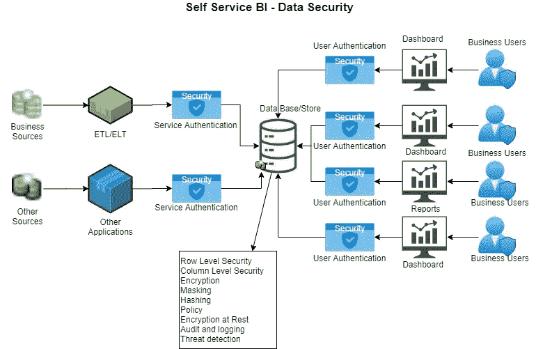

# 自助 BI —数据安全

> 原文：<https://medium.com/analytics-vidhya/self-service-bi-data-security-8b7b8bb713da?source=collection_archive---------27----------------------->

# 什么是自助服务中的数据安全性

自助服务商业智能的数据安全性是目前备受关注的一个领域。主要有两个部分，一个是写入自助服务存储，另一个是从中读取。写入通常受到控制，但读取最具挑战性。这是我每天听到和谈论的话题。

对于阅读，有如下考虑

*   访问系统的用户数量
*   系统的性能
*   数据有多安全？
*   谁可以访问哪些数据。

让我们首先从什么是自助服务开始。多年来，人们使用数据和构建报告来经营业务，使用数据来做出决策，这是通过各种技术实现的。但挑战在于，数据会以某种方式复制，并存储在特定于特定用例的系统中，以便做出决策。这导致了大量的延迟和耗时的开发来获取数据，以便我们能够做出以数据为中心的决策。

另一个挑战是当数据量增加时，为访问而存储的数据变得难以提供安全性，因为每行可能有多个安全规则或策略。例如，当只有几行时，很容易提供安全性和性能，现在如果相同的数据集只有几十亿行，那么性能就变得具有挑战性。

# 体系结构

# 为什么是数据库而不是文件？

这是一个很重要的话题。访问只有几行的文件很容易，没有什么挑战性，但当文件大小以千兆字节或太字节增长时，访问就变得困难和耗时。为了提供解决方案，数据库是他们的技术是交替的。不仅并发性和多用户访问非常适合数据库。此外，数据库和相关技术不仅为一个应用程序提供存储，还可以为一个或多个共享模型提供存储。

# 自助服务安全性

自助服务避免了这种情况，它将数据放在一个地方，不会重复，但能够提供数据访问以构建自己的报告。现在，在如何以所有业务用户都可以访问的方式最好地存储数据方面，这也带来了挑战。还带来了安全性方面的另一个挑战，因为所有数据都可用，我们如何控制安全性。数据治理也是重要的一部分。考虑到数据模型对所有用户都是通用的，并且业务数据可能包含敏感和非敏感数据，这意味着我们需要在安全性、加密、屏蔽和数据访问策略方面投入大量精力。

以下是数据安全的一些主题

*   读取的数据访问安全性

> 行级安全性
> 
> 列级安全性

*   ETL、ELT 作业的数据写入安全性。手动操作或其他应用的写权限
*   对敏感数据进行分类并建立清单
*   为不必显示的数据(如电话号码 xxx-xxx-xxxx)提供屏蔽
*   加密敏感列，尤其是与人力资源相关的列，如 SSN、收入
*   管理访问，其中应排除敏感数据。
*   能够审核谁访问了哪些数据
*   能够查看特定数据的谱系以及哪些用户都访问过

从上面可以看出，主要是读写的数据访问。写入主要由使用服务帐户的应用程序控制，服务帐户可能具有提升的访问权限，因为它必须处理数据集中的所有记录。写入也由系统控制，密码或机密可以轮换或保存在安全的位置。

读取访问是最大的挑战。当我们只有一个真实的来源，所有的业务数据都在那里。并非公司或企业中的所有用户都可以访问所有数据。这就是行级和列级安全性非常重要的地方。现在，除了行级别和列级别之外，还有其他选项，但是这些选项使用视图、表和其他方式来复制数据。

为了避免数据重复，并有一个单一的地方来管理安全系统与行级和列级的安全是非常必要的。通过用行级和列级组织安全需求，我们可以提供哪些用户以及他们可以查看或看到的访问权限。这允许业务用户自己做报告，但同时数据是安全的。不仅如此，当用户受到威胁时，还可以很容易地找到并更改该用户的密码或用户名，以确保其安全。不仅如此，我们还需要收集审计日志，以了解谁在何时以何种方式访问了数据。还有助于更快、更及时地补救受损用户及其帐户。当使用非用户帐户时，这变得具有挑战性并且风险很高。

例如，如果通过服务帐户、系统帐户或任何其他方式提供访问，并且有大约 200 个用户访问数据，如果受到危害，所有这 200 个用户都会受到影响，并且会产生细微差别。现在，我们必须更改所有 200 个用户的受损帐户，并且我们也不知道系统是如何组成的(这 200 个用户中的哪个用户是真正组成的)。

为敏感数据加密列也是另一个巨大的安全项目。这可以防止提供不必要的或错误的访问，也可以防止受到损害。

本文仅用于信息共享和指导。

*最初发表于*[*【https://github.com】*](https://github.com/balakreshnan/synapseAnalytics/blob/master/DataGovernance/datasecruityself.md)*。*